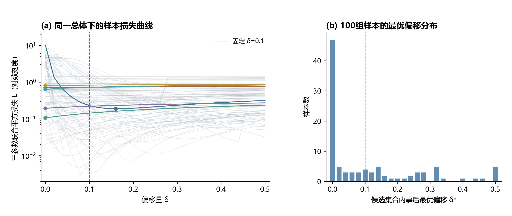

# D01 同一总体下的逐样本最优偏移诊断

2026-09-24。探索图，暂不纳入正文或正式图号。

## 条件与读图

固定 β=2、η=1000、γ=1000、n=7，复用[E09](../../../数据/E09_六方法共同测试/README.md)中该条件的全部100组样本。条件在扫描前确定，与此前原理图的总体参数一致，未按收益挑选条件。候选偏移为0至0.5，步长0.02，共26个。

左图每条线对应一组样本，纵轴为三参数联合平方损失（对数刻度），彩色强调按抽样编号排序的前6组，圆点为各自候选最优点；右图统计100组样本的候选最优偏移。虚线为固定δ=0.1。

损失沿用当前评价定义：

\[
L_i(\delta)=\left(\frac{\hat\beta_i(\delta)-\beta}{\beta}\right)^2+
\left(\frac{\hat\eta_i(\delta)-\eta}{\eta}\right)^2+
\left(\frac{\hat\gamma_i(\delta)-\gamma}{\eta}\right)^2,
\qquad J_1=\sqrt{\frac1{100}\sum_i L_i}.
\]

## 得到什么

| 规则 | J₁ | 相对固定δ=0.1降幅 |
|---|---:|---:|
| 固定δ=0.1 | 0.708583 | — |
| 当前冻结AMDM | 0.653092 | 7.83% |
| 利用真值的逐样本候选最优 | 0.535607 | 24.41% |

- 最优偏移分布在21个候选值上：47组取0，5组取0.5，其余48组取内部候选。只有4组取0.1。
- 没有数值容差内并列最小值；落在各样本最小损失的1%范围内的候选数量，中位数为1、最大值为26。固定0.1在16组样本上处于这一近优范围内。因此仍有平坦曲线，不能仅按最优值是否不同来衡量差别大小。
- 当前AMDM相对固定0.1：73组损失降低、3组相等、24组升高；总体J₁下降7.83%。

这组结果支持：在该条件和候选集合内，损失最小的偏移会随样本变化，而且事后逐样本选择对应实际的总体误差改善空间。候选最优利用真参数，是诊断参照，不是可部署方法或AMDM已实现的收益。52组最优点位于候选范围端点，不能将本图解释为连续偏移空间内的完整最优分布；本诊断也未识别哪部分差异可由观测样本可靠预测。

## 文件与复现

- [程序](诊断.py)：复建样本、调用生产MDM扫描、汇总并导出PNG/SVG/PDF。
- [候选损失和三参数估计](候选损失.csv)：2600条。
- [逐样本诊断](逐样本诊断.csv)：100条，包含实际AMDM选择及损失、最优值与近优候选数。
- [频数](最优偏移频数.csv)、[结果与来源哈希](结果.json)。

项目根目录运行：`python "Study/Study 01 New/图片/诊断/D01_逐样本最优偏移/诊断.py"`。

已核对100个样本哈希；全部2600个候选求解有效；固定0.1及AMDM所选偏移的扫描损失与E09一致；逐样本候选最优损失均不大于这两种规则。PNG排版已目检。本次复用了E09样本，不能作为新的独立确认。
