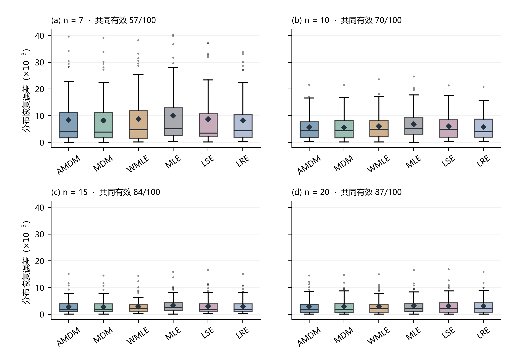
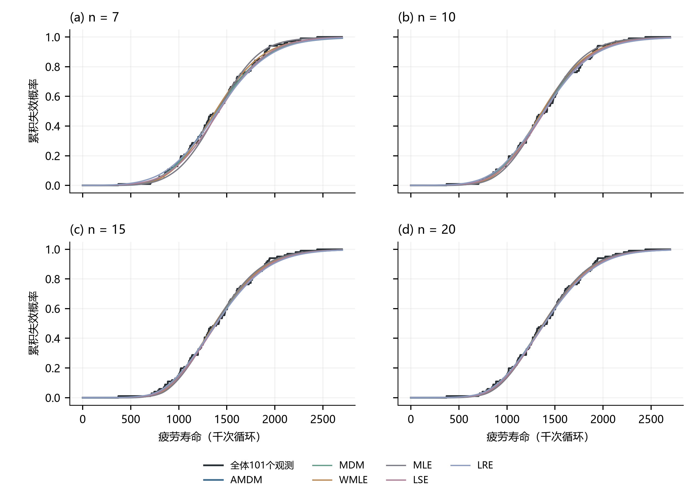

# E11 真实疲劳寿命重复小样本预实验

状态：预实验与指标探索已完成；疲劳案例的B1留出预测评价已写入论文3.6和4.3（表6、图5）。真实数据结果不作为已知真参数的精度证明。

**最新探索（2026-09-25）**：[指标与跨案例探索](指标与跨案例探索/README.md)已完成，新增56,000条估计，冻结模型未改。九个分位点、CRPS、区间与Brier得分完整比较后，发现疲劳案例的B1/B5留出损失相对固定MDM下降；两套已知真值模拟及既有E09分位点复核支持该方向，删除最小/最大观测后也保留。另两个真实案例结果不完全一致，仍为探索性应用证据；报告保存全部指标、跨案例图、数据、程序和核验；正文仅采用疲劳案例B1的探索性应用结果。

**最新评价（2026-09-25）**：[重复小样本留出预测评价](留出预测评价/README.md)已完成。n=7、10、15、20各2,000次，每次以未抽中的101−n个观测计算CRPS；六方法48,000条尝试均保留。共同成功抽样上AMDM平均得分略低于MLE、WMLE、LSE和LRE，与固定MDM差距不足0.1%；完整AMDM/固定MDM配对检查同样接近。报告包含组图、成功率、抽样编号、程序及独立积分核验，仍为同一真实案例的探索评价。

**多方法参考检查**：已完成[参数估计轨迹及抽样波动图](参数轨迹/README.md)。随着样本量增加，各方法未形成唯一共同参数位置；完整数据LSE/LRE的位置估计为0，固定MDM约155，MLE约181。暂不建立多方法共识真值。AMDM仅使用已有冻结模型，WMLE的n>100渐近权重切换已单独说明。

**2026-09-25更新**：已完成[每档2,000次扩大抽样与收益诊断](扩展诊断/README.md)，并增加匹配参数Weibull模拟和有放回抽取对照。真实无放回抽取的参数参考联合误差改善2.21%—3.08%，经验CDF距离未同步改善；已定位低尾样本选择行为及评价目标差异。下文保留原100次六方法预实验，扩大实验只比较AMDM与固定MDM。

## 数据与冻结方案

- 来源：[NIST原始数据](https://www.itl.nist.gov/div898/handbook/datasets/BIRNSAUN.DAT)，Birnbaum与Saunders（1958）6061-T6铝合金疲劳寿命，最大应力21,000 psi，101个完整观测，单位为千次循环。
- [NIST模型比较](https://www.itl.nist.gov/div898/handbook/eda/section4/eda4292.htm)考察了三参数Weibull等模型，其信息准则偏向正态分布。因此这是三参数Weibull估计方法的真实数据适配预实验，不能将数据视为已知Weibull总体。
- 按作者决定：全体101个观测同时作为经验参考与抽样池；无61/40拆分。原拟议拆分未执行。
- n=7、10、15、20各100次；每次从101个观测中无放回抽取，同一小样本用于六方法；不同重复之间可重叠。种子20260925，不根据结果筛选样本或更换数据集。
- AMDM直接使用E09冻结模型，不用真实数据重新训练；沿用E09传统方法求解协议及固定单位换算。
- 主指标：估计CDF与全101个观测的经验CDF，在[0,参考最大观测]上的归一化积分平方距离，越小越贴近完整数据分布；次指标为全参考集平均CRPS/参考IQR。两者均非独立留出预测误差。
- 三参数仅报告相对全样本MLE拟合的偏离，作为辅助描述，不称真参数RMSE、不据此确定方法优劣。
- 图中箱线表示四分位数及1.5 IQR须，离群点全部保留，菱形为均值；这是固定数据集下重复抽取的变异，不是总体置信区间。

## AMDM相对各方法的分布恢复误差降幅

每格按AMDM与该方法共同有效的小样本比较；正值为AMDM平均CDF距离较小。

| n | 固定MDM | WMLE | MLE | LSE | LRE |
|---|---:|---:|---:|---:|---:|
| 7 | -0.91% | 5.66% | 12.65% | 5.01% | 7.12% |
| 10 | -0.23% | 7.78% | 13.17% | 5.59% | 7.62% |
| 15 | -0.33% | 3.68% | 12.98% | 6.82% | 11.78% |
| 20 | -0.53% | 0.98% | 7.03% | 7.98% | 10.95% |

## 相对完整数据拟合参数的恢复

完整101观测的MLE拟合是参考估计，不是真参数。下表比较AMDM相对固定MDM的参考联合误差降幅，两个方法均使用全部100次抽取。

| n | AMDM参考联合误差 | 固定MDM参考联合误差 | 降幅 |
|---|---:|---:|---:|
| 7 | 0.72285 | 0.72162 | -0.17% |
| 10 | 0.62698 | 0.66022 | 5.03% |
| 15 | 0.58694 | 0.60553 | 3.07% |
| 20 | 0.54007 | 0.55045 | 1.89% |

参数参考比较与经验分布比较回答不同问题。本预实验中，AMDM在n=10、15、20时比固定MDM更接近全样本拟合参数，但四档经验CDF距离略高于固定MDM。不能因某个指标有利就将其重新命名为真实精度。

## 求解失败数（每方法每档100次）

| n | AMDM | MDM | WMLE | MLE | LSE | LRE |
|---|---:|---:|---:|---:|---:|---:|
| 7 | 0 | 0 | 6 | 37 | 0 | 0 |
| 10 | 0 | 0 | 8 | 22 | 0 | 0 |
| 15 | 0 | 0 | 9 | 7 | 0 | 0 |
| 20 | 0 | 0 | 12 | 1 | 0 | 0 |

## 结果图

曲线为六方法共同有效重复上的平均拟合CDF，不挑选有利的单次样本，也不把平均曲线当作可部署估计器。误差图使用相同共同有效集合；上述成对比较表用各对自己的有效集合，二者汇总口径不同。

## 复现与核验

`python run_pilot.py` 完成计算，`python summarize_plot.py` 生成报告和图。保留原始数值转录、观测编号、每次抽样编号、模型/代码哈希、逐样本结果、失败记录、比较表及验证JSON。
直接HTTP下载返回403，原始数值来自NIST网页工具读取后按原顺序转录；文件哈希对应转录文件。全样本MLE与NIST报告拟合核对，CRPS与数值积分交叉检查，CDF距离用更细网格核验；见[验证结果](verification.json)。

全样本MLE拟合：形状 3.428056，尺度 1356.462162，位置 181.137039；NIST报告约3.43、1357、181。
