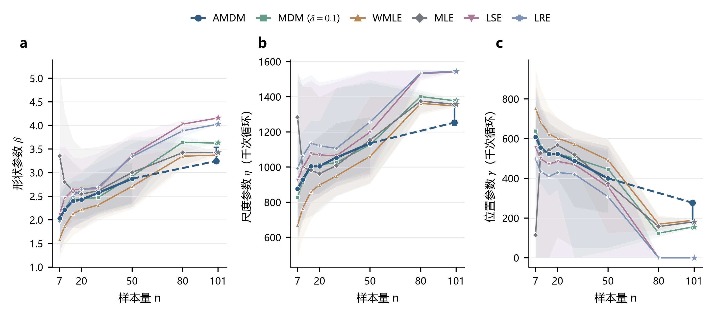
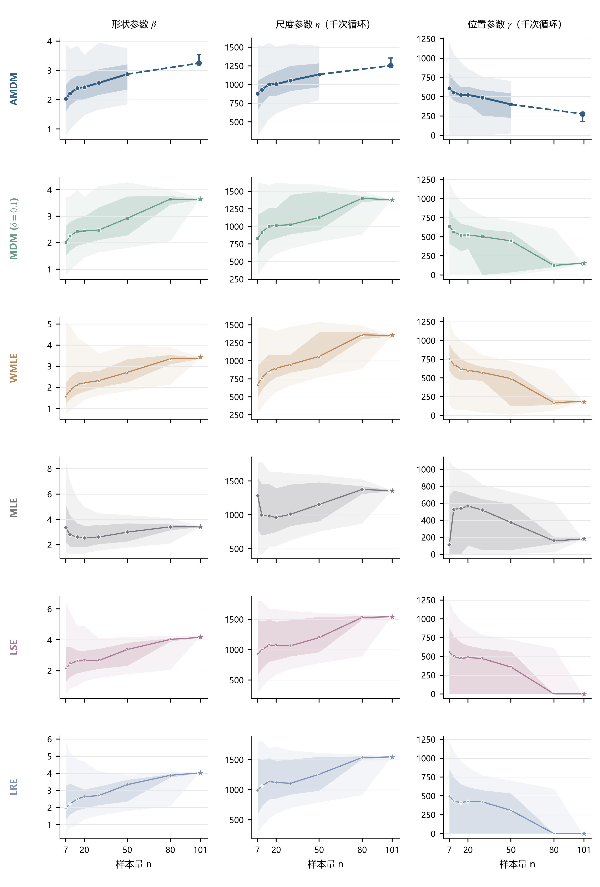

# 多方法真实数据参数估计轨迹

2026-09-25。目的：先检验样本量增加时各方法是否靠拢，再判断能否建立多方法共同参考。没有预设共识参数，没有平均各方法作为真值，也没有改动论文正文。

**当前结果：方法自身的抽样波动总体缩小，但各方法没有在三参数上形成唯一共同位置。尤其位置参数仍有明显分歧，因此目前不宜把多方法平均当作更可靠的标准答案。**

## 三参数轨迹

线为各方法有效估计的中位数，阴影为25%—75%分位范围；这是固定101观测池内的抽样波动，不是总体参数置信区间。星号是完整101观测的一次估计。横轴为线性刻度，各点之间连线仅引导阅读。

AMDM有冻结模型的样本量为7、10、15、20、30、50、100；不在80或101处编造模型输出。50—100之间用虚线连接，100点竖线表示四分位范围。各n模型分别训练，不能将整条AMDM曲线理解为一个固定维度模型的渐近收敛轨迹。

WMLE在n>100时，现有实现的J2和J3采用渐近权重，故101点单独标记、不与100点连线。其完整数据形状和位置估计与MLE几乎相同，与权重规则有关，不能作为两个独立方法趋于同一点的证据。

## 完整数据端点

| 方法 | β | η（千次循环） | γ（千次循环） |
|---|---:|---:|---:|
| 固定MDM | 3.6344 | 1378.92 | 154.71 |
| WMLE | 3.4281 | 1357.77 | 181.14 |
| MLE | 3.4281 | 1356.46 | 181.14 |
| LSE | 4.1653 | 1541.77 | 0.00 |
| LRE | 4.0329 | 1545.26 | 0.00 |

AMDM在全部101种n=100留一子集上的中位数为(3.2470, 1253.49, 277.18)；这不是完整101观测的估计，不能与上表混称同一输入下的端点。

在n=80及100时，LSE/LRE的位置中位数已经为0，而固定MDM、MLE、WMLE仍在约124—188附近。也就是说，样本增加后更清楚的是各自结果，而非所有方法共享一个答案。n=80以上共同有效子集的复算没有改变这一分歧。

## 抽样与实施

- n=7、10、15、20、30、50、80各500次无放回抽取，同一次观测交给所有可用方法；不同n独立抽取，非同一路径逐个追加观测。
- n=100只有101种不同的无放回子集，因此遍历全部留一子集，不用500次重复抽同样子集制造更多独立信息。
- n=101仅拟合一次。样本量逼近101时，波动缩小部分来自抽样池将被取尽，不能据此证明估计器在未知总体中的渐近一致性。
- 共3,602个不同任务样本（不同n可能独立抽到相同集合，未按结果筛选），21,111条方法结果；其中复用原结果5,600条，其余15,511条新计算。模型未训练或改选，求解约束、单位换算沿用E11。
- 中心线使用各方法自己的有效估计；完整失败记录见[求解覆盖](fit_coverage.csv)。MLE小样本失败较多，例如n=7为202/500；WMLE各档亦有失败，不能把有效估计曲线解释为包含失败样本的性能排名。
- [共同有效子集复算](common_valid_summary.csv)及[差异检查](common_valid_sensitivity.csv)保留用于区分失败条件化影响。

## 逐方法抽样波动

深色带为25%—75%，浅色带为2.5%—97.5%分位范围。各小图纵轴单独缩放，仅用于观察各方法自己的变化，不能直接按带宽比较不同方法。分位范围不包含全部极端值；全部结果和最小、最大值均保存在数据表中。

## 下一步判断

本轮不支持直接建立多方法共同参考，暂不继续计算“离共识参数的误差”。如继续研究这条路线，应先解释LSE/LRE的零位置边界与另一组方法的正位置估计为何分开，而不是从较接近的一组方法中选出有利参考。

## 文件与核验

- [完整汇总](trajectory_summary.csv)、[逐样本结果](per_subsample.csv.gz)、[完整101端点](full101_estimates.csv)
- `n*_samples.npz`含原始观测编号及排序样本；[冻结协议及源文件哈希](protocol.json)
- [验证记录](verification.json)：21,111行无重复键，原文件及模型哈希不变，小样本抽样与前次扩展一致；新增n=30/50/100上的生产MDM与缓存实现交叉核对通过。
- [图件定义](figure_manifest.json)；两图均有PNG、可编辑文本SVG和PDF。
- 复现程序：[计算](../run_trajectories.py)、[绘图](../plot_trajectories.py)。`chunks/`为可再生成的计算检查点。

已目检图件：标签、图例、单位完整，无重叠截断；AMDM未支持处和WMLE权重切换已标明。当前为探索诊断图，不占用论文正式图号。
