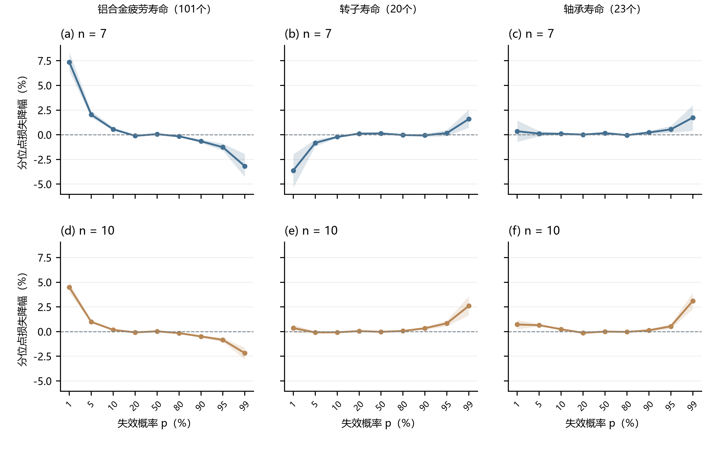

# E11 指标与跨案例探索

状态：探索性评价。候选指标、案例、随机种子在本轮评分前固定；低尾优势出现后追加最小/最大观测剔除敏感性。不将探索中选出的指标称为事先设定的论文主终点。

## 本轮判断

**目前最值得继续发展的目标是低失效概率寿命点B1、B5。** 它们对应估计分布中1%、5%失效概率的寿命，即名义99%、95%可靠度寿命。这个应用目标把三参数改进连接到一个明确的可靠性量，且不需要把全样本某种方法的拟合当作真实答案。

在101个疲劳寿命上，AMDM相对固定MDM的B1留出分位点损失下降2.41%—7.36%，B5下降0.65%—2.04%；四档样本量均为正。前后两半抽样分别汇总后仍为正，去掉最小值或最大值后重新抽样、重新估计也保留该方向。这些检查支持该案例内的稳定性，不增加独立真实案例数。

已知真值方面，两个匹配Weibull总体中B1/B5的RMSE均下降；已有E09全部48条件的复核也得到B1 RMSE下降3.37%—6.11%、B5下降0.76%—2.59%。因此，这一发现不仅来自换一种真实数据评分，也得到真值可知条件下的误差结果支持。E09是已用过的测试数据，本次只是新增指标分析。

**尚不能写成普遍真实数据优势。** 新增轴承案例的B1/B5有小幅改善，但转子案例n=7的低尾得分变差；疲劳案例的上尾分位点也有退步。CRPS整体分布得分基本持平。六方法共同成功集合上，疲劳B1/B5得分优于固定MDM、MLE、WMLE和LSE，但未超过LRE；完整数值与失败率均保留。

**建议的后续方向：** 保持论文的参数估计主线，把B5作为下一次独立真实案例检验的主要工程目标、B1作为辅助目标，提前固定评价方案，在有足够原始观测的新数据上确认。B1当前相对改善更大，但101个观测只能提供很有限的1%尾部信息，不能因数值更亮眼就把它直接升级为普遍可靠度保证。当前结果可作为“疲劳案例中低尾寿命预测改善”的探索性证据，不据此改写为“真实三参数估计已经证实更准”。

## 本轮问题与范围

寻找AMDM相对固定δ=0.1 MDM在哪些具有明确应用意义的目标上确有改善，并检查这种改善是否由单次抽样、个别极端观测或单一模拟参数参照造成。

- 既有真实数据：101个铝合金疲劳寿命，n=7、10、15、20，每档2,000次留出评价，保留六方法。
- 新真实案例：20个转子寿命、23个轴承寿命，各取n=7、10，每档1,000次，共24,000条六方法估计。
- 已知真值：复用全样本MLE拟合参数对应的Weibull模拟；新增以全样本固定MDM拟合参数为生成参数的模拟，四档各2,000次、两方法共16,000条新估计。拟合值只有在作为模拟生成参数时才是真值，不能回称真实数据的真参数。
- 极端观测敏感性：分别移除101个观测中的最小值370、最大值2440，重新抽取、重新估计，并在剩余观测上评价；四档各1,000次，两方法共16,000条新估计。

共新增56,000条估计。未重新训练AMDM、未改变模型、未删除原数据或未获益指标。

发现低尾方向后，另复核已有E09的4,800组共同测试：沿用全部48个条件和九个分位点，直接计算已知真值下的分位点RMSE。该复核没有新增估计，也不作为独立确认。

## 指标为什么有意义

| 指标 | 回答的问题 | 判定 |
|---|---|---|
| 分位点损失（pinball） | 预测的B1、B5、B10等寿命点能否描述留出观测 | 越小越好；B1/B5/B10对应1%/5%/10%失效概率 |
| CRPS | 整个寿命分布的预测表现 | 越小越好，保留为总体参照 |
| 80%/90%区间得分 | 区间宽度与漏覆盖代价的综合表现 | 越小越好，不只奖励窄区间 |
| 固定寿命阈值Brier得分 | 到指定寿命前是否失效的概率预测 | 越小越好，阈值在本轮评分前固定 |
| 已知真值下参数/分位点RMSE | 模拟中估计是否更接近生成真值 | 越小越好，仅用于模拟 |

分位点损失：$\rho_p(y-q)=\max\{p(y-q),(p-1)(y-q)\}$。

参考：[Gneiting与Raftery（2007）](https://doi.org/10.1198/016214506000001437)。1%—99%的九个分位点全部保留，极低概率点的真实验证受原始样本量限制。

## 全分位点结果

正值为AMDM相对固定MDM的平均分位点损失下降。横轴列出预设概率点，等距排列是分类坐标。阴影为条件于固定观测池和冻结模型的逐点95%配对Monte Carlo重抽样区间，不是总体置信区间，也没有对多指标搜索作显著性校正。重复抽样增加的是数值精度，不增加原始独立试件数。

## 101个疲劳寿命的低尾结果

| p | n | 真实留出损失降幅 | 删除最小值后 | 删除最大值后 | MLE参照模拟RMSE降幅 | MDM参照模拟RMSE降幅 |
|---:|---:|---:|---:|---:|---:|---:|
| 1% | 7 | +7.36% | +8.40% | +7.15% | +6.49% | +6.31% |
| 1% | 10 | +4.49% | +6.25% | +4.74% | +5.87% | +5.99% |
| 1% | 15 | +3.90% | +4.75% | +3.93% | +5.59% | +6.02% |
| 1% | 20 | +2.41% | +3.03% | +2.81% | +4.47% | +4.88% |
| 5% | 7 | +2.04% | +2.06% | +1.91% | +5.01% | +4.65% |
| 5% | 10 | +0.99% | +1.07% | +1.07% | +3.80% | +3.96% |
| 5% | 15 | +0.87% | +0.52% | +0.89% | +3.23% | +3.39% |
| 5% | 20 | +0.65% | +0.24% | +0.71% | +2.69% | +2.83% |
| 10% | 7 | +0.56% | +0.49% | +0.45% | +2.40% | +2.12% |
| 10% | 10 | +0.18% | +0.10% | +0.22% | +1.25% | +1.37% |
| 10% | 15 | +0.20% | -0.02% | +0.22% | +0.50% | +0.45% |
| 10% | 20 | +0.14% | -0.03% | +0.15% | +0.17% | +0.08% |

## 原主体参数域的复核

在既有E09全部条件内重新汇总分位点RMSE：各条件等权，条件内AMDM与固定MDM配对；区间采用2,000次条件内配对重抽样。所有九个分位点结果见CSV，以下摘出与当前低尾发现对应的B1/B5。

| n | B1 RMSE降幅 | B5 RMSE降幅 |
|---:|---:|---:|
| 7 | +6.11% | +2.59% |
| 10 | +4.99% | +1.57% |
| 15 | +4.37% | +1.07% |
| 20 | +3.37% | +0.76% |

## 新案例交叉检查

| 案例 | n | B1损失降幅 | B5损失降幅 | B10损失降幅 | CRPS降幅 |
|---|---:|---:|---:|---:|---:|
| 转子寿命（20个） | 7 | -3.62% | -0.82% | -0.22% | +0.06% |
| 转子寿命（20个） | 10 | +0.36% | -0.08% | -0.07% | +0.06% |
| 轴承寿命（23个） | 7 | +0.36% | +0.12% | +0.10% | +0.10% |
| 轴承寿命（23个） | 10 | +0.72% | +0.65% | +0.24% | +0.02% |

两个新增案例在本轮计算前选定，均报告结果。它们来自前一轮读到的文献，不是从大量数据集跑分后择优挑选；但每个案例的独立原始观测仅20/23个，尤其不足以充分验证1%尾部。

## 改善的误差构成

在两个匹配Weibull模拟的n=7条件下，AMDM的B1标准化偏差略增，但抽样标准差下降约12%—13%，最终RMSE下降约6%。这说明此处收益主要体现在对抽样波动的抑制，并非每个样本都更接近真值；完整偏差/标准差/RMSE分解见CSV。该解释仅针对这两个模拟条件，不据此推断真实总体的偏差。

## 99%可靠度寿命与99%可靠度保证的区别

B1是估计模型中对应1%失效概率的寿命点。其留出分位点损失下降，表示针对该寿命点的预测得分改善，不自动表示真实失效比例已经达到1%。下表检查实际留出观测落在预测B1以下的平均比例。

| n | AMDM | 固定MDM | 名义比例 |
|---:|---:|---:|---:|
| 7 | 6.94% | 7.69% | 1% |
| 10 | 5.15% | 5.55% | 1% |
| 15 | 3.53% | 3.85% | 1% |
| 20 | 3.05% | 3.18% | 1% |

## 完整结果与复现

- [全部真实指标与五个对照的配对结果](real_comparison.csv)：含逐点条件区间及前后半批次结果。
- [六方法共同成功抽样的比较](six_method_common_comparison.csv)：CRPS及九个分位点使用统一抽样集合，成功率另报。
- [已知真值模拟结果](sim_comparison.csv)、[分位点偏差与离散分解](known_truth_quantile_bias_sd.csv)。
- [已有E09全分位点复核](existing_E09_quantile_by_n.csv)、[各参数条件结果](existing_E09_quantile_by_cell.csv)。
- [极端观测剔除结果](极端观测敏感性/comparison.csv)、[极端观测是否进入估计样本的分层诊断](extreme_inclusion_sensitivity.csv)。
- [求解成功率](success_rates.csv)、[校准诊断](calibration.csv)、[低尾证据汇总](lower_tail_evidence.csv)。
- [冻结配置与来源哈希](protocol.json)、[数据](cases.json)、[核验](verification.json)。
- [计算程序](../explore_metrics.py)、[端点敏感性程序](../tail_sensitivity.py)、[汇总绘图程序](../report_metrics.py)。

文献来源：[182-047，第4.1节](<D:/博士阶段/100科研文献管理/100科研文献管理/180_AI辅助参数估计/182_传统参数估计方法/182-047-pdf原文.md:199>)；[182-050，第5.2节及表9](<D:/博士阶段/100科研文献管理/100科研文献管理/180_AI辅助参数估计/182_传统参数估计方法/182-050-pdf原文.md:305>)。

所有真实比较使用每对方法共同成功的抽样，失败另记；不能将不同配对集合的均值混成统一排名。完整指标表包含未改善结果，不以数据探索结果修改冻结模型或主论文结论。
