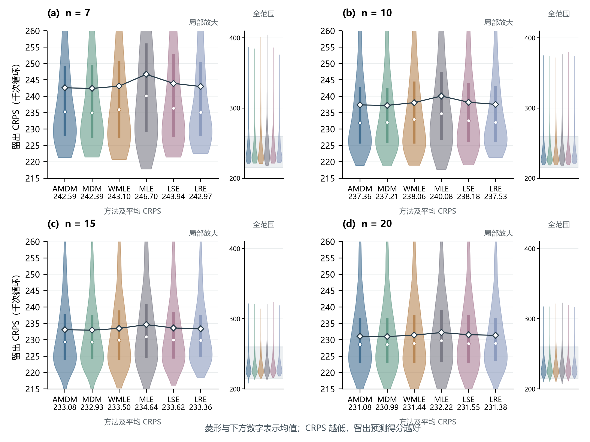

# E11 真实疲劳寿命数据的重复小样本留出预测评价

2026-09-25。使用101个真实寿命观测，n=7、10、15、20各2,000次无放回抽取；每次用n个观测估计，用剩余101−n个观测评价。所有方法共享划分，AMDM采用原冻结模型。

**评价对象：少量寿命观测得到的估计分布，能否描述同来源的其他观测。** 本轮不使用全样本MLE或多方法共识作为参数真值。该数据集此前已用于探索，本轮属于同一案例的进一步评价。

## 主要结果

六方法共同成功的抽样上，AMDM平均CRPS低于MLE、WMLE、LSE和LRE；相对MLE降幅为0.49%—1.67%，相对WMLE为0.16%—0.29%。相对固定MDM则高0.04%—0.08%，两者非常接近。这是描述性比较，不宣称统计显著。

仅比较AMDM与固定MDM时，两者各档2,000次均成功，AMDM降幅依次为+0.007%、−0.029%、−0.055%、−0.051%。因此不受其他方法失败筛选影响的完整配对结果也没有显示清晰的额外预测优势。AMDM与固定MDM均可稳定完成本案例求解；本案例的分布预测评价与模拟中的参数精度评价回答不同问题。

## 指标和比较口径

主指标为留出观测上的平均CRPS，原始单位为千次循环，越小越好。每个抽样先对其剩余观测求平均，再对共同成功的抽样等权平均。CRPS衡量分布预测，不是参数RMSE。

$$\operatorname{CRPS}(\hat F,y)=\int_{-\infty}^{\infty}[\hat F(t)-\mathbf{1}\{y\le t\}]^2\,dt.$$

指标依据：[Gneiting与Raftery（2007）](https://doi.org/10.1198/016214506000001437)。数据来源：[NIST BIRNSAUN](https://www.itl.nist.gov/div898/handbook/datasets/BIRNSAUN.DAT)。

主图和主表采用六方法共同成功的抽样；成功率按全部2,000次计算。另保存AMDM与各方法在两者共同成功抽样上的配对比较，避免将不同评价集合混为一谈。重复抽取的分布反映固定101个观测下的划分变异，不是总体置信区间。

## 汇总表

| n | 方法 | 平均CRPS | 中位CRPS | AMDM较该方法降幅 | 成功率 | 六方法共同有效数 |
|---:|---|---:|---:|---:|---:|---:|
| 7 | AMDM | 242.589 | 235.308 | — | 100.00% | 1025 |
| 7 | MDM | 242.394 | 234.943 | -0.08% | 100.00% | 1025 |
| 7 | WMLE | 243.104 | 235.933 | +0.21% | 93.35% | 1025 |
| 7 | MLE | 246.703 | 240.124 | +1.67% | 57.90% | 1025 |
| 7 | LSE | 243.942 | 236.311 | +0.55% | 100.00% | 1025 |
| 7 | LRE | 242.974 | 235.073 | +0.16% | 100.00% | 1025 |
| 10 | AMDM | 237.363 | 231.927 | — | 100.00% | 1350 |
| 10 | MDM | 237.212 | 232.016 | -0.06% | 100.00% | 1350 |
| 10 | WMLE | 238.062 | 232.941 | +0.29% | 91.25% | 1350 |
| 10 | MLE | 240.078 | 234.680 | +1.13% | 76.25% | 1350 |
| 10 | LSE | 238.176 | 232.527 | +0.34% | 100.00% | 1350 |
| 10 | LRE | 237.530 | 232.027 | +0.07% | 100.00% | 1350 |
| 15 | AMDM | 233.081 | 229.379 | — | 100.00% | 1560 |
| 15 | MDM | 232.935 | 229.310 | -0.06% | 100.00% | 1560 |
| 15 | WMLE | 233.498 | 229.911 | +0.18% | 85.35% | 1560 |
| 15 | MLE | 234.637 | 230.909 | +0.66% | 92.65% | 1560 |
| 15 | LSE | 233.623 | 229.951 | +0.23% | 100.00% | 1560 |
| 15 | LRE | 233.356 | 229.829 | +0.12% | 100.00% | 1560 |
| 20 | AMDM | 231.078 | 228.601 | — | 100.00% | 1670 |
| 20 | MDM | 230.993 | 228.601 | -0.04% | 100.00% | 1670 |
| 20 | WMLE | 231.438 | 228.890 | +0.16% | 85.00% | 1670 |
| 20 | MLE | 232.218 | 229.761 | +0.49% | 98.50% | 1670 |
| 20 | LSE | 231.552 | 228.853 | +0.20% | 100.00% | 1670 |
| 20 | LRE | 231.384 | 228.918 | +0.13% | 100.00% | 1670 |

降幅 = 100 ×（1 − AMDM平均CRPS / 对照平均CRPS）。正值表示AMDM较低，负值表示AMDM较高。MDM指固定δ=0.1。共同成功得分与成功率需一起阅读，不能将成功子集中的表现等同于所有任务上的表现。

## 结果图

图：不同小样本量下六方法的留出CRPS小提琴图。(a)–(d)分别对应n=7、10、15、20。每幅主图保持AMDM、MDM、WMLE、MLE、LSE、LRE顺序，方法颜色保持一致。宽度表示核密度，内部粗线为四分位区间，白圆点为中位数，空心菱形及方法名下方数字为均值。均值连线仅辅助比较高低，不表示连续变量趋势。数值越低表示留出预测得分越好。

主图统一放大215—260区间，旁侧小图使用统一全范围显示全部得分，其阴影标出放大范围。未删掉尾部观测；[均值与范围计数](figure_ranking.csv)保存各方法均值、数量及主图范围外计数。各小提琴等最大宽度。图与主表均为六方法共同成功抽样，其数量依次为1025、1350、1560、1670。

## 固定MDM的完整配对检查

以下只要求AMDM与固定MDM共同成功，不受其他方法失败影响。

| n | 配对数量 | AMDM平均CRPS | 固定MDM平均CRPS | AMDM降幅 |
|---:|---:|---:|---:|---:|
| 7 | 2000 | 244.699 | 244.716 | +0.01% |
| 10 | 2000 | 238.384 | 238.315 | -0.03% |
| 15 | 2000 | 232.644 | 232.515 | -0.06% |
| 20 | 2000 | 230.294 | 230.176 | -0.05% |

## 文件与复现

- [运行程序](../run_holdout.py)：冻结协议、核验历史估计、补算方法、计算留出得分及汇总。
- [绘图与报告程序](../plot_holdout.py)：生成本报告及PNG、SVG、PDF。
- [冻结协议](protocol.json)、[核验结果](verification.json)、[逐抽样结果](per_subsample.csv.gz)、[抽取编号](estimation_ids.csv.gz)。
- [主表](summary.csv)、[全部配对比较](paired_comparison.csv)、[共同成功绘图数据](common_scores.csv.gz)。

本次复用24,000条既有估计并补算24,000条估计，全部48,000条留出得分重新计算。检查每次训练/评价编号不重叠、缓存估计数值不变、数据/代码/模型哈希不变，并以独立数值积分校验24种样本量×方法的CRPS。未重新训练、未改变旧结果、未自动写入论文或Git提交。
