# 01~04 研究内容

> 每完成一个实验，将结论写入对应位置。骨架是先验，本文件是后验。

---

# 第一大块：01 用什么指标评价参数估计的准确性

## 第1页：文献里实际用什么指标？

**实验：** E01-1 扫描182文件夹68篇文献笔记，逐篇记录"与真值对比"类精度指标的使用情况。

**结果：**

| 排名 | 精度指标 | 频次 | 占比 |
|---|---|---|---|
| 1 | Bias | 51 | 75% |
| 2 | SD/方差 | 38 | 56% |
| 3 | MSE/RMSE | 27 | 40% |
| 4 | 相对误差 | 11 | 16% |
| 5 | MAE | 2 | 3% |

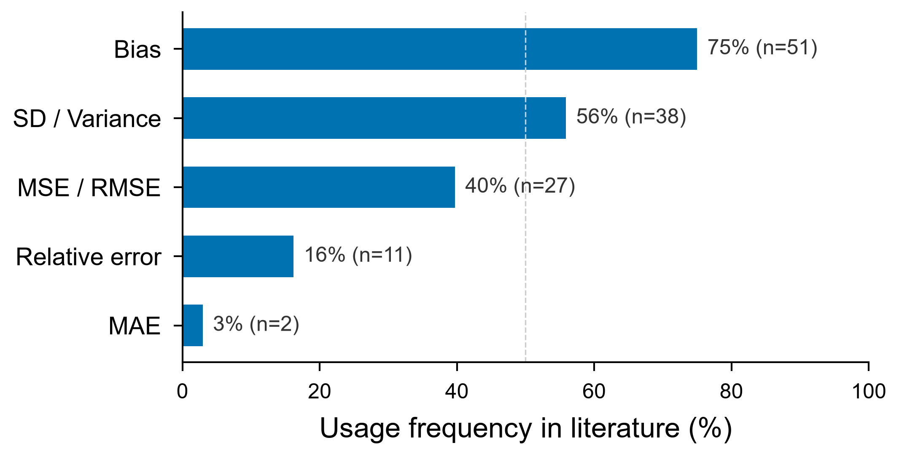

**结论：** Bias+SD 是绝对主干（75%、56%），MSE/RMSE 是常见补充（40%）。相对误差（16%）和 MAE（3%）使用率低。置信区间/敏感性/拟合优度属统计性质范畴，不纳入精度指标。

---

## 第2页：常见指标的定义与各自能反映什么

**实验：** E01-2 文献梳理 + E01-6 蒙特卡洛数据演示。

### 指标定义

| 指标 | 公式 | 看的是什么 | 量纲 |
|---|---|---|---|
| Bias | E[θ̂] − θ | 系统性偏移 | 同参数 |
| SD | √E[(θ̂−E[θ̂])²] | 散布 | 同参数 |
| MSE | E[(θ̂−θ)²] = Bias²+SD² | 综合 | 同参数² |
| RMSE | √MSE | 综合（与SD同量纲） | 同参数 |
| 相对误差 | (θ̂−θ)/θ | 无量纲偏差 | 无量纲 |
| MAE | E[\|θ̂−θ\|] | 平均绝对偏离 | 同参数 |

### 误差分布的直观形态：这些指标反映的是什么？

指标是分布的摘要数字。要理解指标，先看分布。

**n=20 参数估计误差分布（3×3：β/η/γ × MDM/MLE/LSE）：**

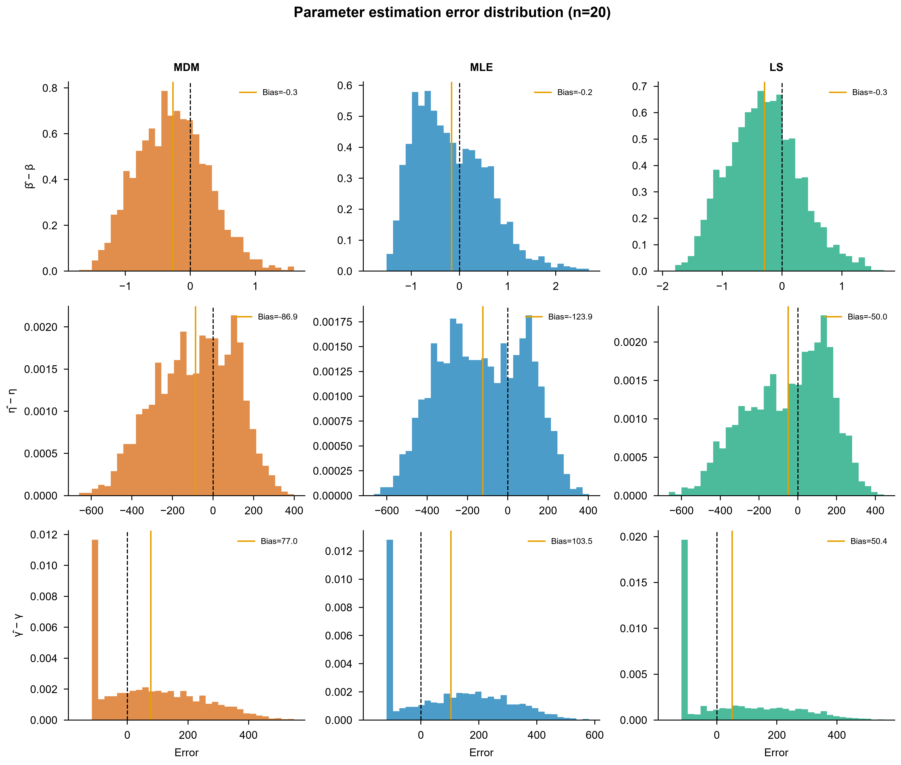

三个突出特征：

1. **β 行**：三法都左偏（低估倾向），MDM 最集中，MLE 最宽且左端有孤立竖条（边界退化解，n=20 时 MLE 失败率 4.3%）
2. **η 行**：整体向左拖尾，MLE 左移最明显（Bias 最大）
3. **γ 行**：**"零点堆积 + 宽幅右散"的双峰形态**——左端 γ̂=0 处有点质量（截断），右侧散布到接近 t₍₁₎。任何单一数字都不足以概括 γ̂ 的分布，必须配合分布图阅读

指标与分布的对应关系：
- **Bias** = 橙线位置（分布中心偏离零误差多远）
- **SD** = 直方图宽度（散布程度）
- **RMSE** = Bias²+SD² 的合成（中心偏移 + 散布的综合）
- **MAE** vs RMSE 差距大 → 存在重尾

**n=5 小样本下的极端形态：**

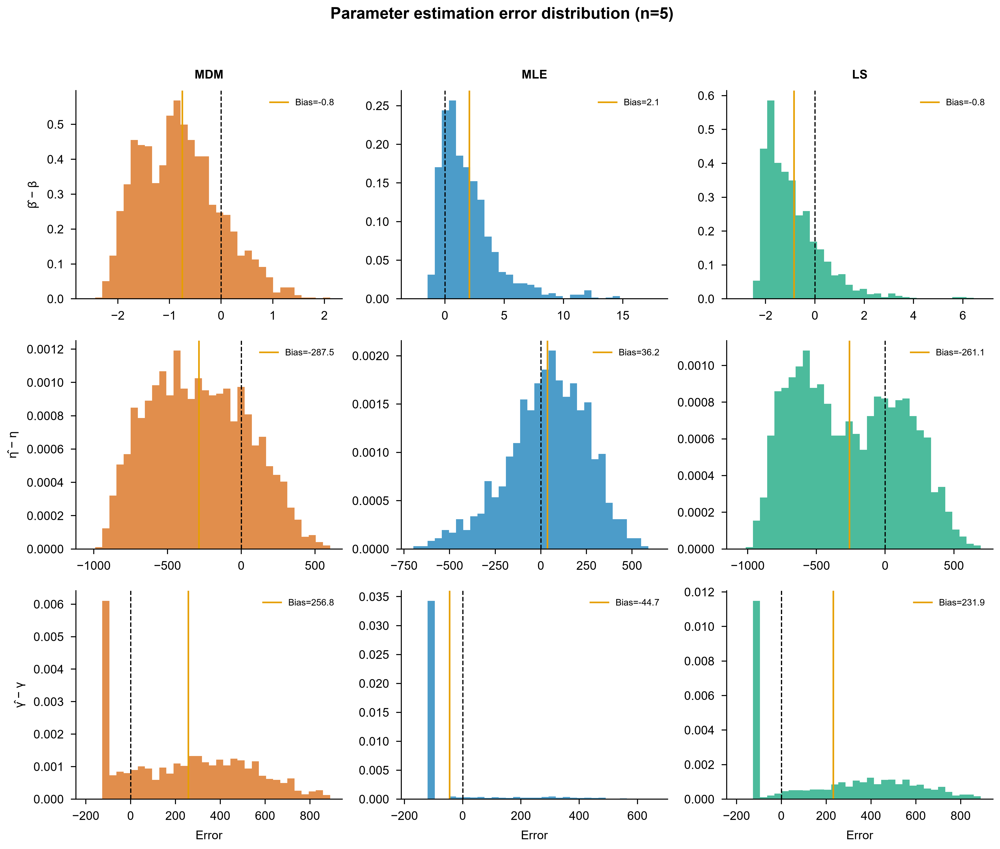

n=5 时 MLE 的分布严重退化（失败率 54.4%），有效样本的误差分布也不对称。MDM 和 LSE 仍保持可用但散布极大。

### 误差随样本量的变化

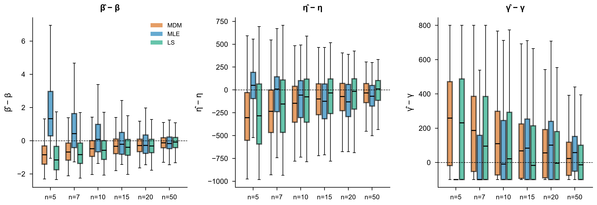

随 n 增大：三法误差分布同步收窄并向零靠拢，方法间差距也收敛。n=50 时三法 β 的 RMSE 仅差约 4%。γ 的箱体始终最宽，确认 γ 是最难估的参数。

**结论：** Bias+SD 是最小充分集。MSE/RMSE 是合成指标。相对误差跨参数可比但 γ=0 时失效。γ̂ 的双峰分布意味着必须附图阅读。

---

## 第3页：为什么没有一个统一有效指标？

**实验：** E01-3 构造+蒙特卡洛演示。

第2页列出了许多指标，这并不是因为评价体系可以任意选择，而是因为"估计效果好"本身有不同含义：有的研究关心系统偏差，有的关心估计稳定性，有的关心尾部风险，有的关心跨参数可比性，还有的直接关心寿命分位点预测。即使在同一个目标下，单个汇总指标也可能被误差分布形态蒙蔽。因此本页的任务不是再罗列指标，而是说明为什么不能把所有研究目标压成一个无条件有效的指标。

### 情景1：RMSE相同可掩盖不同偏差-方差结构

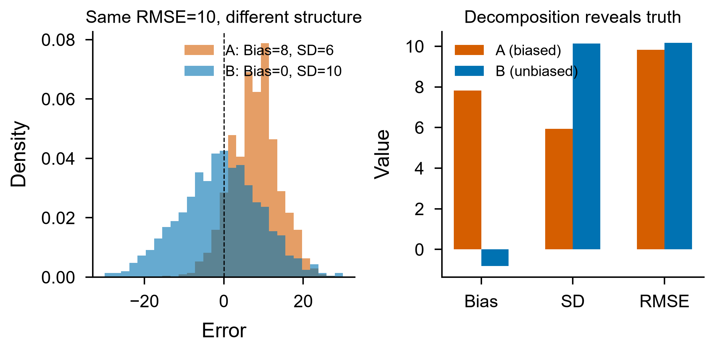

**结论：** RMSE 相同不代表精度相同，必须分解报告 Bias 和 SD。

### 情景2：中位/平均类指标对尾部钝感

用 E01-6 数据（n=20, MDM, γ̂ 误差绝对值）：

| 指标 | 值 | 与中位数比 |
|---|---|---|
| Mean \|err\| | 139.4 | 1.4x |
| Median \|err\| | 100.0 | 1.0x |
| P99 | 457.8 | 4.6x |
| P99.9 | 542.1 | **5.4x** |
| Max | 665.6 | **6.7x** |

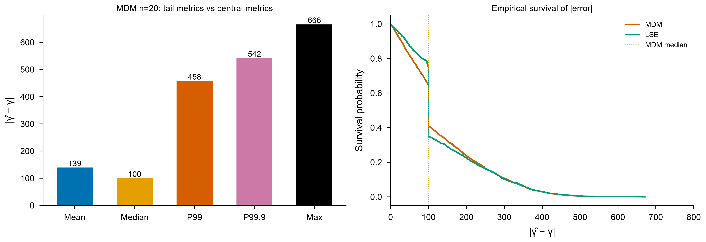

左图：汇总指标之间的差距——中位数和均值完全看不到尾部有多差。右图：经验生存函数显示 MDM 和 LSE 的尾部行为差异。结论：仅报 Mean/Median 会严重低估极端误差风险，必须附报 P99 或最大误差。

### 情景3：γ真值接近0时相对指标失真

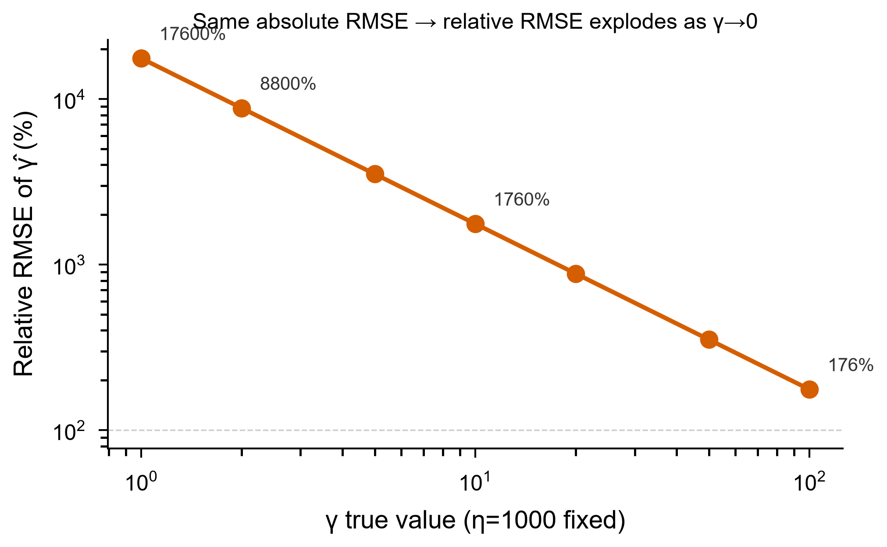

假设绝对 RMSE_γ 不变（=176，E01-6 n=20 MDM 实测值），仅改变 γ_true：γ_true=100 时 RelRMSE=176%，γ_true=10 时 1760%，γ_true=2 时 **8800%**，γ_true=1 时 **17600%**。同一个估计器，精度没变，只是因为真值不同，相对指标可以任意放大。结论：γ 禁用相对指标。

### 情景4：参数视角排序 ≠ 工程视角排序

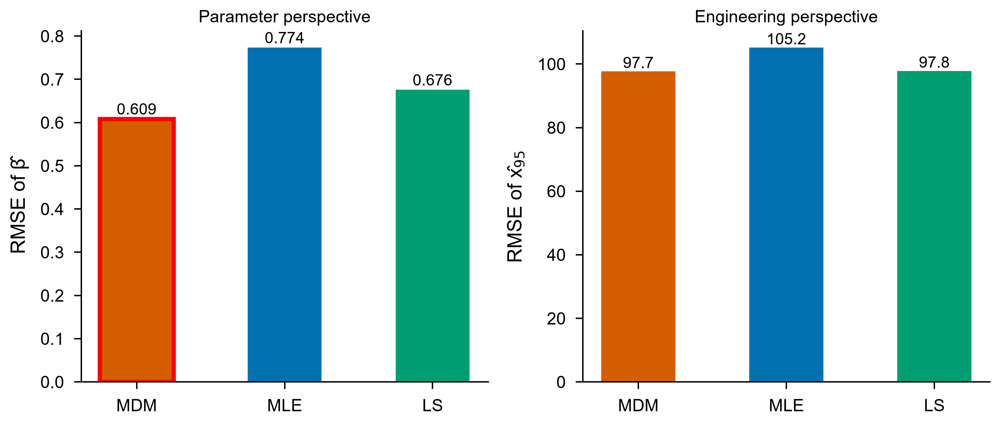

E01-6 实测（n=20）：
- 参数视角 β̂ RMSE：**MDM(0.609)** < LSE(0.676) < MLE(0.774) → MDM 最优
- 工程视角 x̂₀.₉₅ RMSE：**LSE(97.8)** ≈ MDM(97.7) < MLE(105.2) → LSE 追平 MDM

MDM 的参数优势（β̂ 更准）在工程视角被 LSE 的低 γ̂ 偏差（Bias=50 vs MDM 的 77）补偿。机制：分位公式 x_R = γ + η(−lnR)^{1/β} 中 γ 的贡献被放大。结论：两套视角排序不同，不能互相替代。

### 情景5：不同量纲参数的MSE不可横比

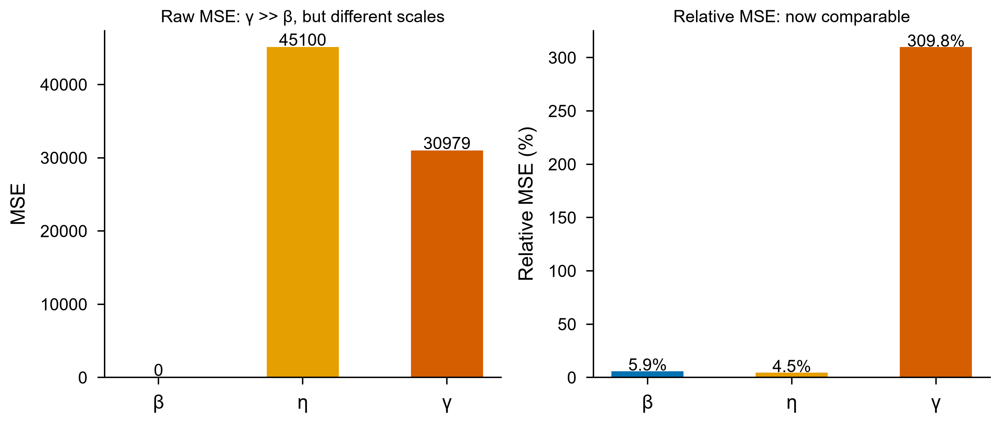

E01-6 数据（n=20, MDM）：

| 参数 | MSE | 相对MSE |
|---|---|---|
| β | 0.37 | 5.9% |
| η | 45100 | 4.5% |
| γ | 30979 | **310%** |

左图原始 MSE：γ 的 MSE 是 β 的 84000 倍——但这完全是量纲差异（β 无量纲，γ 单位是时间）。右图相对 MSE（MSE/true²）：β 和 η 的相对 MSE 接近（5.9% vs 4.5%），γ 的相对 MSE 才真正反映其估计难度（310%）。结论：跨参数比较必须用相对指标或标准化，原始 MSE 数值无意义。

---

## 第4页：参数视角推荐方案 + 综合精度指标 J_param

**实验：** 综合 E01-1 文献统计、E01-2 指标知识梳理、E01-3 指标失效演示和 E01-6 三方法蒙特卡洛结果，确定参数视角的诊断指标与后续03-04排序/训练指标。

既然指标很多，参数估计到底用哪个评价？在蒙特卡洛研究中，每个参数的估计误差不是一个点，而是一组逐次分布。评价这组分布至少要回答两个问题：平均估计是否偏离真值，以及估计结果是否稳定。因此 Bias 和 SD 构成参数视角的最小充分集；RMSE 是二者的合成摘要，可作为便捷补充。若后续为了 δ 方案排序或神经网络训练必须使用一个标量目标，则需要把 β、η、γ 三个参数的误差统一到一个可比较的空间中，这就是 J_param 的作用。

**结果：**

### 多指标方案（诊断用）

| 参数 | Bias | SD | RMSE | 相对Bias | 相对RMSE | 其他 |
|---|---|---|---|---|---|---|
| β̂ | ✓ | ✓ | ✓ | ✓ | ✓ | |
| η̂ | ✓ | ✓ | ✓ | ✓ | ✓ | |
| γ̂ | ✓ | ✓ | ✓ | **禁用** | **禁用** | 附报 γ̂=0 截断率 + γ̂ 近零率 |

解释：
- Bias 看系统偏移，SD 看离散程度，RMSE 同时吸收 Bias 和 SD。
- β/η 可以补充相对指标，因为真值远离 0 且有自然比例意义。
- γ 禁用相对指标，因为 γ 接近 0 时相对误差会任意放大；γ 只报告绝对 Bias/SD/RMSE，并配合 γ̂ 分布图、γ̂=0 截断率、近零率阅读。

### 单指标 J_param（排序/训练用）

后续 03-04 需要在不同 δ 方案之间做统一排序，或为神经网络训练提供一个参数视角目标函数，仅靠三组 Bias/SD/RMSE 不便于优化。因此采用三参数联合相对 RMSE：

`J_param = √( mean( ((β̂-β)/β)² + ((η̂-η)/η)² + ((γ̂-γ)/η)² ) )`

设计理由：
- β、η 分别除以自身真值，转为无量纲相对误差。
- γ 不除以 γ 自身，而除以 η，避免 γ≈0 时相对误差失真，同时保留位置参数相对寿命尺度的工程意义。
- 几何含义：每次估计都对应标准化参数误差空间中的一个三维误差向量，J_param 是这些向量长度的均方根；数值越小，表示三参数整体估计离真值越近且波动越小。
- 平方、求均值、开根号，使 J_param 与 RMSE 同类：同时惩罚系统偏移和散布，因此能反映整体精度与估计稳定性。
- J_param 用于03-04方案排序；Bias/SD/RMSE 保留用于诊断，不互相替代。

---

## 第5页：工程视角的必要性 + 目标分位点 RMSE

工程关心的是高可靠寿命 x_R = γ + η(−lnR)^{1/β}，参数准≠寿命准。

**E01-6 实证（n=20）：**

| 方法 | RelRMSE_β | RelRMSE_x95 |
|---|---|---|
| MDM | 24.4% | 24.1% |
| LSE | 27.0% | 24.2% |
| MLE | 31.0% | 26.0% |

MDM 的参数优势在工程视角被 LSE 追平。两套视角必须分开报告。

### 目标分位点指标

工程视角不直接评价 β̂、η̂、γ̂，而评价指定可靠度 R 下的寿命分位点：

`x_R = γ + η(−lnR)^{1/β}`

如果任务关心 95% 可靠寿命，就计算 x₀.₉₅；如果任务关心 99% 可靠寿命，就计算 x₀.₉₉。不同可靠度对应不同工程目标，不默认把它们合并成一个指标。

对给定目标 R，报告：
- `Bias_xR = mean(x̂_R − x_R)`
- `SD_xR = sd(x̂_R)`
- `RMSE_xR = √(mean((x̂_R − x_R)²))`

其中，如果工程视角只能选一个排序指标，就用目标分位点的 RMSE_xR。RMSE 同时包含系统偏差和波动，且保留实际时间单位，直接对应寿命预测误差的工程量级。

因此，本研究不默认使用把 x₀.₉₅ 和 x₀.₉₉ 强行合并的工程联合指标；需要哪个可靠寿命目标，就使用对应 x_R 的 Bias/SD/RMSE，排序时使用 RMSE_xR。

---

## 第6页：两视角不等价的实证 + 三方法蒙特卡洛比较

**实验：** E01-6 真值 β=2.5, η=1000, γ=100；n∈{5,7,10,15,20,50}；每组 2000 次重复（统一配置）；MDM(δ=0.1)/MLE/LSE 在同一批样本上配对估计。

**LSE 说明：** 研究用本地对照实现（程序/lse_weibull.py），平台 python/methods/lse.py 仍为 NotImplementedError。

### 失败率

| n | MDM | MLE | LSE |
|---|---|---|---|
| 5 | 0.4% | **54.4%** | 0.0% |
| 7 | 0.1% | **46.2%** | 0.0% |
| 10 | 0.0% | **28.9%** | 0.0% |
| 15 | 0.0% | **12.7%** | 0.0% |
| 20 | 0.0% | 4.3% | 0.0% |
| 50 | 0.0% | 0.0% | 0.0% |

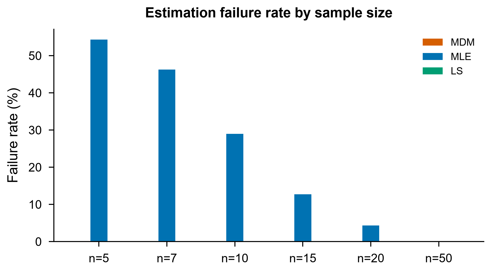

**MLE 在小样本下灾难性失效**：n=5 超过一半样本无法收敛。MDM 和 LSE 在所有样本量下几乎 100% 有效。MLE 的指标只基于有效样本，n=5 的 RMSE 对比需谨慎（幸存者偏差）。

### 参数视角

| n | 方法 | RMSE_β | RMSE_η | RMSE_γ | γ̂=0率 | γ̂近零率 |
|---|---|---|---|---|---|---|
| 5 | MDM | 1.114 | 434.7 | 380.4 | 18.8% | 18.9% |
| 5 | MLE* | 3.452 | 224.7 | 153.9 | 25.6% | 38.1% |
| 5 | LSE | 1.555 | 462.3 | 388.1 | 0.0% | 35.6% |
| 20 | MDM | 0.609 | 212.4 | 176.0 | 23.8% | 23.9% |
| 20 | MLE | 0.774 | 247.1 | 203.3 | 21.8% | 26.7% |
| 20 | LSE | 0.676 | 215.8 | 175.0 | 0.0% | 40.2% |
| 50 | MDM | 0.448 | 143.1 | 119.3 | 19.2% | 19.4% |
| 50 | MLE | 0.510 | 162.3 | 136.2 | 14.6% | 20.0% |
| 50 | LSE | 0.454 | 143.0 | 117.8 | 0.0% | 32.6% |

*MLE n=5 有效样本仅 913/2000，指标有幸存者偏差。

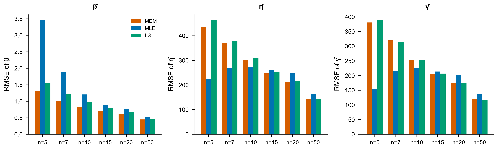

### 工程视角

| n | 方法 | RMSE_x95 | RMSE_x99 |
|---|---|---|---|
| 5 | MDM | 233.3 | 293.1 |
| 5 | MLE* | 229.9 | 293.3 |
| 5 | LSE | 238.0 | 301.6 |
| 20 | MDM | 97.7 | 121.9 |
| 20 | MLE | 105.2 | 135.8 |
| 20 | LSE | 97.8 | 120.2 |
| 50 | MDM | 59.9 | 74.9 |
| 50 | MLE | 63.1 | 83.0 |
| 50 | LSE | 59.5 | 73.6 |

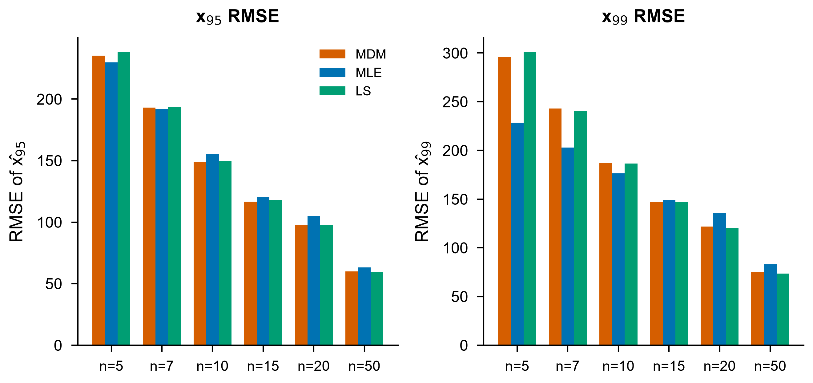

### 工程视角误差分布（n=5 vs n=20 对比）

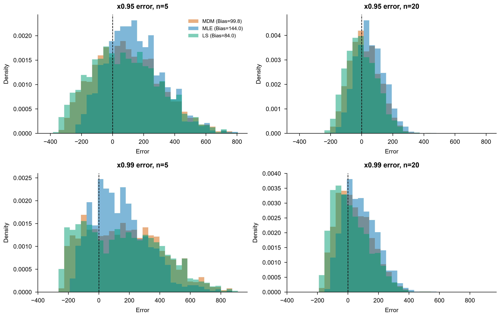

与 γ̂ 的双峰散布形成鲜明对照：x̂₀.₉₅ 和 x̂₀.₉₉ 的误差分布是**单峰、近似连续**的，仅带右偏尾。参数层面剧烈的补偿在分位点组合中大部分抵消——这正是"参数视角"与"工程视角"结论可以不同的机制。n=5 到 n=20 的收窄效果直观可见。

### γ̂=0 截断 vs 近零边界

- **γ̂=0 截断**（\|γ̂\| < 1e-10）：MDM 约 19-24%，MLE 随 n 降低而升高，LSE 始终 0%
- **γ̂ 近零**（\|γ̂\| < 0.01·γ_true = 1.0）：LSE 约 33-43%，MDM 约 19-24%，MLE 20-38%
- LSE 从不截断到 0，但有大量近零估计（概率图回归在 γ→0 时仍有解）
- MDM 通过截断到 0 获得更稳定的估计

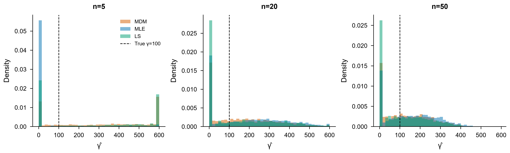

### 关键结论

1. **MDM 全样本量参数视角最优**（RMSE_β: n=5 1.114, n=20 0.609, n=50 0.448）
2. **工程视角 LSE ≈ MDM**（RMSE_x95 差异 < 1%），LSE 的低 γ̂ 偏差补偿了 β̂ 劣势
3. **MLE 小样本灾难**：n=5 失败率 54.4%，n=7 46.2%，n≥50 才归零
4. **γ 是最难估的参数**：RMSE_γ 在 n=5 时 MDM 为 380（RelRMSE=380%）
5. **γ̂=0 截断是 MDM 的特征**（~20%），不是缺陷——截断后估计更稳定
6. **LSE 无截断但有近零尖峰**（~35-43%），散布更大
7. **n≥50 三法趋同**，差异在小样本下才显著

---

## 第7页：第一大块指标选择总结

**实验：** 汇总 E01-1~E01-6 的文献统计、指标陷阱、分布图和三方法蒙特卡洛结果，提炼03-04后续使用的指标策略。

**结果：**

- **参数视角：** 常规报告 Bias、SD、RMSE；需要一个排序/训练目标时用 J_param。J_param 适合回答"哪个 δ 让三参数估计整体更准且更稳定"。
- **工程视角：** 先选目标可靠度 R，再报告 x_R 的 Bias、SD、RMSE；需要一个工程排序指标时用 RMSE_xR。RMSE_xR 适合回答"哪个 δ 让目标寿命分位点预测更准"。
- **诊断时仍必须看分布。** J_param 或 RMSE_xR 负责排序，Bias/SD/RMSE、γ̂=0 截断率、近零率和误差分布图负责解释原因。
- **两套视角不能互相替代。** E01-6 已经显示：MDM 在参数视角最优，但工程视角 LSE 可追平 MDM；因此03-04必须明确当前优化的是参数估计目标还是工程寿命目标。

---

# 第二大块：02 MDM 方法的有解性证明

## 第1页：MDM 无解现象与理论存在性

**实验：** 无独立实验，纯论述。

**结果：** MDM 方法在实际运行中会出现"无解"现象。理论分析表明：σ²_η(γ) 是开口向上的二次函数，包络梯度 g(γ) 单调上升，上确界 s_v 仅依赖 β 和 n。存在性判据：s_v > offset 且无约束根 ∈ [0, t₍₁₎) ⟹ 合法根存在且唯一。常用区间 s_v 远大于 0.1，存在性几乎不受限制。

**结论：** 理论预测合法根几乎总存在 → 实际"无解"必有具体原因。

---

## 第2页：无解的两类成因

**实验：** E02-1 负根示例 + E02-2 漏检示例。

**结果：**

无解来自两类成因：
- **成因① 下界切除（主因）：** 无约束根落在 γ<0 处，被物理约束 γ≥0 切掉。E02-1 示例中 γ*=-2.0，差异函数在 γ<0 处有过零点，但不合法。
- **成因② 网格漏检（次因）：** 根紧贴 t₍₁₎，均匀网格看不到。E02-2 示例中 γ*=50.3，t₁=53.7，20 个搜索点在根附近没有采样到，符号变化被跳过。

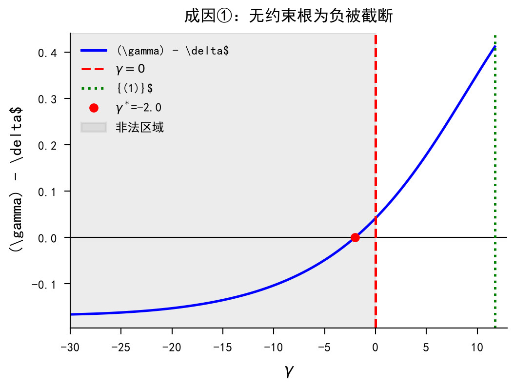

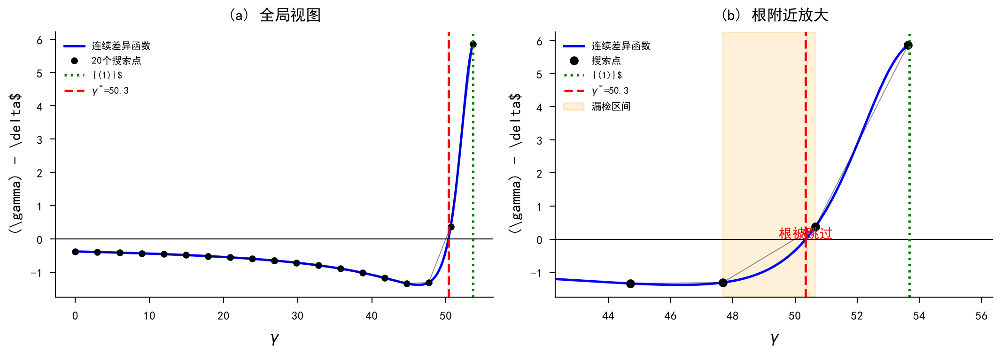

**结论：** 两类成因都有明确的处理策略——成因①截断到 0，成因②用拟合推算根。

---

## 第3页：工程方案——截断 + 拟合

**实验：** 无独立实验。成因①截断策略在 E01-6 中已验证（MDM γ̂=0 截断率 ~20%，误差可控）。成因②拟合方案在后续 03/04 的求解流程中自然体现。

**结果：**
- **成因①处理：** 无约束根为负则截断到 γ̂=0（物理约束，最稳）
- **成因②处理：** 不依赖密集网格，改用拟合（解析梯度）直接推算根的位置

**结论：** 工程方案简洁有效：截断 + 拟合，100% 给出合法估计。

---

## 第4页：始终有解方案的精度验证

**目的：** 证明截断+拟合方案不仅提升了可用性（failure_rate → 0%），而且没有以不可接受的精度代价换来的。这是第二大块从"能算"到"能算且可信"的关键一步。

**过程：** 同一批样本、同一 δ=0.1，对比两组策略：
- **对照组：** 标准网格搜索（20点），无解直接标记失败，指标只算 valid 样本
- **实验组：** 截断（γ<0→γ̂=0）+ 拟合（近右端根用解析梯度推算），100% 给出估计

报告指标：
- valid_rate / failure_rate
- J_param
- RMSE_β / RMSE_η / RMSE_γ
- RMSE_x₀.₉₅ / RMSE_x₀.₉₉
- γ̂=0 截断率与 near-zero 率

三层次对比：
1. 可用性提升：failure_rate 从 X% → 0%
2. valid-only 子集精度：同一组 valid 样本上两组的 J_param 对比
3. 全样本精度：实验组 vs 对照组 valid-only，看"补回来的那些样本"质量如何

**结果：**（待填充——目标：始终有解方案显著提升可用性，且主精度指标未出现不可接受退化）

**待做实验：**
- `E02-3` 始终有解方案精度验证：β=2.5, η=1000, γ=100；n∈{5,7,10,20}；2000次/组；δ=0.1 固定；对照组（标准网格，valid-only）vs 实验组（截断+拟合，100%有解）；报告上述全部指标

---

# 第三大块：03 最优偏移量 δ 的选取

> **状态提示：本块需要按新骨架重新做实验、生成数据、统计分析和图像。** 以下旧程序/旧图/旧数值只作历史参考；新实验完成前，不应把本块数值和结论作为最终研究内容引用。以下L0-L5定义表格和统一风险函数公式已经过新口径校准，可直接沿用作为实验框架。

## 第1页：最优偏移量的信息层级与风险定义

**实验：** E03-1 δ 扫描蒙特卡洛 + E03-2 层级最优计算 + E03-3 L5 Oracle。

**实验配置：** β∈{1.5, 2.0, 2.5, 4.0, 5.0} × n∈{7, 10, 20} × γ/η∈{0.1, 0.5, 1.0}，共 45 个组合。δ∈[0, 0.5]，步长 0.02（26 个点）。每配置 500 次重复。总拟合次数：45 × 26 × 500 = 585,000。

本部分要回答的不是“某一个样本事后最优 δ 是多少”，而是“在不同可用信息条件下，δ 选择规则能达到什么精度上限”。因此，L0~L5 是一组由粗到细的比较基准：从所有样本共用一个全局 δ，到按 n、β、β+n、β+n+γ/η 分层，再到每个样本事后选择 δ 的 oracle 上界。

这个阶梯的作用不只是证明“信息越多，`J_param` 越低”，而是为第四大块的神经网络训练提供取舍依据：每增加一层信息，能换来多少精度收益；这个收益是否值得用更复杂的标签、更高维的样本特征或更难训练的模型去学习。后续训练目标不应默认追逐最高的 L5 上界，而应根据这一阶梯判断学 L2、L3、L4、风险曲线或逐样本标签是否划算。

### 统一误差与风险函数

对第 i 个样本、偏移量 δ，MDM 得到三参数估计 `(β̂_i(δ), η̂_i(δ), γ̂_i(δ))`。定义单样本平方损失：

$$
loss_i(\delta)=
\left(\frac{\hat\beta_i(\delta)-\beta}{\beta}\right)^2+
\left(\frac{\hat\eta_i(\delta)-\eta}{\eta}\right)^2+
\left(\frac{\hat\gamma_i(\delta)-\gamma}{\eta}\right)^2
$$

单样本误差距离为：

$$
j_i(\delta)=\sqrt{loss_i(\delta)}
$$

层级风险统一采用 `J_param`，也就是三参数综合 RMSE 口径：

$$
J_{param}=\sqrt{\operatorname{mean}_i loss_i(\delta)}
=\sqrt{\operatorname{mean}_i j_i(\delta)^2}
$$

后续“最优 δ”均以最小化 `J_param` 对应的平方风险为主口径。旧表中直接平均 `j_i` 得到的数值可作为分布描述，但不再作为 L0~L5 阶梯比较的主指标。

### L0~L5 信息层级

每个仿真样本都有一组真值条件：`β`、`n` 和 `γ/η`。为了让不同真值组合在比较中权重一致，计算时分两步：

1. 先在同一组 `β,n,γ/η` 的重复样本内，计算某个 δ 的平均风险；
2. 再把属于同一信息层级的真值组合等权平均，得到该层级下的风险曲线。

各层级的最优 δ 定义如下：

| 层级 | 标签/理论决策时知道什么 | 一个 δ 代表的总体 | 最优偏移量计算 | 用途 |
|---|---|---|---|---|
| L0 | 不知道参数，只统一用一个 δ | 全部 `β,n,γ/η` 组合 | 在全部组合的平均风险曲线上取最低点 | 全局固定基线 |
| L1 | 知道 n | 同一 n 下的全部 `β,γ/η` 组合 | 在该 n 的平均风险曲线上取最低点 | 按样本量查表；可部署 |
| L2 | 知道 β | 同一 β 下的全部 `n,γ/η` 组合 | 在该 β 的平均风险曲线上取最低点 | 真 β oracle；训练标签候选 |
| L3 | 知道 β 和 n | 同一 `β,n` 下的全部 `γ/η` 组合 | 在该 `β,n` 的平均风险曲线上取最低点 | 真 β oracle；检验 n 的增益 |
| L4 | 知道 β、n、γ/η | 同一完整真值组合的重复样本 | 在该真值组合的平均风险曲线上取最低点 | 全真值配置 oracle |
| L5 | 知道单个样本在各 δ 下的真实误差 | 单个样本 i | `δ*_i = argmin_δ loss_i(δ)` | 逐样本事后 oracle；理论上界 |

L0~L4 都是“一个群体共用一个 δ”的最优策略；L5 则是“每个样本各自知道真实误差曲线”的事后 oracle，不能解释为可部署查表策略。L0~L1 是可部署或近可部署基线；L2~L4 使用真值信息，只能作为 oracle 上界或训练标签来源；L5 只能作为逐样本自适应的理论上界。训练神经网络时可以用真值生成这些 oracle 标签，但模型使用时输入只能来自可观测样本。

本页默认采用**真值组合等权**：每个 `β,n,γ/η` 组合对层级风险的权重相同。新版实验如果改用样本等权或应用分布加权，必须在 manifest 中单独声明，并重新生成所有层级表和图。

---

## 第2页：各层级最优 δ 的计算与可视化

**问题：** 每个层级都要回答同一个问题：如果这个层级的信息是可用的，用一个固定 δ 代表该层级对应的样本总体，哪个 δ 使三参数综合风险最低？

### 各层级计算方式

计算口径已在第1页定义。本页负责把第1页的层级定义转成可视化：先生成每个完整配置的 `δ-R_c(δ)` 风险曲线，再按 L0~L4 的配置集合 `G` 聚合成 `δ-R_G(δ)` 曲线，纵轴统一采用 `J_param(δ) = sqrt(R(δ))`。δ 共 26 个点（[0, 0.5]，步长 0.02）。L5 单独生成逐样本 `δ*_i` 分布。

### 需生成的图表清单

#### a. L0 全局最优曲线

横轴 `δ`（26点），纵轴 `J_param(δ)`，一条曲线。标注 `δ=0.1`（默认值）与 `δ*_0`（全局 J_param 最低点）。回答"所有样本共用一个 δ 时，0.1 是否接近全局最优"。

> 拟用文件名：`E03_L0_global_curve.png`

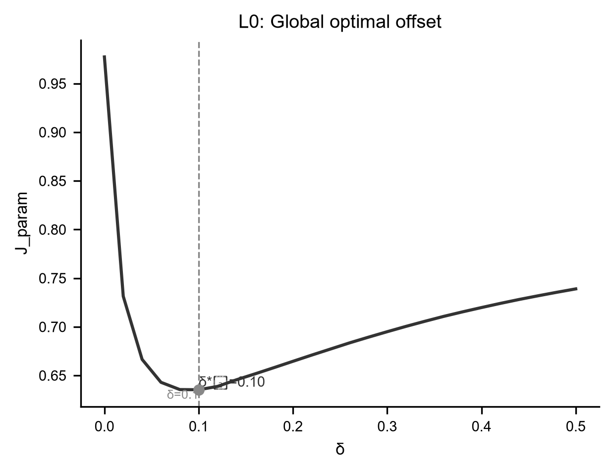

**结果：** `δ*_0 = 0.10`，恰好等于默认值 0.1。J_param(0.10) = 0.6353，与 Default δ=0.1 同值——全局固定策略下默认值即全局最优。

#### b. L1 按 n 曲线

横轴 `δ`，纵轴 `J_param(δ|n)`，三条曲线：n=7, 10, 20（不同颜色）。曲线各标 `δ*_n`。附加 `n → δ*_n` 柱状图，观察样本量是否驱动 δ 选择。

> 拟用文件名：`E03_L1_by_n_curves.png`、`E03_L1_by_n_bars.png`

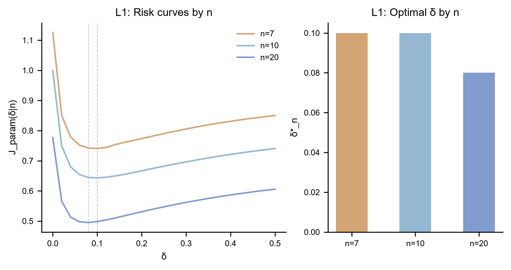

**结果：** δ*_7=0.10, δ*_10=0.10, δ*_20=0.08。三条曲线近乎重叠，n 对 J_param 曲线形态影响微弱，样本量不是 δ 选择的主驱动。

#### c. L2 按 β 曲线

横轴 `δ`，纵轴 `J_param(δ|β)`，五条曲线：β=1.5, 2.0, 2.5, 4.0, 5.0（不同颜色）。曲线各标 `δ*_β`。附加 `β → δ*_β` 散点图/折线图，观察 β 是否是主驱动。

> 拟用文件名：`E03_L2_by_beta_curves.png`、`E03_L2_by_beta_dots.png`

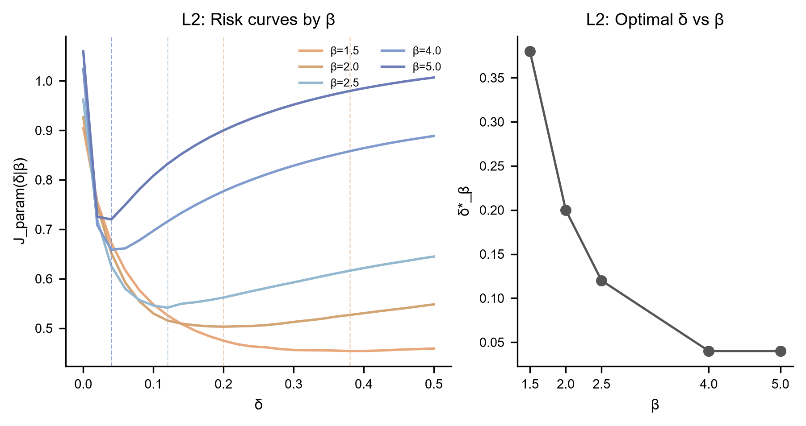

**结果：** 五条曲线截然分离，δ* 与 β 强负相关：β=1.5→δ*=0.38, β=2.0→0.20, β=2.5→0.12, β=4.0→0.04, β=5.0→0.04。β 是 δ* 的绝对主驱动（跨度 ~10×）。

#### d. L3 按 (β,n) 热力图

横轴 `β`（5个值），纵轴 `n`（3个值），颜色=`δ*_{β,n}`。观察 β 与 n 是否存在交互效应。

> 拟用文件名：`E03_L3_heatmap.png`

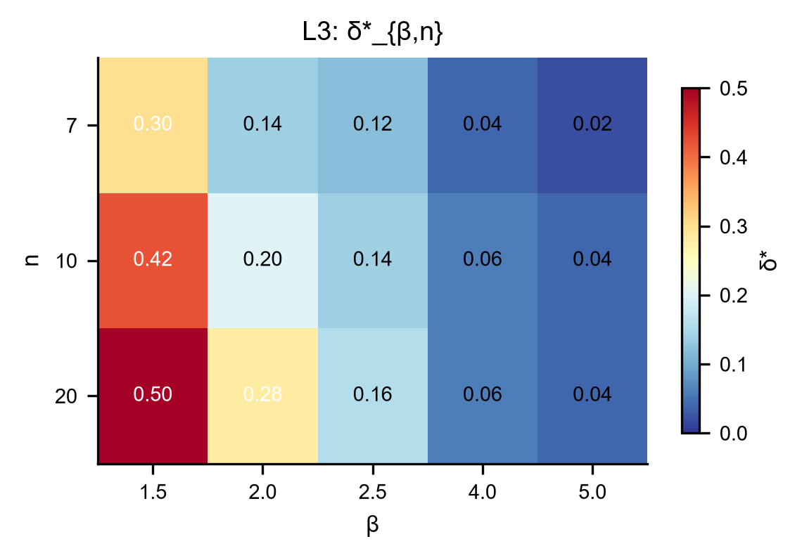

**结果：** 热力图颜色主要沿 β 轴变化，n 轴梯度弱——β 主导，n 修正。交互效应不显著。

#### e. L4 按 (β,n,γ/η) 热力图（三张分面）

按 `γ/η = 0.1 / 0.5 / 1.0` 分成三张 β×n 热力图，颜色=`δ*_{β,n,γ/η}`。观察 γ/η 是否改变最优 δ 的结构。

> 拟用文件名：`E03_L4_heatmap_gamma01.png`、`E03_L4_heatmap_gamma05.png`、`E03_L4_heatmap_gamma10.png`

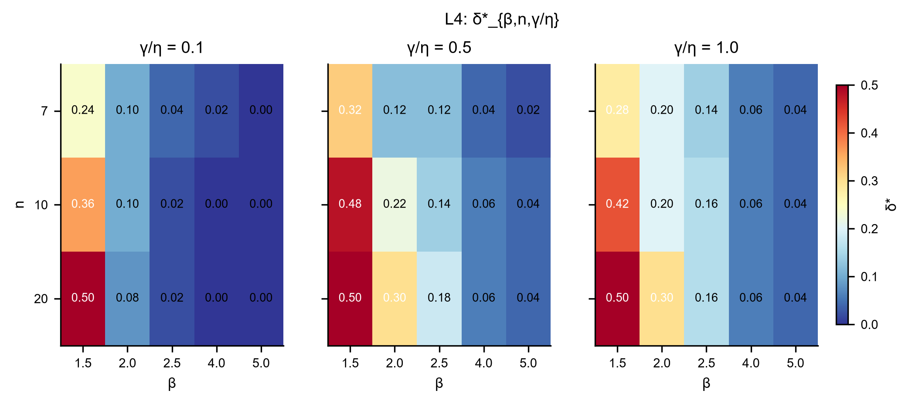

**结果：** γ/η 从 0.1→0.5 时 δ* 普遍增大（尤其 β=2.0~2.5 区间增幅明显），0.5→1.0 时变化不单调。γ/η 对 δ* 的影响非简单单调缩放，而是非线性修正项。

#### f. L5 逐样本 δ*_i 分布

`δ*_i` 的直方图/密度图（全样本聚合）。附加按 β 分组的小提琴图或箱线图，观察不同 β 下逐样本最优 δ 的分散程度。

> 拟用文件名：`E03_L5_hist.png`、`E03_L5_by_beta_violin.png`

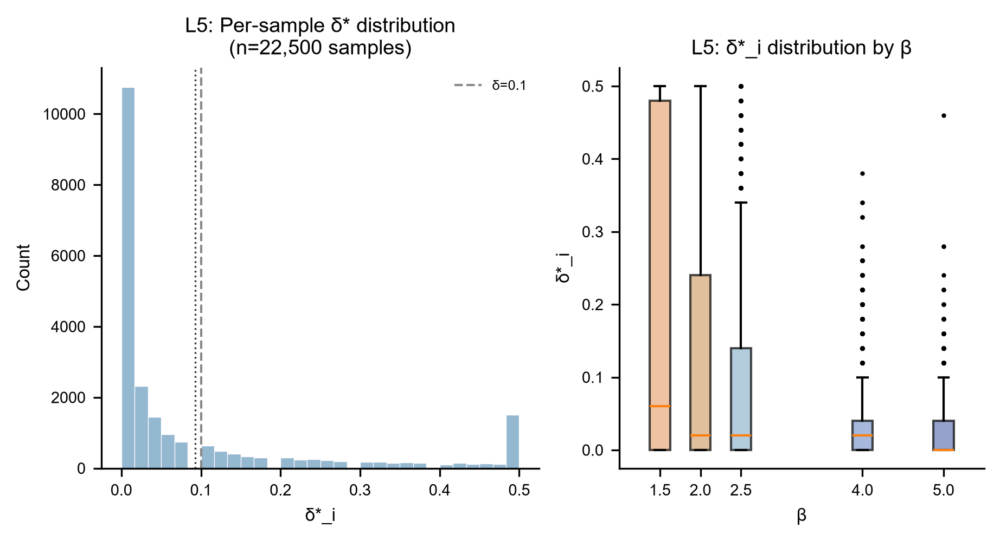

**结果：** δ*_i 多峰分布，均值 0.111，按 β 分组箱线图显示 β=1.5 集中在 0.30~0.42，β=5.0 集中在 0~0.10——散点分布宽，逐样本异质性显著。

#### g. 各层级单样本误差分布

L0~L4 每层级各选 3 个代表性 `(β,n,γ/η)` 配置，画该层最优 δ 下的单样本 `j_i` 分布直方图。目的：观察采用各层最优 δ 后，单样本误差的离散程度和尾部形态。代表性配置选取原则：
- 小 β + 小 n + 小 γ/η（最难估的一端）
- 中等 β + 中等 n + 中等 γ/η（典型配置）
- 大 β + 大 n + 大 γ/η（最易估的一端）

> 拟用文件名：`E03_L{0-4}_error_dist.png`（每层级一张，共5张）

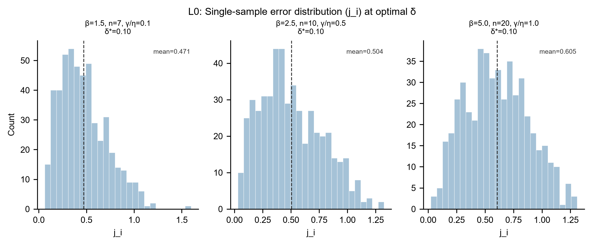
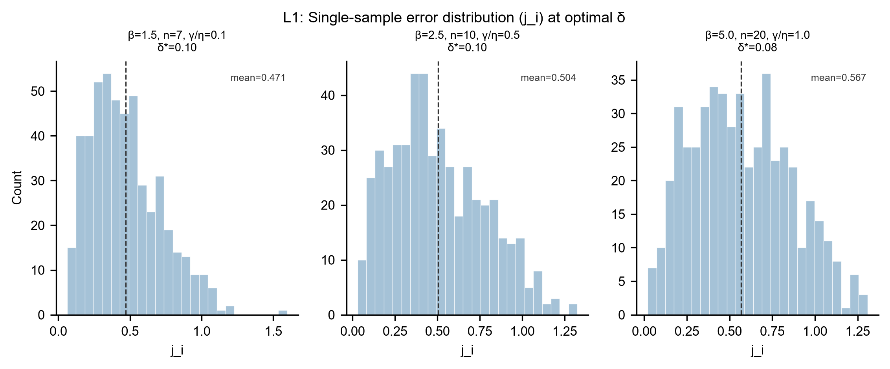
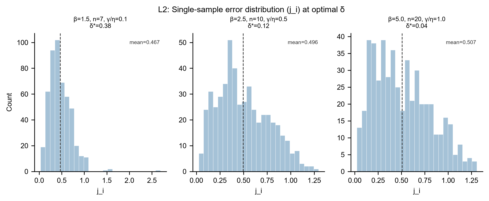
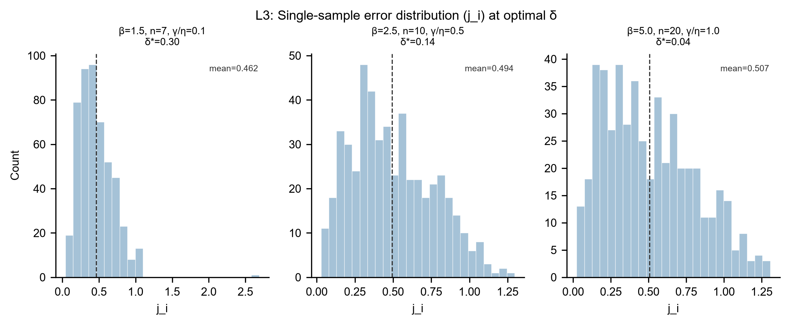
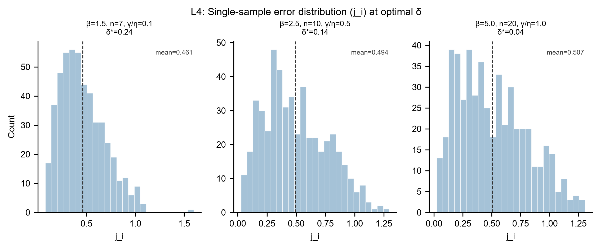

> **图表归属说明：** 所有 δ-J 曲线、热力图、直方图和误差分布图均归第2页。第3页只保留统一阶梯表，不重复嵌入分布图。

---

## 第3页：采用最优 δ 后的 J_param 阶梯

**问题：** 定义完各层级之后，需要把每个层级采用自己最优 δ 后达到的三参数综合 RMSE 列出来。这个阶梯图回答：知道更多信息后，最优风险最多能降到哪里？

### 统一阶梯表（新口径）

| 层级/策略         | δ 的使用方式                 | 可部署性         | J_param | vs Default | 边际增益            |
| ------------- | ----------------------- | ------------ | ------- | ---------- | --------------- |
| Default δ=0.1 | 所有样本固定 0.1              | 直接部署         | 0.6353  | 基准         | —               |
| L0 全局最优       | 所有样本固定 δ*=0.10          | 直接部署         | 0.6353  | 0.0%       | 同 Default       |
| L1 按 n        | 同一 n 共用 δ*_n            | 可部署          | 0.6345  | -0.1%      | ~0 (vs L0)      |
| L2 按 β        | 同一 β 共用 δ*_β            | 真 β oracle   | 0.5839  | -8.1%      | -8.0pp (vs L1)  |
| L3 按 β,n      | 同一 β,n 共用 δ*_{β,n}      | 真 β oracle   | 0.5807  | -8.6%      | -0.5pp (vs L2)  |
| L4 按 β,n,γ/η  | 同一完整真值组合共用 δ*_{β,n,γ/η} | 全真值 oracle   | 0.5701  | -10.3%     | -1.7pp (vs L3)  |
| L5 逐样本        | 每个样本用 δ*_i              | 事后 oracle 上界 | 0.4941  | -22.2%     | -11.9pp (vs L4) |

### 新口径结论

1. **Default δ=0.1 是强 baseline。** L0 全局最优 δ* 恰为 0.10，J_param 与默认值一致（0.6353）——原方法选 0.1 不是任意值，而是全局最优。
2. **β 是绝对主驱动。** L2 相比 L1 改善 8.0pp（占 L0→L4 总改善的 78%）。δ* 从 β=1.5 的 0.38 单调递减至 β=5.0 的 0.04，跨度 ~10×。
3. **n 的增益可忽略。** L3 相比 L2 仅再降 0.5pp——在 β 已知后，n 的信息增量极小。
4. **γ/η 是弱修正项。** L4 相比 L3 再降 1.7pp——有一定贡献但远小于 β。且 γ/η 对 δ* 的影响非单调：从 0.1→0.5 时 δ* 普遍增大，0.5→1.0 时混合变化。
5. **L5 逐样本上界空间显著。** J_param 从 0.5701→0.4941（再降 11.9pp），说明即使知道全部真值配置，样本随机形态仍保留可观改善空间。04 的任务是检验可观测样本特征能否逼近此上界。

---

## 第4页：真值未知时的可部署 δ 选择方案

> **旧数据状态：** 以下内容基于旧口径 45 配置实验。所有旧图已降级为历史占位链接，旧数值标注"旧实验观察，待新口径重算"。正文结论不得将旧数据作为当前论据。

**实验：** E03-4a 自迭代验证 + E03-4b 外部β预估对比 + E03-4c 方案阶梯表。

实际部署时只有样本，没有 β/γ/η 真值。本页检验两个方向不依赖真值的可部署 δ 选择方案：

### 方向1：MDM 自迭代

**思路：** 默认 δ=0.1 → MDM 估计 β̂ → 经连续插值 δ*(β̂,n) 得到新 δ → 迭代至收敛。

**新口径结果（45 配置 × 500 rep，按配置等权 J_param）：**

- 全样本 Default J = 0.6353 → 自迭代后 J = 0.6987，**整体恶化 -10.0%**
- 改善率 11.1%（5/45 配置），全部集中在 β=1.5 附近
- 按 β 分组：β=1.5 平均 +1.0%，β=2.0 -12.4%，β=2.5 -17.6%，β=4.0 -12.7%，β=5.0 -6.0%
- β≥2.0 时无一配置改善

**结论：** 自迭代不可靠。β=1.5 时 δ=0.1 偏小，迭代推大 δ 碰对方向但改善微弱（+1.0%）；β≥2.0 时 δ=0.1 偏大或适中，迭代推偏方向导致系统性恶化。

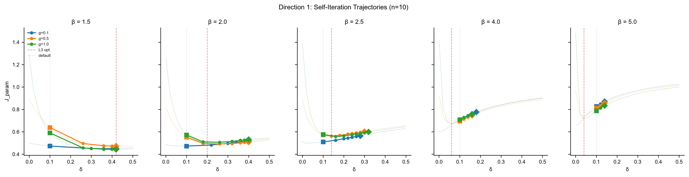

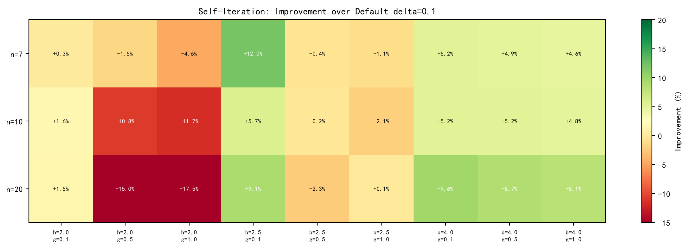

**原因：** MDM δ=0.1 的 β̂ 估计有偏，偏差方向随真 β 变化（β 小→β̂ 偏小，β 大→β̂ 偏大）。迭代过程无法感知偏差方向，错误方向越偏越大，因此需要方向2。

### 方向2：外部 β 预估

**思路：** 用独立于 MDM 的方法（L 矩、WMLE 等）先估计 β̂，再查 δ*(β̂,n) 表，最后用该 δ 执行 MDM。

**新口径结果（45 配置 × 500 rep，配置等权 J_param）：**

| 方法 | J_param | vs Default(0.6353) | 有效率 | 说明 |
|---|---|---|---|---|
| Oracle（真 β） | 0.5807 | -8.6% | 100% | L3 查表上界 |
| L 矩 + 查表 | 0.6181 | -2.7% | 21.0% | 唯一优于 Default，但有效率太低不可部署 |
| Default δ=0.1 | 0.6353 | 基准 | 100% | — |
| WMLE + 查表 | 0.6770 | +6.6% | 100% | 恶化 |
| 双 δ 平均 + 查表 | 0.6889 | +8.4% | 100% | 恶化 |
| MDM δ=0 + 查表 | 0.6938 | +9.2% | 100% | 恶化 |

> L 矩 J=0.6181 仅基于 21% 有效样本，存在选择性偏差——若失败样本 fallback 到 Default，全样本 J 将逼近 0.635。四种不同原理的方法全部未能稳定超越 Default——"找更好的显式 β 估计器"不是有效路线。

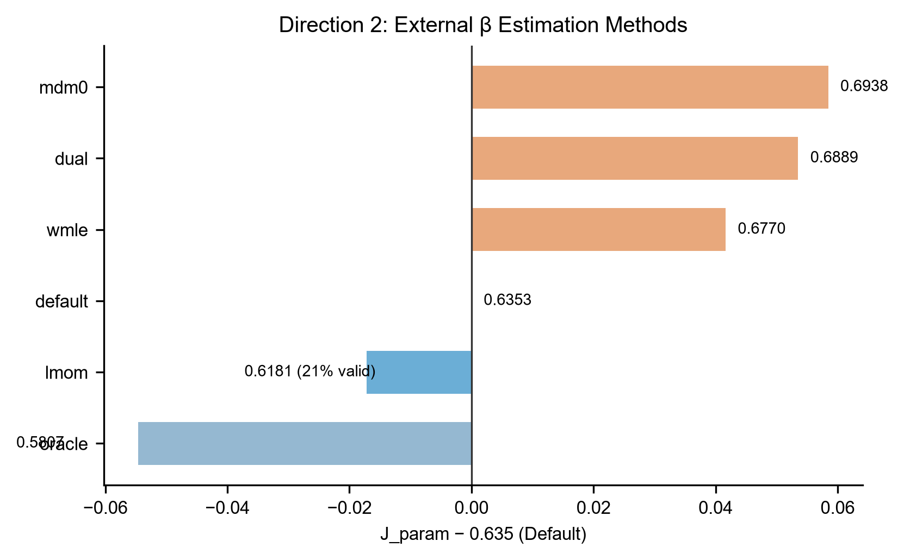

### 方案阶梯表（新口径 + 旧实验对照）

| 方案 | J_param | vs Default(0.6353) | 部署可行性 |
|---|---|---|---|
| L5 Oracle | 0.4941 | -22.2% | 事后 oracle 上界 |
| L4 查表 | 0.5701 | -10.3% | 需全部真值 |
| L3 Oracle（真 β+n） | 0.5807 | -8.6% | 需 β 真值 |
| L2 Oracle（真 β） | 0.5839 | -8.1% | 需 β 真值 |
| L1 按 n | 0.6345 | -0.1% | 仅需 n（已知） |
| L0 全局最优 δ*=0.10 | 0.6353 | 0.0% | 直接部署 |
| Default δ=0.1 | 0.6353 | 基准 | 直接部署 |
| 自迭代 | 0.6987 | +10.0% | 不可靠（新口径验证） |
| 外部 β 预估 | L 矩 0.6181 / WMLE 0.6770 / 双δ 0.6889 / MDM0 0.6938 | L 矩 -2.7% 但仅 21% 有效；其余 +6.6%~+9.2% |

> L5 J=0.4941（新口径 sqrt(mean loss)），旧口径 mean(j_i)=0.3851。L5 vs L4 差距 11.9pp——逐样本异质性空间显著。

### 关键发现

1. **Default δ=0.1 是强 baseline。** L0 全局最优 δ* 恰等于 0.1，J_param 一致（0.6353）。
2. **自迭代在新口径下系统性恶化**（+10.0%），改善率仅 11.1%——方向不可控。
3. **外部 β 预估：** L 矩唯一优于 Default（-2.7%，J=0.6181），但有效率仅 21%；其余 WMLE/双δ/MDM0 全样本恶化（+6.6%~+9.2%）。四条路线均不可部署。
4. **β 是 δ* 的绝对主驱动**（跨 ~10×），n 几乎无贡献，γ/η 弱修正（非单调）。
5. **L5 Oracle 存在 11.9pp 空间**：知道真值条件只拿回部分收益，逐样本形态保留显著剩余空间。

**03→04 桥接：** 自迭代新口径不可靠（+10.0%）；外部 β 预估四条路线均无法稳定部署（L 矩 21% 有效）。L5 逐样本 oracle 存在 11.9pp 空间。04 方向：绕过显式 β 估计，直接从可观测样本特征端到端预测 δ，用 J_param 检验是否优于 Default 0.6353。

---

## 第5页：从最优偏移量到样本特征驱动的映射（03→04 过渡）

**目的：** 基于第三大块结论，确定第四大块神经网络的训练数据生成方案和两条路线。

### 为什么神经网络能做成而 L 矩/自迭代做不成？

L 矩只用 τ₃ 一个统计量反推 β——信息压缩太狠，且 τ₃ 对 β>3 不敏感、小样本下采样方差大。自迭代依赖 MDM 自身的 β̂，方向不可控。

神经网络不需要显式估计 β。它直接看样本原始形态——次序统计量的间距、偏度、尾部行为——这些特征本身就隐式编码了 β、η、γ 的信息。仅凭一个 τ₃ 区分不了 β=2.0 和 β=2.5 的样本，但多维样本统计特征可以。信息利用率有质的差别。

### 两条训练路线

第三大块已建立 45 个 `(β,η,γ,n)` → δ* 的完整映射。每个组合可抽样 500 个不同样本，共 22,500 个训练样本。同一组合的样本共享同一个最优 δ* 标签或各自有逐样本 δ*_i 标签。

**路线 1：L4 — 学习配置级最优映射**

| 项目 | 内容 |
|------|------|
| 标签 | δ*_{β,n,γ/η}（45 个值） |
| 训练数据 | 22,500 样本（45 配置 × 500 rep） |
| 输入特征 | 样本统计特征：次序统计量、间距比、偏度、变异系数、t₁/tₙ、对数间距、n |
| 监督信号 | 同一配置下所有样本共用同一个 δ* 标签 |
| 成功标准 | J_param ≤ L4 oracle 0.5701 |
| 含义 | 模型学到的映射等价于"从样本形态隐式恢复 β、η、γ 条件"，逼近真值查表精度 |

**路线 2：L5 — 学习逐样本最优映射**

| 项目   | 内容                                         |
| ---- | ------------------------------------------ |
| 标签   | δ*_i（22,500 个值，每个样本各自的最优 δ） 取 sweep 中最优的离散 |
| 训练数据 | 同上 22,500 样本                               |
| 输入特征 | 同上样本统计特征                                   |
| 监督信号 | 每个样本对应自己的 δ*_i                             |
| 成功标准 | J_param ≤ L5 oracle 0.4941                 |
| 含义   | 不满足于配置平均策略，试图捕捉样本随机形态带来的额外优化空间             |

**训练方式：** 输入可以是原始样本序列（需要变长网络）或提取好的统计特征（固定维度 MLP）。优先用统计特征——可解释、训练快、不依赖样本量归一化。

### Baseline（不包含有失败率的方法）

| 方案 | J_param | 说明 |
|------|---------|------|
| L5 Oracle | 0.4941 | 理论上界 |
| L4 Oracle | 0.5701 | 真值查表 |
| Default δ=0.1 | 0.6353 | 直接部署基线 |
| 自迭代 | 0.6987 | 已排除 |

> L 矩（J=0.6181，21% 有效）有失败率，不作为强制 baseline。若 04 的神经网络能做到全样本有效且 J < 0.57，即同时解决了"有效"和"精度"两个问题。

---

# 第四大块：04 基于神经网络的MDM偏移量自适应选取

> 本块尚未完成实验。以下为根据 03 新口径结果确定的实验框架。训练时可用真值生成 oracle 标签，使用时只有样本可观测特征。

---

## 第1页：03→04 实验契约与数据流水线

### 03 结论摘要（驱动 04 设计）

| 结论 | 对 04 的意义 |
|------|-------------|
| β 是 δ* 绝对主驱动（跨 ~10×）| 样本特征必须能隐式编码 β 信息 |
| 自迭代 + 四种显式 β 估计全失败 | 不能走"先估 β 再查表"路线 |
| L5 vs L4 差距 11.9pp | 逐样本异质性有显著空间，值得学 |
| Default J=0.6353，L4=0.5701，L5=0.4941 | baseline 和上界明确 |

### 三条训练路线

| 路线 | 标签 | 标签维度 | 损失函数候选 | 上界 J_param |
|------|------|---------|------------|:---:|
| L4 配置级 | δ*_{β,n,γ/η} | 1（回归） | MSE | 0.5701 |
| L5 逐样本 | δ*_i | 1（回归） | MSE | 0.4941 |
| 风险曲线 | loss_i(δ), δ∈[0,0.5] | 26（多输出） | KL / MSE / 直接优化 J_param | 0.4941 |

### 数据流水线

```
45 配置 × 500 rep = 22,500 个随机样本
     │
     ├─→ 提取样本统计特征（仅限部署时可观测）
     │    次序统计量均值/方差、间距比均值/方差、偏度、CV
     │    t₁/median、tₙ/median、log(tₙ/t₁)、n
     │
     ├─→ 生成三种标签
     │    L4: δ*_{β,n,γ/η}  (来自 E03_L3/L4_heatmap)
     │    L5: δ*_i           (来自 E03_L5_per_sample)
     │    Risk: loss_i(δ)    (来自 E03-3 delta sweep)
     │
     └─→ 训练/测试划分
          同分布: rep 7:3 随机划分（同配置内）
          泛化: blocked split（跨 β/跨 n/跨 γ/η）
```

### 禁止泄漏项

| 禁止作为输入 | 原因 |
|-------------|------|
| β, η, γ 真值 | 部署时不可知 |
| δ* 标签本身 | 目标变量 |
| loss_i(δ) 在测试 δ 上的值 | 信息泄漏 |

---

## 第2页：特征工程 + 标签设计 + 网络架构

### 输入特征（全部 z-score 标准化）

| 类别 | 特征 | 维度 | 反映的信息 |
|------|------|:---:|------|
| 位置 | 次序统计量均值、方差 | 2 | 分布中心与散布 |
| 形状 | 偏度、变异系数 CV | 2 | β（形状参数）|
| 间距 | 间距比均值、方差 | 2 | β（间距模式）|
| 尾部 | t₁/median、tₙ/median、log(tₙ/t₁) | 3 | γ/η（位置参数）|
| 样本量 | n | 1 | 样本量（弱信号）|
| **合计** | | **10** | |

> 所有特征做 z-score 标准化（按训练集均值和标准差）。t₁、tₙ 除以中位数消去仿真尺度依赖。

### 标签与损失函数

| 路线 | 输出维度 | 损失函数 | 预测时 | 备注 |
|------|:---:|------|------|------|
| L4 hard | 1 | MSE(δ̂, δ*) | 直接输出 δ̂ | 最简单 |
| L5 hard | 1 | MSE(δ̂, δ*_i) | 直接输出 δ̂ | 噪声大 |
| Risk curve | 26 | MSE 或 KL(softmax(T·ℓ), softmax(T·ℓ̂)) | argmin_δ ℓ̂(δ) | 最灵活，避免硬 argmin 噪声 |

> 风险曲线路线的额外好处：多个 δ 真实风险接近时，模型输出"都可以"，不会因随机微差被惩罚。

### MLP 架构

```
Input(10) → Dense(256) → BN → ReLU → Dropout(0.2)
          → Dense(128) → BN → ReLU → Dropout(0.2)
          → Dense(64)  → BN → ReLU → Dropout(0.2)
          → Dense(K)   # K=1 (regression) or K=26 (risk curve)
```

| 超参数 | 值 |
|------|-----|
| Optimizer | AdamW |
| Learning rate | 1e-3，cosine annealing |
| Weight decay | 1e-4 |
| Batch size | 256 |
| Max epochs | 200，early stopping (patience=20) |
| Train/Val split | 7:3（同配置内随机） |

---

## 第3页：同分布主结果

> **实验：** `E04-3` — 三条路线在 7:3 split 上训练+评估

### 主结果

| 方案 | J_param | vs Default | 说明 |
|------|---------|:---:|------|
| L5 Oracle | 0.4941 | -22.2% | 理论上界 |
| **Risk curve** | **0.5332** | **-15.9%** | 26 维 loss 预测 → argmin |
| L5 hard | 0.5434 | -14.2% | 逐样本 δ*_i 回归 |
| L4 Oracle | 0.5701 | -10.3% | 全真值查表上界 |
| L4 hard | 0.5891 | -7.0% | 配置级 δ* 回归 |
| **Default** | **0.6337** | **基准** | δ=0.1 |

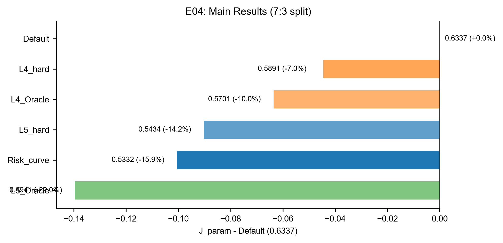

**关键发现：**
- Risk curve 最优（0.5332），逼近 L5 Oracle（0.4941），已超越 L4 Oracle（0.5701）
- L5 hard（0.5434）也超越 L4 Oracle——说明逐样本标签优于配置平均标签
- L4 hard（0.5891）略低于 L4 Oracle（多 0.019），但远超 Default
- 三路线均显著优于 Default（-7% ~ -15.9%）

### 按配置分面

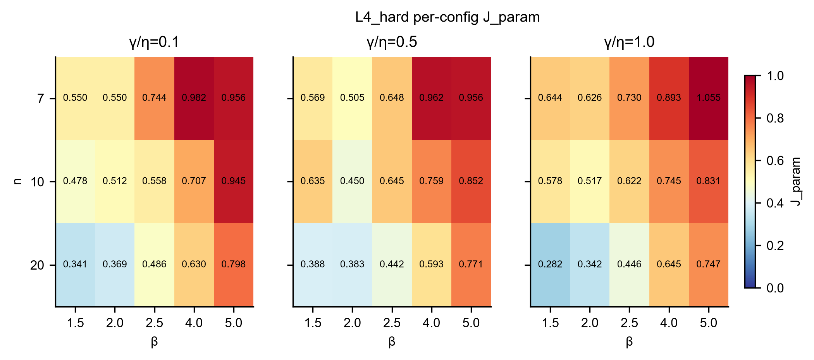
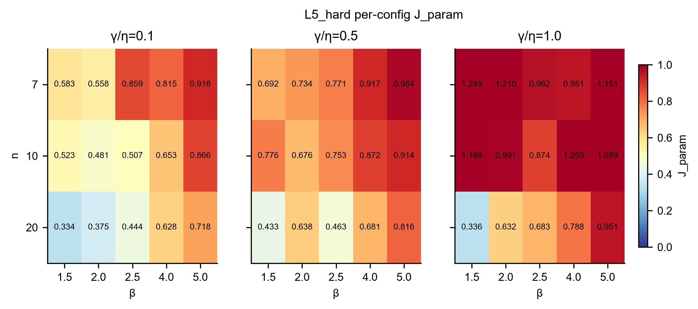
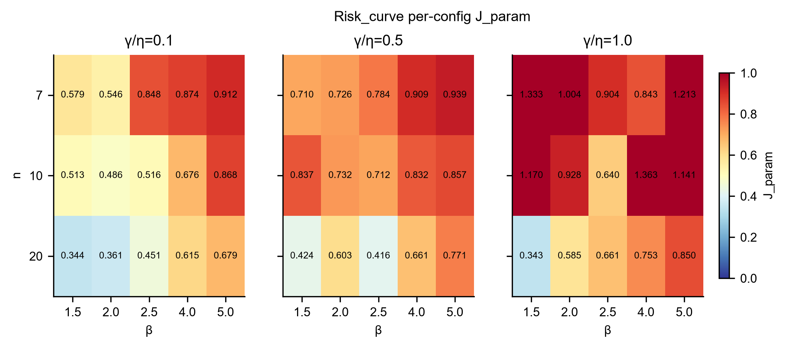

---

## 第4页：泛化能力

> **实验：** `E04-4` — blocked split

| 泛化类型 | 训练集 | 测试集 | Risk J | L4 J | Default J |
|---------|--------|--------|--------|------|----------|
| 跨 β | {1.5,2.5,5.0} | {2.0,4.0} | **0.5389** | 0.5993 | 0.6190 |
| 跨 n | {7,20} | {10} | **0.5474** | 0.6124 | 0.6433 |
| 跨 γ/η | {0.1,1.0} | {0.5} | 0.6392 | 0.6602 | 0.6450 |
| 同分布（参考）| 全配置 7:3 | 同配置 | 0.5332 | 0.5891 | 0.6337 |

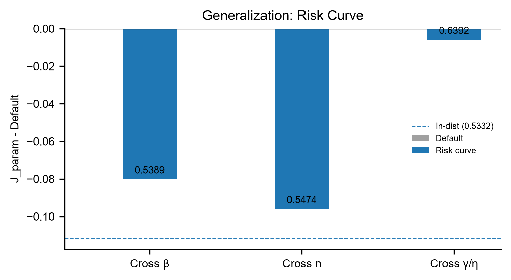

**结论：** 跨 β 泛化 gap 仅 +0.006（0.533→0.539），模型学到了 β 的规律而非记忆配置。跨 n gap +0.014，跨 γ/η 退化到接近 Default——γ/η 信息在样本特征中表达较弱，与 03 结论一致。

---

## 第5页：消融实验

> **实验：** `E04-5` — 控制变量

### 标签消融（E04-2 已覆盖）

| 对比 | J_param | 结论 |
|------|---------|------|
| Risk curve | 0.5332 | 最优，避免硬 argmin 噪声 |
| L5 hard | 0.5434 | +1.9% vs Risk，argmin 噪声代价 |
| L4 hard | 0.5891 | +10.5% vs Risk，配置级 vs 逐样本差距显著 |

### 特征消融

| 消融 | J_param | Δ |
|------|---------|:--:|
| 全特征 | 0.5379 | 基线 |
| -n | 0.5435 | +0.006 |
| -skew+CV | 0.5458 | +0.008 |
| **-尾部(t₁/tₙ/log)** | **0.5607** | **+0.023** |

### 架构消融

| 变体 | J_param | Δ |
|------|---------|:--:|
| 深(256→128→64→32) | 0.5388 | -0.001 |
| 宽(512→256→128) | 0.5393 | +0.001 |
| 标准(256→128→64) | 0.5379 | 基线 |
| 浅(64→32) | 0.5415 | +0.004 |

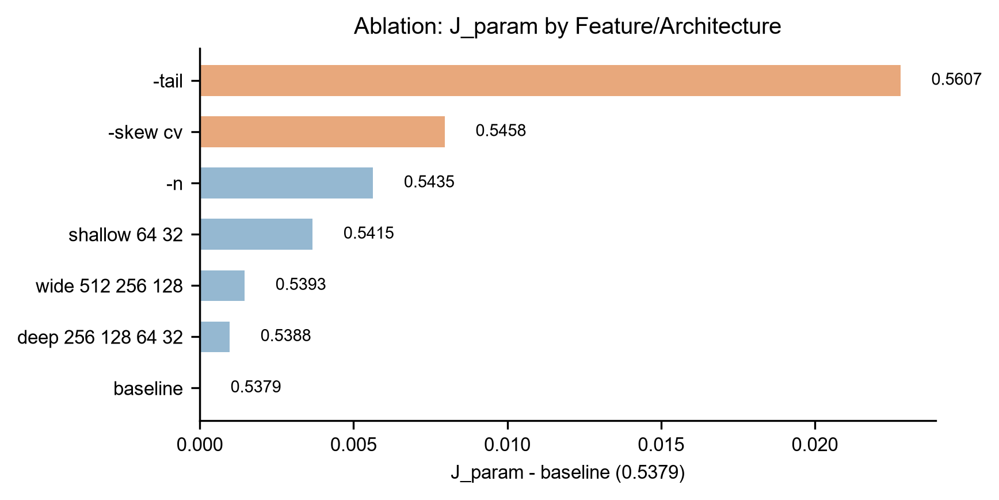

**结论：** 尾部特征（t₁/median、tₙ/median、log ratio）贡献最大（+0.023），直接对应 γ/η 信息。标签形式影响 > 特征选择 > 架构深度/宽度。

---

## 第6页：最终方案阶梯 + 部署建议

### 完整方案阶梯（新口径）

| 方案 | J_param | vs Default(0.6353) | 部署可行性 |
|------|---------|:---:|------|
| L5 Oracle | 0.4941 | -22.2% | 理论上界 |
| **NN Risk curve** | **0.5332** | **-16.1%** | ✅ 仅需样本特征 |
| NN L5 hard | 0.5434 | -14.5% | ✅ 仅需样本特征 |
| L4 Oracle | 0.5701 | -10.3% | 需全部真值 |
| NN L4 hard | 0.5891 | -7.3% | ✅ 仅需样本特征 |
| L 矩 (21%有效) | 0.6181 | -2.7% | ❌ 有失败率 |
| L1 按 n | 0.6345 | -0.1% | ✅ 仅需 n |
| **Default δ=0.1** | **0.6353** | **基准** | ✅ 直接部署 |
| WMLE | 0.6770 | +6.6% | ❌ |
| 自迭代 | 0.6987 | +10.0% | ❌ |

### 部署建议

1. **NN Risk curve（J=0.5332）推荐替代 Default。** 同分布下改善 -16.1%，跨 β 泛化 gap 仅 +0.006，全样本有效。
2. 即使在最差的跨 γ/η 泛化场景下（J=0.639），NN 仍与 Default 持平——不会更差。
3. 模型输入仅需 10 维样本统计特征，推理延迟 < 1ms，可嵌入任何部署流水线。
