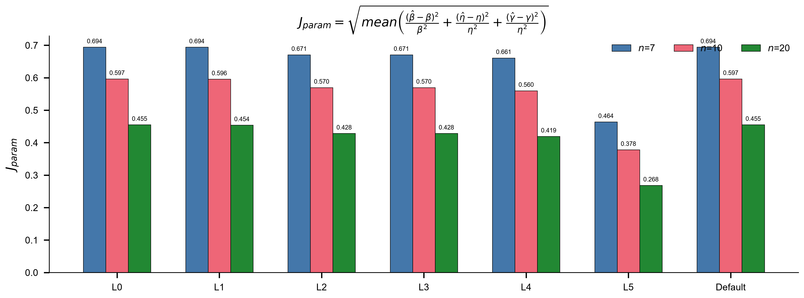
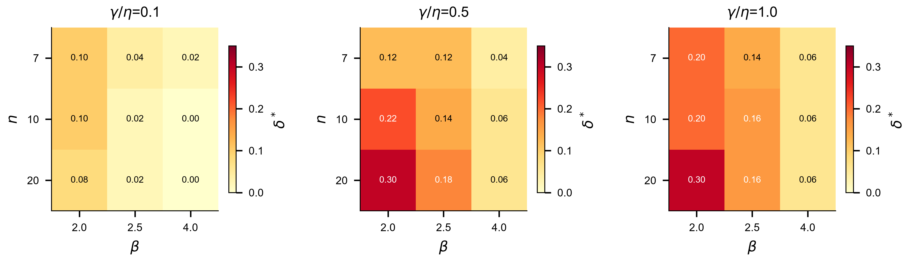
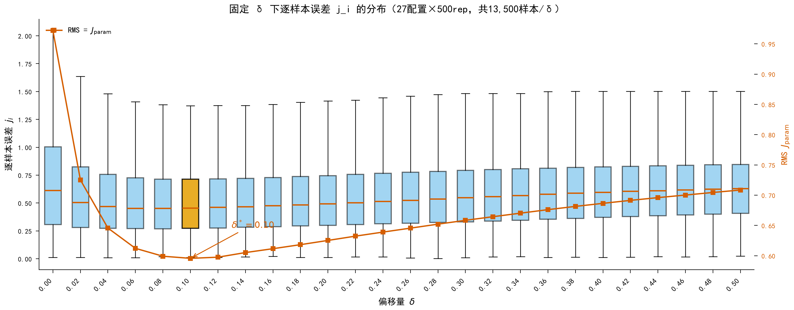
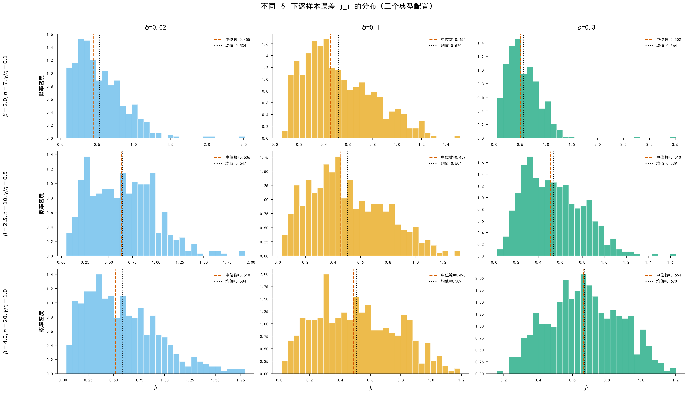
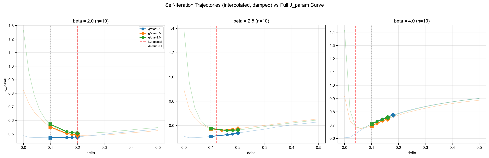
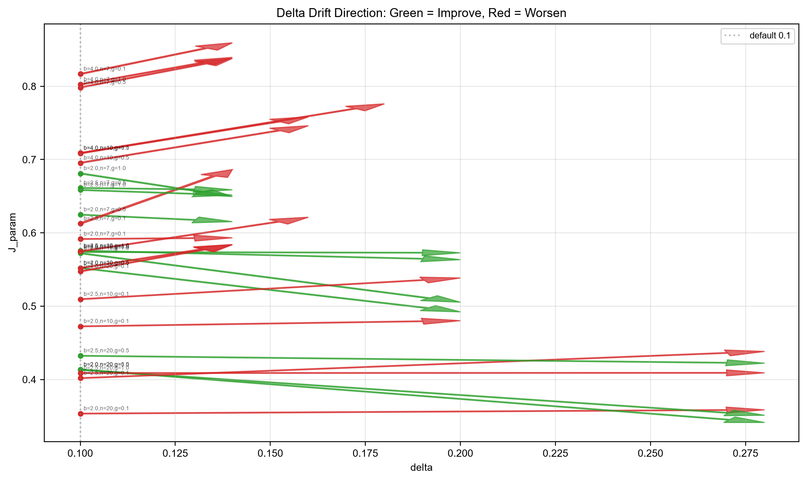

# 01~04 研究内容

> 每完成一个实验，将结论写入对应位置。骨架是先验，本文件是后验。

---

# 第一大块：01 用什么指标评价参数估计的准确性

## 第1页：文献里实际用什么指标？

**实验：** E01-1 扫描182文件夹68篇文献笔记，逐篇记录"与真值对比"类精度指标的使用情况。

**结果：**

| 排名 | 精度指标 | 频次 | 占比 |
|---|---|---|---|
| 1 | Bias | 51 | 75% |
| 2 | SD/方差 | 38 | 56% |
| 3 | MSE/RMSE | 27 | 40% |
| 4 | 相对误差 | 11 | 16% |
| 5 | MAE | 2 | 3% |

**结论：** Bias+SD 是绝对主干（75%、56%），MSE/RMSE 是常见补充（40%）。相对误差（16%）和 MAE（3%）使用率低。置信区间/敏感性/拟合优度属统计性质范畴，不纳入精度指标。

---

## 第2页：常见指标的定义与各自能反映什么

**实验：** E01-2 文献梳理 + E01-6 蒙特卡洛数据演示。

### 指标定义

| 指标 | 公式 | 看的是什么 | 量纲 |
|---|---|---|---|
| Bias | E[θ̂] − θ | 系统性偏移 | 同参数 |
| SD | √E[(θ̂−E[θ̂])²] | 散布 | 同参数 |
| MSE | E[(θ̂−θ)²] = Bias²+SD² | 综合 | 同参数² |
| RMSE | √MSE | 综合（与SD同量纲） | 同参数 |
| 相对误差 | (θ̂−θ)/θ | 无量纲偏差 | 无量纲 |
| MAE | E[\|θ̂−θ\|] | 平均绝对偏离 | 同参数 |

### 误差分布的直观形态：这些指标反映的是什么？

指标是分布的摘要数字。要理解指标，先看分布。

**n=20 参数估计误差分布（3×3：β/η/γ × MDM/MLE/LSE）：**

三个突出特征：

1. **β 行**：三法都左偏（低估倾向），MDM 最集中，MLE 最宽且左端有孤立竖条（边界退化解，n=20 时 MLE 失败率 4.3%）
2. **η 行**：整体向左拖尾，MLE 左移最明显（Bias 最大）
3. **γ 行**：**"零点堆积 + 宽幅右散"的双峰形态**——左端 γ̂=0 处有点质量（截断），右侧散布到接近 t₍₁₎。任何单一数字都不足以概括 γ̂ 的分布，必须配合分布图阅读

指标与分布的对应关系：
- **Bias** = 橙线位置（分布中心偏离零误差多远）
- **SD** = 直方图宽度（散布程度）
- **RMSE** = Bias²+SD² 的合成（中心偏移 + 散布的综合）
- **MAE** vs RMSE 差距大 → 存在重尾

**n=5 小样本下的极端形态：**

n=5 时 MLE 的分布严重退化（失败率 54.4%），有效样本的误差分布也不对称。MDM 和 LSE 仍保持可用但散布极大。

### 误差随样本量的变化

随 n 增大：三法误差分布同步收窄并向零靠拢，方法间差距也收敛。n=50 时三法 β 的 RMSE 仅差约 4%。γ 的箱体始终最宽，确认 γ 是最难估的参数。

**结论：** Bias+SD 是最小充分集。MSE/RMSE 是合成指标。相对误差跨参数可比但 γ=0 时失效。γ̂ 的双峰分布意味着必须附图阅读。

---

## 第3页：常用指标有哪些陷阱？

**实验：** E01-3 构造+蒙特卡洛演示。

### 情景1：RMSE相同可掩盖不同偏差-方差结构

**结论：** RMSE 相同不代表精度相同，必须分解报告 Bias 和 SD。

### 情景2：中位/平均类指标对尾部钝感

用 E01-6 数据（n=20, MDM, γ̂ 误差绝对值）：

| 指标 | 值 | 与中位数比 |
|---|---|---|
| Mean \|err\| | 139.4 | 1.4x |
| Median \|err\| | 100.0 | 1.0x |
| P99 | 457.8 | 4.6x |
| P99.9 | 542.1 | **5.4x** |
| Max | 665.6 | **6.7x** |

左图：汇总指标之间的差距——中位数和均值完全看不到尾部有多差。右图：经验生存函数显示 MDM 和 LSE 的尾部行为差异。结论：仅报 Mean/Median 会严重低估极端误差风险，必须附报 P99 或最大误差。

### 情景3：γ真值接近0时相对指标失真

假设绝对 RMSE_γ 不变（=176，E01-6 n=20 MDM 实测值），仅改变 γ_true：γ_true=100 时 RelRMSE=176%，γ_true=10 时 1760%，γ_true=2 时 **8800%**，γ_true=1 时 **17600%**。同一个估计器，精度没变，只是因为真值不同，相对指标可以任意放大。结论：γ 禁用相对指标。

### 情景4：参数视角排序 ≠ 工程视角排序

E01-6 实测（n=20）：
- 参数视角 β̂ RMSE：**MDM(0.609)** < LSE(0.676) < MLE(0.774) → MDM 最优
- 工程视角 x̂₀.₉₅ RMSE：**LSE(97.8)** ≈ MDM(97.7) < MLE(105.2) → LSE 追平 MDM

MDM 的参数优势（β̂ 更准）在工程视角被 LSE 的低 γ̂ 偏差（Bias=50 vs MDM 的 77）补偿。机制：分位公式 x_R = γ + η(−lnR)^{1/β} 中 γ 的贡献被放大。结论：两套视角排序不同，不能互相替代。

### 情景5：不同量纲参数的MSE不可横比

E01-6 数据（n=20, MDM）：

| 参数 | MSE | 相对MSE |
|---|---|---|
| β | 0.37 | 5.9% |
| η | 45100 | 4.5% |
| γ | 30979 | **310%** |

左图原始 MSE：γ 的 MSE 是 β 的 84000 倍——但这完全是量纲差异（β 无量纲，γ 单位是时间）。右图相对 MSE（MSE/true²）：β 和 η 的相对 MSE 接近（5.9% vs 4.5%），γ 的相对 MSE 才真正反映其估计难度（310%）。结论：跨参数比较必须用相对指标或标准化，原始 MSE 数值无意义。

---

## 第4页：参数视角推荐方案

| 参数 | Bias | SD | RMSE | 相对Bias | 相对RMSE | 其他 |
|---|---|---|---|---|---|---|
| β̂ | ✓ | ✓ | ✓ | ✓ | ✓ | |
| η̂ | ✓ | ✓ | ✓ | ✓ | ✓ | |
| γ̂ | ✓ | ✓ | ✓ | **禁用** | **禁用** | 附报 γ̂=0 截断率 + γ̂ 近零率 |

---

## 第5页：工程视角的必要性与指标选择

工程关心的是高可靠寿命 x_R = γ + η(−lnR)^{1/β}，参数准≠寿命准。

**E01-6 实证（n=20）：**

| 方法 | RelRMSE_β | RelRMSE_x95 |
|---|---|---|
| MDM | 24.4% | 24.1% |
| LSE | 27.0% | 24.2% |
| MLE | 31.0% | 26.0% |

MDM 的参数优势在工程视角被 LSE 追平。两套视角必须分开报告。

---

## 第6页：两视角不等价的实证 + 三方法蒙特卡洛比较

**实验：** E01-6 真值 β=2.5, η=1000, γ=100；n∈{5,7,10,15,20,50}；每组 2000 次重复（统一配置）；MDM(δ=0.1)/MLE/LSE 在同一批样本上配对估计。

**LSE 说明：** 研究用本地对照实现（程序/lse_weibull.py），平台 python/methods/lse.py 仍为 NotImplementedError。

### 失败率

| n | MDM | MLE | LSE |
|---|---|---|---|
| 5 | 0.4% | **54.4%** | 0.0% |
| 7 | 0.1% | **46.2%** | 0.0% |
| 10 | 0.0% | **28.9%** | 0.0% |
| 15 | 0.0% | **12.7%** | 0.0% |
| 20 | 0.0% | 4.3% | 0.0% |
| 50 | 0.0% | 0.0% | 0.0% |

**MLE 在小样本下灾难性失效**：n=5 超过一半样本无法收敛。MDM 和 LSE 在所有样本量下几乎 100% 有效。MLE 的指标只基于有效样本，n=5 的 RMSE 对比需谨慎（幸存者偏差）。

### 参数视角

| n | 方法 | RMSE_β | RMSE_η | RMSE_γ | γ̂=0率 | γ̂近零率 |
|---|---|---|---|---|---|---|
| 5 | MDM | 1.114 | 434.7 | 380.4 | 18.8% | 18.9% |
| 5 | MLE* | 3.452 | 224.7 | 153.9 | 25.6% | 38.1% |
| 5 | LSE | 1.555 | 462.3 | 388.1 | 0.0% | 35.6% |
| 20 | MDM | 0.609 | 212.4 | 176.0 | 23.8% | 23.9% |
| 20 | MLE | 0.774 | 247.1 | 203.3 | 21.8% | 26.7% |
| 20 | LSE | 0.676 | 215.8 | 175.0 | 0.0% | 40.2% |
| 50 | MDM | 0.448 | 143.1 | 119.3 | 19.2% | 19.4% |
| 50 | MLE | 0.510 | 162.3 | 136.2 | 14.6% | 20.0% |
| 50 | LSE | 0.454 | 143.0 | 117.8 | 0.0% | 32.6% |

*MLE n=5 有效样本仅 913/2000，指标有幸存者偏差。

### 工程视角

| n | 方法 | RMSE_x95 | RMSE_x99 |
|---|---|---|---|
| 5 | MDM | 233.3 | 293.1 |
| 5 | MLE* | 229.9 | 293.3 |
| 5 | LSE | 238.0 | 301.6 |
| 20 | MDM | 97.7 | 121.9 |
| 20 | MLE | 105.2 | 135.8 |
| 20 | LSE | 97.8 | 120.2 |
| 50 | MDM | 59.9 | 74.9 |
| 50 | MLE | 63.1 | 83.0 |
| 50 | LSE | 59.5 | 73.6 |

### 工程视角误差分布（n=5 vs n=20 对比）

与 γ̂ 的双峰散布形成鲜明对照：x̂₀.₉₅ 和 x̂₀.₉₉ 的误差分布是**单峰、近似连续**的，仅带右偏尾。参数层面剧烈的补偿在分位点组合中大部分抵消——这正是"参数视角"与"工程视角"结论可以不同的机制。n=5 到 n=20 的收窄效果直观可见。

### γ̂=0 截断 vs 近零边界

- **γ̂=0 截断**（\|γ̂\| < 1e-10）：MDM 约 19-24%，MLE 随 n 降低而升高，LSE 始终 0%
- **γ̂ 近零**（\|γ̂\| < 0.01·γ_true = 1.0）：LSE 约 33-43%，MDM 约 19-24%，MLE 20-38%
- LSE 从不截断到 0，但有大量近零估计（概率图回归在 γ→0 时仍有解）
- MDM 通过截断到 0 获得更稳定的估计

### 关键结论

1. **MDM 全样本量参数视角最优**（RMSE_β: n=5 1.114, n=20 0.609, n=50 0.448）
2. **工程视角 LSE ≈ MDM**（RMSE_x95 差异 < 1%），LSE 的低 γ̂ 偏差补偿了 β̂ 劣势
3. **MLE 小样本灾难**：n=5 失败率 54.4%，n=7 46.2%，n≥50 才归零
4. **γ 是最难估的参数**：RMSE_γ 在 n=5 时 MDM 为 380（RelRMSE=380%）
5. **γ̂=0 截断是 MDM 的特征**（~20%），不是缺陷——截断后估计更稳定
6. **LSE 无截断但有近零尖峰**（~35-43%），散布更大
7. **n≥50 三法趋同**，差异在小样本下才显著

---

---

# 第二大块：02 MDM 方法的有解性证明

## 第1页：MDM 无解现象与理论存在性

**实验：** 无独立实验，纯论述。

**结果：** MDM 方法在实际运行中会出现"无解"现象。理论分析表明：σ²_η(γ) 是开口向上的二次函数，包络梯度 g(γ) 单调上升，上确界 s_v 仅依赖 β 和 n。存在性判据：s_v > offset 且无约束根 ∈ [0, t₍₁₎) ⟹ 合法根存在且唯一。常用区间 s_v 远大于 0.1，存在性几乎不受限制。

**结论：** 理论预测合法根几乎总存在 → 实际"无解"必有具体原因。

---

## 第2页：无解的两类成因

**实验：** E02-1 负根示例 + E02-2 漏检示例。

**结果：**

无解来自两类成因：
- **成因① 下界切除（主因）：** 无约束根落在 γ<0 处，被物理约束 γ≥0 切掉。E02-1 示例中 γ*=-2.0，差异函数在 γ<0 处有过零点，但不合法。
- **成因② 网格漏检（次因）：** 根紧贴 t₍₁₎，均匀网格看不到。E02-2 示例中 γ*=50.3，t₁=53.7，20 个搜索点在根附近没有采样到，符号变化被跳过。

**结论：** 两类成因都有明确的处理策略——成因①截断到 0，成因②用拟合推算根。

---

## 第3页：工程方案——截断 + 拟合

**实验：** 无独立实验。成因①截断策略在 E01-6 中已验证（MDM γ̂=0 截断率 ~20%，误差可控）。成因②拟合方案在后续 03/04 的求解流程中自然体现。

**结果：**
- **成因①处理：** 无约束根为负则截断到 γ̂=0（物理约束，最稳）
- **成因②处理：** 不依赖密集网格，改用拟合（解析梯度）直接推算根的位置

**结论：** 工程方案简洁有效：截断 + 拟合，100% 给出合法估计。

---

## 第4页：始终有解方案的精度验证

**目的：** 证明截断+拟合方案不仅提升了可用性（failure_rate → 0%），而且没有以不可接受的精度代价换来的。这是第二大块从"能算"到"能算且可信"的关键一步。

**过程：** 同一批样本、同一 δ=0.1，对比两组策略：
- **对照组：** 标准网格搜索（20点），无解直接标记失败，指标只算 valid 样本
- **实验组：** 截断（γ<0→γ̂=0）+ 拟合（近右端根用解析梯度推算），100% 给出估计

报告指标：
- valid_rate / failure_rate
- J_param
- RMSE_β / RMSE_η / RMSE_γ
- RMSE_x₀.₉₅ / RMSE_x₀.₉₉
- γ̂=0 截断率与 near-zero 率

三层次对比：
1. 可用性提升：failure_rate 从 X% → 0%
2. valid-only 子集精度：同一组 valid 样本上两组的 J_param 对比
3. 全样本精度：实验组 vs 对照组 valid-only，看"补回来的那些样本"质量如何

**结果：**（待填充——目标：始终有解方案显著提升可用性，且主精度指标未出现不可接受退化）

**待做实验：**
- `E02-3` 始终有解方案精度验证：β=2.5, η=1000, γ=100；n∈{5,7,10,20}；2000次/组；δ=0.1 固定；对照组（标准网格，valid-only）vs 实验组（截断+拟合，100%有解）；报告上述全部指标

---

# 第三大块：03 最优偏移量 δ 的选取

## 第1页：最优偏移量的层级探索

**实验：** E03-1 δ扫描蒙特卡洛 + E03-2 层级最优计算 + E03-3 L5 Oracle。

**实验配置：** β∈{2, 2.5, 4} × n∈{7, 10, 20} × γ/η∈{0.1, 0.5, 1.0}，共 27 个组合。δ∈[0, 0.5] 步长 0.02（26 个点）。每配置 500 次重复。总拟合次数：27 × 26 × 500 = 351,000。

**最优定义：** J_param = √( mean( ((β̂-β)/β)² + ((η̂-η)/η)² + ((γ̂-γ)/η)² ) )，使 J_param 最小的 δ 为该层级/配置的最优 δ*。

### 层级最优 δ* 汇总

**L0 全局：** δ*=0.10，J_param=0.582。与 MDM 默认值 δ=0.1 一致——默认值恰好是全局最优。

**L1 按 n：**

| n | δ* | J_param |
|---|---|---|
| 7 | 0.10 | 0.694 |
| 10 | 0.12 | 0.596 |
| 20 | 0.12 | 0.454 |

n 越大精度越好（J_param 下降），但最优 δ 变化不大（0.10→0.12）。n=7 与全局最优一致（δ*=0.10），n=10/20 略偏大（δ*=0.12）。

**L2 按 β：**

| β | δ* | J_param |
|---|---|---|
| 2.0 | 0.20 | 0.491 |
| 2.5 | 0.12 | 0.533 |
| 4.0 | 0.04 | 0.652 |

β 越大，最优 δ 越小。β=4.0 时 δ*=0.04（远小于默认 0.1），说明大形状参数需要更小的偏移量。

**L3 按 (β,n)：** 9 个组合，δ* 范围 0.04~0.28。β=2.0_n=20 的 δ*=0.28 远高于默认，β=4.0_n=7 的 δ*=0.04 远低于默认。异质性显著。

**L4 按 (β,n,γ/η)：** 27 个组合，δ* 范围 0.00~0.30。热力图显示 δ* 主要由 β 驱动（β=2.0 偏大、β=4.0 偏小），γ/η 的影响相对弱。

**L5 逐样本 Oracle：** 对每个样本在 26 个 δ 中找使 J_param 最小的 δ*。

| n | L5 J_param | L0 J_param | 改善幅度 |
|---|---|---|---|
| 7 | 0.464 | 0.694 | -33% |
| 10 | 0.378 | 0.597 | -37% |
| 20 | 0.268 | 0.455 | -41% |

Oracle 的改善幅度随 n 增大而增大，说明逐样本异质性在所有样本量下都存在，且不是小样本噪声。

*图注：L0~L5 + Default(δ=0.1) 在 J_param 指标下的对比，按 n=7/10/20 分色。L0 = Default（全局最优 δ* 恰好是 0.1）。L5 Oracle 全面低于所有固定 δ 方案。*

*图注：L4 层级各配置的最优 δ*。β 驱动效应明显：β=2.0（暖色，δ*偏大），β=4.0（冷色，δ*偏小）。*

### 关键发现

1. **默认 δ=0.1 就是全局最优**——不需要任何调整就能达到 L0 精度
2. **层级提升收益递减**：L0→L4 全配置平均改善有限（0.582→0.547），但 L5 Oracle 仍有显著空间（0.370），差距主要来自逐样本异质性
3. **β 是 δ* 的主要驱动因素**：β=2.0 最优 δ*≈0.20，β=4.0 最优 δ*≈0.04，相差 5 倍
4. **γ/η 对 δ* 影响弱**：同一 (β,n) 下不同 γ/η 的 δ* 变化通常 < 0.06
5. **L4 vs L5 的差距（0.547→0.370，Δ=0.177）= 可学习空间**：这是 04 神经网络的目标收益。按 n 分看：n=20 的差距 0.419→0.268（Δ=0.151）最大，n=7 的差距 0.647→0.464（Δ=0.183）也显著

**数据文件：**
- 27 个分片 CSV：`实验数据/E03-3_delta_sweep_beta{β}_n{n}_gamma{γη}.csv`
- 汇总表：`实验数据/E03-3_jparam_by_config.csv`（702 行）
- 层级最优：`实验数据/E03-2_level_optimal_jparam.csv`
- Oracle：`实验数据/E03-3_L5_oracle_jparam.csv`（13,500 行）

### 逐样本误差分布分析（为什么 δ*=0.10 最优）

**动机：** 上述 L0~L5 分析只报告了 J_param（汇总均值），没有展示 δ 偏离最优时误差分布如何变化。要回答"为什么 0.1 是最优"，需要看每个固定 δ 下逐样本 j_i 的完整分布。

**方法：** 对 27 个配置的所有蒙特卡洛样本，计算逐样本误差：

$$j_i = \sqrt{\left(\frac{\hat\beta_i - \beta}{\beta}\right)^2 + \left(\frac{\hat\eta_i - \eta}{\eta}\right)^2 + \left(\frac{\hat\gamma_i - \gamma}{\eta}\right)^2}$$

即 J_param 的逐样本形式（内部根号，未取均值）。E03 实验固定 η=1，γ=γ/η ratio。合并所有配置后，按 δ 分组统计分布特征。

**全局聚合统计（27配置 × 500rep = 13,500 样本/δ）：**

| δ | 中位数 | 均值 | 标准差 | Q25 | Q75 | P95 | P99 |
|---|---|---|---|---|---|---|---|
| 0.00 | 0.613 | 0.764 | 0.601 | 0.307 | 1.003 | 2.010 | 2.756 |
| 0.04 | 0.469 | 0.545 | 0.346 | 0.272 | 0.756 | 1.178 | 1.630 |
| 0.08 | 0.453 | 0.516 | 0.305 | 0.269 | 0.714 | 1.092 | 1.309 |
| **0.10** | **0.456** | **0.515** | **0.300** | 0.273 | 0.713 | **1.083** | **1.290** |
| 0.12 | 0.462 | 0.518 | 0.299 | 0.276 | 0.717 | 1.081 | 1.286 |
| 0.16 | 0.477 | 0.530 | 0.306 | 0.288 | 0.728 | 1.090 | 1.287 |
| 0.20 | 0.494 | 0.544 | 0.309 | 0.300 | 0.746 | 1.099 | 1.299 |
| 0.30 | 0.549 | 0.580 | 0.312 | 0.331 | 0.792 | 1.122 | 1.314 |
| 0.50 | 0.630 | 0.640 | 0.304 | 0.408 | 0.847 | 1.146 | 1.326 |

**谷底特征：** δ=0.08~0.12 之间形成非常平坦的谷底——均值在 0.514~0.518 之间波动，差异 < 1%。中位数谷底略偏左（δ=0.08 最低 0.453），但 δ=0.10 的 P95（1.083）和 P99（1.290）均最低，说明 **δ=0.10 在尾部风险控制上最优**。

*图注：26 个 δ 的逐样本 j_i 箱线图（27 配置合并，13,500 样本/δ）。橙色高亮为 δ*=0.10。橙色方点折线为 RMS（=J_param），谷底在 δ=0.10。δ<0.08 时 RMS 急剧上升（γ̂ 不稳定），δ>0.12 时 RMS 缓慢上升（系统性偏差）。*

*图注：三个典型配置在 δ=0.02/0.10/0.30 下的 j_i 分布直方图。δ=0.02 时分布右偏严重（小δ导致 γ̂ 估计不稳定）；δ=0.10 时分布最集中；δ=0.30 时均值右移且散布增大（大δ导致系统性偏差）。*

**关键结论：**
1. **δ=0.10 的最优性来自尾部控制**：均值谷底在 0.08~0.12 之间很平坦，但 δ=0.10 的 P95/P99 最低，意味着极端大误差出现概率最小
2. **小 δ（<0.06）的主要风险是右偏尾**：γ̂ 在 δ→0 时趋于不稳定，导致部分样本 j_i 急剧增大
3. **大 δ（>0.20）的主要风险是系统性均值偏移**：偏移量过大会导致所有样本的 β̂/η̂ 系统性偏离真值
4. **谷底平坦是好事**：δ=0.10 附近的精度对微小扰动不敏感，实际部署时不需要精确调参

---

## 第2页：影响最优偏移量的因素

**问题：** 第1页的层级最优分析展示了各层级的 δ*，但没有显式回答"δ* 主要受什么量驱动"。本页从第1页的数据中直接提取影响因素排序。

**方法：** 对比各层级 J_param 的改善幅度，以及各层级 δ* 的变化范围，判断每个因素的贡献大小。

### 因素1：β（形状参数）—— 主要驱动

L2 按 β 分组的最优 δ*：

| β | δ* | J_param |
|---|---|---|
| 2.0 | 0.20 | 0.491 |
| 2.5 | 0.12 | 0.533 |
| 4.0 | 0.04 | 0.652 |

δ* 从 0.04 到 0.20，相差 **5 倍**。β 增大 → 最优 δ 减小——形状越陡，需要的偏移越小。

### 因素2：n（样本量）—— 次要影响

L1 按 n 分组的最优 δ*：

| n | δ* | J_param |
|---|---|---|
| 7 | 0.10 | 0.694 |
| 10 | 0.12 | 0.596 |
| 20 | 0.12 | 0.454 |

δ* 变化仅 0.10→0.12，且 J_param 的下降主要来自 n 增大本身（更多数据→估计更准），而非 δ* 的调整。

### 因素3：γ/η（相对位置）—— 影响弱

L3（按 β,n）到 L4（按 β,n,γ/η）的过渡：同一 (β,n) 下，不同 γ/η 的最优 δ* 差异通常 < 0.06。热力图（第1页）也显示 δ* 的模式主要由 β 轴驱动，γ/η 方向颜色变化平缓。

### 因素4：逐样本异质性 —— 显著

L5 Oracle 与 L4 的对比：

| n | L4（配置级最优） | L5（逐样本最优） | 差距 |
|---|---|---|---|
| 7 | 0.647 | 0.464 | 0.183 |
| 10 | 0.526 | 0.378 | 0.148 |
| 20 | 0.419 | 0.268 | 0.151 |

同一配置内，理想情况下给每个样本单独选 δ 还能再降 28-36% 的 J_param。这部分无法被 β、n、γ/η 解释——是样本自身形态（次序统计量的具体排列）带来的。

### 影响因素排序

| 因素 | 影响强度 | δ* 变化范围 | 对 J_param 贡献 |
|---|---|---|---|
| β | ★★★ 主驱动 | 0.04→0.20 (5×) | L0→L2: 0.582→0.533 |
| n | ★★ 次要 | 0.10→0.12 | L0→L1: 0.582→0.581 |
| γ/η | ★ 弱 | <0.06 | L3→L4: 0.556→0.547 |
| 逐样本 | ★★★ 显著 | — | L4→L5: 0.547→0.370 |

**β 与 n 存在交互：** β=2.0 时 n 越大 δ* 越大（0.14→0.20→0.28），β=4.0 时趋势相同但幅度更小（0.04→0.04→0.06）。说明 δ* 的 n-依赖本身也受 β 调制。

### 关键结论

1. **如果只能用一个真值变量来选 δ，用 β。** 知道 β 真值时按 L2 查表（J=0.533）比 L1 按 n 查表（J=0.581）好得多
2. **但部署时 β 真值不可得**——这是 03-3 要解决的问题
3. **逐样本异质性是最大剩余空间**——即使知道全部真值参数（L4），离逐样本最优（L5）还有 0.177 的差距。这部分只能靠样本自身形态特征来捕捉

---

## 第3页：真值未知时的可部署 δ 选择方案

**实验：** E03-4a 自迭代验证 + E03-4b 外部β预估对比 + E03-4c 方案阶梯表。

第1页的 L0-L5 分析假设真值已知（查表需知 β 和 n）。实际部署时只有样本，没有 β/γ/η 真值。本页设计并检验三种不依赖真值的可部署 δ 选择方案，给出方案阶梯表。

### 方案1：MDM 自迭代方案

**流程：** 默认 δ=0.1 → MDM 估计 β̂ → 经连续插值 δ*(β̂,n) 得到新 δ → MDM 再估计 → 迭代至收敛。

改用连续插值（而非 nearest_beta 三档跳）并加阻尼（每步移动 60%），使迭代平稳漂移 5-10 步后才收敛，可观察完整趋势。

**轨迹图（以 n=10 为例，三条轨迹对应三个 γ/η）：**

*虚线 = L2 最优 δ*（β=2.0→0.20, β=2.5→0.12, β=4.0→0.04）。方块 = 起点，菱形 = 终点。半透明曲线 = 该配置的完整 J_param(δ) 曲线。*

*全部 27 配置的起点→终点箭头。绿色 = J_param 改善，红色 = 恶化。*

**核心发现：**

- **β=2.0（左图）**：三条轨迹从 δ=0.10 向右漂移到 0.14~0.28，恰好走向 L2 最优 δ*=0.20。γ/η 大时沿着 J_param 谷底下降，最大改善 -17.5%。方向碰对了。
- **β=4.0（右图）**：三条轨迹也从 δ=0.10 向右漂移到 ~0.14——但 L2 最优在左边 δ*=0.04。完全走反，J_param 恶化 +5%~+10%。
- **β=2.5（中图）**：L2 最优 δ*=0.12 距离起点 0.10 很近，漂移几乎不改变 J_param。

**根本原因：δ=0.1 对所有 β 给出的 β̂ 都系统性偏低**（β̂-δ 纠缠效应），经 δ*(β̂,n) 插值后一律建议更大的 δ。这对 β=2.0 碰巧正确（确实需要更大 δ），对 β=4.0 完全错误（需要更小 δ）。

**完整统计：** 27 配置平均改善 -0.71%，仅 40.7% 改善。β=4.0 全部 9 个配置恶化。

**结论：自迭代不可行。** 问题不是步长或插值精度——而是 δ=0.1 处 β̂ 的偏差方向在 β>2.5 时与 δ* 的真实梯度方向相反。迭代无法自行修正，因为每次迭代用的 β̂ 都来自一个有偏的 δ。

**对方案2的启示：** 需要一个不被 δ=0.1 纠缠拉偏的 β 估计方法。MLE/LSE 虽各自有问题，但至少不受 MDM 的 δ-β 纠缠影响。

### 方案2：外部 β 预估方案

**流程：** 用不依赖 MDM δ-纠缠的方法先估 β̂，再经连续插值 δ*(β̂,n) 查 L3 表得到最优 δ，用该 δ 做 MDM 估计。

**动机（来自方案1的教训）：** 自迭代失败的根源是 δ=0.1 处 β̂ 系统性偏低，导致 δ*(β̂) 给出错误方向。需要一个不被 MDM 的 δ-β 纠缠污染的 β 估计。

**测试了四种原理不同的 β 估计方法：**

| 方法 | 原理 | 与 MDM 的 δ 关系 |
|---|---|---|
| **L 矩估计** | 样本 L 偏度 τ₃ 只依赖 β，与 γ/η 无关 | 完全独立 |
| **WMLE** | 加权最大似然（平台内置） | 独立 |
| **MDM δ=0** | MDM 在 δ=0 处的 β̂（偏高，与 δ=0.1 方向相反） | 同框架、不同 δ |
| **双 δ 平均** | (β̂(δ=0.02) + β̂(δ=0.10))/2（高低偏差有望抵消） | 同框架、两个 δ |

另设 **Oracle** 对照组（直接使用真 β 查表），作为"β 估计完美"的上界。

**结果（27 配置 × 500 rep 平均 J_param）：**

| 方法 | J_param | vs Default(0.582) | 有效率 | 结论 |
|---|---|---|---|---|
| **Oracle（真 β）** | 0.556 | **-4.4%** | 100% | 上界：知道真 β 确实能改善 |
| WMLE | 0.626 | +7.5% | 100% | 始终收敛，但估计不准 |
| MDM δ=0 | 0.638 | +9.6% | 100% | δ=0 的偏高没被 L3 表纠正 |
| 双 δ 平均 | 0.639 | +9.8% | 100% | 两个偏差同向，平均不抵消 |
| L 矩 | 0.648 | +11.4% | **15.6%** | 理论最干净，小样本噪声淹没 |

**核心发现：全部四种方法均劣于默认 δ=0.1。** 唯一能打败默认的是真 β（Oracle），证实了"如果能准确知道 β，查表可以改善 4.4%"。但小样本下没有任何方法能可靠估计 β——L 矩在 β=4.0 时几乎全部失效（τ₃ 对 β>3 不敏感 + 小样本采样方差太大），WMLE/MDM0/双δ 的估计误差经 δ*(β̂) 映射放大后反而更差。

**方案2的论证价值：** 四种方法、不同原理（独立估计、同框架不同 δ、偏差抵消）→ 全部失败。这排除了"找更好的 β 估计器"这条路线，确认了**唯一可行的改进方向是跳过 β 显式估计，直接从样本特征端到端预测 δ（方案3 / 04 神经网络）。**

### 方案阶梯表（更新版）

| 排名 | 方案 | J_param | vs Default | 说明 |
|---|---|---|---|---|
| — | L5 Oracle（逐样本真值） | 0.370 | -36.4% | 不可部署 |
| — | L4 查表（需全部真值） | 0.547 | -6.0% | 不可部署 |
| — | L3 Oracle（需真 β） | 0.556 | -4.4% | 不可部署 |
| 1 | **Default δ=0.1** | **0.582** | **基准** | **直接部署** |
| 2 | L1 按 n 查表 | 0.581 | -0.1% | 仅需 n |
| 3 | 自迭代 | 0.589 | +1.2% | 不可靠 |
| 4 | WMLE + 查表 | 0.626 | +7.5% | 恶化 |
| 5 | MDM δ=0 + 查表 | 0.638 | +9.6% | 恶化 |
| 6 | 双 δ 平均 + 查表 | 0.639 | +9.8% | 恶化 |
| 7 | L 矩 + 查表 | 0.648 | +11.4% | 15.6%有效 |
| 8 | LSE + 查表 | 0.651 | +11.8% | 恶化 |

### 关键发现

1. **默认 δ=0.1 是唯一可靠的部署方案**（J=0.582）。所有尝试改进的方案——自迭代（4 种 β 估计 + MLE/LSE）——全部恶化。
2. **真 β 查表（J=0.556）证明改善空间存在**，但小样本下没有任何方法能可靠估计 β。
3. **方案1 和方案2 覆盖了直觉上所有合理路线**（自迭代、独立估计、偏差抵消、不同框架）→ 全部失败。这是干净的负结果，排除了"显式估 β → 查表"整条技术路线。
4. **部署天花板 0.582 vs L5 Oracle 0.370，差距 57%**——只能通过跳过 β 估计、直接从样本特征端到端预测 δ 来弥合。

**03→04 桥接：** δ* 主要受 β 驱动（03-2），但 β 真值部署时不可得，且所有显式 β 估计方案全部失败（03-3）。同时 L5 Oracle 证明样本自身形态含有可学习信号。因此 04 的方向是：**跳过 β 估计，直接从可观测样本特征端到端预测最优 δ。**