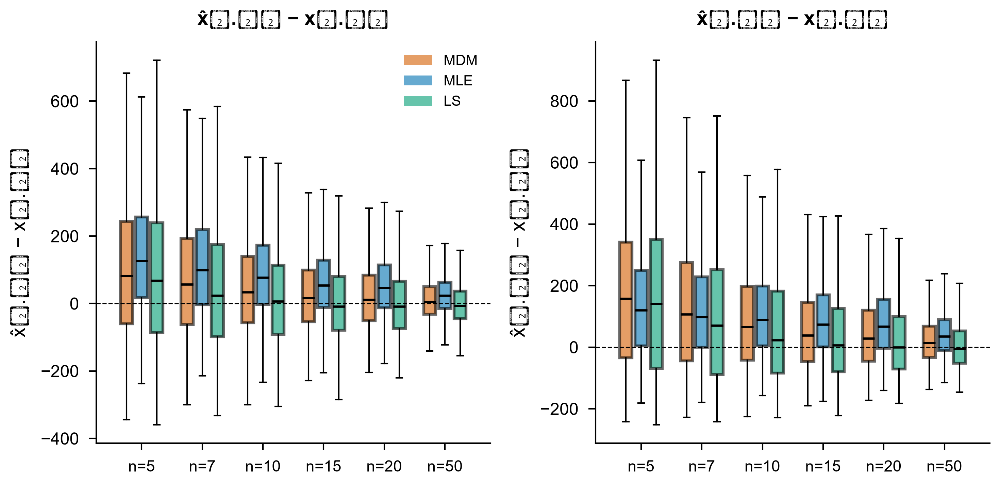

# 01~04 研究内容

> 每完成一个实验，将结论写入对应位置。骨架是先验，本文件是后验。

---

# 第一大块：01 用什么指标评价参数估计的准确性

## 第1页：文献里实际用什么指标？

**实验：** E01-1 扫描182文件夹68篇文献笔记，逐篇记录"与真值对比"类精度指标的使用情况。

**结果：**

| 排名 | 精度指标 | 频次 | 占比 |
|---|---|---|---|
| 1 | Bias | 51 | 75% |
| 2 | SD/方差 | 38 | 56% |
| 3 | MSE/RMSE | 27 | 40% |
| 4 | 相对误差 | 11 | 16% |
| 5 | MAE | 2 | 3% |

**结论：** Bias+SD 是绝对主干（75%、56%），MSE/RMSE 是常见补充（40%）。相对误差（16%）和 MAE（3%）使用率低。置信区间/敏感性/拟合优度属统计性质范畴，不纳入精度指标。

---

## 第2页：常见指标的定义与各自能反映什么

**实验：** E01-2 文献梳理 + E01-6 蒙特卡洛数据演示。

### 指标定义

| 指标 | 公式 | 看的是什么 | 量纲 |
|---|---|---|---|
| Bias | E[θ̂] − θ | 系统性偏移 | 同参数 |
| SD | √E[(θ̂−E[θ̂])²] | 散布 | 同参数 |
| MSE | E[(θ̂−θ)²] = Bias²+SD² | 综合 | 同参数² |
| RMSE | √MSE | 综合（与SD同量纲） | 同参数 |
| 相对误差 | (θ̂−θ)/θ | 无量纲偏差 | 无量纲 |
| MAE | E[\|θ̂−θ\|] | 平均绝对偏离 | 同参数 |

### 误差分布的直观形态：这些指标反映的是什么？

指标是分布的摘要数字。要理解指标，先看分布。

**n=20 参数估计误差分布（3×3：β/η/γ × MDM/MLE/LSE）：**

三个突出特征：

1. **β 行**：三法都左偏（低估倾向），MDM 最集中，MLE 最宽且左端有孤立竖条（边界退化解，n=20 时 MLE 失败率 4.3%）
2. **η 行**：整体向左拖尾，MLE 左移最明显（Bias 最大）
3. **γ 行**：**"零点堆积 + 宽幅右散"的双峰形态**——左端 γ̂=0 处有点质量（截断），右侧散布到接近 t₍₁₎。任何单一数字都不足以概括 γ̂ 的分布，必须配合分布图阅读

指标与分布的对应关系：
- **Bias** = 橙线位置（分布中心偏离零误差多远）
- **SD** = 直方图宽度（散布程度）
- **RMSE** = Bias²+SD² 的合成（中心偏移 + 散布的综合）
- **MAE** vs RMSE 差距大 → 存在重尾

**n=5 小样本下的极端形态：**

n=5 时 MLE 的分布严重退化（失败率 54.4%），有效样本的误差分布也不对称。MDM 和 LSE 仍保持可用但散布极大。

### 误差随样本量的变化

随 n 增大：三法误差分布同步收窄并向零靠拢，方法间差距也收敛。n=50 时三法 β 的 RMSE 仅差约 4%。γ 的箱体始终最宽，确认 γ 是最难估的参数。

**结论：** Bias+SD 是最小充分集。MSE/RMSE 是合成指标。相对误差跨参数可比但 γ=0 时失效。γ̂ 的双峰分布意味着必须附图阅读。

---

## 第3页：常用指标有哪些陷阱？

**实验：** E01-3 构造+蒙特卡洛演示。

### 情景1：RMSE相同可掩盖不同偏差-方差结构

**结论：** RMSE 相同不代表精度相同，必须分解报告 Bias 和 SD。

### 情景2：中位/平均类指标对尾部钝感

用 E01-6 数据（n=20, MDM, γ̂ 误差绝对值）：

| 指标 | 值 | 与中位数比 |
|---|---|---|
| Mean \|err\| | 139.4 | 1.4x |
| Median \|err\| | 100.0 | 1.0x |
| P99 | 457.8 | 4.6x |
| P99.9 | 542.1 | **5.4x** |
| Max | 665.6 | **6.7x** |

左图：汇总指标之间的差距——中位数和均值完全看不到尾部有多差。右图：经验生存函数显示 MDM 和 LSE 的尾部行为差异。结论：仅报 Mean/Median 会严重低估极端误差风险，必须附报 P99 或最大误差。

### 情景3：γ真值接近0时相对指标失真

假设绝对 RMSE_γ 不变（=176，E01-6 n=20 MDM 实测值），仅改变 γ_true：γ_true=100 时 RelRMSE=176%，γ_true=10 时 1760%，γ_true=2 时 **8800%**，γ_true=1 时 **17600%**。同一个估计器，精度没变，只是因为真值不同，相对指标可以任意放大。结论：γ 禁用相对指标。

### 情景4：参数视角排序 ≠ 工程视角排序

E01-6 实测（n=20）：
- 参数视角 β̂ RMSE：**MDM(0.609)** < LSE(0.676) < MLE(0.774) → MDM 最优
- 工程视角 x̂₀.₉₅ RMSE：**LSE(97.8)** ≈ MDM(97.7) < MLE(105.2) → LSE 追平 MDM

MDM 的参数优势（β̂ 更准）在工程视角被 LSE 的低 γ̂ 偏差（Bias=50 vs MDM 的 77）补偿。机制：分位公式 x_R = γ + η(−lnR)^{1/β} 中 γ 的贡献被放大。结论：两套视角排序不同，不能互相替代。

### 情景5：不同量纲参数的MSE不可横比

E01-6 数据（n=20, MDM）：

| 参数 | MSE | 相对MSE |
|---|---|---|
| β | 0.37 | 5.9% |
| η | 45100 | 4.5% |
| γ | 30979 | **310%** |

左图原始 MSE：γ 的 MSE 是 β 的 84000 倍——但这完全是量纲差异（β 无量纲，γ 单位是时间）。右图相对 MSE（MSE/true²）：β 和 η 的相对 MSE 接近（5.9% vs 4.5%），γ 的相对 MSE 才真正反映其估计难度（310%）。结论：跨参数比较必须用相对指标或标准化，原始 MSE 数值无意义。

---

## 第4页：参数视角推荐方案

| 参数 | Bias | SD | RMSE | 相对Bias | 相对RMSE | 其他 |
|---|---|---|---|---|---|---|
| β̂ | ✓ | ✓ | ✓ | ✓ | ✓ | |
| η̂ | ✓ | ✓ | ✓ | ✓ | ✓ | |
| γ̂ | ✓ | ✓ | ✓ | **禁用** | **禁用** | 附报 γ̂=0 截断率 + γ̂ 近零率 |

---

## 第5页：工程视角的必要性与指标选择

工程关心的是高可靠寿命 x_R = γ + η(−lnR)^{1/β}，参数准≠寿命准。

**E01-6 实证（n=20）：**

| 方法 | RelRMSE_β | RelRMSE_x95 |
|---|---|---|
| MDM | 24.4% | 24.1% |
| LSE | 27.0% | 24.2% |
| MLE | 31.0% | 26.0% |

MDM 的参数优势在工程视角被 LSE 追平。两套视角必须分开报告。

---

## 第6页：两视角不等价的实证 + 三方法蒙特卡洛比较

**实验：** E01-6 真值 β=2.5, η=1000, γ=100；n∈{5,7,10,15,20,50}；每组 2000 次重复（统一配置）；MDM(δ=0.1)/MLE/LSE 在同一批样本上配对估计。

**LSE 说明：** 研究用本地对照实现（程序/lse_weibull.py），平台 python/methods/lse.py 仍为 NotImplementedError。

### 失败率

| n | MDM | MLE | LSE |
|---|---|---|---|
| 5 | 0.4% | **54.4%** | 0.0% |
| 7 | 0.1% | **46.2%** | 0.0% |
| 10 | 0.0% | **28.9%** | 0.0% |
| 15 | 0.0% | **12.7%** | 0.0% |
| 20 | 0.0% | 4.3% | 0.0% |
| 50 | 0.0% | 0.0% | 0.0% |

**MLE 在小样本下灾难性失效**：n=5 超过一半样本无法收敛。MDM 和 LSE 在所有样本量下几乎 100% 有效。MLE 的指标只基于有效样本，n=5 的 RMSE 对比需谨慎（幸存者偏差）。

### 参数视角

| n | 方法 | RMSE_β | RMSE_η | RMSE_γ | γ̂=0率 | γ̂近零率 |
|---|---|---|---|---|---|---|
| 5 | MDM | 1.114 | 434.7 | 380.4 | 18.8% | 18.9% |
| 5 | MLE* | 3.452 | 224.7 | 153.9 | 25.6% | 38.1% |
| 5 | LSE | 1.555 | 462.3 | 388.1 | 0.0% | 35.6% |
| 20 | MDM | 0.609 | 212.4 | 176.0 | 23.8% | 23.9% |
| 20 | MLE | 0.774 | 247.1 | 203.3 | 21.8% | 26.7% |
| 20 | LSE | 0.676 | 215.8 | 175.0 | 0.0% | 40.2% |
| 50 | MDM | 0.448 | 143.1 | 119.3 | 19.2% | 19.4% |
| 50 | MLE | 0.510 | 162.3 | 136.2 | 14.6% | 20.0% |
| 50 | LSE | 0.454 | 143.0 | 117.8 | 0.0% | 32.6% |

*MLE n=5 有效样本仅 913/2000，指标有幸存者偏差。

### 工程视角

| n | 方法 | RMSE_x95 | RMSE_x99 |
|---|---|---|---|
| 5 | MDM | 233.3 | 293.1 |
| 5 | MLE* | 229.9 | 293.3 |
| 5 | LSE | 238.0 | 301.6 |
| 20 | MDM | 97.7 | 121.9 |
| 20 | MLE | 105.2 | 135.8 |
| 20 | LSE | 97.8 | 120.2 |
| 50 | MDM | 59.9 | 74.9 |
| 50 | MLE | 63.1 | 83.0 |
| 50 | LSE | 59.5 | 73.6 |

### 工程视角误差分布（随样本量变化）

与 γ̂ 的双峰散布形成鲜明对照：x̂₀.₉₅ 和 x̂₀.₉₉ 的误差分布是**单峰、近似连续**的，仅带右偏尾。参数层面剧烈的补偿在分位点组合中大部分抵消——这正是"参数视角"与"工程视角"结论可以不同的机制。随 n 增大，三法在工程视角的差距同样收窄。

### γ̂=0 截断 vs 近零边界

- **γ̂=0 截断**（\|γ̂\| < 1e-10）：MDM 约 19-24%，MLE 随 n 降低而升高，LSE 始终 0%
- **γ̂ 近零**（\|γ̂\| < 0.01·γ_true = 1.0）：LSE 约 33-43%，MDM 约 19-24%，MLE 20-38%
- LSE 从不截断到 0，但有大量近零估计（概率图回归在 γ→0 时仍有解）
- MDM 通过截断到 0 获得更稳定的估计

### 关键结论

1. **MDM 全样本量参数视角最优**（RMSE_β: n=5 1.114, n=20 0.609, n=50 0.448）
2. **工程视角 LSE ≈ MDM**（RMSE_x95 差异 < 1%），LSE 的低 γ̂ 偏差补偿了 β̂ 劣势
3. **MLE 小样本灾难**：n=5 失败率 54.4%，n=7 46.2%，n≥50 才归零
4. **γ 是最难估的参数**：RMSE_γ 在 n=5 时 MDM 为 380（RelRMSE=380%）
5. **γ̂=0 截断是 MDM 的特征**（~20%），不是缺陷——截断后估计更稳定
6. **LSE 无截断但有近零尖峰**（~35-43%），散布更大
7. **n≥50 三法趋同**，差异在小样本下才显著

---
