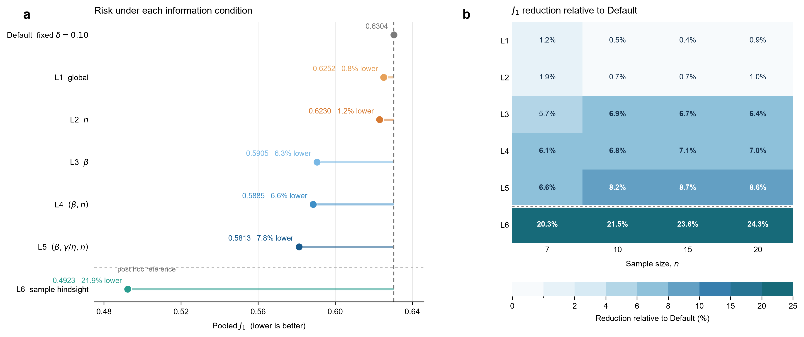
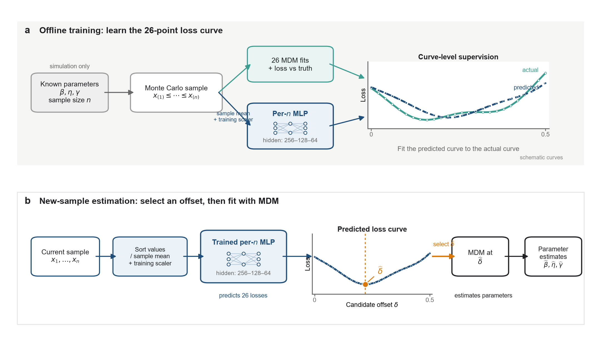
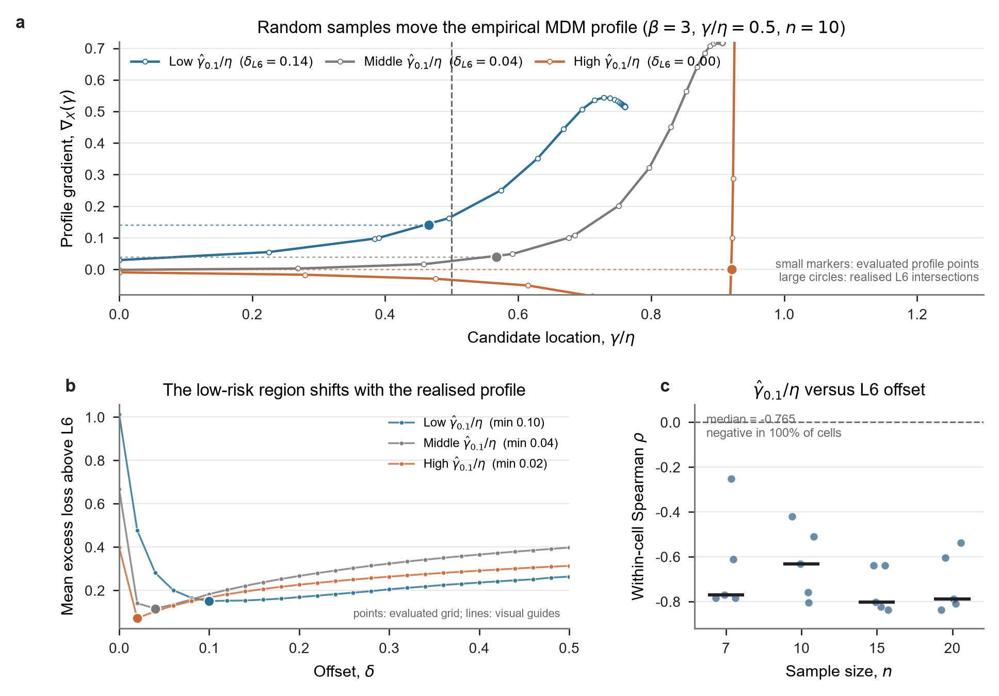

# 第一部分：Study01——三参数 Weibull 小样本 MDM 偏移量的自适应选择

> 本文件是逐页汇报稿。每个二级标题对应一页 PPT；“页面上写”是观众可见内容，“讲稿备注”是汇报时展开说明的内容。
>
> 现有 PPT 仅作为版式和素材来源：[2026-08-Study01阶段汇报-模板版.pptx](../2026-08-Study01阶段汇报-模板版.pptx)。研究事实以 Study01 当前论文和正式产物为准。

本部分的内部逻辑是：**为什么需要偏移量 → 为什么统一偏移量只是折中 → 当前样本是否提供选择信息 → 怎样实现样本自适应选择 → 改善有多大 → 为什么有效 → 适用边界是什么。**

## 第1页｜整场汇报沿一条方法递进链展开

**本页主旨**

三部分不是三个独立工作，而是从改进传统估计器、比较完整路线，再到改进直接估计目标的连续推进。

**页面上写**

1. **第一部分｜Study01：** 神经网络利用当前样本改进 MDM 内部偏移量决策。
2. **第二部分｜Research04：** 比较结构保留路线与直接神经参数估计的能力和边界。
3. **第三部分｜Study02：** 直接估计时，由参数等权损失 P 递进到寿命点损失 Q 和约束路线 QCP。

页面下方放一条主线：

`MDM 内部优化 → 完整估计路线比较 → 直接估计目标优化`

**页面结论**

整场汇报回答的是神经网络应在估计流程中承担什么角色，以及怎样定义它的训练目标。

**讲稿备注**

第一部分先把已经完整的 Study01 讲清；第二部分承接老师提出的比较问题，不回避直接估计当前更好的结果，同时把它的泛化和区间问题拆开；第三部分进一步追问，直接网络既然可行，最值得研究的就不只是网络结构，而是损失函数怎样与最终用途对齐。

## 第2页｜Study01 回答的是一个连续的决策问题

**本页主旨**

三参数 Weibull 小样本 MDM 中，偏移量不是一个固定常数问题，而是一个由参数域和当前样本共同决定的有限样本决策问题。

**页面上写**

- 正偏移量为什么有必要？
- 统一取值由什么决定？
- 真参数未知时，能否只依据当前样本选择偏移量？
- 选择有效时，收益从哪里来？

**展示**

用一条文字链代替复杂流程图：

`稳定性 → 参数域折中 → 信息层级 → 样本自适应 → 机制与边界`

**页面结论**

Study01 的核心不是“又训练了一个网络”，而是把偏移量选择从经验常数推进为可解释的样本决策。

**讲稿备注**

这部分不按实验先后讲，而是按科学问题讲。先确认偏移量为什么存在，再问一个统一值能否覆盖所有情况，最后才讨论真参数未知时如何利用观测样本进行选择。这样网络是问题推导出来的工具，不是研究的起点。

## 第3页｜正偏移量首先解决小样本稳定性

**本页主旨**

相对无偏移判据，固定正偏移量已经承担了主要的稳定性改善。

**页面上写**

- 比较：$\delta=0$ 与固定 $\delta=0.10$
- 标准化 SD：$\beta$ 下降约 57%，$\eta$ 下降约 39%，$\gamma$ 下降约 41%
- 后续自适应选择是在稳定基线之上的进一步优化

**展示**

**页面结论**

$\delta=0.10$ 不是需要被推翻的旧方案，而是后续方法必须超过的稳健基线。

**讲稿备注**

偏移量最初不是为了追求某个网络结果，而是为了抑制有限样本下判据和参数估计的波动。固定 0.10 已经取得明显稳定性收益，因此后面的研究问题变成：在保留稳定性的前提下，能否减少统一取值带来的精度损失。

## 第4页｜最佳统一偏移量随参数域移动

**本页主旨**

统一偏移量是给定参数空间和权重下的总体折中，不是脱离应用域的固定真理。

**页面上写**

- 保持 $\beta$ 域宽度不变，仅平移覆盖位置
- 汇总风险谷底由 0.18 移到 0.04
- 各曲线存在较宽的低风险区域

**展示**

**页面结论**

宽混合参数域中，0.10 是稳健默认值；面向更明确的应用域时，统一取值可以重新确定。

**讲稿备注**

这一页把“0.10 是否最优”改成更科学的问题：在什么参数域和汇总方式下最优。风险曲线的谷底会随覆盖范围移动，但低风险区通常较宽，所以统一值既有稳健性，也必然牺牲一部分条件针对性。

## 第5页｜信息层级揭示偏移量由什么决定

**本页主旨**

样本量本身解释的差异很少，形状参数和完整参数条件能够解释更多偏移量风险差异。

**页面上写**

| 信息层级 | 可用信息 | 相对固定 0.10 的改善 |
|---|---|---:|
| L1 | 全局统一 | 0.83% |
| L2 | 样本量 $n$ | 1.17% |
| L3 | 真 $\beta$ | 6.33% |
| L4 | $(\beta,n)$ | 6.65% |
| L5 | $(\beta,\gamma/\eta,n)$ | 7.79% |
| L6 | 当前样本的事后真实损失 | 21.91% |

**展示**

**页面结论**

参数条件解释了一部分差异，L5 与 L6 的剩余差距说明同一参数条件内的样本实现仍然重要。

**讲稿备注**

L1—L5 是条件平均规则，L6 则在每个样本生成后查看 26 个候选偏移量的真实损失再选择，因此 L6 是事后参照，不是可部署方法。这里真正得到的线索是：低风险偏移量既随参数条件变化，也随当前抽样结果变化。

## 第6页｜可执行问题是从观测样本恢复多少信息

**本页主旨**

真参数未知时，当前排序样本中的相对位置、间距和离散结构是可用于偏移量决策的信息。

**页面上写**

- 输入：排序样本 $X/\operatorname{mean}(X)$
- 每个样本量分别训练
- 输出：$\delta=0.00$–0.50 的 26 点损失曲线
- 决策：选择预测低风险点，再调用原 MDM 估计参数

**展示**

**页面结论**

网络不直接替代 MDM，而是利用样本信息选择 MDM 的内部偏移量。

**讲稿备注**

这里预测整条损失曲线，而不是把事后最优格点当成分类标签。相邻偏移量的真实损失常常非常接近，预测曲线能够保留低风险平台；应用时仍由原 MDM 完成三参数估计。

## 第7页｜样本自适应选择使联合参数风险下降 7.27%

**本页主旨**

在同一样本和留出协议下，样本自适应方法在四个样本量上都优于固定 0.10。

**页面上写**

- 正式测试样本：48,000
- pooled $J_1$：0.6304 → 0.5846
- 相对下降：7.27%
- bootstrap 95% CI：6.94%–7.64%
- 估计失败率：0%

**展示**

**页面结论**

$J_1$ 为偏移量选择提供统一决策目标；其下降是否对应常规估计精度改善，要由下一页的 Bias、SD 和 RMSE 独立核验。

**讲稿备注**

7.27% 是当前论文的主要可执行收益。它小于 L6 的 21.91%，因为 L6 使用了部署阶段不可获得的真参数和事后损失。合理的评价不是要求网络逼近 L6，而是确认它在可用信息条件下稳定超过固定基准。

## 第8页｜常规精度指标独立验证三个参数都得到改善

**本页主旨**

$J_1$ 用于训练和选择，最终效果回到逐参数 Bias、SD 和 RMSE；三个参数在三类指标上均同向改善。

**页面上写**

| 参数 | 方法 | Bias | SD | RMSE |
|---|---|---:|---:|---:|
| $\beta$ | 固定 0.10 | −0.2327 | 0.3293 | 0.4032 |
|  | 样本自适应 | **−0.2008** | **0.3165** | **0.3749** |
| $\eta$ | 固定 0.10 | −0.1998 | 0.3011 | 0.3614 |
|  | 样本自适应 | **−0.1827** | **0.2813** | **0.3354** |
| $\gamma$ | 固定 0.10 | 0.1868 | 0.2633 | 0.3228 |
|  | 样本自适应 | **0.1700** | **0.2445** | **0.2978** |

补充小字：$\beta,\eta$ 按真值归一化，$\gamma$ 按真 $\eta$ 归一化。

**页面结论**

常规精度指标与 $J_1$ 给出一致方向，因此主要结论不依赖单一自定义指标。

**讲稿备注**

这一页不再重复网络损失，而是回到常用的 Bias、SD 和 RMSE。统计覆盖 160 个参数组合、每组合 300 个测试样本，反映的是整个正式设计域，不是单一代表样本。

## 第9页｜不必命中事后最优点，也能做出更好的决策

**本页主旨**

偏移量选择的评价标准是实际风险，而不是预测格点与 L6 完全一致的比例。

**页面上写**

- 相邻偏移量常位于同一低风险平台
- 160 个参数单元中：125 个改善，35 个回退
- 网络提高了落入低风险区域的频率

**展示**

**页面结论**

这是风险决策问题，不是“正确标签命中率”问题。

**讲稿备注**

代表性样本中，网络选择的格点可以不是实际最低点，但只要位于低损失平台，总体风险仍会下降。35 个退化单元也说明收益是总体性的，而不是对每个样本或每个参数条件作保证。

## 第10页｜样本波动通过经验梯度移动低风险偏移量

**本页主旨**

同一真参数下，不同样本的次序统计量和间距会改变 MDM 经验梯度及搜索交点，进而改变适宜偏移量。

**页面上写**

- $\nabla_X(0)$ 与 L6 偏移量：多数单元正相关
- $\hat\gamma_{0.1}/\eta$ 与 L6 偏移量：20/20 单元负相关
- 边界解占 7.1%，主要机制不是简单截断

**展示**

**页面结论**

网络能够发挥作用，是因为样本形态确实携带了与 MDM 内部风险相关的信息。

**讲稿备注**

这条机制沿 MDM 内部计算过程展开：样本间距变化会改变经验剖面和梯度曲线；搜索交点移动后，位置参数以及另外两个参数随之变化，最终改变整条偏移量—损失曲线。诊断相关性与这一解释一致。

## 第11页｜剩余差距同时包含学习误差和信息差

**本页主旨**

继续训练和增加模型灵活性还能获得收益，但 L6 使用了部署阶段不存在的事后信息。

**页面上写**

| 方法 | 同一确认集 $J_1$ |
|---|---:|
| 固定 0.10 | 0.6267 |
| 论文 MLP | 0.5827 |
| 同域重训 | 0.5680 |
| 灵活 Z-only 参照 | 0.5618 |
| L6 事后参照 | 0.4906 |

**页面结论**

当前网络并未达到所有可学习收益的上限，但与 L6 的差距不能全部解释为训练不足。

**讲稿备注**

这一页给出投入与收益的边界感。扩大覆盖、同域重训和更灵活模型都能继续降低风险；同时，L6 看到了真参数和每个候选点的事后损失，因此剩余差距混合了可学习部分与完美信息差。

## 第12页｜Study01 的结论与下一问

**本页主旨**

Study01 已经证明保留 MDM 的样本自适应路线有效，但也自然引出“为什么不让网络直接输出参数”。

**页面上写**

1. 正偏移量解决主要稳定性问题。
2. 统一偏移量是参数域下的折中。
3. 样本形态能够支持进一步选择，$J_1$ 下降 7.27%。
4. 机制来自经验梯度和搜索交点随样本实现变化。

**展示**

页面右侧只放下一问：

> 既然已经使用神经网络，保留 MDM 再选择偏移量，是否优于直接从样本估计三个参数？

**页面结论**

第二部分不再问“偏移量怎么选”，而是比较两条完整估计路线的能力与边界。

**讲稿备注**

这一问来自 Study01 的外部比较，而不是对 Study01 的否定。Study01 已经完整回答了 MDM 家族内部如何改进；接下来要回答的是，在同一任务下保留传统结构和直接端到端估计分别适合什么条件。
