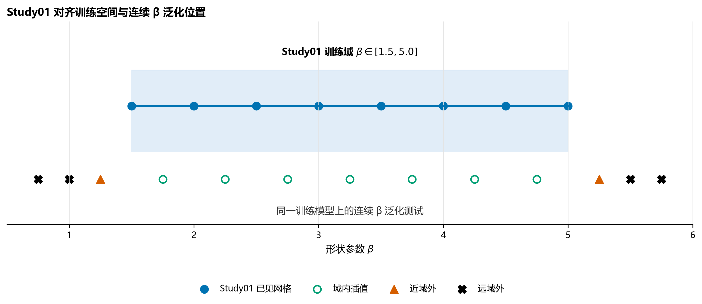
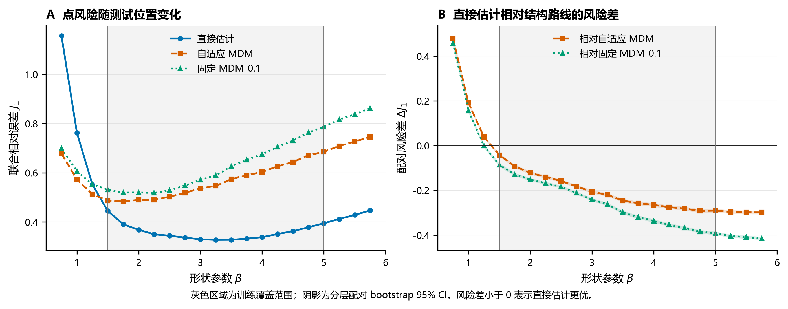
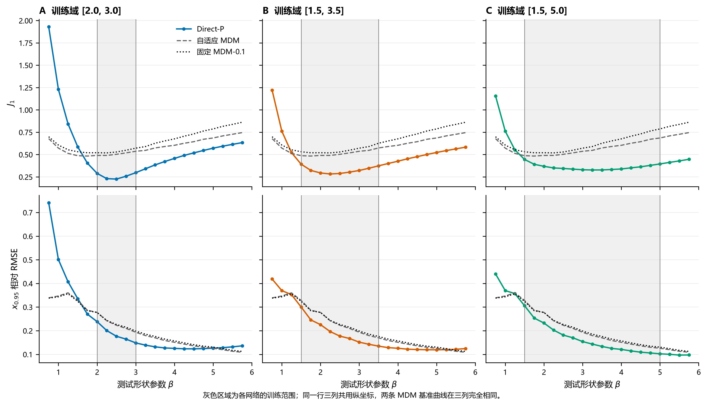
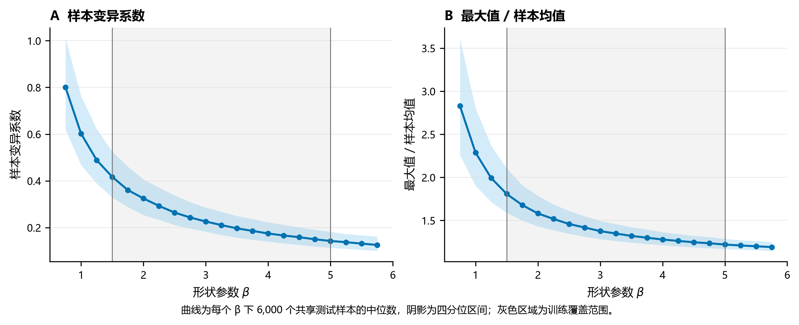

# 第二部分：直接神经估计与结构保留路线比较

> 本部分对应 `Research/04-直接NN参数估计`。每个二级标题对应一页 PPT；表格保留为可编辑表格，不嵌入图片。

## 第1页｜Study01 之后，老师真正会问什么

**本页主旨**

Study01 用神经网络为 MDM 选择偏移量；进一步的问题是：既然已经使用神经网络，为什么不让它直接从样本输出三个参数？

**页面上写**

| 路线 | 神经网络负责什么 | 参数怎样得到 |
|---|---|---|
| 自适应 MDM | 选择 MDM 的内部偏移量 | 网络作决策，MDM 负责参数求解 |
| Direct-P | 学习样本到三个参数的映射 | 网络直接输出 $(\hat\beta,\hat\eta,\hat\gamma)$ |

**本部分回答三个问题**

1. 在与 Study01 对齐的条件下，哪条路线的点估计更准？
2. Direct-P 的优势是否只存在于训练网格，离开训练范围后会怎样？
3. 如果扩大训练范围，能否同时获得更大的适用域和同样高的局部精度？

**页面结论**

这不是只比较两个平均数，而是要找出两条路线各自在什么条件下更合适。

**讲稿备注**

第二部分不预设 MDM 一定更好，也不预设直接网络可以完全替代传统方法。我们先在完全对齐的参数域内做路线比较，再主动改变 Direct-P 的训练范围，检查它的优势依赖什么条件。

## 第2页｜整套实验只有两组，分别回答两个问题

**本页主旨**

Research04 包含两组正式实验；每组只改变一个核心因素。

**页面上写**

| 实验 | 核心问题 | 改变什么 | 保持什么不变 |
|---|---|---|---|
| 实验 A：路线比较 | 在 Study01 参数域内，Direct-P 和 MDM 谁更准？ | 估计路线 | 训练域、样本量、测试样本、网络预算、种子 |
| 实验 B：训练域宽度 | Direct-P 扩大适用范围后，局部精度是否受损？ | 训练 $\beta$ 区间与训练预算 | 网络、其他参数、种子、正式测试样本 |

**训练总账**

- 实验 A：4 个 Direct-P 模型 + 4 个自适应 MDM 选择器，共 8 个神经网络；固定 MDM-0.1 不训练。
- 实验 B：6 个逻辑场景，对应 20 个唯一 Direct-P 模型；其中 4 个宽域模型复用实验 A，新增训练 16 个。
- 整个 Research04：20 个唯一 Direct-P 模型 + 4 个自适应 MDM 选择器，共 24 个唯一神经网络。

**页面结论**

实验 A 判断“谁更准”，实验 B 判断“这种优势依赖什么条件”。

**讲稿备注**

模型数量按 $n$ 分开计算，因为 $n=7,10,15,20$ 使用四个独立网络。实验 B 的三种训练域乘两种预算得到 6 个逻辑场景；宽域在两种预算下设置相同，所以只训练一次。

## 第3页｜实验 A：用了什么、怎样训练、怎样测试

**本页主旨**

实验 A 对齐 Study01，只改变最终采用哪一种估计路线。

**页面上写**

| 项目 | 冻结设置 |
|---|---|
| 训练参数域 | $\beta=1.5,2.0,\ldots,5.0$；$\eta=1000$；$\gamma/\eta=0.10,0.25,0.50,0.75,1.00$ |
| 样本量 | $n=7,10,15,20$，每个 $n$ 单独训练模型 |
| 训练数据 | 8 个 $\beta$ × 5 个 $\gamma/\eta$ × 4 个 $n$ × 300 次，共 48,000 个样本 |
| 网络与预算 | 256–128–64；最大 300 轮；patience=20；种子 42 |
| 正式测试 | $\beta=0.75,1.00,\ldots,5.75$，共 126,000 个独立共享样本 |
| 三种方法 | Direct-P、自适应 MDM、固定 MDM-0.1 |
| 输出数据 | 每个样本由三种方法共同估计，共 378,000 行配对结果 |

**评价口径**

- 主评价：三个参数分别的 Bias、SD、RMSE，以及联合参数误差 $J_1$。
- 外部评价：由估计参数计算 $x_{0.95}$ 的 Bias、SD、RMSE；$x_{0.95}$ 没有参与 Direct-P 训练。
- 失败处理：失败率单列；失败样本按训练阶段冻结的惩罚进入 $J_1$。

**页面结论**

三种方法面对同一批测试样本，因此差异来自估计路线，而不是测试样本不同。

**讲稿备注**

Direct-P 与自适应 MDM 都有四个按样本量区分的模型。固定 MDM-0.1 不需要训练，但与另外两种方法处理完全相同的测试样本。这里用 $x_{0.95}$ 只是检查参数误差是否传递到实际量，不是把它作为训练目标；把分位点作为训练目标是第三部分 Study02 的问题。

## 第4页｜实验 A 为什么把测试点分成四类

**本页主旨**

“训练时没见过这个离散点”和“已经离开训练范围”不是同一件事。

**展示**

**页面上写**

| 测试区域 | $\beta$ 位置 | 要回答的问题 |
|---|---|---|
| 已见网格 | 训练时使用的 8 个水平 | 域内基准精度 |
| 域内未见 | $1.75,2.25,\ldots,4.75$ | 是否学会连续插值，而非记忆网格 |
| 近域外 | 1.25、5.25 | 刚离开边界时是否退化 |
| 远域外 | 0.75、1.00、5.50、5.75 | 外推距离增大后是否失效 |

**页面结论**

这一划分把“插值能力”和“外推能力”分开，不会把所有未见点混为一谈。

**讲稿备注**

如果域内未见点表现与训练网格相当，可以说明网络不是简单查表；如果域外恶化，则说明它的适用边界由训练覆盖决定。

## 第5页｜实验 A 的主要结果：域内 Direct-P 明显更准

**本页主旨**

Direct-P 的优势同时出现在已见网格和域内未见点，但低 $\beta$ 域外发生反转。

**展示**

**页面上写**

| 测试区域 | Direct-P $J_1$ | 自适应 MDM $J_1$ | Direct 相对变化 |    配对 $\Delta J_1$（95% CI） |
| ---- | -------------: | ------------: | ----------: | -------------------------: |
| 已见网格 |     **0.3658** |        0.5696 |  **−35.8%** | −0.2038 [−0.2067, −0.2011] |
| 域内未见 |     **0.3532** |        0.5648 |  **−37.5%** | −0.2115 [−0.2144, −0.2087] |
| 近域外  |     **0.4873** |        0.6188 |  **−21.3%** | −0.1316 [−0.1369, −0.1263] |
| 远域外  |         0.7587 |    **0.6840** |      +10.9% | +0.0746 [+0.0696, +0.0798] |

**页面结论**

实验 A 证明：在本轮训练覆盖域内，Direct-P 是更强的点估计器，而且优势不是记住离散训练点得到的。

**讲稿备注**

域内未见点的改善幅度与已见网格几乎相同，这是连续插值的证据。远域外合并结果反转，主要由低侧 $\beta=0.75$ 和 1.00 的大误差驱动；高侧到 $\beta=5.75$ 仍未反转，所以外推方向和外推距离都重要。

## 第6页｜实验 A 不只看综合分数：Bias、SD 和实际量怎样变化

**本页主旨**

Direct-P 的域内优势来自系统偏差和重复估计波动同时下降，也传递到了未参与训练的 $x_{0.95}$。

**页面上写**

已见网格的参数原始尺度 Bias / SD / RMSE：

| 方法 | $\beta$ | $\eta$ | $\gamma$ |
|---|---:|---:|---:|
| Direct-P | **−0.371 / 0.783 / 0.866** | **−38.43 / 193.98 / 197.75** | **27.73 / 167.17 / 169.45** |
| 自适应 MDM | −0.791 / 1.048 / 1.313 | −181.31 / 272.72 / 327.49 | 169.48 / 236.91 / 291.29 |
| 固定 MDM-0.1 | −0.947 / 1.122 / 1.468 | −200.97 / 301.73 / 362.53 | 188.60 / 264.34 / 324.72 |

$x_{0.95}$ 相对误差：

| 测试区域 | Direct Bias / SD / RMSE | 自适应 MDM Bias / SD / RMSE | Direct RMSE 变化 |
|---|---:|---:|---:|
| 已见网格 | **+0.0020 / 0.1799 / 0.1799** | +0.0537 / 0.2045 / 0.2114 | **−14.9%** |
| 域内未见 | **−0.0020 / 0.1668 / 0.1668** | +0.0501 / 0.1933 / 0.1997 | **−16.5%** |
| 远域外 | −0.0418 / 0.2921 / 0.2950 | **+0.0499 / 0.2499 / 0.2549** | +15.8% |

**页面结论**

域内不是“只让一个综合指标变好”：三个参数和 $x_{0.95}$ 都改善；远域外则共同反转。

**讲稿备注**

$J_1$ 用于跨参数综合比较，但不代替三个参数各自的 Bias、SD 和 RMSE。$x_{0.95}$ 没参与训练，因此它是外部任务评价，不是网络自己定义规则后再用同一规则给自己打分。

## 第7页｜为什么实验 A 中 Direct-P 会更准

**本页主旨**

Direct-P 的域内优势来自“更自由的映射 + 训练域信息”；MDM 则受结构化求解过程的限制。

**页面上写**

1. **目标更直接。** Direct-P 直接最小化三个参数的联合误差；MDM 先构造伪尺度一致性，再由该准则间接得到参数。
2. **估计器限制不同。** 自适应 MDM 只是在给定 MDM 家族中选择偏移量，不能改变这个估计器家族的结构上限。
3. **训练数据提供域内规律。** 小样本本身可能对应多组相近参数；网络利用大量模拟样本学到在当前训练域内哪组参数更常与这种样本形态对应。
4. **因此 Bias 和 SD 同时降低。** 网络既校正了结构估计器的系统偏差，也借助重复训练样本稳定了小样本映射。

**为什么不是处处更好**

Direct-P 使用的域内规律也是一种训练分布约束。测试输入离开这一分布后，原来有利的经验映射可能变成错误的收缩方向。

**页面结论**

Direct-P 的优势不是“神经网络天然更准”，而是它在已知训练域内用更强的数据先验换取了更低风险。

**讲稿备注**

这里的“先验”指训练数据规定了哪些参数组合常见，不是另写进网络的一项参数。平方损失下，网络会对与某种样本形态相容的参数组合取条件折中；训练域正确时这种折中能降误差，训练域错误时也会把答案拉向错误范围。

## 第8页｜样本量增加后，为什么 Direct-P 优势收窄

**本页主旨**

两条路线都会随样本量增加而改善，但 MDM 从新增样本中获益更快。

**展示**

**页面上写**

| $n$ | Direct-P $J_1$ | 自适应 MDM $J_1$ | Direct 相对变化 | $x_{0.95}$ RMSE：Direct / MDM |
|---:|---:|---:|---:|---:|
| 7 | 0.4076 | 0.6945 | −41.3% | 0.2286 / 0.2804 |
| 10 | 0.3765 | 0.5907 | −36.3% | 0.1884 / 0.2217 |
| 15 | 0.3488 | 0.5107 | −31.7% | 0.1534 / 0.1716 |
| 20 | 0.3251 | 0.4535 | −28.3% | 0.1348 / 0.1468 |

**结果能说明什么**

- Direct-P 在四个样本量下都更准。
- 从 $n=7$ 增到 20，Direct-P 的 $J_1$ 降低 20.3%，自适应 MDM 降低 34.7%。
- 样本越少，训练域信息的相对作用越大；样本越多，单个样本自身提供的信息越充分。

**页面结论**

Direct-P 尤其适合训练域已知的极小样本点估计；样本增多后，结构路线与它的差距缩小。

**讲稿备注**

MDM 依赖顺序统计量与秩概率的对应。样本增多后，单个极端点对伪尺度和剖面目标的影响下降，因此 MDM 改善更快。这不是说 Direct-P 在大样本时变差，而是两者都变好、MDM 追赶得更快。

## 第9页｜训练固定在 $\eta=1000$，换尺度会不会失效

**本页主旨**

Study01 和 Research04 的正式训练都固定 $\eta=1000$；但两条路线均采用尺度等变设计，需要用其他尺度验证实现是否真的符合该设计。

**页面上写**

完整 126,000 个测试样本成对缩放，不重新训练模型：

| 测试 $\eta$ | $J_1$ | $x_{0.95}$ RMSE | 失败率 |
|---:|---:|---:|---:|
| 1 | 0.4705367 | 0.2060071 | 0.05476% |
| 10 | 0.4705367 | 0.2060071 | 0.05476% |
| 100 | 0.4705367 | 0.2060071 | 0.05476% |
| 1,000 | 0.4705367 | 0.2060071 | 0.05476% |
| 10,000 | 0.4705367 | 0.2060071 | 0.05476% |
| 1,000,000 | 0.4705367 | 0.2060071 | 0.05476% |

- $\hat\beta$ 最大差异为 0。
- $\hat\eta$、$\hat\gamma$ 按尺度还原后的最大差异不超过 $9.1\times10^{-13}$。
- Study01 的“选择器 → 偏移量 → MDM”链也已在 $\eta=1,1000,10^6$ 的代表条件上通过尺度等变检查。

**页面结论**

固定 $\eta=1000$ 没有限制当前方法适用于相同分布形状的其他计量尺度；本轮没有观察到尺度变化造成的额外误差。

**讲稿备注**

原因是输入使用排序样本除以样本均值，整体乘以常数后网络看到的输入不变；输出中的 $\eta$ 和 $\gamma$ 再乘回样本均值，因此按同一常数缩放。这里验证的是同一样本的尺度等变，不是分别在六个 $\eta$ 上训练六套随机模型。

## 第10页｜实验 A 暴露的新问题：部署时并不知道真实参数域

**本页主旨**

实验 A 的 Direct-P 使用了与测试域高度匹配的训练范围；实际应用中，真实 $\beta$ 是否落在该范围通常事先未知。

**页面上写**

- 训练窄：可能在目标区间内更准，但更容易遇到域外样本。
- 训练宽：覆盖更安全，但网络必须同时适应更多参数组合。
- 关键问题：扩大训练范围造成的损失只是因为固定数据被摊薄，还是训练域本身变宽就会增加辨识难度？

**页面结论**

实验 A 说明 Direct-P 在已知域内更准，但还不能证明一个宽域网络可以无代价地替代结构估计器。

**讲稿备注**

因此需要实验 B。它不再重复比较谁更准，而是只研究 Direct-P 的训练范围。我们同时设置固定总样本量和固定单元密度，专门拆开“数据不够”和“范围太宽”这两个原因。

## 第11页｜实验 B：三种训练域、两种预算、六个场景

**本页主旨**

实验 B 只改变训练 $\beta$ 范围，并用两种预算判断宽域损失能否靠增加数据消除。

**页面上写**

| 训练 $\beta$ 区间 | 水平数 | 固定总量：每单元 / 每个 $n$ | 固定密度：每单元 / 每个 $n$ |
|---|---:|---:|---:|
| $[2,3]$ | 3 | 800 / 12,000 | 300 / 4,500 |
| $[1.5,3.5]$ | 5 | 480 / 12,000 | 300 / 7,500 |
| $[1.5,5]$ | 8 | 300 / 12,000 | 300 / 12,000 |

**共同控制**

- $\eta=1000$，5 个 $\gamma/\eta$，4 个 $n$，相同网络、训练上限和种子 42。
- 每个逻辑场景使用同一组 126,000 个正式测试样本。
- 共同区间 $\beta\in[2,3]$ 的 30,000 个样本评价局部精度；完整区间评价覆盖与外推。
- 6 个逻辑场景，共 756,000 行结果；宽域两种预算共用模型，故训练 20 个唯一 Direct-P 模型。

**两种预算各自排除什么解释**

- 固定总量：反映有限训练预算下，训练点被摊薄后的实际代价。
- 固定密度：宽域增加到窄域 2.67 倍训练量；若仍变差，就不能只归因于样本被摊薄。

**页面结论**

实验 B 的设计目的，是区分“训练数据数量不足”和“训练参数域扩大本身”的作用。

**讲稿备注**

全部 282 次数值失败都在共同区间之外，因此共同区间的宽域比较不由失败惩罚驱动。域宽差异使用同一样本配对，并以 3000 次 bootstrap 给出 95% 置信区间。

## 第12页｜实验 B 的局部结果：范围越宽，共同区间参数恢复越差

**本页主旨**

即使给宽域模型更多训练数据，它在共同区间恢复三个参数的能力仍然下降。

**展示**

**页面上写**

固定总训练量：

| 训练区间 | $J_1$ | $\beta$ RMSE | $\eta$ RMSE | $\gamma$ RMSE | $x_{0.95}$ RMSE |
|---|---:|---:|---:|---:|---:|
| $[2,3]$ | **0.2616** | **0.1333** | **0.1720** | **0.1452** | 0.1883 |
| $[1.5,3.5]$ | 0.2982 | 0.1795 | 0.1835 | 0.1517 | **0.1853** |
| $[1.5,5]$ | 0.3461 | 0.2346 | 0.1948 | 0.1636 | 0.1901 |

- 宽域相对窄域：$J_1$ 增加 32.3%，$\Delta J_1=+0.0845$（95% CI 0.0829–0.0859）。
- 固定单元密度后：宽域训练数据为窄域的 2.67 倍，$J_1$ 仍增加 31.5%，$\Delta J_1=+0.0829$（95% CI 0.0814–0.0844）。
- 主要损失来自 $\beta$，其 RMSE 增加 76.0%；$x_{0.95}$ RMSE 只增加 1.0%。

**页面结论**

宽域局部损失不是简单的“数据不够”；训练域本身改变了网络需要解决的辨识问题。

**讲稿备注**

两种预算得到几乎相同的约 32% 增幅，是这个实验最关键的识别证据。增加数据可以让网络更准确地学到宽域下的最佳折中，但不能让宽域下的最佳折中自动等同于窄域下的最佳答案。

## 第13页｜实验 B 已覆盖哪些内部点和外部点

**本页主旨**

窄域网络在共同区间更准，但测试点离其训练边界越远，外推误差越大。

**展示**

**页面上写**

固定单元密度下的代表性 $J_1$：

| 训练区间 | 域内非训练点 | 左侧紧邻 / 远域外 | 右侧紧邻 / 远域外 |
|---|---:|---:|---:|
| $[2,3]$ | $\beta=2.25$：**0.2322** | 1.75：0.3982 / 1.25：0.8214 | 3.25：0.3421 / 3.75：0.4229 |
| $[1.5,3.5]$ | $\beta=2.25$：**0.2832** | 1.25：0.5341 / 0.75：1.2158 | 3.75：0.3961 / 4.25：0.4502 |
| $[1.5,5]$ | $\beta=3.25$：**0.3274** | 1.25：0.5521 / 0.75：1.1564 | 5.25：0.4124 / 5.75：0.4470 |

三种训练网格间距均为 0.5，测试间距为 0.25，因此每个区间都实际包含：训练点、域内非训练点、左右紧邻域外点和更远域外点。

**图中 MDM 为什么也沿横轴变化**

- 三列中的自适应 MDM 和固定 MDM 曲线完全相同，它们没有跟随 Direct-P 重新训练。
- 曲线沿 $\beta$ 变化，是因为测试分布本身变了；估计器固定不等于它在所有真实参数下误差恒定。
- 自适应 MDM 还会按当前样本选择不同偏移量；固定 MDM 始终用 0.1，但其统计误差仍随真实 $\beta$ 变化。

**页面结论**

现有实验已经覆盖小、中、大区间的内部非训练点和双侧域外点；域外距离增大时参数误差上升，而且低 $\beta$ 侧上升更快。

**讲稿备注**

三列使用同一测试样本、同一行使用相同纵轴。这样可以直接看到：灰色训练区越宽，远处测试点离边界越近，Direct-P 的域外风险越低；与此同时，第12页已经证明它在共同区间内更差。当前尚未做的是“同一宽度区间在多个 $\beta$ 位置上的系统平移”，因此不能把宽度效应与区间位置效应完全分离。

## 第14页｜为什么宽域训练不会“数据越多就一定恢复窄域精度”

**本页主旨**

根本原因是小样本参数辨识存在重叠：相似的归一化样本形态可能由不同参数组合产生。

**页面上写**

设网络看到的输入为 $z$、真实参数为 $\theta$。在平方损失下，网络学习的是训练分布给定的条件折中：

$$
f^*(z)=\operatorname{E}_{\text{train}}(\theta\mid z).
$$

- **窄域训练：** 与同一 $z$ 相容的候选参数较少，条件分布更集中，局部折中更接近真实值。
- **宽域训练：** 更多参数组合能产生相似的小样本形态，条件分布更宽，网络必须在更多候选答案间折中。
- **增加训练数据：** 能更准确地估计这个宽域条件折中，但不会消除输入本身无法唯一区分参数的重叠。
- **为何 $x_{0.95}$ 几乎不变：** $\beta$、$\eta$、$\gamma$ 的误差存在补偿；参数分别偏了，组合出的一个分位点仍可能接近。

**页面结论**

实验 B 观察到的是“训练域改变条件估计目标”，不只是“同样数据被分给更多网格点”。

**讲稿备注**

这也解释了为什么不能通过无限增加宽域样本，保证局部参数精度回到窄域水平。数据更多主要减少网络训练的不稳定性；但只要一个小样本在统计上仍可对应多个参数组合，宽域网络就必须做折中。这个机制解释与两种预算结果一致，但它仍是基于当前网络和模拟设计的解释，不是对所有架构的数学定理。

## 第15页｜为什么低 $\beta$ 外推最先失败

**本页主旨**

低 $\beta$ 分布更分散、右尾更重，归一化输入形态比高侧外推更快离开训练数据。

**展示**

**页面上写**

- $\beta=1.25$：Direct-P 的 $J_1$ 已比自适应 MDM 高 7.6%。
- $\beta=0.75$：高 70.5%。
- $\beta=5.75$：仍低 40.0%。
- 样本变异系数中位数：$\beta=1.50$ 时 0.417，$\beta=0.75$ 时 0.800。
- 最大值/均值中位数：由 1.808 上升到 2.830。

**页面结论**

外推风险不仅由“离边界多远”决定，还由输入分布朝哪个方向改变决定。

**讲稿备注**

Direct-P 使用 $X/\bar X$。低 $\beta$ 时，均值和高阶顺序统计量更容易被极端值拉动，输入几何快速离开训练分布，所以网络发生错误收缩。MDM 每次仍按 Weibull 结构重新求解，虽然域内平均误差更高，但在这一特定外推方向退化较缓。

## 第16页｜两组实验合起来，为什么 Direct-P 不能简单替代结构路线

**本页主旨**

实验 A 证明 Direct-P 的域内点估计优势；实验 B 证明这种优势以训练范围匹配为条件。

**页面上写**

| 应用条件 | 更合适的路线 | 原因 |
|---|---|---|
| 参数域较窄、稳定、重复点估计量大 | 专用 Direct-P | 域内 Bias、SD、RMSE 更低，推断快 |
| 参数域较宽但可由训练覆盖 | 宽域 Direct-P + 域诊断 | 覆盖更大，但接受局部精度代价 |
| 参数域未知或可能进入低 $\beta$ 域外 | 结构路线或触发回退 | 不依赖 Direct-P 的训练支持范围 |

**还没有完成的比较**

- 当前 Direct-P 输出点估计；MDM 可自然接入 bootstrap 或 Monte Carlo 区间流程。
- 神经网络也可以通过重采样、模型集成或校准构造区间，并非“不能给区间”。
- 公平的区间比较应同时报告 95% 覆盖率、平均宽度、最差单元覆盖率和计算成本；本轮尚未做这组实验。

**页面结论**

传统路线保留的价值不是“域内一定更准”，而是不需要先假定 Direct-P 已覆盖真实参数域，并保留逐样本结构化求解过程。

**讲稿备注**

固定 MDM-0.1 完全不训练；自适应 MDM 仍需要四个选择器网络，所以不能把所有 MDM 都说成无需训练。当前证据只比较了这两种 MDM 实现，也不能外推成“所有传统估计方法都不如或都优于直接网络”。

## 第17页｜第二部分的完整答案，以及怎样过渡到 Study02

**本页主旨**

两组实验共同给出了“谁更好、在什么条件下更好、为什么、边界在哪里”的答案。

**页面上写**

1. **谁更准：** 在 Study01 对齐域内，Direct-P 的联合参数误差下降约 36%–38%，$x_{0.95}$ RMSE 下降约 15%–17%。
2. **为什么更准：** Direct-P 直接优化参数误差，并利用训练域中的重复样本规律降低 Bias 和 SD。
3. **尺度是否限制适用性：** 从 $\eta=1$ 到 $10^6$ 的完整成对审计中，$J_1$、$x_{0.95}$ RMSE 和失败率不变，没有发现尺度意外。
4. **为什么不会处处更准：** 这种规律依赖训练分布；三个训练区间的连续测试均显示低 $\beta$ 域外退化快于高侧。
5. **扩大训练域会怎样：** 宽域提高覆盖，但共同区间参数误差增加约 32%；增加到 2.67 倍训练量仍未消除该代价。
6. **最终判断：** Direct-P 是训练域匹配时更强的点估计器；结构路线是参数域未知或触发域外风险时仍有价值的求解与回退路线。

**过渡到第三部分**

本部分的 Direct-P 用参数联合误差训练，只把 $x_{0.95}$ 作为外部评价。若实际任务最终关心的就是 $x_{0.95}$，是否应把训练目标也从参数等权误差改成分位点误差？这才是 Study02 的问题。

**页面结论**

Research04 回答估计路线的适用边界；Study02 接着回答直接网络内部应该优化什么目标。

**讲稿备注**

第二部分到这里闭环：实验 A 给出域内优势，实验 B 给出这种优势的条件和代价。第三部分不再讨论是否采用直接网络，而是在直接网络内部比较 P、Q 和 QCP。
