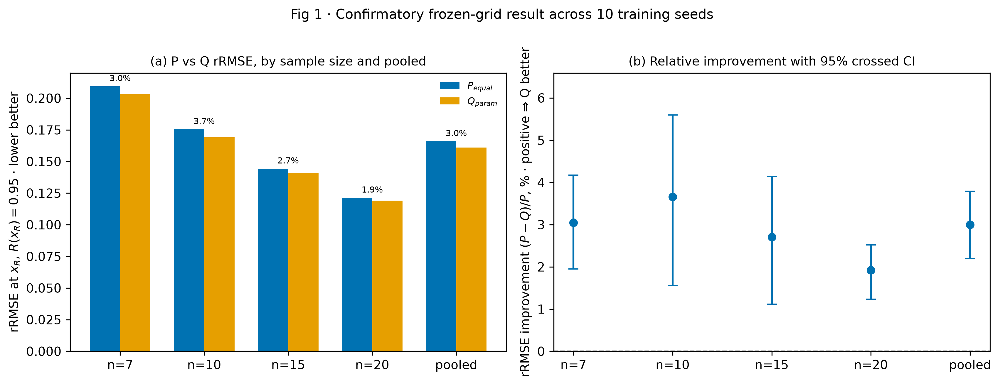
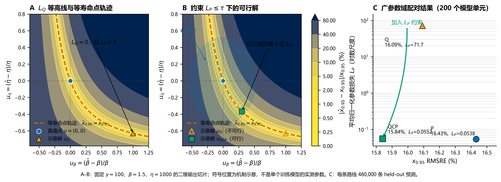
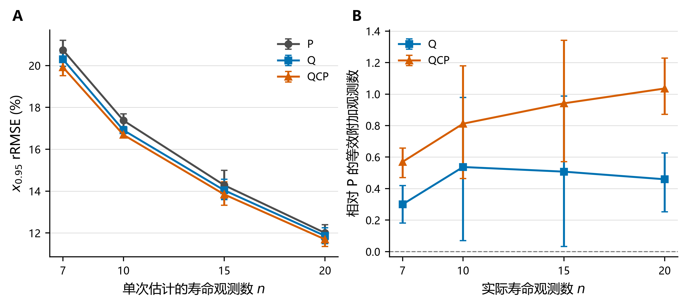

# 第三部分：Study02——从参数等权损失到寿命点目标与参数约束

> 本部分按当前论文的固定论证链组织：`P → Q → 解释 Q 改善有限及其代价 → QCP → 解释 QCP 解决了什么`。主线只使用当前同预算 P/Q/QCP 证据。

本部分的逻辑是：**直接估计必须定义损失 → 参数等权 P 的依据有限 → 用实际寿命点定义 Q → Q 在目标点改善但产生参数补偿 → 用 P 定义可行域、以 Q 为主目标形成 QCP → QCP 恢复跨寿命点一致性。**

## 第1页｜直接估计的关键不只是网络，而是训练目标

**本页主旨**

当神经网络直接输出三个参数时，必须先回答“怎样定义估计得好不好”。

**页面上写**

同一个三输出网络，可以采用不同训练依据：

- 参数是否接近真值？
- 最终使用的寿命点是否准确？
- 参数可接受的前提下，寿命点是否最准确？

**页面结论**

Study02 研究的不是换一个网络，而是改变端到端估计的评价依据。

**讲稿备注**

前一部分说明直接估计值得研究。接下来真正决定网络学习方向的是损失函数：如果部署时最终使用的是 $x_{0.95}$，参数空间里的等权距离是否仍是最合适的训练目标？

## 第2页｜P 提供透明的参数参照，但权重仍是约定

**本页主旨**

P 将三个归一化参数误差按 $1{:}1{:}1$ 相加，能够评价参数恢复，却不能说明这种等权正好对应 $x_{0.95}$ 的重要性。

**页面上写**

$$
L_P=left(\frac{\hat\beta-\beta}{\beta}\right)^2+
\left(\frac{\hat\eta-\eta}{\eta}\right)^2+
\left(\frac{\hat\gamma-\gamma}{\eta}\right)^2.
$$

- 归一化解决量纲差异
- $1{:}1{:}1$ 提供透明参照
- 但参数准不等于指定寿命点一定准

**页面结论**

P 是合理的参数恢复基线，但不是由最终寿命任务推导出来的唯一度量。

**讲稿备注**

这里不要把 P 说成错误。P 清楚、稳定，而且能约束三个参数。但如果最终用途明确为某个寿命点，参数方向的重要程度应由这个寿命点对各参数的敏感度决定，而不是预先固定为等权。

## 第3页｜Q 让 $x_{0.95}$ 通过反向传播分配参数重要性

**本页主旨**

Q 仍输出合法的三个参数，但训练误差通过寿命点公式回传，使参数权重随当前任务和预测位置动态变化。

**页面上写**

$$
x_R=\gamma+\eta[-\log R]^{1/\beta},
$$

$$
L_Q=left(\frac{\hat x_{0.95}-x_{0.95}}{x_{0.95}}\right)^2.
$$

页面下方用一句话说明：

`同样的三参数输出，不同的是误差沿最终寿命点公式反向传播。`

**展示**

**页面结论**

Q 把“哪个参数方向更重要”交给当前寿命任务，而不是人工指定固定权重。

**讲稿备注**

Q 的梯度包含 $\nabla_\theta x_{0.95}$，因此参数敏感度随真值位置、当前预测和可靠度水平变化，并保留参数交互。静态权重矩阵只能近似局部行为，无法完整复制有限误差路径上的动态更新。

## 第4页｜Q 在训练目标上更好，但改善幅度温和

**本页主旨**

在统一训练预算和 200 个配对模型单元下，Q 对 $x_{0.95}$ 的直接对齐带来稳定但不大的改善。

**页面上写**

| 路线 | $x_{0.95}$ RMSRE |
|---|---:|
| P | 16.432% |
| Q | **16.092%** |

- 绝对下降：0.340 个百分点
- 相对改善：2.069%
- 95% CI：[1.280%, 2.811%]

**展示**

**页面结论**

直接对齐最终寿命点能够回收参数等权损失与实际任务之间的一部分尺度错配。

**讲稿备注**

这里的“更好”只针对训练目标 $x_{0.95}$。改善有限并不说明 Q 的方向错误，而是说明 P 本身已经包含与寿命点相关的信息，同时单一样本能提供的信息、模型误差和目标的弱识别共同限制了额外收益。

## 第5页｜Q 的单点监督留下等寿命点补偿方向

**本页主旨**

一个标量寿命点不能唯一约束三个内部参数，多组参数可以给出近似相同的 $x_{0.95}$。

**页面上写**

- 三个未知参数 → 一个寿命点监督
- 局部 Jacobian 的秩至多为 1
- 存在近似等 $x_{0.95}$ 方向
- 网络可沿这些方向补偿参数误差

**展示**

**页面结论**

Q 的弱点不是没有对齐任务，而是只对齐一个任务值时内部参数识别不足。

**讲稿备注**

损失面可以理解为存在较宽的等价谷底：沿某些方向大幅改变参数，$x_{0.95}$ 仍变化很小。神经网络最终落在谷底中的哪个位置，会受到初始化、优化路径和隐式偏好的影响，这就产生了参数补偿。

## 第6页｜Q 的代价在其他寿命点上清楚暴露

**本页主旨**

Q 在 $x_{0.95}$ 上略优于 P，但同一组三参数在 $x_{0.90}$ 和 $x_{0.99}$ 上明显失真。

**页面上写**

| 寿命点 | P RMSRE | Q RMSRE | Q 相对 P |
|---|---:|---:|---:|
| $x_{0.90}$ | 13.657% | 18.630% | 退化 36.411% |
| $x_{0.95}$ | 16.432% | **16.092%** | 改善 2.069% |
| $x_{0.99}$ | 21.960% | 35.820% | 退化 63.114% |

**展示**

**页面结论**

Q 学会了指定寿命点，却没有保证同一参数模型在其他寿命点上的一致性。

**讲稿备注**

这一结果把“参数补偿”变成了可检验后果。Q 在 $x_{0.90}$ 的有方向偏差为 −13.460%，在 $x_{0.99}$ 为 +21.134%，说明补偿改变了整条寿命曲线的形状，而不只是让参数数字看起来不同。

## 第7页｜QCP 以 Q 为主目标、以 P 定义可行域

**本页主旨**

QCP 不是把 P 和 Q 简单加权，而是在参数误差可接受的区域内继续寻找 Q 最小的解。

**页面上写**

$$
\min_{\theta} L_Q(\theta)
\quad\text{s.t.}\quad
L_P(\theta)\le \tau_{\mathrm{cell}}.
$$

- Q：决定优化方向
- P：规定参数不能偏离多远
- $\tau_{\mathrm{cell}}$：控制可行域宽度

**页面结论**

QCP 的分工是“目标由 Q 决定，过度参数补偿由 P 排除”。

**讲稿备注**

这与单纯的 $Q+\lambda P$ 不同。加权和会让 P 与 Q 共同改变优化目标，权重含义依赖两个损失的尺度；QCP 保持 Q 为唯一主目标，只把 P 用作可接受性边界，更接近“任务目标 + 结构约束”的思路。

## 第8页｜QCP 保留目标点收益并恢复跨寿命点一致性

**本页主旨**

QCP 相对 Q 在训练点只小幅改善，但在未监督寿命点上大幅修复，并在三个预设寿命点上都略优于 P。

**页面上写**

| 寿命点 | P RMSRE | Q RMSRE | QCP RMSRE | QCP 相对 P |
|---|---:|---:|---:|---:|
| $x_{0.90}$ | 13.657% | 18.630% | **13.336%** | 改善 2.353% |
| $x_{0.95}$ | 16.432% | 16.092% | **15.841%** | 改善 3.599% |
| $x_{0.99}$ | 21.960% | 35.820% | **20.647%** | 改善 5.981% |

**展示**

**页面结论**

QCP 的主要价值不是让 $x_{0.95}$ 再大幅下降，而是让一组三参数重新支持整条寿命曲线。

**讲稿备注**

相对 Q，QCP 在 $x_{0.95}$ 改善 1.562%，在 $x_{0.90}$ 和 $x_{0.99}$ 分别改善 28.417% 和 42.360%。这正符合约束机制：把参数从补偿方向拉回时，训练点变化不大，但其他寿命点的曲线形状得到明显恢复。

## 第9页｜QCP 消除了 97.8% 的超额参数补偿

**本页主旨**

QCP 对 Q 的修复首先体现在内部参数可信性，其下游结果才是跨寿命点误差恢复。

**页面上写**

| 指标 | P | Q | QCP |
|---|---:|---:|---:|
| 平均参数损失 | 0.05385 | 71.714 | **0.05522** |
| 参数补偿指数 | 0.33226 | 0.915 | **0.34532** |

- 200/200 个 QCP checkpoint 满足参数约束
- 消除 Q 相对 P 的 97.8% 超额参数补偿

**展示**

**页面结论**

QCP 先恢复参数一致性，再恢复由同一参数派生的寿命曲线。

**讲稿备注**

这里的 97.8% 不是寿命点精度提高 97.8%，而是以 P 为参照，对 Q 超额参数补偿的解决比例。汇报时必须把这个分母说清，避免把机制指标误读成精度指标。

## 第10页｜当前改善主要表现为重复估计更稳定

**本页主旨**

$x_{0.95}$ 的均方误差下降主要来自固定真值单元内波动减小，而不是系统偏差大幅改变。

**页面上写**

| 路线 | 偏差 RMS 分量 | 单元内 SD 分量 | 总 RMSRE |
|---|---:|---:|---:|
| P | 7.091% | 14.824% | 16.432% |
| Q | **6.994%** | 14.493% | 16.092% |
| QCP | 7.001% | **14.210%** | **15.841%** |

**页面结论**

Q/QCP 的目标点收益主要是重复估计更集中，QCP 同时减弱了 Q 的方向性低估。

**讲稿备注**

“有方向偏差”和“偏差 RMS 分量”不能混用。前者会让不同区域的高估和低估互相抵消；后者先在每个固定真值单元计算偏差再汇总。当前三条路线的偏差 RMS 接近，主要差异来自单元内标准差。

## 第11页｜效应量可以换算为等效观测数

**本页主旨**

QCP 的相对改善不大，但可以换算成“P 需要多用多少观测才能达到相近精度”。

**页面上写**

| $n$ | Q 等效新增观测 | QCP 等效新增观测 |
|---:|---:|---:|
| 7 | 0.30 | **0.57** |
| 10 | 0.54 | **0.81** |
| 15 | 0.51 | **0.94** |
| 20 | 0.46 | **1.04** |

**展示**

**页面结论**

QCP 的当前收益约相当于 P 多使用 0.57–1.04 个观测，是增量改进，不替代真实样本量增加。

**讲稿备注**

这个换算比单独报 2%—4% 更直观。它同时保留了量级边界：方法改进有价值，但远小于把 7 个样本增加到 10 个或把 10 个增加到 15 个的收益。

## 第12页｜Study02 得到三条递进结论

**本页主旨**

Study02 建立了“任务对齐—单点补偿—参数约束恢复”的完整论证链。

**页面上写**

1. **P → Q：** 最终使用量可以直接定义端到端参数估计的训练依据，Q 在 $x_{0.95}$ 上优于 P。
2. **Q 的边界：** 单点监督留下参数补偿方向，训练点改善有限，其他寿命点明显失真。
3. **Q → QCP：** P 可行域排除过度补偿，QCP 在三个预设寿命点上均取得较低 pooled RMSRE。

**页面结论**

贡献不是证明 Q 永远优于 P，而是给出一条可解释的任务目标与参数约束协同路线。

**讲稿备注**

主结论应同时讲效果和机制：Q 为什么比 P 更贴近目标，为什么只好一点，为什么会牺牲其他寿命点；QCP 为什么只在训练点小幅改善，却在非训练点大幅恢复。泛化、真实数据和更多可靠度水平放到后续验证或备份页，不打断主论证链。

## 备份页A｜同预算和证据完整性

**本页主旨**

三条路线在同一最大训练机会下比较，测试资源保持封存。

**页面上写**

- P、Q、QCP：各 200 个模型单元、各 480,000 条 held-out 预测
- 统一最大训练机会：600 epochs / patience 60
- 0 NaN、0 非有限预测、0 支撑域违规
- 数据、scaler、初始化、首 batch 和网络身份逐单元匹配

**页面结论**

当前 P、Q、QCP 结果满足同预算、同数据和同测试合同下的可比性要求。

**讲稿备注**

这页只在老师追问比较公平性时使用。主线不展开训练流水账，只说明三条路线具有相同最大训练机会，实际最佳 epoch 和计算成本可以不同。

## 备份页B｜下一步验证放在主线之后

**本页主旨**

后续工作围绕适用域和可部署约束展开，不改写当前机制结论。

**页面上写**

- 连续参数域和未见参数水平泛化
- 不同可靠度水平与多目标任务
- 真实数据中的可观测约束替代真参数 P 约束
- 约束阈值、计算成本与收益边界

**页面结论**

下一阶段要把当前模拟域中的目标—约束机制推进到连续参数域和真实数据。

**讲稿备注**

这些问题重要，但不改变当前主结论。真实应用中没有真参数标签，QCP 的参数约束需要进一步替换为可观测统计结构、物理规律或校准信息，这是后续路线，而不是当前结果已经解决的问题。
