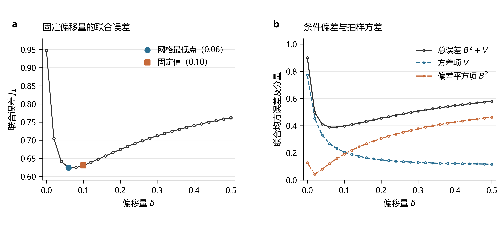
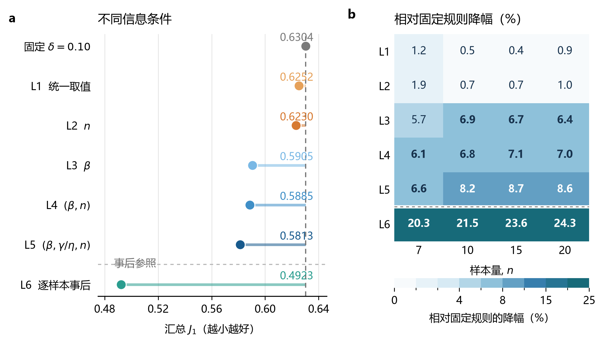
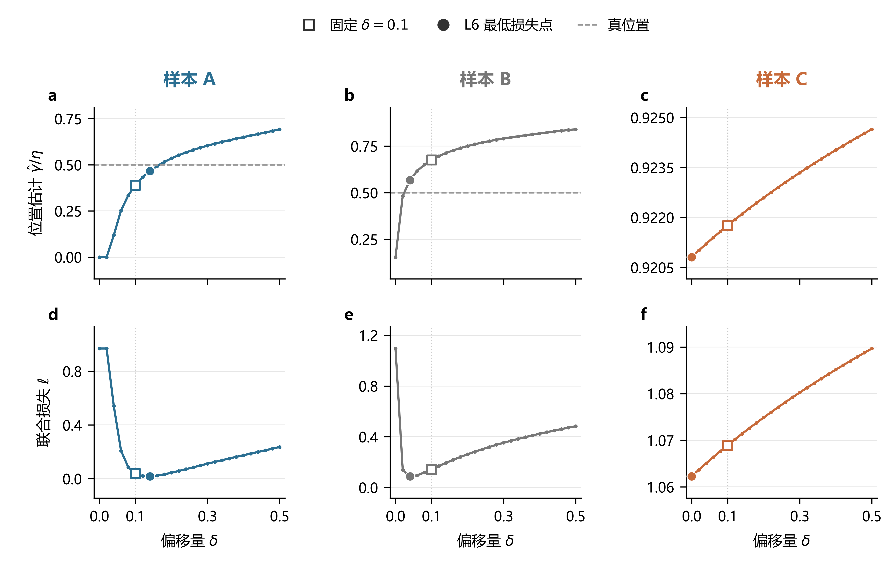
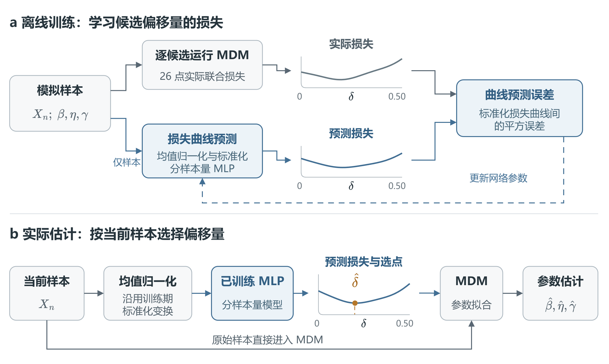
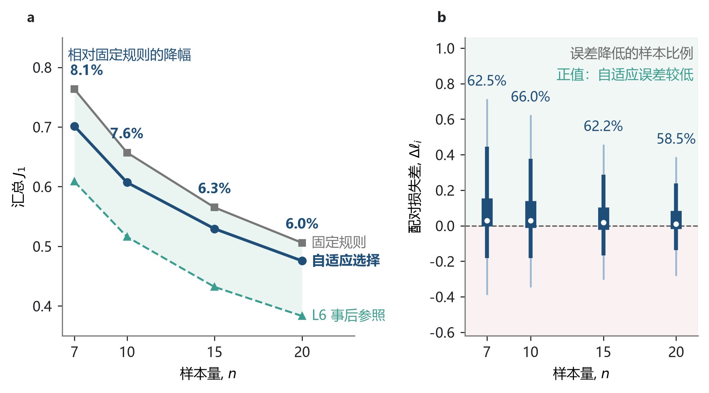

# 第一部分：MDM 方法中偏移量的自适应调整

> 第3—11页，约10分钟；另附备查页A1。以下为Markdown拟定页码，便于据此编辑PPT。页面保留证据，讲稿简要说明每一步怎样引出下一步。

## 第3页｜核心问题：经验偏移量怎样进一步选择？

**页面上写**

**目的：** 明确经验偏移量进一步选择的问题。

**结果：** 已有正偏移量改善小样本估计，但统一取值及调整依据仍需研究。

**结论：** 从统一常数出发，检验参数条件与样本信息能否支持进一步选择。

MDM 的前期研究引入正偏移量 $\delta=0.1$，改善了三参数 Weibull 小样本估计。

**本文研究：这个经验值在什么条件下合适？真参数未知时，能否根据当前样本进一步选择偏移量，提高参数估计精度？**

**讲稿**

这个工作之前讲过几次，这次主要把论文最后形成的逻辑和结果捋清楚。起点是 MDM 已有的经验偏移量 0.1。我们先问，换一个统一常数能不能更好；再看选择依据是否来自参数条件和样本差异，最后检验能不能做成实际可用的样本自适应方法。

## 第4页｜能否找到一个比 0.1 更好的统一偏移量？

**页面上写**

**目的：** 检验更换统一偏移量能带来多少收益。

**结果：** 当前扫描最低点为0.06，0.10的联合误差仅高约0.93%。

**结论：** 当前宽混合域中，更换统一常数的收益有限。

在当前完整参数设计中，扫描 $0,0.02,\ldots,0.50$ 共 26 个候选偏移量，比较汇总联合误差。

| 偏移量 | 联合误差 $J_1$ | 结果 |
|---|---:|---|
| 0 | 0.9481 | 无偏移基准 |
| 0.06 | 0.624518 | 当前完整设计的最低扫描点 |
| 0.10 | 0.630409 | 仅比最低值高约 0.93% |
| 0.50 | 0.7619 | 继续增大后误差回升 |

**结论：当前宽混合参数域中，0.1 已接近最佳统一值，单纯更换常数的收益有限。**

组合内偏差—方差分解进一步表明：正偏移量降低抽样方差，但过大时偏差代价增加，形成风险折中。

**讲稿**

首先做最直接的检查：把 26 个候选值都扫描一遍。当前参数域里的最低点是 0.06，但 0.1 的误差只比它高约 0.93%，所以更换统一常数带来的收益有限。右侧分解说明，偏移量在偏差与方差之间形成折中，并非越大越好。接下来就问：如果限定的参数空间发生变化，最佳统一偏移量是否也会改变？

## 第5页｜参数空间改变时，最佳统一偏移量是否也会改变？

**页面上写**

**目的：** 检验最佳统一偏移量是否依赖限定的参数空间。

**结果：** 固定宽度窗口平移后，最佳统一值由0.18移至0.04。

**结论：** 参数空间改变会影响风险折中；覆盖范围改变后需重新评价统一值。

**研究目的：检验最佳统一偏移量是否依赖所限定的参数空间。**

统一偏移量是在给定参数空间及其设计权重下，使汇总风险最低的取值。

**实验：** 保持形状参数窗口宽度不变，将窗口由 $[1.50,2.50]$ 平移至 $[4.00,5.00]$，比较各窗口的风险曲线及其最低点。

**结果：参数空间位置改变后，最佳统一偏移量也发生变化。** 本次平移实验中，其取值由0.18移至0.04。

**含义：** 不同子域的风险折中不同；面向较大参数空间时，统一值取决于各子域风险的汇总。扩大或移动覆盖范围可能改变这一折中，需要重新评价，不能直接沿用原空间的最优性结论。

**讲稿**

这里想验证的是，最佳统一偏移量是否会随着参数空间改变。它本来就是在一个限定空间里求平均风险最低的值，所以我们固定窗口宽度，只移动位置，看最低点是否变化。结果确实变了，0.18到0.04是这次实验的具体表现。实际应用可能覆盖更大的空间，而大空间的汇总风险由其中各部分共同决定。既然不同子域的风险折中不同，扩大或移动覆盖范围后，原来的统一值就需要重新检查。接下来进一步问：能不能根据这些参数条件分别选择？

## 第6页｜按参数条件选择，能改善多少？

**页面上写**

**目的：** 判断按参数条件选择能否进一步降低风险。

**结果：** 样本量规则改善1.17%，完整真参数条件规则改善7.79%。

**结论：** 参数条件提供更多选择空间，但尚未利用逐样本差异。

为不同信息条件构造选择规则，在训练折内选择组平均损失最低的偏移量，再用测试折评价。

| 规则 | 可用信息 | 相对固定0.10的 $J_1$ 降幅 |
|---|---|---:|
| L1 | 全局统一 | 0.83% |
| L2 | 样本量 $n$ | 1.17% |
| L3 | 真形状参数 $\beta$ | 6.33% |
| L4 | 真 $(\beta,n)$ | 6.65% |
| L5 | 真 $(\beta,\gamma/\eta,n)$ | 7.79% |
| L6（下一步的事后参照） | 当前样本的全部候选真实损失 | 21.91% |

**结果：只按样本量调整的收益较小，参数条件提供了更多选择空间。**

**讲稿**

先看前五行。统一选择和按样本量选择，收益都比较小；知道形状参数等条件以后，收益明显增加。所以，不同参数条件确实对应不同的选择规则。但 L5 已经知道完整参数条件，为什么最后一行的逐样本选择还好很多？这就引出了样本本身的差异。

## 第7页｜真参数相同，不同样本是否仍需要不同偏移量？

**页面上写**

**目的：** 检验同真参数下的样本是否需要不同偏移量。

**结果：** L5与L6改善分别为7.79%和21.91%；补充确认集选点一致率12.56%。

**结论：** 参数条件平均规则不能描述全部样本差异；L6仅为事后参照。

- L5：同一参数条件共用一个平均风险最低的偏移量。
- L6：对每个样本查看 26 个候选的实际损失，再选最低点。
- 信息条件比较中，相对固定值的联合误差降幅由 L5 的 **7.79%** 增至 L6 的 **21.91%**。
- 补充确认集上，L5 与 L6 的偏移量完全一致率仅 **12.56%**。

**结果：即使参数条件相同，逐样本的低损失选择仍有差异，参数条件平均规则不能描述全部样本变化。**

**讲稿**

L5 对同一真参数条件选一个统一值，L6 则看每个样本的实际损失。两者存在明显风险差，补充确认集上的选点一致率也只有约 12.6%。这说明，同一参数条件下仍存在样本差异。不过，L6 看到了实际应用中未知的真实损失，它只能说明事后选择空间，不能直接说明这些收益都能从可观测样本中学到。

## 第8页｜样本差异为什么会改变低风险偏移量？

**页面上写**

**目的：** 解释样本差异怎样影响低风险选点。

**结果：** 同真值样本的损失最低点不同；20个单元相关中位数为−0.765。

**结论：** 样本结构伴随搜索路径和低风险选点变化，支持按样本调整的动机。

对照同一参数组合下三个样本的 MDM 估计路径和候选损失，再在 20 个单元的 2,000 个确认样本上检查这种联系。

`样本间距与位置结构不同 → 梯度轨迹和搜索交点变化 → 候选估计及其损失变化 → 低风险偏移量不同`

- 三个同真值样本的低损失偏移量位于不同位置。
- 固定偏移量下的位置估计与事后选点，在 20 个单元中均负相关，单元内相关中位数为 **−0.765**。

**讲稿**

这里沿每一列看同一个样本，横向比较同真值的不同样本。抽样改变了样本的间距和位置结构，也改变了 MDM 的搜索轨迹；偏移量是在这条路径上调整选解位置，因此不同样本可能需要不同的选择。诊断结果支持这种联系。到这里，问题就从找一个最佳常数，推进到能不能根据当前样本作选择。

## 第9页｜只有观测样本时，怎样实现这种选择？

**页面上写**

**目的：** 在真参数与真实损失未知时实现偏移量选择。

**结果：** 建立“归一化排序样本→26点损失曲线→偏移量→MDM”的方法。

**结论：** 推理只用观测样本；效果由折外参数误差验证。

实际应用中，真参数和当前样本的真实候选损失都未知。可执行任务是：**根据当前样本，预测不同偏移量的损失，再作选择。**

`排序样本 ÷ 样本均值 → 预测26点损失曲线 → 选择预测损失最低的δ → MDM估计三个参数`

- 模拟训练阶段：用真参数计算候选损失，作为监督标签。
- 实际使用阶段：输入仅为寿命样本；每个样本量使用对应模型。
- 相邻候选可能有接近的损失，因此预测整条曲线，最终以参数误差评价效果。

**讲稿**

前面的分析给出了按样本选择的动机，但实际拿不到真参数和真实损失。因此，我们在模拟阶段学习样本到候选损失曲线的映射，应用时只输入归一化排序样本，选择预测损失最低的偏移量，再由 MDM 估计参数。网络承担的是偏移量选择，是否有效还要看实际参数误差。

## 第10页｜样本自适应选择是否真的降低了误差？

**页面上写**

**目的：** 验证可执行选择相对固定0.1的收益。

**结果：** 联合误差0.6304→0.5846，下降7.27%；125个单元改善、35个退化。

**结论：** 当前设计下总体参数精度改善；冻结方法后的独立确认仍待补充。

按位置尺度比水平留出，在同一批 48,000 组折外样本上，成对比较自适应 MDM 与固定 MDM-0.1。

- 联合误差：**0.6304 → 0.5846，下降7.27%**。
- 条件于当前选择器的95%配对重采样区间：**6.94%—7.64%**。
- 四个样本量均改善；三个参数的标准化 RMSE 均下降，失败率0%。
- 160个参数单元中，125个改善、35个退化。

**讲稿**

最终在位置尺度比水平留出的折外评价中，联合误差下降了 7.27%，四个样本量和三个参数的汇总 RMSE 都改善。这才是可观测样本能支持有效选择的直接证据。但仍有 35 个单元退化，而且输入表示筛选复用了这批评价数据，因此结论是选定方法在当前设计下的总体改善，冻结方法后的独立确认还需要补。

## 第11页｜最后得到什么答案？

**页面上写**

**目的：** 回答偏移量怎样选择以及能改善多少。

**结果：** 参数域与样本差异影响选点；样本预测使联合误差下降7.27%。

**结论：** 当前样本支持进一步选择，但不保证每个单元及寿命点均改善。

**MDM 偏移量的合理选择同时受到参数域与样本实现影响。在真参数未知时，可以根据当前样本预测候选损失，在当前评价设计下比固定经验值进一步降低联合参数估计误差。**

- 参数域差异解释了为什么不存在普适的统一最佳值。
- 同真值样本的差异提供了进一步选择的动机；样本预测与折外验证给出了可执行的收益证据。
- 当前主结果为联合参数误差下降 **7.27%**，不代表所有单元和评价指标均改善。

**讲稿**

所以，这篇论文最后回答的是：经验偏移量的选择受参数域和本次样本共同影响；仅用当前样本预测候选损失，可以进一步改善 MDM 的参数估计，当前得到的改善是 7.27%。这就把最开始的经验取值问题，落到了有实验依据、也能实际执行的选择方法上。

## 备查页A1｜参数精度收益是否传到寿命点？

**页面上写**

**目的：** 检查参数收益向寿命点的传递。

**结果：** 参数与寿命点排序不同；自适应MDM相对固定值的寿命点收益有限。

**结论：** 联合参数精度改善不能直接推广为每个寿命点都更准确。

| 同一48,000样本上的方案 | 联合参数误差 $J_1$ |
|---|---:|
| 样本自适应MDM | 0.5846 |
| 固定MDM-0.1 | 0.6304 |
| WMLE | 0.7288 |
| LSE | 0.8725 |

- 三个寿命点上，所比较的WMLE相对RMSE最低。
- 自适应MDM相对固定值：$x_{0.90}$ 略差，$x_{0.95}$、$x_{0.99}$ 略好。

**讲稿**

这里再补充一个结论范围：参数误差与寿命点误差会给出不同的方法排序。三个参数共同决定寿命点，因此总体参数精度改善，不能直接推成每个寿命点都更准确。

## 备查：证据口径

- [正文v1.12](../../../Study/01-study-MDM最小偏移量优化研究/manuscript/Study01论文初稿-v1.12.md)：统一值扫描、参数域平移、信息条件比较及自适应主结果。
- [附录v1.10](../../../Study/01-study-MDM最小偏移量优化研究/manuscript/Study01论文附录-v1.10.md)：F.1的16,000组确认样本支持12.56%一致率；F.2的2,000组确认样本支持路径诊断与−0.765相关中位数。两项不是同一批诊断数据。
- 完整设计的0.06最低扫描点是描述性结果；L1的0.83%来自训练折选值、测试折评价，二者口径不同。
- L2与L3的信息并非包含关系；不能将每两行的差解释为增加某个信息的净效应。
- L6利用真实候选损失，是事后参照。L5与L6的风险差不能全部归为可学习收益；格点完全一致率也不是方法效果的唯一指标。
- 信息条件比较按重复编号五折评价；主MLP按位置尺度比水平留出。相对误差不能不加区分地用于跨协议排名。
- 形状参数留出总体改善7.35%，最低形状水平略有退化；尚不能概括为任意连续域泛化。
