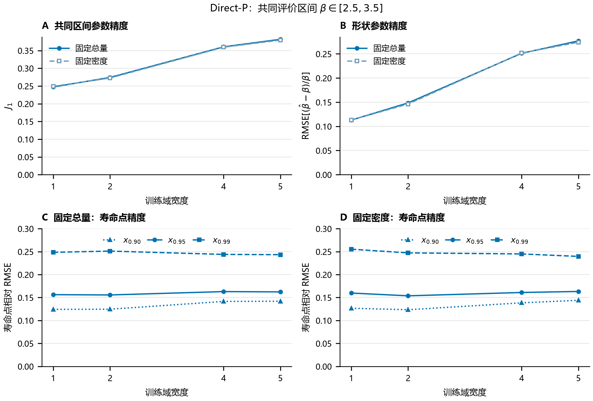
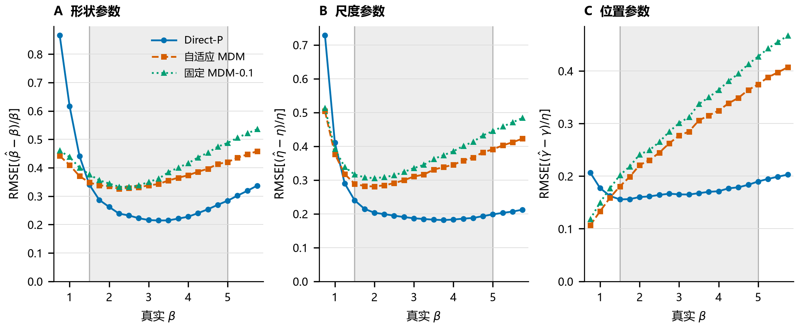

# 第二部分：直接神经估计的条件优势与训练域依赖

> 第12—20页，约10分钟。承接Study01的问题，但使用Research04自己的共享测试协议。

## 第12页｜用共享测试样本比较五种完整估计方案

**页面上写**

- Direct-P：从归一化排序样本直接输出参数。
- 自适应MDM：网络选择偏移量，再求解参数。
- 固定MDM-0.1、WMLE、LSE：传统参照。
- 训练 $\beta\in[1.5,5]$；测试扩展至 $[0.75,5.75]$，共126,000个样本。

**讲稿**

本部分分别检查域内未训练点和双侧域外点，再改变训练域宽度。基础训练资源共48,000个样本，包含内部验证；每个样本量单独训练，模型种子固定为42。两条神经路线虽然使用相同隐藏层和归一化输入形式，监督目标、验证选点和内部划分实现仍有差异，因此这里比较完整方案，不将风险差直接解释成MDM求解结构的净效应。本部分也不是复用Study01的折外模型来增加测试点。

## 第13页｜Direct-P在域内未训练形状点上仍保持优势

**页面上写**

| 方案 | 已见网格 $J_1$ | 域内未训练点 $J_1$ |
|---|---:|---:|
| Direct-P | 0.3658 | 0.3532 |
| 自适应MDM | 0.5696 | 0.5648 |
| 固定MDM-0.1 | 0.6285 | 0.6202 |
| WMLE | 0.7731 | 0.7721 |
| LSE | 0.8793 | 0.8843 |

Direct-P相对自适应MDM分别降低35.8%和37.5%。

**讲稿**

已见网格指参数水平在训练中出现过，测试观测仍为独立新样本。域内未训练点是在原形状网格之间增加的新水平，结果说明优势没有局限在原网格点上。传统参照加入后域内排序不变。不过，新点只沿形状轴增加，不能由此推到任意三参数连续空间。$J_1$包含统一失败惩罚，成功子集误差另行报告。

## 第14页｜外推具有方向性：低侧反转，高侧仍有优势

**页面上写**

- $\beta=1.25$：Direct-P相对自适应MDM的 $J_1$ 高7.6%。
- $\beta=0.75$：高70.5%。
- $\beta=5.75$：仍低约40.0%。

**讲稿**

图A显示逐点风险，图B为Direct-P减去对应MDM的配对差，负值表示直接估计更好。灰色部分是训练域；A中实心是训练形状点，空心是新增点。B的误差线是条件于固定模型的95%配对bootstrap区间，两个标记略作水平错位以便阅读。左右两侧的风险趋势不同，因此“远域外平均表现”不足以描述外推边界，更不能笼统说域外全部反转。

## 第15页｜扩大训练覆盖，在共同区间付出局部参数精度代价

**页面上写**

- 四个窗口中心都为3：$[2.5,3.5]$、$[2,4]$、$[1,5]$、$[0.5,5.5]$。
- 始终在共同真实区间 $[2.5,3.5]$ 的30,000个样本上评价。
- 最宽相对最窄：固定总量 $J_1$ 增加54.3%；固定单元密度增加52.4%。

**讲稿**

先看上排。两种预算下，训练窗口扩宽都伴随共同区间的参数误差上升。固定密度时，每个样本量的训练资源从4,500增至16,500，约为原来的3.67倍，仍存在局部代价。因此，单纯将现象解释为固定总量下的样本摊薄并不充分。图中只有冻结模型的点估计，没有跨重新训练的区间。旧的嵌套域实验同时改变中心，保留作补充，不与这里合并。

## 第16页｜训练域改变条件预测，但全部差距的成因尚未分离

**页面上写**

$$
a_L^*(z)=\arg\min_a\operatorname E_{\pi_{\mathrm{train}}}[L(a,\theta)\mid z].
$$

- 相似小样本可与多组参数相容。
- 训练分布改变这些参数的条件权重。
- 当前结果还混合模型逼近、优化和选点影响。

**讲稿**

这个表达说明，在给定训练分布和损失下，理想点决策也有其条件性。普通平方损失对应条件均值；这里的相对平方损失含真参数相关权重，对应加权折中。更大的网络可能降低逼近误差，更多数据也可能改善训练，但当前没有通过容量对照测定各部分贡献。因此可以说训练分布依赖是有依据的解释，不能说已经证明观察到的全部代价都不可消除，或者更大网络一定没有作用。

## 第17页｜参数收益与寿命点收益不按同一比例变化

**页面上写**

| 域内位置 | 联合参数误差降幅 | $x_{0.95}$ 相对RMSE降幅 |
|---|---:|---:|
| 已见网格 | 35.8% | 14.9% |
| 域内未训练点 | 37.5% | 16.5% |

- 同中心扩宽时，三个可靠度寿命点的变化方向也不一致。
- 参数恢复与寿命点精度需要分别评价。

**讲稿**

域内三个参数的边际误差得到改善，但这些收益传到寿命点后明显缩小。再回看上一张宽度图的下排，固定总量下扩宽窗口，$x_{0.90}$和$x_{0.95}$误差升高，$x_{0.99}$反而略降。这表明联合参数目标与各寿命量之间不是固定换算关系。位置参数的误差用真实尺度参数标准化，图中三个纵轴均明确表示RMSE。

## 第18页｜参数误差方向提供补偿线索，解析导数只作局部诊断

**页面上写**

- 大形状区域，自适应MDM常见形状、尺度偏低而位置偏高。
- 参数误差可以在寿命函数中部分抵消。
- 对数伪尺度的局部敏感度随 $1/\beta^2$ 衰减。

**讲稿**

图A与B是模拟统计，图C是解析诊断，两者证据性质不同。大形状区的误差方向与补偿解释一致，但混合相关还包含参数单元之间的差异。导数描述的是特定坐标下的局部敏感度，不是完整估计器曲率，也不能单独确定偏差方向。与旧汇报相比，这里保留有用解释，同时明确哪些还只是线索。

## 第19页｜尺度等变已检验，训练域风险仍需单独判断

**页面上写**

- 同比例尺度变化：$\eta=1$至$10^6$，成对审计 $J_1=0.4705367$ 不变。
- 已见网格中，$n=7\to20$，Direct-P相对优势由41.3%收窄至28.3%。
- 点估计结果尚未验证区间覆盖、真实数据或自动切换规则。

**讲稿**

均值归一化与尺度还原使本方案具有比例缩放等变性，完整成对审计支持这一实现性质。它解决计量单位和同比例变化，却不会消除形状、位置尺度比分布或数据机制变化。样本量增加时两条路线都改善，相对差距收窄；各样本量使用独立模型，因此也不能直接推断更大样本量下的极限。可观测风险诊断目前只作探索。

## 第20页｜确定使用直接网络之后，还要确定训练什么

**页面上写**

1. 当前域内点估计中，Direct-P更准确。
2. 外推方向与训练覆盖影响其风险。
3. 参数精度收益并不等比例传递到寿命点。

**转入第三部分**

> 如果最终使用量是某个可靠度寿命点，直接用这个寿命点训练，会得到什么收益，又会付出什么代价？

**讲稿**

Research04给出的是具体方案的条件性能与解释线索。下一部分把网络结构和数据协议在研究内部配对，集中研究监督目标。Study02的原始量纲输入、参数解码和训练设计与这里不同，因而它的P不是这里Direct-P结果的直接续表。

## 备查：本部分证据

- [Research04正文v0.2](../../../Research/04-直接NN参数估计/03-稿件-直接神经估计与结构保留路线比较-v0.2.md)。
- [附录v0.2](../../../Research/04-直接NN参数估计/03-附录-直接神经估计与结构保留路线比较-v0.2.md)：同宽平移、旧嵌套域、逐点外推及尺度审计。
- 全面板失败率：Direct-P 0.0548%，自适应MDM 0.0286%，固定MDM 0.0643%，WMLE 9.6151%，LSE 0%。WMLE远域外失败率20.7042%，不能仅按其成功子集寿命误差排名。
- 最宽同中心窗口没有左侧域外测试点，不能宣称已确认该窗口的双侧外推能力。
