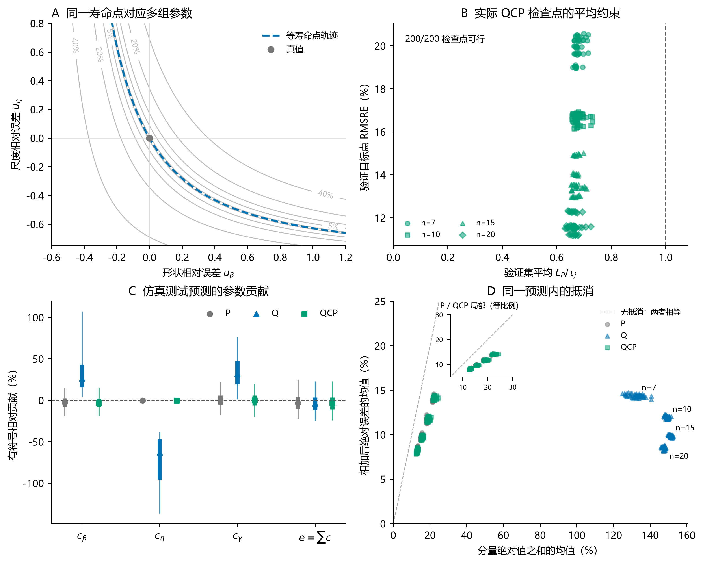
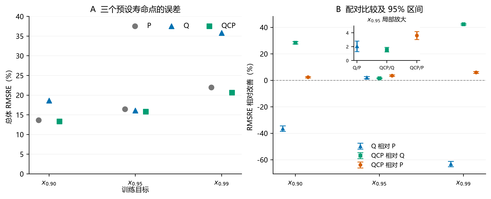
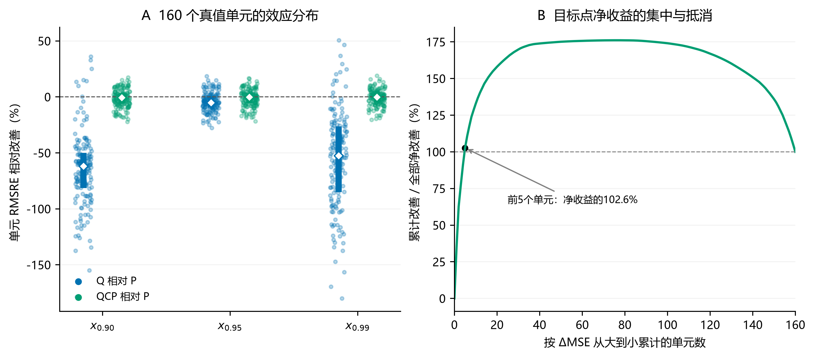

# 第三部分：直接估计中的参数目标与分位点目标

> 第21—31页，约12分钟。以 $x_{0.95}$ 为具体实例，论证主线为任务对齐、参数补偿、修复方式及其取舍。

## 第21页｜让最终使用的寿命量进入训练目标

**页面上写**

**目的：** 比较以参数准确或目标分位点准确为训练目标的差别。

**结果：** P监督三参数误差，Q监督同一组三参数产生的目标寿命点误差。

**结论：** 两种监督服务不同目标，接下来配对检验收益与代价。

$$
x_R=\gamma+\eta[-\ln R]^{1/\beta},\qquad P(T>x_R)=R.
$$

$$
L_P=\operatorname{mean}\left[
\left(\frac{\hat\beta-\beta}{\beta}\right)^2+
\left(\frac{\hat\eta-\eta}{\eta}\right)^2+
\left(\frac{\hat\gamma-\gamma}{\eta}\right)^2\right],
\quad
L_Q=\operatorname{mean}\left(\frac{\hat x_{0.95}-x_{0.95}}{x_{0.95}}\right)^2.
$$

- P评价三个参数的归一化误差。
- Q评价参数共同产生的目标寿命点误差。

**讲稿**

95%可靠度寿命点对应失效分布的5%分位点，不是95%置信下限。P是透明的参数恢复目标，三个标准化误差等系数相加；Q仍输出三个参数，但通过寿命公式回传误差。我们研究的是，最终任务改变以后，参数的作用和相互补偿怎样改变，以及是否需要额外限制参数偏离。

## 第22页｜共同数据与网络，比较完整训练及验证流程

**页面上写**

**目的：** 建立可比较的数据、模型与训练流程。

**结果：** 共享48,000组样本及配对初始化，每条路线含200个模型单元。

**结论：** 主比较涵盖训练和验证流程，损失作用需结合共同验证对照判断。

- 160个真值单元、48,000组模拟样本；固定 $\eta=1000$。
- 每条路线：4个样本量×5折×10种子＝200个模型单元。
- 同一配对单元共享数据划分、标准化和初始化。
- P按验证参数损失选点，Q按验证寿命点损失选点。

**讲稿**

这里的输入保留原始量纲，标准化只用当前训练折；不同于Research04的逐样本均值归一化。每条路线有480,000条预测，是48,000组样本在10个训练种子下的重复预测，不能说成48万个独立测试样本。主比较统一最多600轮、早停耐心60轮，但实际训练时间不同。原P/Q还同时改变了验证选点规则，稍后用补充对照把这一因素进一步拆开。

## 第23页｜直接对齐目标点带来小幅总体收益

**页面上写**

**目的：** 检验直接监督目标点是否降低该点误差。

**结果：** 目标点RMSRE由16.43%降至16.09%，相对改善2.07%。

**结论：** 目标点总体收益存在，仍需检查参数和其他寿命点的代价。

| 路线 | $x_{0.95}$ RMSRE |
|---|---:|
| P：参数导向 | 16.43% |
| Q：目标点导向 | 16.09% |

- Q相对改善2.07%。
- 95%经验bootstrap区间：1.28%—2.81%。
- 这是目标点的总体平方风险改善。

**讲稿**

收益存在，但幅度温和。P本身已经能较好地估计插件寿命点，所以任务对齐带来的额外收益并不大。区间按照模型单元配对并保留种子和折次结构；由于训练集在折间重叠、种子数有限，属于当前设计下的经验近似。这里先确认目标点收益，下一页检查同一组三参数在其他使用量上是否也可靠。

## 第24页｜单点监督允许较大参数误差相互抵消

**页面上写**

**目的：** 解释单点误差较低时为何仍可能出现较大参数偏离。

**结果：** Q平均参数损失约71.7，补偿指数0.915；P分别约0.0539、0.332。

**结论：** 单点监督允许参数误差抵消，低目标误差不保证参数准确。

- 一个寿命点只提供一个标量监督。
- 真值处局部曲率为 $H_Q(0)=2s_0s_0^{\mathsf T}$，秩为1。
- 实际Q预测出现较大参数偏离，同时具有较强的目标误差抵消。

**讲稿**

重点看子图 (a)、(c)、(d)。等寿命点曲面上，多组参数可以给出相同目标值；逐预测贡献分解则显示，这种可能性确实出现在Q的预测中。P的平均参数损失约0.0539，Q达到71.7；补偿指数从0.332升至0.915。局部秩一描述的是单点监督在输出误差空间留下的自由度，不能说成Weibull分布本身不可识别。子图 (b) 的验证可行性将在介绍QCP时解释。

## 第25页｜目标点略好，另外两个寿命点明显变差

**页面上写**

**目的：** 检验目标点的参数补偿是否影响其他寿命点。

**结果：** Q在x0.90和x0.99的误差增加36.41%、63.11%。

**结论：** 若参数用于多个寿命决策，需要兼顾目标点之外的精度。

| 寿命点 | P RMSRE | Q RMSRE | Q相对P |
|---|---:|---:|---:|
| $x_{0.90}$ | 13.66% | 18.63% | 误差增加36.41% |
| $x_{0.95}$ | 16.43% | 16.09% | 误差降低2.07% |
| $x_{0.99}$ | 21.96% | 35.82% | 误差增加63.11% |

**讲稿**

一个目标点相近，并不保证对应的分布形状相近。参数沿补偿方向移动以后，其他可靠度下的寿命点明显改变。这两个非目标点来自既有参数预测的事后机制分析，没有参与原Q训练。如果预测只用于一个目标值，参数补偿可以与低目标风险并存；但如果参数还要用于分布解释或其他寿命决策，就需要额外约束。

## 第26页｜QCP在参数可接受的范围内优化目标点

**页面上写**

**目的：** 在优化目标点时限制参数偏离。

**结果：** 构建QCP；200个选定模型满足验证集平均参数损失约束。

**结论：** 约束作用于平均验证损失，并非逐测试样本保证。

$$
\min_\theta L_Q(\theta)
\quad\text{s.t.}\quad L_P(\theta)\leq\tau_j,
\qquad \tau_j=1.5L_{P,\mathrm{ref},j}.
$$

- 阈值来自匹配的早期P参考模型。
- 训练中加入参数约束惩罚。
- 验证先检查平均参数损失，再在可行轮次中选目标误差最低者。

**讲稿**

这里的j是样本量、折次和种子组成的模型单元，不是每个未知真参数组合。阈值和约束设置在对应阶段通过验证确定。200个选定QCP模型均满足验证集平均参数损失约束；这并不保证每一个测试样本的参数误差都低于阈值。真参数用于模拟监督与验证，训练完成后推理只需要寿命样本。真实应用中的主要问题是训练域与数据机制是否匹配，不能说每次推理都需要真参数。

## 第27页｜参数约束修复跨点退化，并保留目标收益

**页面上写**

**目的：** 检验参数约束能否修复跨点退化并保留收益。

**结果：** QCP三个寿命点RMSRE为13.34%、15.84%、20.65%。

**结论：** 当前三个寿命点的退化得到修复，不等于整条分布均已验证。

| 寿命点 | P | Q | QCP |
|---|---:|---:|---:|
| $x_{0.90}$ | 13.66% | 18.63% | 13.34% |
| $x_{0.95}$ | 16.43% | 16.09% | 15.84% |
| $x_{0.99}$ | 21.96% | 35.82% | 20.65% |

上表均为RMSRE；QCP平均参数损失回到约0.0552。

**讲稿**

QCP相对Q在目标点再改善1.56%，在另外两个点改善28.42%和42.36%，主要价值体现在跨点退化的修复。补偿指数回到0.345，按P为参照计算，Q的超额补偿减少97.8%；这个比例属于机制指标，不是寿命精度提高97.8%。当前直接验证了三个寿命点，不能把结果说成已经恢复整条分布曲线或完成覆盖率验证。

## 第28页｜统一验证准则后，Q的目标优势仍保留一部分

**页面上写**

**目的：** 区分训练目标和验证选点对收益的贡献。

**结果：** 共同按Q验证后，Q训练仍改善1.322%；原生Q可行检查点为0/200。

**结论：** 训练目标仍有作用；仅靠当前原生轨迹的可行轮次筛选不足以修复。

| 训练目标 | 验证选点目标 | $x_{0.95}$ RMSRE |
|---|---|---:|
| P | P | 16.432% |
| P | Q | 16.3077% |
| Q | Q | 16.092% |

- 共同验证下，Q相对P训练仍改善1.322%。
- 95%经验区间：0.631%—1.957%。
- 原生Q早停轨迹中，有可行参数检查点的模型为0/200。

**讲稿**

新增对照说明原来的差异同时包含训练目标与验证选点作用。只改变P的选点准则已有0.757%的改善；统一按Q验证以后，Q训练仍保留1.322%的收益。另一方面，在重跑的原生Q轨迹中，仅靠筛选可行轮次没有得到模型。这个结论只针对当前阈值和原生早停轨迹，不能推广到所有更长训练或所有阈值。补充实验复用原有数据，不是独立新样本确认。

## 第29页｜简单加权和多点监督也是必要的修复参照

**页面上写**

**目的：** 检验修复是否必须采用QCP。

**结果：** QP与QCP目标误差为15.8505%、15.8406%；多点监督也缓解退化。

**结论：** 简单加权也是有效参照，当前不能宣称QCP精度更优。

| 方案 | $x_{0.95}$ RMSRE | 回答的问题 |
|---|---:|---|
| 固定加权QP | 15.8505% | 参数正则化是否足以修复 |
| 参数约束QCP | 15.8406% | 显式可行性控制的效果 |
| 三点等权监督 | 16.0977% | 直接增加寿命点监督能否缓解代价 |

- QCP相对QP改善0.0623%，95%区间为−0.0499%—0.1679%。
- 当前QP与QCP精度接近，不能宣称QCP更优。

**讲稿**

QP采用 $L_Q+L_P$，权重1.0来自早期验证筛选，按验证 $L_Q$ 选点，取得与QCP接近的结果。QCP的特点是能明确检查验证可行性，但还需要参考模型与约束求解成本。三点监督也显著缓解两个非目标点的退化，说明修复并非只有一条路线；不过本次等权设置的三个寿命点误差及参数恢复都弱于QP、QCP。因此，新增对照支持“参数恢复要求有作用”，而不支持“必须采用更复杂约束算法”。

## 第30页｜总体风险降低，主要由少数高误差单元贡献

**页面上写**

**目的：** 检查总体收益由哪些参数单元贡献。

**结果：** QCP前5个单元贡献净改善102.6%；典型误差中位数略高于P。

**结论：** 少数困难单元主导总体改善，平均收益不等于普遍获益。

- 目标点上：Q优于P为42/160个单元，QCP优于P为76/160。
- QCP相对P，前5个单元贡献全部净改善的102.6%。
- 典型绝对相对误差中位数：P 7.69%，QCP 7.86%。

**讲稿**

RMSRE对较大误差更敏感，少数困难单元的大幅改善可以决定总体排序。102.6%超过100%，是因为其余单元合计抵消了一部分收益，不是统计错误。P在典型绝对误差上仍更好，QCP也有更高训练成本。组会结论应当是目标、参数解释和资源之间的取舍，而不是挑一个汇总指标宣布普遍赢家。

## 第31页｜监督设计应同时考虑任务量与参数用途

**页面上写**

**目的：** 总结参数目标与分位点目标的取舍。

**结果：** 目标对齐有收益，单点监督有代价，参数正则化等方法可修复。

**结论：** 应根据目标量、参数用途和成本选择监督方式。

1. 目标对齐能降低目标点总体误差，共同验证下仍有收益。
2. 单点监督允许参数补偿，导致其他寿命点退化。
3. 参数正则化与多点监督都能修复部分代价；QP与QCP精度接近。
4. 收益集中性、典型误差和计算成本决定实际取舍。

**讲稿**

第三部分现在的认识比原来更完整：不仅知道Q有收益、QCP能修复，还知道验证选点贡献了一部分差异，以及更简单的QP也能取得接近结果。这些结论限于固定尺度、同一参数网格内新样本和当前训练协议。变化尺度、独立新数据、完整分布或置信下限的评价，需要与各自目标相符的新证据。

## 备查：补充实验及成本

- [Study02正文v2.7.0](../../../Study/02-study-NN参数估计与分位点目标研究/manuscript/Study02论文初稿-v2.7.0.md)：§3.1—3.5、§4.4—4.5。
- [附录v2.7.0](../../../Study/02-study-NN参数估计与分位点目标研究/manuscript/Study02论文附录-v2.7.0.md)：B.9与F。
- 补充600条训练轨迹：参数训练/Q验证、Q原生轨迹复现、三点监督，各200条。Q复现不是新的独立证据。
- 三点等权监督的 $x_{0.90},x_{0.95},x_{0.99}$ RMSRE为14.0130%、16.0977%、20.8491%，平均参数损失0.301916；QP与QCP分别为0.055208、0.055218。
- 记录中的单次CPU训练中位耗时：P 41.4 s、Q 29.6 s、QCP 87.2 s；QCP另有前置参考与筛选成本。耗时限定于该运行环境。
- 固定尺度标签也使P可以学习尺度常量；Research04的尺度等变验证不能移作本研究的尺度泛化证据。
