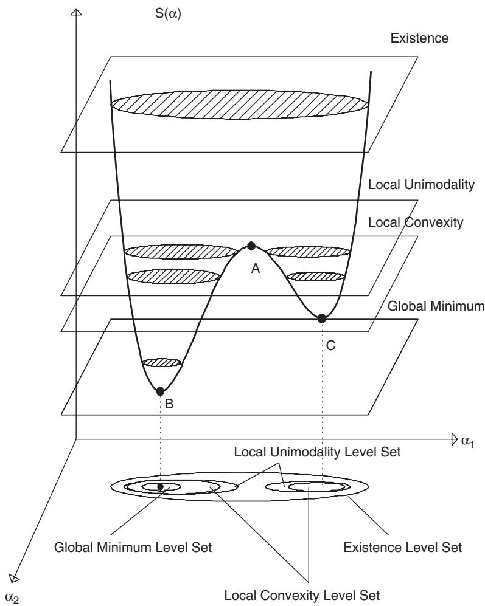
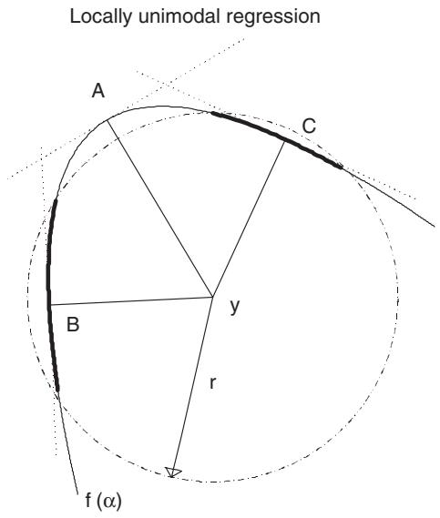
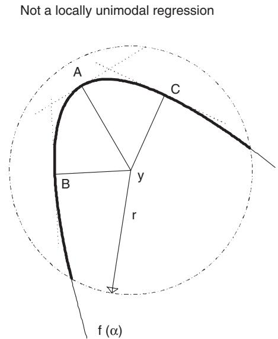
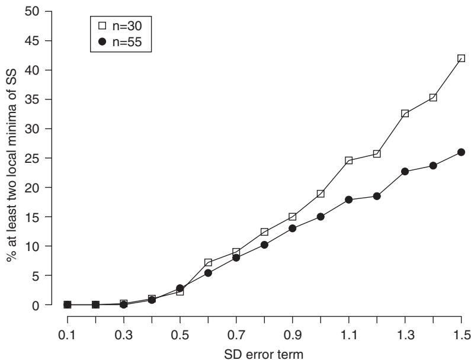
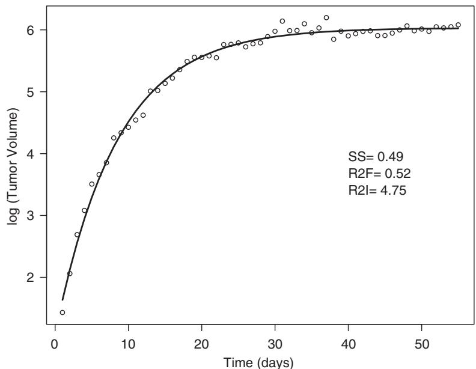

# Criteria for global minimum of sum of squares in nonlinear regression

Eugene Demidenko

Section of Biostatistics and Epidemiology, Dartmouth Medical School, Lebanon, NH 03756, USA

Received 27 February 2006; received in revised form 12 June 2006; accepted 18 June 2006

Available online 28 August 2006

# Abstract

Demidenko [2000. Is this the least squares estimate? Biometrika 87, 437–452] has established the relationship between the curvature of nonlinear regression and the local convexity of a sum of squares: the Hessian matrix is positive definite if the sum of squares is less than the minimum squared radius of the full curvature. In this paper, we continue developing the criteria for the global minimum of the sum of squares in nonlinear regression. In particular, the concept of the local unimodality is introduced; a function is called locally unimodal on a level set if it has a unique local minimum in each component of that level set. We show that the level of the local unimodality of the sum of squares is equal to the minimum squared radius of the intrinsic curvature of the nonlinear regression function. A new class of unidirected nonlinear regression models is introduced with an interpretation in terms of differential geometry. The criteria are illustrated by several popular nonlinear regression models.

$©$ 2006 Elsevier B.V. All rights reserved.

Keywords: Convexity; Curvature; Global minimization; Nonlinear regression; Uniqueness; Unimodality

# 1. Introduction

The concept of curvature in statistics, particularly in nonlinear regression, is well developed. Beal (1960) was the first who applied the curvature notion to improve approximate confidence regions in nonlinear regression. His idea was further developed in the work of Bates and Watts (1980, 1981, 1988), Wei (1994), Kang and Rawlings (1998), and Haines et al. (2004). Guay (1995) generalized the curvature approach to multiresponse nonlinear regression. The importance of reparametrization to reduce curvature and improve confidence intervals in nonlinear regression has been emphasized by Hougaard (1982) and Kass (1984). Hougaard (1985) used regression curvature to derive an approximate distribution of the least-squares estimator. Several authors used curvature to find optimal design for nonlinear regression (Hamilton and Watts, 1985). The general statistical aspects of curvature are discussed in books by Amari (1985) and Kass and Vos (1997).

The topic of this paper is the construction of global criteria for minimization of sum of squares (SS) in nonlinear regression. It is well known that popular minimization algorithms such as Gauss–Newton and Levenberg–Marquardt find a local minimum (Bard, 1973). Does the final iteration of the SS minimization yield the least-squares estimate? This is an easy to ask and difficult to answer question. In fact, as was shown by Demidenko (2000), under mild assumptions for any nonlinear regression the probability that the SS has at least two local minima is nonzero.

In earlier work, Demidenko (1989) and Chavent (1991a,b,c) formulated the global criteria in geometric terms: if the SS at convergence is small, then the minimum found is global. How small is small enough, what is the threshold? In our previous paper (Demidenko, 2000), the concept of local convexity, where the Hessian matrix of the SS is positive definite, was introduced. In this paper, we develop more precise criteria to verify whether the local minimum is the global one. In particular, a link to regression curvature is established: basically, the threshold is equal to the reciprocal of squared maximal curvature.

Now we introduce the notation and basic concepts. Let $y _ { i }$ be the ith observation and $f \left( \mathbf { x } _ { i } ; \pmb { \alpha } \right)$ the corresponding regression function, where $\mathbf { x } _ { i }$ is a fixed vector and $\pmb { \alpha } = ( \alpha _ { 1 } , \alpha _ { 2 } , \ldots , \alpha _ { m } ) \in \pmb { \Theta } \subset \ l _ { R } m$ is an unknown vector parameter (we use boldface to denote vectors and matrices). We assume that $f$ is a twice continuously differentiable function and that $\mathbf { \Theta } _ { \mathbf { \Theta } } \Theta$ is an open $m$ -dimensional convex subset. Since the $\left\{ \mathbf { x } _ { i } \right\}$ are nonrandom vectors, we can simplify the notation by letting $f _ { i } \left( { \pmb { \alpha } } \right) = f \left( \mathbf { x } _ { i } ; \pmb { \alpha } \right)$ . Then the nonlinear regression model takes the form

$$
y _ {i} = f _ {i} (\boldsymbol {\alpha}) + \varepsilon_ {i}, \quad i = 1, \dots , n, \tag {1}
$$

where it is assumed that $E \left( \varepsilon _ { i } \right) = 0$ ; $\varepsilon _ { 1 } , \ldots , \varepsilon _ { n }$ are independent and identically distributed with a positive density function $( n \geqslant m )$ . The set of points {f1(), . . . , $f _ { n } ( { \pmb { \alpha } } ) : { \pmb { \alpha } } \in { \pmb { \Theta } } \}$ in $R ^ { n }$ is called the expectation (or regression) surface (Bates and Watts, 1988; Seber and Wild, 1989). The object of our study is the SS

$$
S (\boldsymbol {\alpha}) = \sum_ {i = 1} ^ {n} \left(y _ {i} - f _ {i} (\boldsymbol {\alpha})\right) ^ {2}, \quad \boldsymbol {\alpha} \in \boldsymbol {\Theta}. \tag {2}
$$

We want to find the global minimum of $S ( { \pmb \alpha } )$ on $\Theta \subset R ^ { m }$ . The value of $\pmb { x } = \widehat { \pmb { \alpha } }$ that minimizes S is called the least-squares estimate. In optimization literature, $\mathbf { \Theta } _ { \Theta }$ -is called the minimization domain and $\widehat { \pmb { \alpha } }$ is called a minimizer (Chong and Zak, ˙ -1996). It is assumed that the nonlinear regression is regular (Gallant, 1987; Pazman, 1993). That is, the derivative matrix has full rank: rank $\mathbf { G } ( { \pmb { \alpha } } ) = m$ for all ${ \pmb { \mathscr { x } } } \in \Theta$ , where $\mathbf { G } ( \pmb { \alpha } )$ is the $n \times m$ matrix of first derivatives, $\left\{ \phantom { } \hat { \mathrm { o f } } / \phantom { } \hat { \mathrm { o } } \alpha _ { 1 } , \dots , \hat { \mathrm { o f } } / \phantom { } \hat { \mathrm { o } } \alpha _ { m } \right\}$ . Also, it is assumed that nonlinear regression is identifiable: namely, $f \left( \pmb { \alpha } _ { 1 } \right) = f \left( \pmb { \alpha } _ { 2 } \right)$ implies ${ \pmb x } _ { 1 } = { \pmb x } _ { 2 }$ .

The global criteria are formulated in terms of the level set defined as $L \left( S _ { * } \right) = \left\{ \pmb { \alpha } \in \pmb { \Theta } : S ( \pmb { \alpha } ) < S _ { * } \right\}$ . A typical multimodal SS is shown in Fig. 1. The global minimum is $B$ , and $C$ is a local minimum; $A$ is a stable/stationary point, where the gradient vanishes. In Demidenko (2000), we introduced the local convexity level set as the level set where $S ( { \pmb \alpha } )$ is locally convex. That is, where the Hessian matrix is positive definite. In this paper, we introduce the concept of local unimodality and relate it to the radius of intrinsic curvature. This concept becomes a milestone in our global criteria.

The structure of the paper is as follows. In the next section, the concept of local unimodality is introduced and the main result is formulated: the local unimodality level of the SS is equal to the minimum squared radius of the intrinsic curvature. In Section 3, we provide a geometric interpretation. Two new classes of nonlinear regressions are introduced in Section 4. Several examples illustrate the computation of local unimodality and convexity in Section 5.

# 2. Local unimodality of SS

In this section we give the definition of the local unimodality and formulate global criteria for the SS (2).

It is instructive to start the discussion with an arbitrary twice-differentiable function $F ( \mathbf { u } )$ , $\mathbf { u } \in R ^ { m }$ bounded from below. Let $F _ { * }$ be any number. Clearly, the level set, $L \left( F _ { * } \right) = \left\{ { \mathbf { u } } \in R ^ { m } : F ( { \mathbf { u } } ) < F _ { * } \right\}$ may be not convex or even not connected. However, as follows from general topology, L (F∗) can be represented as a union of its disjoint open components (Kelley, 1975). Each component of a level set may be viewed as a maximal connected subset. A set is connected if and only if it contains only one component (Ortega and Rheinboldt, 1970). The next result relates the presence of several local minima to disconnection of the level set.

Proposition 1 (Ortega and Rheinboldt, 1970). Let $F ( \mathbf { u } )$ be a continuous function on a connected set $Q \subset R ^ { m }$ . If this function has at least two local minima, there is $F _ { * }$ such that the according level set is disconnected. Vice versa, if there exists $F _ { * }$ such that the level set is bounded and disconnected, then $F ( \mathbf { u } )$ has at least two local minima on $Q$ .

Now we are ready to introduce the concept of local unimodality—the reader is referred to Fig. 2 for a geometrical illustration, where $F$ is the SS $( m = 1 )$ ).

  
Fig. 1. Four level sets of a sum of squares. The existence level set is bounded if there exists a parameter value with the sum of squares less than the existence level, $\overline { { S } } _ { \mathrm { E } }$ . The local unimodality level set consists of two components that correspond to two local minima. However, there is only one local minimum in each component. The Hessian matrix of the sum of squares is positive definite on the local convexity level set. Finally, the global minimum level set is convex. If $\alpha _ { * }$ is a local minimizer with the sum of squares less than the global minimum level, then $\alpha _ { * }$ is the least-squares estimate.

Definition 1. We say that $F ( \mathbf { u } )$ is locally unimodal on the level set L (F∗) if each component contains no more than one local minimum. The value $F _ { * }$ is called a local unimodality level.

Notice that there may be a continuum of local unimodality levels; their supremum is called the upper local unimodality level. The relationship between the local unimodality and squared radius of intrinsic curvature of regression surface is established below (see Definition 3 and Theorem 2).

Clearly, if $F ( \mathbf { u } )$ is a strictly locally convex function on L ( $F _ { * } )$ , then $F ( \mathbf { u } )$ is locally unimodal. Before formulating a general criterion for the local unimodality, we generalize the concept of the existence level (Nakamura, 1984; Demidenko, 1989) to the case where the minimization domain does not necessarily coincide with the entire space $R ^ { n }$ .

Definition 2. Let $F ( \mathbf { u } )$ , $\mathbf { u } \in { \cal { Q } }$ be a continuous function on a convex set $Q \subset { \cal R } ^ { m }$ . Let $\widehat { \mathrm { d } } Q$ denote the boundary of $Q$ The existence level of $F$ on $Q$ is defined as

$$
\bar {F} _ {\mathrm {E}} = \inf  _ {\mathbf {u} _ {*} \in \partial Q} \lim  _ {\mathbf {u} _ {k} \rightarrow \mathbf {u} _ {*}} F (\mathbf {u} _ {k}). \tag {3}
$$

  
Fig. 2. Geometrical illustration of local unimodality: for a locally unimodal regression (left plot) points $B$ and $C$ are the points of local minima and A is the point of maximum. The level set $\left\{ \alpha \in R ^ { 1 } : \| \mathbf { y } - f ( \alpha ) \| ^ { 2 } < r ^ { 2 } \right\}$ is composed of two intervals (bold arcs). There is one minimum on each interval. Thus, $r ^ { 2 }$ is a local unimodality level. The regression at right is not locally unimodal because there are two minima with the sum of squares less than $r ^ { 2 }$ .

In other words, the existence level is the minimal limit of $F$ values over all sequences with a limiting point on the boundary of $Q$ . In particular, if $Q = R ^ { m }$ , we have

$$
\overline {{F}} _ {\mathrm {E}} = \lim  _ {r \to \infty} \inf  _ {\| \mathbf {u} \| \geqslant r} F (\mathbf {u}).
$$

An analogous definition for the existence level of the SS, $\overline { { S } } _ { \mathrm { E } }$ , is given in Demidenko (2000). The criterion for existence works easily: if ${ \mathbf { u } } _ { 0 } \in { \cal Q }$ is such that $F \left( \mathbf { u } _ { 0 } \right) < { \overline { { F } } } _ { \mathrm { E } }$ , then the global minimum of $F$ on $Q$ is attained. Criteria for existence of the least-squares estimate for some popular nonlinear regressions can be found in Demidenko (1996), Jukic and Scitovski (2003), Jukic (2004), Jukic et al. (2004).

Now we are ready to formulate the following general result, fundamental for our study.

Theorem 1 (Demidenko, 1989). Let $F ( { \mathbf { u } } )$ be a twice-differentiable function on a convex set $Q$ , and let there be a point, ${ \mathbf { u } } _ { 0 } \in { \mathfrak { Q } }$ , such that $F _ { 0 } = F \left( \mathbf { u } _ { 0 } \right) < \overline { { F } } _ { \mathrm { E } }$ . Then, the global minimizer exists. If, in addition, $\mathbf { u } _ { * } \in L = \{ \mathbf { u } \in Q : F ( \mathbf { u } ) < F _ { 0 } \}$ and $\widehat { \mathrm { O } } F \left( \mathbf { u } _ { * } \right) / \widehat { \mathrm { O } } \mathbf { u } { = } 0$ $\widehat { \mathrm { { o } } } F$ , implying that $\widehat { 0 } ^ { 2 } F \left( \mathbf { u } _ { * } \right) / \widehat { 0 } \mathbf { u } ^ { 2 }$ is a positive definite matrix, then there exists only one local minimizer on each component of $L$ . That is, $F ( \mathbf { u } )$ is locally unimodal on L. In particular, if L is connected, then $F$ has only one local minimum on $L$ , which is the global one.

A similar result for a special case, $\overline { { F } } _ { \mathrm { E } } = \infty$ , is found in Mäkeläinen et al. (1981), see also Lemma A.1 in Demidenko (2000). Another similar result was obtained by Gasanov and Rikun (1985). The condition $F _ { 0 } < \overline { { F } } _ { \mathrm { E } }$ guarantees the existence of the minimum.

It is worthwhile to note that in standard multivariate calculus, to confirm that a function is unimodal, one shows that the Hessian is positive definite at all points. With Theorem 1, it suffices to examine the positive definiteness of the Hessian only at stationary points.

Now we adapt Theorem 1 to the SS. Algebraically, in order to find a local unimodality level, we have to find a value of the SS where the Hessian is positive definite under the restriction $\partial S / \partial { \pmb { \alpha } } = \mathbf { 0 }$ . The following result is a generalization of the classical Cauchy inequality.

Proposition 2 (Cauchy inequality under a linear restriction). Let e and h be $n \times 1$ nonzero vectors and G be a $n \times m$ matrix of full rank $( m \leqslant n )$ . Then, the following inequality holds:

$$
\mathbf {e} ^ {\prime} \mathbf {h} \leqslant \| \mathbf {e} \| \left[ \mathbf {h} ^ {\prime} \left\{\mathbf {I} - \mathbf {G} \left(\mathbf {G} ^ {\prime} \mathbf {G}\right) ^ {- 1} \mathbf {G} ^ {\prime} \right\} \mathbf {h} \right] ^ {1 / 2} \tag {4}
$$

under the restriction $\mathbf { G ^ { \prime } e } = \mathbf { 0 }$ . The inequality turns into an equality if h can be represented as a linear combination of vector columns of matrix G.

Proof. Let t be any arbitrary $n \times 1$ vector. Then, by the classical Cauchy inequality

$$
\mathbf {e} ^ {\prime} \mathbf {h} = \mathbf {e} ^ {\prime} \mathbf {h} - \mathbf {e} ^ {\prime} \mathbf {G t} = \mathbf {e} ^ {\prime} (\mathbf {h} - \mathbf {G t}) \leqslant \| \mathbf {e} \| \| \mathbf {h} - \mathbf {G t} \|.
$$

Clearly, the inequality becomes an equality if $\mathbf { h } = \mathbf { G } \mathbf { t }$ . Since the last inequality holds for any t, we can take $\mathbf { t } = \mathbf { t } _ { * }$ such that

$$
\| \mathbf {h} - \mathbf {G t} _ {*} \| = \min  _ {t} \| \mathbf {h} - \mathbf {G t} \| = \left[ \mathbf {h} ^ {\prime} \left\{\mathbf {I} - \mathbf {G} \left(\mathbf {G} ^ {\prime} \mathbf {G}\right) ^ {- 1} \mathbf {G} ^ {\prime} \right\} \mathbf {h} \right] ^ {1 / 2},
$$

which implies (4). 

Before applying the extended Cauchy inequality (4) to the SS (2), we note that the half-gradient and half-Hessian matrix are

$$
\frac {1}{2} \frac {\partial S (\boldsymbol {\alpha})}{\partial \boldsymbol {\alpha}} = - \mathbf {G} ^ {\prime} (\boldsymbol {\alpha}) \mathbf {e} (\boldsymbol {\alpha}), \tag {5}
$$

$$
\frac {1}{2} \frac {\partial^ {2} S (\boldsymbol {\alpha})}{\partial \boldsymbol {\alpha} ^ {2}} = \mathbf {G} ^ {\prime} (\boldsymbol {\alpha}) \mathbf {G} (\boldsymbol {\alpha}) - \sum_ {i = 1} ^ {n} e _ {i} (\boldsymbol {\alpha}) \mathbf {H} _ {i} (\boldsymbol {\alpha}), \tag {6}
$$

respectively. Here $\mathbf { e } ( \pmb { \alpha } ) = ( e _ { 1 } ( \pmb { \alpha } ) , \dots , e _ { n } ( \pmb { \alpha } ) ) ^ { \prime }$ is the $n \times 1$ residual vector with the ith component $e _ { i } ( { \pmb { \alpha } } ) = y _ { i } - f _ { i } ( { \pmb { \alpha } } )$ $\mathbf G ( \pmb { \alpha } )$ is the $n \times m$ matrix of first derivatives, and $\mathbf { H } _ { i } ( \pmb { \alpha } ) = \hat { \sigma } ^ { 2 } f _ { i } / \hat { \sigma } \pmb { \alpha } ^ { 2 }$ is the $m \times m$ matrix of the second derivatives.

Definition 3. The radius of intrinsic curvature of the expectation surface at ${ \pmb { \alpha } } \in { \bf { \Theta } } \Theta$ in the direction vector $\mathbf { p } \in R ^ { m }$ is defined as (Bates and Watts, 1988)

$$
R _ {\mathrm {I}} (\alpha , p) = \frac {\mathbf {p} ^ {\prime} \mathbf {G} ^ {\prime} (\alpha) \mathbf {G} (\alpha) \mathbf {p}}{\sqrt {\mathbf {h} ^ {\prime} (\mathbf {p} , \alpha) \mathbf {P} (\alpha) \mathbf {h} (\mathbf {p} , \alpha)}}, \tag {7}
$$

where

$$
\mathbf {P} (\boldsymbol {\alpha}) = \mathbf {I} - \mathbf {G} (\boldsymbol {\alpha}) \left(\mathbf {G} ^ {\prime} (\boldsymbol {\alpha}) \mathbf {G} (\boldsymbol {\alpha})\right) ^ {- 1} \mathbf {G} ^ {\prime} (\boldsymbol {\alpha}) \tag {8}
$$

is an $n \times n$ matrix, and $\mathbf { h } ( \mathbf { p } , \pmb { \alpha } )$ is the $n \times 1$ vector with the ith element $\mathbf { p } ^ { \prime } \mathbf { H } _ { i } ( \pmb { \alpha } ) \mathbf { p }$ . If the denominator of (7) is zero, we set $R _ { \mathrm { I } }$ infinity. The upper local unimodality level for the SS of a nonlinear regression model is defined as

$$
\bar {S} _ {\mathrm {L U}} = \min  _ {\boldsymbol {\alpha} \in \Theta} \min  _ {\mathbf {p}} R _ {\mathrm {I}} ^ {2} (\boldsymbol {\alpha}, \mathbf {p}), \tag {9}
$$

and a local unimodality level, $S _ { \mathrm { L U } }$ , as any number less or equal to $\overline { { S } } _ { \mathrm { L U } }$

Comments: (1) In differential geometry texts, the term extrinsic curvature is used instead intrinsic (Weisstein, 2003). We prefer using the original term because it is better recognized in the statistical community. (2) In terms of notation, we use the upper bar to indicate the upper level; in practice, we may not have it because it requires minimization but a lower approximation would work as well (see more details below).

One can show that the intrinsic curvature is the curvature of the geodesic curve on the expectation surface $\mathbf f ( \pmb { \alpha } )$ , Bates and Watts (1988) and Pazman (1993). Recall that a geodesic is a curve $\pmb { \eta } ( \lambda ) = \mathbf { f } ( \pmb { \psi } ( \lambda ) )$ , where $\psi ( \lambda )$ is a curve in $R ^ { m }$ , with the acceleration orthogonal to the tangent plane, or symbolically, $\mathbf { \ddot { \pmb { \eta } } } \perp \mathbf { G }$ . See more discussion in Section 4.

It is well known that the radius of full curvature in the direction p, given by

$$
R _ {\mathrm {F}} (\boldsymbol {\alpha}, \mathbf {p}) = \frac {\mathbf {p} ^ {\prime} \mathbf {G} ^ {\prime} (\boldsymbol {\alpha}) \mathbf {G} (\boldsymbol {\alpha}) \mathbf {p}}{\left[ \sum_ {i} \left\{\mathbf {p} ^ {\prime} \mathbf {H} _ {i} (\boldsymbol {\alpha}) \mathbf {p} \right\} ^ {2} \right] ^ {1 / 2}}, \tag {10}
$$

changes upon reparametrization, but the radius of intrinsic curvature, $R _ { \mathrm { I } }$ , does not, as shown by Bates and Watts (1981). Therefore, sometimes the reciprocal of (10) is called the parameter-effects curvature (Ratkowsky, 1983). Under natural parametrization, when the acceleration vector is orthogonal to the tangent plane (vector $\mathbf { h } ( \mathbf { p } , \pmb { \alpha } )$ is orthogonal to G), we have $R _ { \mathrm { F } } = R _ { \mathrm { I } }$ .

The upper local convexity level is defined as

$$
\bar {S} _ {\mathrm {L C}} = \min  _ {\boldsymbol {\alpha}, \mathbf {p}} R _ {\mathrm {F}} ^ {2} (\boldsymbol {\alpha}, \mathbf {p}). \tag {11}
$$

Demidenko (2000) showed that if $S ( \pmb { \alpha } ) < \overline { { S } } _ { \mathrm { L C } }$ , then the Hessian is positive definite at $\pmb { \alpha }$ . Since $R _ { \mathrm { F } } ( \pmb { \alpha } , \mathbf { p } ) \leqslant R _ { \mathrm { I } } ( \pmb { \alpha } , \mathbf { p } )$ , we obtain that for any regression

$$
\bar {S} _ {\mathrm {L C}} \leqslant \bar {S} _ {\mathrm {L U}}. \tag {12}
$$

In other words, local convexity is a more stringent property of the function than local unimodality.

The following result establishes the relationship between intrinsic curvature and local unimodality for a SS.

Theorem 2 (Criteria for local and global unimodality). There is at most one local minimum in each component of the level set L 	 SLU
 . Moreover, if $\pmb { \alpha } _ { \ast }$ is a local minimizer such that $S \left( \alpha _ { * } \right) < \overline { { S } } _ { \mathrm { L U } } < \overline { { S } } _ { \mathrm { E } }$ and the level set $L \left( \overline { { S } } _ { \mathrm { L U } } \right)$ is connected, then $\pmb { \alpha } _ { \ast }$ is the global minimizer.

Proof. Let p be any $m \times 1$ vector. Multiplying the half-Hessian defined in (6) at left by $\mathbf { p } ^ { \prime }$ and at right by p, we obtain

$$
\mathbf {p} ^ {\prime} \mathbf {G} ^ {\prime} (\boldsymbol {\alpha}) \mathbf {G} (\boldsymbol {\alpha}) \mathbf {p} - \sum_ {i = 1} ^ {n} e _ {i} (\boldsymbol {\alpha}) \mathbf {p} ^ {\prime} \mathbf {H} _ {i} (\boldsymbol {\alpha}) \mathbf {p}. \tag {13}
$$

We want this quantity to be positive where the gradient vanishes, $\mathbf { G } ^ { \prime } ( \pmb { \alpha } ) \mathbf { e } ( \pmb { \alpha } ) = \mathbf { 0 }$ . Applying the Cauchy inequality (4) to the second term of (13) under this restriction, we obtain that

$$
\mathbf {p} ^ {\prime} \mathbf {G} ^ {\prime} (\alpha) \mathbf {G} (\alpha) \mathbf {p} - S ^ {1 / 2} (\alpha) \sqrt {\mathbf {h} ^ {\prime} (\mathbf {p} , \alpha) \mathbf {P} (\mathbf {p} , \alpha) \mathbf {h} (\mathbf {p} , \alpha)} \tag {14}
$$

is positive for any nonzero p. Notice that (14) is zero if h is a linear combination of vector columns of matrix $\mathbf { G }$ but then $R _ { \mathrm { I } } = \infty$ . From Theorem 1, there is at most one local minimum in each component of the level set $L \left( \overline { { S } } _ { \mathrm { L U } } \right)$ . Further, the inequality $\overline { { S } } _ { \mathrm { L U } } < \overline { { S } } _ { \mathrm { E } }$ implies that there is at least one local minimum on each (nonempty) component of $L \left( \overline { { S } } _ { \mathrm { L U } } \right)$ . Since $L \left( \overline { { S } } _ { \mathrm { L U } } \right)$ is connected, there is only one component, $L \left( \overline { { S } } _ { \mathrm { L U } } \right)$ , and $\pmb { \alpha } _ { \ast }$ is the unique local minimum. However, $S \left( \pmb { \alpha } _ { \ast } \right) < \overline { { S } } _ { \mathrm { L U } } \leqslant S ( \pmb { \alpha } )$ if $\pmb { \alpha } \notin L \left( \overline { { S } } _ { \mathrm { L U } } \right)$ . Therefore, $\pmb { \alpha } _ { \ast }$ is the global minimum. 

In other words, the upper local unimodality level is equal to the minimum squared radius of the intrinsic curvature, or similarly to (11), we have

$$
\bar {S} _ {\mathrm {L U}} = \min  _ {\boldsymbol {\alpha}, \mathbf {p}} R _ {\mathrm {I}} ^ {2} (\boldsymbol {\alpha}, \mathbf {p}). \tag {15}
$$

The word upper means that if the SS S is greater than the right-hand side of (15), then there exist observations $y _ { 1 } , \ldots , y _ { n }$ and ${ \pmb { \alpha } } _ { 0 }$ such that the gradient is zero but the Hessian is not nonnegative definite at ${ \pmb { \alpha } } _ { 0 }$ .

In practice it is not necessary to compute the exact value of the local unimodality—a lower approximation may be sufficient (see the Example section). A level less or equal that of its maximum is denoted without the upper bar, $S _ { \mathrm { L U } } { \leqslant } \overline { { S } } _ { \mathrm { L U } }$ . For intrinsically linear regression $\overline { { S } } _ { \mathrm { L U } } = \infty$ (Pazman, 1993).

A similar criterion with $S _ { \mathrm { L C } }$ defined in (11) has been proven earlier by Demidenko (2000). The criterion formulated in Theorem 2 is stronger as follows from inequality (12). As was mentioned above, the convexity of the SS is effected by

reparametrization but the local unimodality is not. Furthermore, under the desired parametrization, the local convexity and unimodality coincide.

Now we consider the problem of calculating minp $R _ { \mathrm { I } } ^ { 2 } ( { \pmb \alpha } , { \pmb \ p } )$ , defined by (7), when $\pmb { \alpha }$ is fixed. For this purpose, we write the squared denominator of (7) in matrix form denoting $\mathbf { H } = [ \mathbf { H } _ { 1 } , \dots , \mathbf { H } _ { n } ] ^ { \prime }$ , a composed $n m \times m$ matrix of the second derivatives. Then one can directly verify that $\mathbf { h } = \left( \mathbf { I } _ { n } \otimes \mathbf { p } ^ { \prime } \right) \mathbf { H } _ { \mathbf { F } }$ so that the squared denominator is equal to $\mathbf { p } ^ { \prime } \mathbf { H } ^ { \prime } \left( \mathbf { P } \otimes \mathbf { p p } ^ { \prime } \right) \mathbf { H p }$ , where $\otimes$ denotes the Kronecker matrix product. Hence, we come to the following minimization problem:

$$
\varphi = \frac {\left(\mathbf {p} ^ {\prime} \mathbf {G} ^ {\prime} \mathbf {G p}\right) ^ {2}}{\mathbf {p} ^ {\prime} \mathbf {H} ^ {\prime} \left(\mathbf {P} \otimes \mathbf {p p} ^ {\prime}\right) \mathbf {H p}}, \tag {16}
$$

which can be solved by a slight modification of the repeated eigenvalue problem (Demidenko, 2000). Indeed, applying the Cholesky decomposition, we obtain $\mathbf { G } ^ { \prime } \mathbf { G } = \mathbf { T } ^ { \prime } \mathbf { T }$ , where $\mathbf { T }$ is a nonsingular matrix. Then (16) is equivalent to a maximization problem

$$
\varphi_ {\max } = \max  _ {\mathbf {q} ^ {\prime} \mathbf {q} = 1} \mathbf {q} ^ {\prime} \mathbf {Q} ^ {\prime} \left(\mathbf {P} \otimes \mathbf {T} ^ {- 1} \mathbf {q q} ^ {\prime} \mathbf {T} ^ {\prime - 1}\right) \mathbf {Q} \mathbf {q}, \tag {17}
$$

where ${ \bf Q } { = } { \bf H } { \bf T } ^ { - 1 }$ . To calculate this maximum, we proceed as follows: given ${ \bf q } _ { 0 }$ , compute matrix $\mathbf { Q } ^ { \prime } \left( \mathbf { P } \otimes \mathbf { T } ^ { - 1 } \mathbf { q } _ { 0 } \mathbf { q } _ { 0 } ^ { \prime } \mathbf { T } ^ { \prime - 1 } \right)$ $\mathbf { Q } = \mathbf { K }$ and find its maximum eigenvector, ${ \bf q } _ { 1 }$ . Then matrix K is recomputed and the process repeats until convergence. Repeating arguments in Demidenko (2004), one can prove that the sequence of eigenvalues is increasing. A good starting value for ${ \bf q } _ { 0 }$ is the minimum eigenvector of matrix $\mathbf { G } ^ { \prime } \mathbf { G }$ . Early authors used constrained optimization based on a Lagrange multiplier criterion (Bates and Watts, 1980; Goldberg et al., 1983; Seber and Wild, 1989, Section 4.2.7). We thus reduce the computation of the maximum curvature to an eigenvalue problem readily solvable in statistical packages.

# 3. Geometrical interpretation

The concept of local unimodality for one-parameter nonlinear regression $\mathbf f ( \boldsymbol { \alpha } )$ is illustrated in Fig. 2. In the left plot, each component (arc) of the level set $L = \left\{ { \bar { \alpha \mathbf { \bar { \epsilon } } } } \in R ^ { 1 } : \| \mathbf { y } - \mathbf { f } ( \alpha ) \| ^ { 2 } < { \bar { r } } ^ { 2 } \right\}$ has a unique local minimum. Therefore, the SS is unimodal on L. In contrast, in the right panel, there are two local minima at $B$ and $C$ on $L$ , therefore the SS is not locally unimodal.

For multiparameter regression, the intrinsic curvature in the direction p is equal to the intrinsic curvature of the curve with the velocity vector collinear to p and acceleration vector orthogonal to the tangent plane defined by the $n \times m$ matrix of first derivatives, G. This curve is called the geodesic (Spivak, 1979). Thus, in geometric terms, the local unimodality level is the minimum squared radius of intrinsic curvature over the geodesic curves on the expectation surface.

The relationship between intrinsic curvature and local unimodality can be viewed in algebraic terms. Indeed, both local unimodality and local convexity guarantee positive definiteness of the Hessian. The difference is that the latter uses the classical (unconstrained) Cauchy inequality and the former uses inequality (4) under the constraint $\mathbf { G } ^ { \prime } ( \mathbf { y } - \mathbf { f } ) = \mathbf { 0 } .$ . In geometrical terms, this constraint implies the curves with acceleration vectors orthogonal to the tangent plane defined by the vector-columns of matrix G (Seber and Wild, 1989).

As it was noted above $\overline { { S } } _ { \mathrm { L U } } \geqslant \overline { { S } } _ { \mathrm { L C } }$ . This follows from the fact that $R _ { \mathrm { I } } \geqslant R _ { \mathrm { F } }$ , as defined by (10) and (7), respectively. For a one-parameter regression, defining the vectors of the first and second derivatives as ˙f and ¨f, we obtain

$$
R _ {\mathrm {F}} ^ {2} = \frac {\| \dot {\mathbf {f}} \| ^ {4}}{\| \ddot {\mathbf {f}} \| ^ {2}} = \frac {\| \dot {\mathbf {f}} \| ^ {2} \| \ddot {\mathbf {f}} \| ^ {2} - (\dot {\mathbf {f}} ^ {\prime} \ddot {\mathbf {f}}) ^ {2}}{\| \dot {\mathbf {f}} \| ^ {6}} R _ {\mathrm {I}} ^ {2} = \left(1 - \cos^ {2} (\ddot {\mathbf {f}}, \dot {\mathbf {f}})\right) R _ {\mathrm {I}} ^ {2},
$$

where cos 	 ¨f, ˙f 
 denotes the cosine of the angle between vectors ¨f and ˙f. This relationship can be rewritten as

$$
R _ {\mathrm {F}} ^ {2} = \sin^ {2} (\ddot {\mathbf {f}}, \dot {\mathbf {f}}) R _ {\mathrm {I}} ^ {2}. \tag {18}
$$

In particular, this formula implies that $\overline { { S } } _ { \mathrm { L U } } = \overline { { S } } _ { \mathrm { L C } }$ if curve f is naturally parametrized because $\mathbf { \ddot { f } ^ { \prime } \dot { f } } = 0$ .

Now we use relationship (18) to generalize to the multiparameter case. Indeed, let p be the direction vector, then

$$
R _ {\mathrm {F}} ^ {2} = \sin^ {2} (\mathbf {h}, \mathbf {G}) R _ {\mathrm {I}} ^ {2}, \tag {19}
$$

where $\sin ( \mathbf { h } , \mathbf { G } )$ denotes the sine of the angle between vector h and the plane spanned by matrix G. Formula (19) can be used to approximate local unimodality via $S _ { \mathrm { L C } }$ from below. Indeed, if $\sin ^ { 2 } ( \mathbf { h } , \mathbf { G } ) \geqslant \delta$ for all $\pmb { \alpha }$ and $\mathbf { p }$ , we can set $S _ { \mathrm { L U } } = S _ { \mathrm { L C } } / \delta$ .

# 4. Straight and unidirected regressions

In this section we introduce two new classes of nonlinear regressions.

We consider curves on the regression surface $\{ \mathbf { f } ( \pmb { \alpha } ) , \pmb { \alpha } \in \pmb { \Theta } \}$ . The curve on f can be specified as f $( \psi ( \lambda ) )$ , where $\psi ( \lambda )$ is a curve in $R ^ { m }$ and $\lambda \in R ^ { 1 }$ . The simplest curve in $R ^ { m }$ is a straight line, which goes through $\pmb { \alpha }$ in direction $\mathbf { p } \in R ^ { m }$ . Then the curve on f defined as $\pmb { \eta } ( \lambda ) = \mathbf { f } ( \pmb { \alpha } + \lambda \mathbf { p } )$ is called straight directed if its derivatives constitute a positive angle. Generally, we arrive at the following definition.

Definition 4. We say that nonlinear regression (1) is straight directed if

$$
\left(\boldsymbol {\alpha} _ {2} - \boldsymbol {\alpha} _ {1}\right) ^ {\prime} \mathbf {G} ^ {\prime} \left(\boldsymbol {\alpha} _ {1}\right) \mathbf {G} \left(\boldsymbol {\alpha} _ {2}\right) \left(\boldsymbol {\alpha} _ {2} - \boldsymbol {\alpha} _ {1}\right) \geqslant 0 \tag {20}
$$

for all 1, ${ \pmb x } _ { 2 } \in { \bf \Theta } { \bf \Theta }$ .

To justify this definition, we pick ${ \pmb { \mathscr { a } } } _ { 1 } \in { \pmb { \Theta } }$ and $\mathbf { p } \in R ^ { m }$ , so that the curve on f is defined as $\pmb { \eta } ( \lambda ) = \mathbf { f } \left( \pmb { \alpha } _ { 1 } + \lambda \mathbf { p } \right)$ . Since $\dot { \pmb { \eta } } _ { 1 } = \mathbf { G } \left( \pmb { \alpha } _ { 1 } \right) \mathbf { p }$ and $\dot { \pmb { \eta } } _ { 2 } = \mathbf { G } \left( \pmb { \alpha } _ { 2 } \right) \mathbf { p }$ , where ${ \pmb { \alpha } } _ { 2 } = { \pmb { \alpha } } _ { 1 } + \lambda _ { * } { \bf p }$ the curve is straight directed if $\pmb { \dot { \eta } } _ { 1 } ^ { \prime } \pmb { \dot { \eta } } _ { 2 } = \mathbf { p } ^ { \prime } \mathbf { G } ^ { \prime } \left( \pmb { \alpha } _ { 1 } \right) \mathbf { G } \left( \pmb { \alpha } _ { 2 } \right) \mathbf { p } \geqslant 0$ . But ${ \bf p } = \left( { \pmb { \alpha } } _ { 2 } - { \pmb { \alpha } } _ { 1 } \right) / { \lambda _ { * } }$ , so a curve on f is straight directed if and only if (20) holds. A sufficient condition for straight directed regression is that matrix ${ \bf G } ^ { \prime } \left( { \pmb { \alpha } } _ { 1 } \right) { \bf G } \left( { \pmb { \alpha } } _ { 2 } \right)$ be nonnegative definite.

A one-parameter nonlinear regression is straight directed if the angle between derivatives at any points is right or sharp, $\dot { \mathbf { f } } ^ { \prime } ( \alpha _ { 1 } ) \dot { \mathbf { f } } \left( \alpha _ { 2 } \right) \geqslant 0$ .

Obviously, linear regression $\mathbf { f } ( { \pmb { \alpha } } ) = \mathbf { X } { \pmb { \alpha } }$ is straight directed because matrix $\mathbf { G } ^ { \prime } \left( \pmb { \alpha } _ { 1 } \right) \mathbf { G } \left( \pmb { \alpha } _ { 2 } \right) = \mathbf { X } ^ { \prime } \mathbf { X }$ is nonnegative definite.

We prove that a quasilinear regression defined by $\mathbf { f } ( { \pmb { \alpha } } ) = \psi ( \mathbf { X } { \pmb { \alpha } } )$ , where $\psi$ is a monotonic function on $R ^ { 1 }$ and $\mathbf { X }$ is an $n \times m$ design matrix of full rank, is straight directed. Indeed, for this regression $\mathbf { G } ( \pmb { \alpha } ) = \mathbf { L } ( \pmb { \alpha } ) \mathbf { X }$ , where $\mathbf { L } ( \pmb { \alpha } ) = d i a g \left( \dot { \psi } ( \mathbf { X } \pmb { \alpha } ) \right)$ is the $n \times n$ diagonal matrix of derivatives with all nonnegative (or nonpositive) elements. Then,

$$
\mathbf {G} ^ {\prime} \left(\alpha_ {1}\right) \mathbf {G} \left(\alpha_ {2}\right) = \mathbf {X} ^ {\prime} \mathbf {D} \mathbf {X}, \tag {21}
$$

where $\mathbf { D } = \mathbf { L } \left( \pmb { \alpha } _ { 1 } \right) \mathbf { L } \left( \pmb { \alpha } _ { 2 } \right) \mathrm { i }$ s the diagonal matrix with nonnegative elements on the diagonal. Obviously, matrix (21) is nonnegative definite for all ${ \pmb { \alpha } } _ { 1 }$ and $\pmb { \alpha } _ { 2 }$ . Important special cases of quasilinear regression are $\psi ( s ) = \exp ( s )$ , $\psi ( s ) =$ $s ^ { p }$ , and $\psi ( s ) = 1 / s$ —exponential, power, and hyperbolic regression, respectively (Demidenko, 1996, 2000). The Michaelis–Menten function (Bates and Watts, 1988) defined as $f _ { i } \left( \alpha _ { 1 } , \alpha _ { 2 } \right) = \left( \alpha _ { 1 } x _ { i } \right) / \left( \alpha _ { 2 } + x _ { i } \right)$ with $\alpha _ { 1 } > 0$ and $\alpha _ { 2 } > 0$ becomes a unidirected regression $\left( \beta _ { 1 } + \beta _ { 2 } z _ { i } \right) ^ { - 1 }$ after reparametrization $z _ { 1 } = 1 / x _ { i }$ , $\beta _ { 1 } = \alpha _ { 2 } / \alpha _ { 1 }$ , $\beta _ { 2 } = 1 / \alpha _ { 1 }$ . On the other hand, the quadratic regression defined as f $( \alpha _ { 1 } , \alpha _ { 2 } , \alpha _ { 3 } ) = \alpha _ { 1 } + \alpha _ { 2 } \mathbf { x } + \alpha _ { 2 } ^ { 2 } \mathbf { z }$ with $\alpha _ { 2 } \geqslant 0$ $\mathbf { \nabla } ( \mathbf { x } \neq \mathbf { 0 }$ and $\mathbf { z } \neq \mathbf { 0 }$ ) is not unidirected if $\mathbf { x } ^ { \prime } \mathbf { z } < \mathbf { 0 }$ .

The sum of two quasilinear regressions is unidirected. Indeed, if $f _ { i } ( \pmb { \alpha } ) = \psi \left( \pmb { \alpha } ^ { \prime } \mathbf { x } _ { i } \right) + \varphi \left( \pmb { \alpha } ^ { \prime } \mathbf { x } _ { i } \right)$ and ${ \dot { \psi } } { \dot { \varphi } } > 0$ , then $\mathbf { G } = \left[ d i a g \left( \dot { \psi } ( \mathbf { X } \pmb { \alpha } ) \right) + d i a g \left( \dot { \varphi } ( \mathbf { X } \pmb { \alpha } ) \right) \right] \mathbf { X }$ and matrix ${ \bf G } ^ { \prime } \left( { \pmb { \alpha } } _ { 1 } \right) { \bf G } \left( { \pmb { \alpha } } _ { 2 } \right)$ is a nonnegative definite matrix.

Instead of straight lines in $R ^ { m }$ , one may choose geodesics to characterize how straight the regression surface is. If a curve on f is defined as $\pmb { \eta } ( \lambda ) = \mathbf { f } ( \pmb { \psi } ( \lambda ) )$ the second derivative (acceleration vector) can be expressed in vector form as $\ddot { \pmb { \eta } } = ( \mathbf { I } _ { n } \otimes \pmb { \psi } ) \mathbf { H } \pmb { \psi } + \mathbf { G } \dot { \pmb { \psi } }$ , where $\psi$ and $\Ddot { \psi }$ are the $m \times 1$ vectors of the first and second derivatives of curve $\psi ( \lambda )$ . Since the acceleration vector of a geodesic is orthogonal to the tangent plane we obtain a vector nonlinear differential equation of the second order for the geodesic,

$$
\dot {\boldsymbol {\psi}} = - \left(\mathbf {G} ^ {\prime} \mathbf {G}\right) ^ {- 1} \mathbf {G} ^ {\prime} \left(\mathbf {I} _ {n} \otimes \boldsymbol {\psi}\right) \mathbf {H} \boldsymbol {\psi}, \tag {22}
$$

where G and the $n m \times m$ matrix of second derivatives, H, are evaluated at $\mathbf { f } ( \psi ( \lambda ) )$ . As follows from differential equation theory there is one geodesic that connects two points on regression surface with minimal curvature. For a linear regression, $\mathbf H = \mathbf 0$ and geodesics become straight lines. We say that a nonlinear regression is unidirected if the angle between the derivatives on the geodesics is right or sharp. Algebraically, we express this in the following form.

Definition 5. We say that nonlinear regression (1) is unidirected if

$$
\left(\psi_ {2} - \psi_ {1}\right) ^ {\prime} \mathbf {G} _ {1} ^ {\prime} \mathbf {G} _ {2} \left(\psi_ {2} - \psi_ {1}\right) \geqslant 0,
$$

where $\pmb { \psi } _ { k } = \pmb { \psi } _ { k } \left( \lambda _ { k } \right)$ and $\mathbf { G } _ { k } = \mathbf { G } \left( \psi _ { k } \left( \lambda _ { k } \right) \right)$ for all $\lambda _ { 1 }$ , $\lambda _ { 2 }$ $k = 1 , 2$ ), and $\psi$ is the solution to (22).

Although we were not able to prove this, we hypothesize that for straight directed and unidirected regressions, the local unimodality criterion turns into the global criterion.

Conjecture. For a straight or unidirected regression, the local unimodality level is connected. For a straight regression the local convexity level is convex. Consequently, if for a straight or unidirected regression $S _ { \mathrm { L U } }$ is a local unimodality level and $\pmb { \alpha } _ { \ast }$ is a local minimizer with the SS $S \left( \pmb { \alpha } _ { \ast } \right) < S _ { \mathrm { L U } } < S _ { \mathrm { E } }$ , then $\pmb { \alpha } _ { \ast }$ is the global minimizer. That is, $\pmb { \alpha } _ { \ast }$ is the true least-squares estimate.

In other words, if for a straight or unidirected regression a local minimum of SS is less than the minimum squared radius of intrinsic curvature then the found minimum is global.

# 5. Examples of local unimodality calculation

We illustrate the calculation of local unimodality with the following three examples, polylinear and log-Gompertz (exponential) and quasilinear exponential models. In the first example, we compute a local unimodality level directly. In the second example we find the global minimum of SS by solving a polynomial equation and assessing how frequently there are at least two local minima. In the last example, we derive the global criterion for the SS by computing the local convexity level.

# 5.1. Polylinear regression

This type of nonlinear regression was introduced in Demidenko (2000),

$$
\mathbf {f} (\boldsymbol {\beta}, \rho) = \mathbf {X} \boldsymbol {\beta} + \rho \mathbf {u} - \rho \mathbf {Z} \boldsymbol {\beta}, \quad \boldsymbol {\beta} \in R ^ {m}, \rho \in R ^ {1}, \tag {23}
$$

where $\mathbf { X }$ and $\mathbf { Z }$ are fixed $n \times m$ design matrices of full rank and u is an $n \times 1$ vector. Also, it is assumed that matrix $\mathbf { X } - \rho \mathbf { Z }$ has full rank for all $\rho$ . The local convexity level for the polylinear regression was found in Demidenko (2000); here we aim to find the local unimodality level. The following result will be used.

Proposition 3. Let G and $\mathbf { F }$ be $n \times m$ and $n \times k$ matrices of full rank $( k \leqslant m \leqslant n )$ , such that the columns of matrix F are linear combinations of the columns of matrix G. Then for any $n \times 1$ vector, t, we have t  $\left\{ { \bf I } - { \bf G } \big ( { \bf G } ^ { \prime } { \bf G } \big ) ^ { - 1 } { \bf G } ^ { \prime } \right\}$ $\mathbf { t } \leqslant \mathbf { t } ^ { \prime } \left\{ \mathbf { I } - \mathbf { F } \big ( \mathbf { F } ^ { \prime } \mathbf { F } \big ) ^ { - 1 } \mathbf { F } ^ { \prime } \right\} \mathbf { t } .$

This inequality has a clear geometrical interpretation: the distance from a point to a linear space is shorter than to any of its subspaces.

For regression (23) we have $\mathbf { G } = [ \mathbf { X } - \rho \mathbf { Z } ; \mathbf { u } - \mathbf { Z } \pmb { \beta } ]$ , the $n \times ( m + 1 )$ matrix, and

$$
\mathbf {H} _ {i} = \left[ \begin{array}{l l} 0 & \mathbf {z} _ {i} \\ \mathbf {z} _ {i} ^ {\prime} & \mathbf {0} \end{array} \right] \tag {24}
$$

is an $( m + 1 ) \times ( m + 1 )$ matrix, where $\mathbf { z } _ { i }$ is the ith row of matrix Z. As follows from Proposition 3, the denominator of (7) increases if $\mathbf { G } = [ \mathbf { X } - \rho \mathbf { Z } ; \mathbf { u } - \mathbf { Z } \beta ]$ is replaced by matrix $\mathbf { X } - \rho \mathbf { Z }$ . Hence, omitting argument $\pmb { \alpha }$ , we have

$\mathbf { h } ^ { \prime } \left\{ \mathbf { I } - \mathbf { G } \big ( \mathbf { G } ^ { \prime } \mathbf { G } \big ) ^ { - 1 } \mathbf { G } ^ { \prime } \right\} \mathbf { h } \geqslant \mathbf { h } ^ { \prime } \mathbf { P } \mathbf { h }$ , where ${ \bf P } ( \rho ) = { \bf I } - ( { \bf X } - \rho { \bf Z } ) \big \{ ( { \bf X } - \rho { \bf Z } ) ^ { \prime } ( { \bf X } - \rho { \bf Z } ) \big \} ^ { - 1 } ( { \bf X } - \rho { \bf Z } ) ^ { \prime } .$ . Further, proceeding as in Demidenko (2000), we obtain

$$
\bar {S} _ {\mathrm {L U}} \geqslant S _ {\mathrm {L U}} = \min  _ {\mathbf {p}} \frac {\left[ \mathbf {p} ^ {\prime} \mathbf {W} ^ {\prime} \left\{\mathbf {I} - \mathbf {Z} \left(\mathbf {Z} ^ {\prime} \mathbf {Z}\right) ^ {- 1} \mathbf {Z} ^ {\prime} \right\} \mathbf {W p} \right] ^ {2}}{\max  _ {\rho} \mathbf {h} ^ {\prime} \mathbf {P} (\rho) \mathbf {h}}, \tag {25}
$$

where ${ \mathbf W } = [ { \mathbf X } ; { \mathbf u } ]$ is an extended matrix. To find $S _ { \mathrm { L U } }$ for a given $\rho$ , we find the minimum of (25) over p using the repeated eigenvalue problem (16). The algorithm to compute the right-hand side of (25) and particularly the maximum of the denominator as a function of $\rho$ , when $\mathbf { p }$ is fixed, is described in the Appendix.

# 5.2. Log-Gompertz curve

The Gompertz curve was introduced by a German scientist, Gompertz, in 1825 to model the hazard in life table (Seber and Wild, 1989). Later, it became very popular in biology and medicine for modeling tumor growth (Bajzer and Vuk-Pavlovic, 1997). In particular, this curve describes three phases of tumor growth: development, rapid growth, and stagnation. Assuming multiplicative error, estimation of the Gompertz model reduces to a nonlinear regression

$$
y _ {t} = \alpha_ {1} + \alpha_ {2} \mathrm {e} ^ {\alpha_ {3} x _ {t}} + \varepsilon_ {t}, \tag {26}
$$

where $y _ { t }$ is the logarithm observation, $x _ { t }$ is the time point of observation, and $\alpha _ { 1 }$ , 2, and $\alpha _ { 3 }$ are parameters $( t = 1 , \ldots , n )$ . Without loss of generality, we can assume that $\{ x _ { t } \}$ is an ascending sequence. Also, we assume that $\{ x _ { t } \}$ take at least three different values. Parameters $\alpha _ { 2 }$ and $\alpha _ { 3 }$ may or may not assumed to be negative. If $\alpha _ { 2 }$ and $\alpha _ { 3 }$ are negative, then the growth model is an increasing function of time. Parameter $\alpha _ { 3 }$ , the rate, is intrinsically nonlinear—it indicates how fast tumor approaches its asymptote $\alpha _ { 1 }$ . Model (26) on the log scale is simpler than the original Gompertz curve in terms of parameter estimation. Also it reflects the fact that the error of the growth measurement (typically, tumor volume) is proportional to its value; this model is called log-Gompertz (Demidenko, 2004). The existence of the least-squares estimate was studied in Demidenko (1996) and Jukic et al. (2004). In the present work we concentrate on the uniqueness.

Usually, the time points are equidistant, so we study (26) assuming that $x _ { t } = t$ . In this case the SS minimization can be reduced to a polynomial equation. This facilitates assessing the chance that the SS has several local minima via simulations. The computations are illustrated with spheroid tumor growth model data.

We reduce the SS minimization to a polynomial equation as follows. It is easy to show that after elimination of the linear parameters $\alpha _ { 1 }$ and $\alpha _ { 2 }$ minimization of the SS becomes equivalent to a univariate maximization over $\alpha _ { 3 }$ ,

$$
r (\alpha_ {3}) = \frac {\left[ \sum_ {t = 1} ^ {n} y _ {t} e _ {t} - \overline {{y}} \sum_ {t = 1} ^ {n} e _ {t} \right] ^ {2}}{\sum_ {t = 1} ^ {n} e _ {t} ^ {2} - n ^ {- 1} \left(\sum_ {t = 1} ^ {n} e _ {t}\right) ^ {2}},
$$

where $e _ { t } = e _ { t } \left( \alpha _ { 3 } \right) = \exp \left( \alpha _ { 3 } x _ { t } \right)$ . In statistical terms, the LS estimate of $\alpha _ { 3 }$ maximizes the correlation between $\{ y _ { t } \}$ and $\left\{ \mathrm { e } ^ { \alpha _ { 3 } x _ { t } } \right\}$ . Letting $z = \exp \left( \alpha _ { 3 } \right)$ , the stationary points of r (3) are the solutions of the polynomial equation of the $( 3 n - 1 )$ th order, $P _ { 3 n - 1 } ( z ) = 0$ , where

$$
\begin{array}{l} P _ {3 n - 1} (z) = \left[ \sum_ {t = 1} ^ {n} z ^ {2 t} - n ^ {- 1} \left(\sum_ {t = 1} ^ {n} z ^ {t}\right) ^ {2} \right] \left[ \sum_ {t = 1} ^ {n} t y _ {t} z _ {t} ^ {t} - \bar {y} \sum_ {t = 1} ^ {n} t z ^ {t} \right] \\ - \left[ \sum_ {t = 1} ^ {n} y _ {t} z ^ {t} - \bar {y} \sum_ {t = 1} ^ {n} z ^ {t} \right] \left[ \sum_ {t = 1} ^ {n} t z ^ {2 t} - n ^ {- 1} \left(\sum_ {t = 1} ^ {n} z ^ {t}\right) \left(\sum_ {t = 1} ^ {n} t z ^ {t}\right) \right]. \tag {27} \\ \end{array}
$$

Note that the term $z ^ { 3 n }$ vanishes in (27), so that the order of the polynomial is $3 n - 1 .$ . All $3 n - 1$ roots of a polynomial equation can be found with high precision using standard software (we use the polyroot function in S-Plus) but only a few of them are real. Thus, we can assess how often the SS has several local minima via simulations. In Fig. 3, we show the results of simulation with $n = 5 5$ and 30 for $\alpha _ { 1 } = 6$ , $\alpha _ { 2 } = - 5$ , $\alpha _ { 3 } = - 0 . 1$ . These parameter values are close to the estimates of the real data example, see below. For each $\sigma$ , we simulated $\{ y _ { i } , i = 1 , \ldots , n \}$ according to (26), where $\varepsilon _ { i } \sim \mathcal { N } \left( 0 , \sigma ^ { 2 } \right)$ and $x _ { i } = i$ ; the number of the experiments is 1000. Then we solved the algebraic equation

  
Fig. 3. Monte Carlo assessment of the percent of experiments when the sum of squares in the log-Gompertz regression model has at least two local minima. The parameter values are the same as the estimates of the spheroid tumor example.

  
Fig. 4. Log-Gompertz fit to spheroid data tumor.

and found whether function r (3) has a unique maximum (the second derivative of the polynomial evaluated at the root should be positive). As one would expect, (a) the chance that SS has several local minima increases with $\sigma$ (b) more observations $( n )$ reduces the chances for multimodality. As follows from Fig. 3, for $\sigma < 0 . 3$ the SS has unique minimum but for $\sigma = 1 . 5$ the chance of encountering a false least-squares estimate increases to $40 \%$ for $n = 3 0$ .

Spheroid tumor example: Here we consider an example of the growth of a spheroid tumor (Demidenko, 2004). Plot of tumor volume on the log scale versus time reveals that growth can be modeled via log-Gompertz curve, see Fig. 4. The results of estimation are presented in Table 1 (standard errors are displayed below in the parentheses).

Table 1 Results of the log-Gompertz model estimation for spheroid tumor growth   

<table><tr><td>x̂1</td><td>x̂2</td><td>x̂3</td><td>SS</td><td>R²F</td><td>R²I</td></tr><tr><td>6.03 (.02)</td><td>4.95 (.07)</td><td>.0118 (.003)</td><td>0.489</td><td>0.515</td><td>4.75</td></tr></table>

To compute the radius of full and intrinsic curvature we need the $n \times 3$ matrix of first derivative, G, with the ith row vector $\bar { \mathbf { G } } _ { i } = \left( 1 , \mathrm { e } ^ { \mathrm { i } \alpha _ { 3 } } , \alpha _ { 2 } \mathrm { e } ^ { \mathrm { i } \alpha _ { 3 } } i \right)$ , and the $3 \times 3$ matrices of the second derivatives, $\mathbf { H } _ { i }$ , that have zero elements besides $H _ { i 2 3 } = H _ { i 3 2 } = i \mathrm { e } ^ { \mathrm { i } \alpha _ { 3 } }$ and $H _ { i 3 2 } = \alpha _ { 2 } i ^ { 2 } \mathrm { e } ^ { \mathrm { i } \alpha _ { 3 } }$ . The squared radius of intrinsic curvature, $R _ { \mathrm { I } } ^ { 2 }$ , at the LS estimate is computed via the iterative eigenvalue problem (17); the squared radius of full curvature, $R _ { \mathrm { F } } ^ { 2 }$ , is computed by the same algorithm where $\mathbf { P } { = } \mathbf { I } .$ . It required only two iterations to convergence. Notice that $R _ { \mathrm { I } } ^ { 2 }$ is much greater than $R _ { \mathrm { F } } ^ { 2 }$ and both are greater than the minimized least-squares value. This hints that a reparametrization may be sought which straightens out the geodesics and improves the confidence intervals.

# 5.3. Exponential regression

Exponential regression is a quasilinear regression with $\psi = \exp$ . As follows from the discussion in Section 2, reparametrization $\pmb { \alpha } _ { \ast } = \mathbf { T } \pmb { \alpha }$ and ${ \bf X } _ { * } = { \bf X } { \bf T } ^ { - 1 }$ , where $\mathbf { T }$ is the Cholesky triangular matrix such as $\mathbf { T } ^ { \prime } \mathbf { T } = \mathbf { X } ^ { \prime } \mathbf { X }$ , substantially improves minimization and “rounds” confidence regions because this parametrization decreases regression curvature. In particular, under this parametrization the local convexity and unimodality are close. To find a local convexity level, we need to find value $\textstyle S = \sum e _ { i } ^ { 2 }$ , where $e _ { i } = y _ { i } - \mathrm { e } ^ { \alpha ^ { \prime } \mathbf { x } _ { i } }$ , such that for all $\pmb { \alpha } : S ( \pmb { \alpha } ) < S$ the Hessian matrix of the SS is positive definite. First, we consider a scalar case and then we will show how to modify the derivation for a multivariate exponential regression.

The minimization of the second derivative of the SS equal to $S$ is reduced to a Lagrange function:

$$
\mathscr {L} \left(e _ {1}, \dots , e _ {n}; \lambda\right) = \sum_ {i = 1} ^ {n} \left(y _ {i} ^ {2} - e _ {i} y _ {i} - 2 e _ {i} \left(y _ {i} - e _ {i}\right)\right) x _ {i} ^ {2} - 2 \lambda \left(\sum_ {i = 1} ^ {n} e _ {i} ^ {2} - S\right).
$$

The first-order condition gives the solution

$$
e _ {i} = \frac {3}{4} \frac {y _ {i} x _ {i} ^ {2}}{x _ {i} ^ {2} - \lambda}, \quad \lambda <   \min  x _ {i} ^ {2}. \tag {28}
$$

The Lagrange multiplier $\lambda$ and $S$ are related through a one-to-one relationship

$$
S = \frac {9}{1 6} \sum_ {i = 1} ^ {n} y _ {i} ^ {2} x _ {i} ^ {4} / \left(x _ {i} ^ {2} - \lambda\right) ^ {2}.
$$

We notice that the right-hand side is an increasing function of $\lambda$ on the interval $\left( - \infty , \operatorname* { m i n } x _ { i } ^ { 2 } \right)$ and takes positive values. Since we are interested in the positiveness of the second derivative, we need to find a minimal root of the equation for $\lambda$ ,

$$
\sum \left(y _ {i} ^ {2} - e _ {i} y _ {i} - 2 e _ {i} \left(y _ {i} - e _ {i}\right)\right) x _ {i} ^ {2} = 0, \tag {29}
$$

where $e _ { i }$ is defined by (28). Substituting (28) into (29) after some algebra, we come to the following equation for $\lambda$ :

$$
\sum_ {i = 1} ^ {n} \left[ \frac {8}{9} y _ {i} ^ {2} x _ {i} ^ {2} - \frac {x _ {i} ^ {2} - 2 \lambda}{\left(x _ {i} ^ {2} - \lambda\right) ^ {2}} y _ {i} ^ {2} x _ {i} ^ {4} \right] = 0. \tag {30}
$$

It is easy to check that the left-hand side is an increasing function on $( - \infty , 0 )$ ; it has zero derivative at zero where it attains the maximum $\sum y _ { i } ^ { 2 } x _ { i } ^ { 2 } > { \frac { 8 } { 9 } } \sum y _ { i } ^ { 2 } x _ { i } ^ { 2 }$ ; it is a decreasing function on $\left( 0 , \operatorname* { m i n } x _ { i } ^ { 2 } \right)$ . Since we are looking for minimal

, the solution to (30) should be sought in the interval $( - \infty , 0 )$ . Since $\lambda$ and $S$ are related by a one-to-one relationship√ we can consider (30) as an implicit function of S. Let this function be denoted $W ( s )$ , where $s = \sqrt { S } \geqslant 0 .$ . Then we have

$$
\begin{array}{l} W (0) = \frac {8}{9} \sum y _ {i} ^ {2} x _ {i} ^ {2}, \quad W (\infty) = \infty , \\ W \left(\frac {3}{4} \sqrt {\sum_ {i = 1} ^ {n} y _ {i} ^ {2} x _ {i} ^ {2}}\right) = - \frac {1}{9} \sum y _ {i} ^ {2} x _ {i} ^ {2}. \\ \end{array}
$$

The first equality comes from the fact that $S = 0$ corresponds $\lambda = - \infty$ , the second equality comes from the fact that $S = \infty$ corresponds to $\lambda = \operatorname* { m i n } x _ { i } ^ { 2 }$ and then $x _ { i } ^ { 2 } - 2 \lambda < 0$ and the third equality comes from the fact that $\begin{array} { r } { S = \frac { 9 } { 1 6 } \sum _ { i = 1 } ^ { n } y _ { i } ^ { 2 } x _ { i } ^ { 2 } } \end{array}$ 16  i =1 y i x i nds  and $\lambda { = } 0$ the formula for on the interval ivatives, where cit function, it is element, leads to the inequality $W / \mathrm { d } s =$ $\frac { 8 } { 3 } \lambda s < 0$ $\mathrm { d } ^ { 2 } W / \mathrm { d } s ^ { 2 } > 0$ $( 0 , s _ { * } )$ $\boldsymbol { W } \left( \boldsymbol { s } _ { * } \right) = 0$ $W ( S ) > W ( 0 ) + s W ^ { \prime } ( 0 )$ But

$$
W ^ {\prime} (0) = \left. \frac {\mathrm {d} W}{\mathrm {d} s} \right| _ {s = 0} = \frac {8}{3} \lim _ {\lambda \rightarrow - \infty} \lambda \sqrt {\sum_ {i = 1} ^ {n} \frac {y _ {i} ^ {2} x _ {i} ^ {4}}{\left(x _ {i} ^ {2} - \lambda\right) ^ {2}}} = \frac {8}{3} \sqrt {\sum_ {i = 1} ^ {n} y _ {i} ^ {2} x _ {i} ^ {4}}.
$$

Thus, we obtain that for all SS, S, such that $S < S _ { \mathrm { { L C } } }$ , where

$$
S _ {\mathrm {L C}} = \frac {1}{9} \frac {\left(\sum y _ {i} ^ {2} x _ {i} ^ {2}\right) ^ {2}}{\sum y _ {i} ^ {2} x _ {i} ^ {4}},
$$

the Hessian of the SS for the exponential regression is positive (SS is locally convex).

To obtain the local convexity/unimodality level for a multivariate exponential regression we compute

$$
S _ {\mathrm {L C}} = \min  _ {\mathbf {p} ^ {\prime} \mathbf {p} = \mathbf {1}} \frac {1}{9} \frac {\left(\sum y _ {i} ^ {2} \left(\mathbf {x} _ {i} ^ {\prime} \mathbf {p}\right) ^ {2}\right) ^ {2}}{\sum y _ {i} ^ {2} \left(\mathbf {x} _ {i} ^ {\prime} \mathbf {p}\right) ^ {4}}
$$

using the iterative eigenvalue algorithm described in Section 2. Let T be a Cholesky decomposition of matrix $\mathbf { A } =$ $\sum y _ { i } ^ { 2 } \mathbf { x } _ { i } \mathbf { x } _ { i }$ and $\scriptstyle \mathbf { B } ( \mathbf { p } _ { 0 } ) = \sum \ y _ { i } ^ { 2 } \left( \mathbf { x } _ { i } ^ { \prime } \mathbf { p } _ { 0 } \right) ^ { 2 } \mathbf { x } _ { i } \mathbf { x } _ { i } ^ { \prime }$ . Specifically, the algorithm for computation of $S _ { \mathrm { L C } }$ is as follows: (1) Compute the maximum eigenvector of matrix A. (2) Compute the maximum vector, p of matrix $\mathbf { T } ^ { - 1 } \mathbf { B } \left( \mathbf { p } _ { 0 } \right) \left( \mathbf { T } ^ { \prime } \right) ^ { - 1 }$ . (3) Let $\mathbf { p } _ { 0 } { = } \mathbf { p }$ . (4) Return to step (2) and iterate until convergency.

Since exponential regression is unidirected, applying our conjecture from Section 4, we assert that a local minimum with the value less than $S _ { \mathrm { L C } }$ is the global minimum of the SS. To test how often this criterion works, we conducted a simulation study with $m = 2$ , $n = 1 0$ , $\alpha _ { 1 } = \alpha _ { 2 } = 0 . 1$ and $\mathbf { x } _ { i } = ( 1 , i ) ^ { \prime }$ . The observations $y _ { i } = \exp \left( \alpha _ { 1 } + \alpha _ { 2 } i \right) + \varepsilon _ { i }$ , where $\varepsilon _ { i } \sim \mathcal { N } \left( 0 , \sigma ^ { 2 } \right)$ , were generated for values $\sigma$ in the interval from 0.1 to 0.5. Since the global minimum of the SS, S can be found exactly using polynomial approach as in Section 5.2, we compute the number of cases when there exists a unique local minimum and $S < S _ { \mathrm { { L C } } }$ . When residuals are not too large, $\sigma < 0 . 4$ , our criterion worked $100 \%$ . For $\sigma { = } 0 . 4$ the number of simulations when $S < S _ { \mathrm { { L C } } }$ was $98 \%$ and for $\sigma = 0 . 5$ it was $90 \%$ , while there was a single local minimum of the SS. This means that the global criterion works for good to moderate fits. However, when the model does not adequately fit the data, $S > S _ { \mathrm { { L C } } }$ may not mean that the found minimum is the false one.

# 6. Discussion

Global minimization is one of the hardest problems of computational mathematics (Horst and Pardalos, 1995; Horst and Tuy, 1996; Floudas, 2000). It has a profound implication on statistical problems because without satisfactory criteria for global minimum algorithms for least-squares minimization, and generally, maximum likelihood, estimation procedure is not complete. Moreover, the probability of obtaining a false estimate is positive for almost any nonlinear parameter estimation. Without local unimodality criteria a confidence interval may be disjoint and easily overlooked. Comprehensive study of the numerical properties of the estimation criterion, such as SS or likelihood function, may improve statistical significance testing in small samples—the work by Gallant (1975, 1987) is a good example in this

direction. Until now computation of curvature in regression, and statistics in general, had purely theoretical interest merely as a characteristic of regression nonlinearity. We have established a link between full and intrinsic curvature and the numerical properties of the SS in nonlinear regression. In this paper, we suggested only a partial criteria for global minimum—much work has to be done to improve our results and generalize them to a more general problem of maximum likelihood estimation.

# Appendix A. Computation of (25)

We start with the denominator. Maximization of the denominator is equivalent to minimization of function

$$
D (\rho) = \mathbf {h} ^ {\prime} (\mathbf {X} - \rho \mathbf {Z}) \mathbf {M} ^ {- 1} (\rho) (\mathbf {X} - \rho \mathbf {Z}) ^ {\prime} \mathbf {h}, \tag {31}
$$

where ${ \bf { M } } ( \rho ) = ( { \bf { X } } - \rho { \bf { Z } } ) ^ { \prime } ( { \bf { X } } - \rho { \bf { Z } } )$ is a $m \times m$ nonsingular matrix. We shall prove that the minimum of (31) is attainable on the real line and reduces to solving a cubic equation.

Indeed, function $D ( \rho )$ has asymptotes because

$$
\lim _ {\rho \to \pm \infty} D (\rho) = \lim _ {\delta \to 0} \mathbf {h} ^ {\prime} (\delta \mathbf {X} - \mathbf {Z}) \big [ (\delta \mathbf {X} - \mathbf {Z}) ^ {\prime} (\delta \mathbf {X} - \mathbf {Z}) \big ] ^ {- 1} (\delta \mathbf {X} - \mathbf {Z}) ^ {\prime} \mathbf {h} = \mathbf {h} ^ {\prime} \mathbf {Z} \big (\mathbf {Z} ^ {\prime} \mathbf {Z} \big) ^ {- 1} \mathbf {Z} ^ {\prime} \mathbf {h}.
$$

Further, the derivative of $D$ with respect to $\rho$ is

$$
- \rho^ {- 1} \mathbf {h} ^ {\prime} \left[ 2 \mathbf {Z} \mathbf {M} ^ {- 1} (\rho) \left(\rho \mathbf {X} - \rho^ {2} \mathbf {Z}\right) ^ {\prime} + (\mathbf {X} - \rho \mathbf {Z}) \mathbf {M} ^ {- 1} (\rho) \left\{\rho \left(\mathbf {X} ^ {\prime} \mathbf {Z} + \mathbf {Z} ^ {\prime} \mathbf {X}\right) + 2 \rho^ {2} \mathbf {Z} ^ {\prime} \mathbf {Z} \right\} \mathbf {M} ^ {- 1} (\rho) (\mathbf {X} - \rho \mathbf {Z}) ^ {\prime} \right] \mathbf {h}.
$$

For large absolute values of $\rho$ , we have

$$
\frac {\mathrm {d} D}{\mathrm {d} \rho} = \mathrm {O} \left(- \frac {4}{\rho} \mathbf {h} ^ {\prime} \mathbf {Z} \left(\mathbf {Z} ^ {\prime} \mathbf {Z}\right) ^ {- 1} \mathbf {h}\right) <   0,
$$

which means that $D ( \rho )$ approaches its asymptotes from below. It implies that the minimum of (31) is attained in $( - \infty , \infty )$ .

To find the minimum of (25), we proceed as follows. Let $\rho _ { 0 }$ be a starting value, say $\rho _ { 0 } = 0$ . We compute matrices

$$
\mathbf {M} _ {0} = \left(\mathbf {X} - \rho_ {0} \mathbf {Z}\right) ^ {\prime} \left(\mathbf {X} - \rho_ {0} \mathbf {Z}\right), \quad \mathbf {P} _ {0} = \mathbf {M} _ {0} ^ {- 1} \left(\mathbf {X} ^ {\prime} \mathbf {Z} + \mathbf {Z} ^ {\prime} \mathbf {X}\right) \mathbf {M} _ {0} ^ {- 1}, \quad \mathbf {R} _ {0} = \mathbf {M} _ {0} ^ {- 1} \mathbf {Z} ^ {\prime} \mathbf {Z} \mathbf {M} _ {0} ^ {- 1},
$$

and solve for $\rho$ the following cubic equation, as an approximation to the nonlinear equation $\mathrm { d } D / \mathrm { d } \rho = 0$ ,

$$
2 \mathbf {h} ^ {\prime} \mathbf {Z} \mathbf {M} _ {0} ^ {- 1} (\rho \mathbf {Z} - \mathbf {X}) ^ {\prime} \mathbf {h} + \mathbf {h} ^ {\prime} (\rho \mathbf {Z} - \mathbf {X}) \mathbf {P} _ {0} (\rho \mathbf {Z} - \mathbf {X}) ^ {\prime} \mathbf {h} + 2 \rho \mathbf {h} ^ {\prime} (\rho \mathbf {Z} - \mathbf {X}) \mathbf {R} _ {0} (\rho \mathbf {Z} - \mathbf {X}) ^ {\prime} \mathbf {h}.
$$

There is at least one real root of this equation. If there are three real roots, we take one that gives the minimum of $D$ . Setting $\rho _ { 1 }$ to that root, we recalculate matrices ${ { \bf { M } } _ { 0 } }$ , ${ \bf P } _ { 0 }$ and $\mathbf { R } _ { 0 }$ and solve the next cubic equation, iterating until convergence. The sequence, $\big \{ \rho _ { s } , s = 0 , 1 , 2 , \ldots \big \}$ , has at least one limit point because the derivative of $D ( \rho )$ at large $\rho$ is negative and is not zero at infinity. Also, if $\rho _ { * }$ is a limit point of $\rho _ { s }$ , letting $s  \infty$ , we obtain $D ^ { \prime } \left( \rho _ { * } \right) = 0$ , i.e. $\rho _ { * }$ returns the minimum of $D$ .

# References

Amari, S.-I., 1985. Differential Geometrical Methods in Statistics. Lecture Notes in Statistics, vol. 28. Springer, Berlin.   
Bajzer, Z., Vuk-Pavlovic, S., 1997. Mathematical modeling of tumor growth kinetics. In: Adam, J., Bellomo, N. (Eds.), A Survey of Models for Tumor-Immune System Dynamics. Birkhauser, Boston.   
Bard, Y., 1973. Nonlinear Parameter Estimation. Academic Press, New York.   
Bates, D.M., Watts, D.G., 1980. Relative curvature measures of nonlinearity (with discussion). J. Roy. Statist. Soc., Ser. B 42, 1–25.   
Bates, D.M., Watts, D.G., 1981. Parameter transformations for improved approximate confidence regions in nonlinear least squares. Ann. Statist. 9, 1152–1167.   
Bates, D.M., Watts, D.G., 1988. Nonlinear Regression Analysis and its Applications. Wiley, New York.   
Beal, E.M.L., 1960. Confidence regions in non-linear estimation. J. Roy. Statist. Soc. 22, 41–76.   
Chavent, G., 1991a. On the theory and practice of non-linear least squares. Adv. Water Resources 14, 55–63.   
Chavent, G., 1991b. Quasi-convex sets and size $\times$ curvature conditions, application to nonlinear inversion. Appl. Math. Optim. 24, 129–169.   
Chavent, G., 1991c. New size $\times$ curvature conditions for a strict quasiconvexity of sets. SIAM J. Control Optim. 29, 1348–1372.

Chong, E.K., Zak, S.H., 1996. An Introduction to Optimization. Wiley, New York. ˙   
Demidenko, E., 1989. Optimization and Regression. Nauka, Moscow. (in Russian).   
Demidenko, E., 1996. On the existence of the least squares estimate in nonlinear growth curve models of exponential type. Comm. Statist., Theory Methods 25, 159–182.   
Demidenko, E., 2000. Is this the least squares estimate? Biometrika 87, 437–452.   
Demidenko, E., 2004. Mixed Models: Theory and Applications. Wiley, New York.   
Floudas, C.A., 2000. Deterministic Global Optimization. Kluwer, Boston.   
Gallant, A.R., 1975. Power of likelihood ratio test of location in nonlinear-regression models. J. Amer. Statist. Assoc. 70, 198–203.   
Gallant, A.R., 1987. Nonlinear Statistical Methods. Wiley, New York.   
Gasanov, I.I., Rikun,A.D., 1985. The necessary and sufficient conditions for single extremality in nonconvex problems of mathematical programming. USSR Comput. Math. Math. Phys. 25, 105–113.   
Goldberg, M.L., Bates, D.M., Watts, D.G., 1983. Simplified method for assessing nonlinearity. Amer. Statist. Assoc. Proc. Bus. Econom. Statistics Section 67–74.   
Guay, M., 1995. Curvature measures for multiresponse regression models. Biometrika 82, 411–417.   
Haines, L.M., O’Brien, T.E., Clarke, G.P.Y., 2004. Kurtosis and curvature measures for nonlinear regression models. Statist. Sinica 14, 547–570.   
Hamilton, D.C., Watts, D.G., 1985. A quadratic design criterion for precise estimation in nonlinear-regression models. Technometrics 27, 241–250.   
Horst, R., Pardalos, P.M., 1995. Handbook of Global Optimization. Kluwer, Dordrecht.   
Horst, R., Tuy, H., 1996. Global Optimization. Deterministic Approaches. Springer, New York.   
Hougaard, P., 1982. Parametrizations on non-linear models. J. Roy. Statist. Soc. B 44, 244–252.   
Hougaard, P., 1985. The appropriateness of the asymptotic distribution in a nonlinear regression model in relation to curvature. J. Roy. Statist. Soc. B 47, 103–114.   
Jukic, D., 2004. A necessary and sufficient criteria for the existence of the least squares estimate for a 3-parametric exponential function. Appl. Math. Comput. 147, 1–17.   
Jukic, D., Scitovski, R., 2003. Solution of the least-squares problem for logistic function. J. Comput. Appl. Math. 156, 159–177.   
Jukic, D., Kralik, G., Scitovski, R., 2004. Least-squares fitting Gompertz curve. J. Comput. Appl. Math. 169, 359–375.   
Kang, G., Rawlings, J.O., 1998. Marginal curvatures for functions of parameters in nonlinear regression. Statist. Sinica 8, 467–476.   
Kass, R.E., 1984. Canonical parametrizations and zero parameter-effects curvature. J. Roy. Statist. Soc. B 46, 86–92.   
Kass, R.E., Vos, P.W., 1997. Geometrical Foundations of Asymptotic Inference. Wiley, New York.   
Kelley, J.L., 1975. General Topology. Springer, New York.   
Mäkeläinen, T., Schmidt, K., Styan, G.P.H., 1981. On the existence and uniqueness of the maximum likelihood estimate of a vector-valued parameter in fixed-size samples. Ann. Statist. 9, 758–767.   
Nakamura, T., 1984. Existence theorems of a maximum likelihood estimate from a generalized censored data sample. Ann. Inst. Statist. Math. 36, 375–393.   
Ortega, J.M., Rheinboldt, W.C., 1970. Iterative Solution of Nonlinear Equations in Several Variables. Academic Press, New York.   
Pazman, A., 1993. Nonlinear Statistical Models. Kluwer, Dordrecht.   
Ratkowsky, D.A., 1983. Nonlinear Regression Modelling: A Unified Practical Approach. Marcel Dekker, New York.   
Seber, G.A.F., Wild, C.J., 1989. Nonlinear Regression. Wiley, New York.   
Spivak, M., 1979. A Comprehensive Introduction to Differential Geometry, vol. 2. Publish or Perish, Berkeley, CA.   
Wei, B.C., 1994. On confidence regions of embedded models in regular parametric families. Austral. J. Statist. 36, 327–338.   
Weisstein, E.W., 2003. CRS Encyclopedia of Mathematics. Chapman & Hall, Boca Raton, FL.