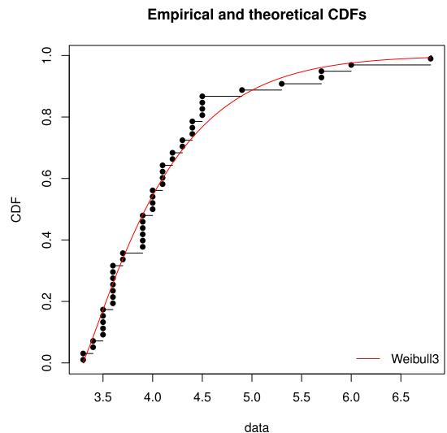
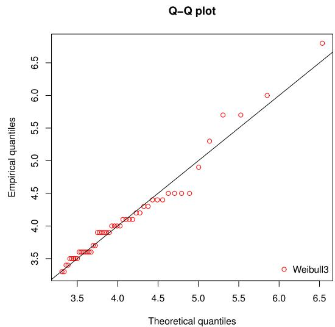

# Maximum likelihood prediction of records from 3-parameter Weibull distribution and some approximations

Mohammad Z. Raqab a,b,∗, Laila A. Alkhalfan c, Omar M. Bdair d, Narayanaswamy Balakrishnan e

a Department of Mathematics, The University of Jordan, Amman 11942, Jordan   
b King Abdulaziz University, Jeddah, Saudi Arabia   
c Department of Statistics and OR, Kuwait University, Safat 13060, Kuwait   
d Faculty of Engineering Technology, Al-Balqa Applied University, Amman 11134, Jordan   
e Department of Mathematics and Statistics, McMaster University, Hamilton, Ontario, Canada

# a r t i c l e i n f o

Article history:

Received 14 October 2018

Received in revised form 24 December 2018

MSC:

primary 62G30

secondary 62E15

62F10

Keywords:

Confidence intervals

Maximum likelihood predictor

Maximum likelihood predictive estimators

Prediction intervals

Record data

Weibull distribution

# a b s t r a c t

Based on record data, numerous authors have discussed the estimation of two-parameter Weibull distribution using classical and Bayesian approaches. In this paper, prediction of future records based on observed ones, using the maximum likelihood method, is considered. For a restricted parametric space, the existence and uniqueness of the maximum likelihood predictors of future records as well as the predictive maximum likelihood estimators of all unknown quantities are also established. Alternative approximate methods to obtain the likelihood estimators and predictors, which always exist and are easy-to-determine, are also discussed. The alternative approximate procedures studied in this paper are transformation-based predictive likelihood function, corrected predictive likelihood function, maximum product of spacings prediction Monte Carlo simulations are performed to compare the proposed methods and one real data set is also analyzed for illustrative purposes.

$^ { © }$ 2019 Published by Elsevier B.V.

# 1. Introduction

Record statistics arise naturally in many practical fields, and there are several situations in meteorology, hydrology, sporting and athletic events wherein only record values are usually recorded. For an elaborate treatment on records and their applications, one may refer to the books by Arnold et al. [1], Nevzorov [2], and Gulati and Padgett [3]. In the record set-up, data are observed sequentially and successive maximum (minimum) values are the only ones that are recorded. Specifically, let $\{ X _ { j } , j ~ \ge ~ 1 \}$ be a sequence of independent and identically (iid) continuous random variables (r.v.’s) with cumulative distribution function (cdf) $F ( x )$ and probability density function (pdf) $f ( x ) .$ . An observation $X _ { j }$ is defined to be an upper record if $X _ { j } > X _ { i }$ for every $i < j$ , and an analogous definition can be given for lower records (with the inequality being reversed).

Prediction of future records is of great interest in the context of record data as it has important applications in applied fields such as climate and environment and flood levels of rivers. Considerable amount of work has been done on prediction of records. Ahsanullah [4] obtained the best linear unbiased predictor and the best linear invariant predictor of a future record based on observed ones from a two-parameter exponential distribution. Dunsmore [5] provided Bayesian predictive

distributions of future records from an exponential distribution. Predictors of future records from three extreme value distributions have been discussed by Nagaraja [6]. Kaminsky and Rhodin [7] extended the method of maximum likelihood to allow for the joint prediction of a future random variable along with the estimation of an unknown parameter. The resulting predictor is called the maximum likelihood predictor (MLP). Ahmad [8] derived Bayesian prediction intervals for future generalized order statistics using doubly censoring data. Ahmadi and Doostparast [9] considered estimation and prediction of records from some life distributions. Most recently, Barakat et al. [10] developed prediction intervals for future generalized order statistics based on two-parameter exponential distribution with random sample size.

Significant work has been done on the estimation problem for the 2-parameter Weibull distribution based on record data, and especially on Bayesian and non-Bayesian methods. For details on some various developments, interested readers may refer to Soliman et al. [11], Asgharzadeh and Abdi [12], Teimouri and Nadarajah [13], and Bdair and Raqab [14]. In contrast, the estimation–prediction problem for the 3-parameter Weibull distribution has not received much attention and we, therefore, focus our attention here on this problem.

In this paper, based on the first m observed records from the 3-parameter Weibull distribution, we discuss the problem of estimating the parameters as well as predicting the future unobserved records simultaneously from the same sequence of iid r.v.’s. The rest of this paper is organized as follows. In Section 2, the MLP of future records as well as predictive maximum likelihood estimators (PMLEs) based on observed records from the 3-parameter Weibull distribution are discussed in detail. Generally, the MLPs of future records do not always exist and for this reason some modifications of the predictive likelihood functions are proposed in Section 3. The performance of all the estimators and the predictors are evaluated in Section 4 by means of bias and mean square error. The corresponding confidence and prediction intervals are also discussed in Section 4, and an illustrative example is presented therein as well.

# 2. MLPs of future records

Let $\{ X _ { i } , i ~ \ge ~ 1 \}$ be a sequence of independent and identically distributed (iid) random variables (r.v.’s) with common absolutely continuous cdf F and pdf $f$ . By convention, $X _ { 1 }$ is taken as a record. Then, the record times sequence $\{ U ( n ) , n \geq 1 \}$ is defined (see, for example, Arnold et al. [1] and Charalambides [15]) as

$$
U (1) = 1 \text {a n d f o r} n \geq 2, U (n) = \min  \{j: j > U (n - 1) \}.
$$

The r.v.’s $X _ { U ( n ) }$ , $n \geq 1$ , are record values.

Our main concern here is the prediction of the nth record $X _ { U ( n ) }$ in the sequence based on the first m record values, $\underline { { { X } } } ~ = ~ ( X _ { U ( 1 ) } , \dots , X _ { U ( m ) } )$ , where $1 ~ < ~ m ~ < ~ n$ The predictive likelihood function (PLF) of the future nth record $X _ { U ( n ) }$ and $\boldsymbol { \zeta } = ( \theta , \alpha , \lambda )$ is given by

$$
L = L \left(x _ {U (n)}, \xi ; \underline {{x}}\right) = \prod_ {j = 1} ^ {m} h \left(x _ {U (j)}\right) \frac {\left[ H \left(x _ {U (n)}\right) - H \left(x _ {U (m)}\right) \right] ^ {n - m - 1}}{(n - m - 1) !} f \left(x _ {U (n)}\right), \tag {2.1}
$$

where $h ( x ) = f ( x ) / ( 1 { - } F ( x ) )$ and $H ( x ) = - l o g ( 1 { - } F ( x ) )$ are the hazard rate and cumulative hazard function of X, respectively. Now, suppose $\delta _ { M L } = t ( \underline { { x } } )$ and $\zeta _ { M L } = u ( \underline { { x } } )$ are statistics for which

$$
L (t (\underline {{x}}), u (\underline {{x}}); \underline {{x}}) = \sup  _ {(x _ {U (n)}, \underline {{\zeta}})} L (x _ {U (n)}, \underline {{\zeta}}; \underline {{x}}).
$$

We then call $\delta _ { M L } = t ( \underline { { x } } ) ,$ , the MLP of $X _ { U ( n ) }$ and $\hat { \boldsymbol { \xi } } = \boldsymbol { u } ( \boldsymbol { \chi } )$ , the predictive maximum likelihood estimate (PMLE) of $\zeta$

We shall now assume that the underlying $X _ { i }$ ’s follow the 3-parameter Weibull distribution, $W ( \theta , \alpha , \lambda ) ,$ , with pdf and cdf

$$
f (x) = \alpha \lambda (x - \theta) ^ {\alpha - 1} e ^ {- \lambda (x - \theta) ^ {\alpha}}, F (x) = 1 - e ^ {- \lambda (x - \theta) ^ {\alpha}}, x > \theta , \alpha , \lambda > 0, \tag {2.2}
$$

respectively. Based on the observed record data, the PLF in (2.1), viewed as a function of $\theta , \alpha , \lambda$ and the future nth record to be predicted, can be expressed as

$$
\begin{array}{l} L = \lambda^ {n} \alpha^ {m + 1} \prod_ {j = 1} ^ {m} (x _ {U (j)} - \theta) ^ {\alpha - 1} \frac {[ (x _ {U (n)} - \theta) ^ {\alpha} - (x _ {U (m)} - \theta) ^ {\alpha} ] ^ {n - m - 1}}{(n - m - 1) !} \\ \times \left(x _ {U (n)} - \theta\right) ^ {\alpha - 1} e ^ {- \lambda \left(x _ {U (n)} - \theta\right) ^ {\alpha}}, \theta <   x _ {U (1)} <   \dots <   x _ {U (m)} <   x _ {U (n)}. \tag {2.3} \\ \end{array}
$$

Our interest is to maximize the PLF in (2.3) with respect to $X _ { U ( n ) }$ as well as other parameters involved in the Weibull model to determine the MLP of $X _ { U ( n ) }$ and the PMLEs of $\theta , \alpha , \lambda$ .

# 2.1. Two-parameter model

Let $X _ { 1 } , X _ { 2 } , . . . ,$ be a random sequence from a Weibull distribution (say, $W ( \alpha , \lambda ) )$ with pdf and cdf defined in (2.2) with shift parameter $\theta \ : = \ : 0$ . The corresponding record times are denoted by $X _ { U ( 1 ) }$ , $X _ { U ( 2 ) } , \ldots . . .$ Suppose we observed only $\underset {  } { X } = ( X _ { U ( 1 ) } , X _ { U ( 2 ) } , \dotsc , X _ { U ( m ) } )$ and the goal is to predict the future record $X _ { U ( n ) }$ , where $1 \leq m < n$ . The predictive likelihood function (PLF) of $X _ { U ( n ) }$ , α and $\lambda$ is just the joint pdf of $X _ { U ( n ) }$ and $\underset { ^ { \sim } } { X }$ for some $n \geq m + 1$ and it can be represented as a product of two likelihood functions $L _ { 1 }$ and $L _ { 2 }$ , where $L _ { 1 }$ is the joint pdf of the first $m$ observed records and $L _ { 2 }$ is the conditional pdf

of $X _ { U ( n ) }$ , given $\underset { \sim } { X } = \underset { \sim } { x } ,$ By Markov property of record data (Arnold et al. [1]), the conditional distribution of ${ \cal X } _ { U ( n ) } | \mathop { { \cal X } } _ { \sim } = \chi ,$ is just the conditional distribution of $X _ { U ( n ) } | X _ { U ( m ) } = x _ { U ( m ) }$ , which is the distribution of $( n - m ) \operatorname { t h }$ record statistic from a sequence drawn from the left truncated distribution with pdf $\cdot f ^ { * } ( y ) = f ( y ) / [ 1 - F ( x _ { U ( m ) } ) ] , y > x _ { U ( m }$ $y > x _ { U ( m ) }$ . From (2.1) and (2.2), the predictive likelihood equations (PLEs) yield closed form expressions for the MLP of $X _ { U ( n ) }$ and the PMLE of λ. Let us denote the MLP of $X _ { U ( n ) }$ and PMLEs of $\lambda$ and $\alpha$ deduced from these PLEs by $\delta _ { M L }$ and $\hat { \lambda } _ { M L }$ and $\hat { \alpha } _ { M L }$ . The MLP of $X _ { U ( n ) }$ and PMLE of $\lambda$ are obtained to be

$$
\delta_ {M L} = \left(\frac {(n - 1) \alpha + 1}{m \alpha + 1}\right) ^ {\frac {1}{\alpha}} X _ {U (m)}, \hat {\lambda} _ {M L} = \frac {n (m \alpha + 1)}{[ (n - 1) \alpha + 1 ] X _ {U (m)} ^ {\alpha}},
$$

respectively. The PMLE of $\alpha$ is the solution of the equation $\varphi _ { 0 } ( \alpha ; \underline { { x } } ) = 0$ , where

$$
\varphi_ {0} (\alpha ; \chi) = T _ {0} (\chi) \alpha + (m + 1) + \frac {1}{\alpha} \log \left(\frac {(n - 1) \alpha + 1}{m \alpha + 1}\right) = 0, \tag {2.4}
$$

with $\begin{array} { r } { T _ { 0 } ( \underline { { x } } ) = \sum _ { i = 1 } ^ { m } l o g \ x _ { U ( i ) } - m l o g \ x _ { U ( m ) } \leq 0 . } \end{array}$ . The PLE in (2.4) needs to be solved numerically. It is easily shown that $\varphi _ { 0 } ( \alpha ; \pmb { \chi } )$ is a non-increasing function with $\varphi _ { 0 } ( 0 ; \underline { { x } } ) = n$ and $\varphi _ { 0 } ( + \infty ; \underline { { x } } ) = - \infty$ , which implies that Eq.(2.4) has a unique solution at the PMLE of $\alpha$ . This assertion can be observed by noting that

$$
\begin{array}{l} \frac {\partial \varphi_ {0} (\alpha ; \underline {{x}})}{\partial \alpha} = T _ {0} (\underline {{x}}) + \frac {1}{\alpha^ {2}} \left\{\frac {(n - m - 1) \alpha}{(m \alpha + 1) [ (n - 1) \alpha + 1 ]} - \log \left(\frac {(n - 1) \alpha + 1}{m \alpha + 1}\right) \right\} \\ = T _ {0} (\underline {{x}}) + \frac {1}{\alpha^ {2}} \left\{\frac {1}{m \alpha + 1} \left(1 - \frac {m \alpha + 1}{(n - 1) \alpha + 1}\right) - \log \left(\frac {(n - 1) \alpha + 1}{m \alpha + 1}\right) \right\} \\ \leq T _ {0} (\underline {{x}}) + \frac {1}{\alpha^ {2}} \left\{\left(1 - \frac {m \alpha + 1}{(n - 1) \alpha + 1}\right) - \log \left(\frac {(n - 1) \alpha + 1}{m \alpha + 1}\right) \right\} \\ \leq 0. \\ \end{array}
$$

The last inequality holds by using the fact that $1 - 1 / x \leq l o g x ,$ , for all $x > 0$ . This shows the existence and uniqueness of $\hat { \alpha } _ { M L }$ , $\hat { \lambda } _ { M L }$ and then $\delta _ { M L }$ .

Often, the practitioners prefer the set prediction $C ( \mathcal { X } ) = \big ( L ( \mathcal { X } ) , U ( \mathcal { X } ) \big )$ to be an interval such that $P$ $\left( X _ { U ( n ) } \in C ( \mathbb { X } ) \right) = 1 - \gamma$ , where $1 { - } \gamma$ is a specified coverage probability. By observing that the MLP of $X _ { U ( n ) }$ and the PMLE of λ are computed as functions of $\alpha$ , this in turn implies that the conditional PLF, $L _ { 2 }$, can be seen as an unimodal function of the pivotal quantity

$$
Q \left(X _ {U (n)}; x\right) = \frac {n (m \alpha + 1)}{[ (n - 1) \alpha + 1 ]} \frac {X _ {U (n)} ^ {\alpha} - X _ {U (m)} ^ {\alpha}}{X _ {U (m)} ^ {\alpha}}.
$$

As $Q ( X _ { U ( n ) } ; \underline { { X } } )$ is a monotonic function of $X _ { U ( n ) }$ , the set prediction $C ( \mathbb { X } )$ is guaranteed to be a prediction interval (PI). To determine the cut-off points of this statistic, let us first consider $E _ { i } ( \alpha )$ to be the ith record value from the standard exponential distribution and $W _ { m } ( \alpha ) = \xi ( \alpha ) \lambda X _ { U ( m ) } ^ { \alpha } ,$ , where $\xi ( \alpha ) = [ ( n - 1 ) \alpha + 1 ] / ( m \alpha + 1 ) .$ . Hence, by employing conditioning argument, we have

$$
\begin{array}{l} P \left(Q \left(X _ {U (n)}; \underline {{X}}\right) \leq q\right) = P \left(\frac {E _ {n} (\alpha) - E _ {m} (\alpha)}{W _ {m} (\alpha)} \leq q\right) \\ = P \left(E _ {n} (\alpha) - E _ {m} (\alpha) \leq q W _ {m} (\alpha)\right) \\ = \int_ {0} ^ {\infty} P \left(E _ {n} (\alpha) - E _ {m} (\alpha) \leq q x \mid W _ {m} (\alpha) = x\right) f _ {W _ {m}} (x) d x, \\ \end{array}
$$

where $f _ { W _ { m } } ( x )$ is $G ( m , 1 / \xi ( \alpha ) )$ density. Using the fact that $E _ { n } ( \alpha ) - E _ { m } ( \alpha ) \sim G ( n - m , 1 )$ , we have

$$
\begin{array}{l} P \left(Q \left(X _ {U (n)}; \chi\right) \leq q\right) = \int_ {0} ^ {\infty} \left\{1 - \sum_ {j = 0} ^ {n - m - 1} \frac {e ^ {- q x} (q x) ^ {j}}{j !} \right\} \frac {x ^ {m - 1} e ^ {- x / \xi (\alpha)}}{\xi^ {m} (\alpha) (m - 1) !} d x \\ = 1 - \frac {1}{(q   \xi (\alpha) + 1) ^ {m}} \sum_ {j = 0} ^ {n - m - 1} {\binom {m + j - 1} {j}} \left(\frac {q   \xi (\alpha)}{q   \xi (\alpha) + 1}\right) ^ {j}. \\ \end{array}
$$

The cut-off points of the distribution of $Q ( X _ { U ( n ) } ; \underline { { { x } } } )$ can be computed by solving the following two equations:

$$
\frac {1}{(q _ {\frac {\gamma}{2}} \xi (\alpha) + 1) ^ {m}} \sum_ {j = 0} ^ {n - m - 1} \binom {m + j - 1} {j} \left(\frac {q _ {\frac {\gamma}{2}} \xi (\alpha)}{q _ {\frac {\gamma}{2}} \xi (\alpha) + 1}\right) ^ {j} = 1 - \frac {\gamma}{2}
$$

and

$$
\frac {1}{(q _ {1 - \frac {\gamma}{2}} \xi (\alpha) + 1) ^ {m}} \sum_ {j = 0} ^ {n - m - 1} \binom {m + j - 1} {j} \left(\frac {q _ {1 - \frac {\gamma}{2}} \xi (\alpha)}{q _ {1 - \frac {\gamma}{2}} \xi (\alpha) + 1}\right) ^ {j} = \frac {\gamma}{2}.
$$

If $\alpha$ is unknown, then it can be replaced by its PMLE, $\hat { \alpha } _ { M L }$ , obtained numerically by solving (2.4). This implies that $1 0 0 ( 1 - \gamma ) \%$ PI for $X _ { U ( n ) }$ is $( L _ { 1 } ( \underline { { x } } ) , U _ { 1 } ( \underline { { x } } ) )$ , where

$$
L _ {1} (\underline {{x}}) = \left(1 + q _ {\frac {\gamma}{2}}   \xi (\hat {\alpha} _ {M L})\right) X _ {U (m)} ^ {\hat {\alpha} _ {M L}}, U _ {1} (\underline {{x}}) = \left(1 + q _ {1 - \frac {\gamma}{2}}   \xi (\hat {\alpha} _ {M L})\right) X _ {U (m)} ^ {\hat {\alpha} _ {M L}}.
$$

We may also use a parametric bootstrap procedure for developing PIs of future records. This procedure could accommodate the effects of estimation in calibrating the so obtained PI. The main idea here is that the estimates of the parameters can be modeled by re-sampling the informative data and then performing PIs based on the quantiles obtained from these data. Let us consider the pivotal quantity obtained from the conditional PLF of $X _ { U ( n ) }$ , given $\underset { \sim } { X } = \underset { \sim } { x } ,$ which is

$$
Q (X _ {U (n)}; \underline {{x}}) = \frac {n (m \hat {\alpha} _ {M L} + 1)}{[ (n - 1) \hat {\alpha} _ {M L} + 1 ]} \frac {X _ {U (n)} ^ {\hat {\alpha} _ {M L}} - X _ {U (m)} ^ {\hat {\alpha} _ {M L}}}{X _ {U (m)} ^ {\hat {\alpha} _ {M L}}}.
$$

It represents the version of $Q$ with $\hat { \alpha } _ { M L }$ substituted for $\alpha$ . Let $\hat { \alpha } _ { M L }$ be the PMLE of $\alpha$ based on the first m records, $X _ { U ( 1 ) } , X _ { U ( 2 ) } , \dots , X _ { U ( m ) }$ . Our aim here is to generate various versions $Q ^ { * }$ of Q based on the re-sampled data. To summarize, the parametric bootstrap algorithm is given by the following steps:

• Step 1: Find the PMLEs $\hat { \alpha } _ { M L }$ and $\hat { \lambda } _ { M L }$ of $\alpha$ and $\lambda$ , respectively, based on the first m records observed;   
• Step 2: Using $\hat { \alpha } _ { M L }$ and $\hat { \lambda } _ { M L }$ obtained in Step 1, generate a bootstrap sample $X _ { U ( 1 ) } ^ { * } , X _ { U ( 2 ) } ^ { * } , \dotsc , X _ { U ( n ) } ^ { * }$ under the Weibull model. Then, obtain the corresponding PMLEs $\hat { \alpha } _ { M L } ^ { * }$ and $\hat { \lambda } _ { M L } ^ { * }$ of $\alpha$ and $\lambda$ as well as the MLP $\hat { X } _ { U ( n ) }$ of $X _ { U ( n ) }$ from $X _ { U ( 1 ) } ^ { * } , X _ { U ( 2 ) } ^ { * } , \dotsc , X _ { U ( m ) } ^ { * }$ ;   
• Step 3: Based on the bootstrap sample, define an estimated bootstrap version

$$
Q ^ {*} = \frac {n (m \hat {\alpha} _ {M L} ^ {*} + 1)}{[ (n - 1) \hat {\alpha} _ {M L} ^ {*} + 1 ]} \frac {X _ {U (n)} ^ {\hat {\alpha} _ {M L} ^ {*}} - X _ {U (m)} ^ {\hat {\alpha} _ {M L} ^ {*}}}{X _ {U (m)} ^ {\hat {\alpha} _ {M L} ^ {*}}}
$$

• Step 4: Generate $\mathtt { B } = 1 0 0 0$ bootstrap samples and versions of $Q ^ { * }$ , and then obtain the $1 0 0 \gamma ^ { t h }$ and $1 0 0 ( 1 - \gamma ) ^ { t h }$ sample quantiles (say $\hat { q } _ { \gamma }$ and $\hat { q } _ { 1 - \gamma }$ );   
• Step 5: Based on the approximate quantiles computed in Step 4 and the pivotal quantity Q , we set an approximate $1 0 0 ( 1 - \gamma ) \%$ PI for $X _ { ( n ) }$ as $( L _ { 2 } ( \underline { { x } } ) , U _ { 2 } ( \underline { { x } } ) )$ , where

$$
L _ {2} (\underline {{x}}) = \left(1 + \hat {q} _ {\frac {\gamma}{2}}   \xi (\hat {\alpha} _ {M L})\right) X _ {U (m)} ^ {\hat {\alpha} _ {M L}}, U _ {2} (\underline {{x}}) = \left(1 + \hat {q} _ {1 - \frac {\gamma}{2}}   \xi (\hat {\alpha} _ {M L})\right) X _ {U (m)} ^ {\hat {\alpha} _ {M L}}.
$$

# 2.2. Three-parameter model

We now consider the 3-parameter Weibull distribution with pdf as given in (2.2). The log of the predictive likelihood function (PLF) of $X _ { U ( n ) }$ , based on observed x, can be expressed as

$$
\begin{array}{l} \log L \propto (m + 1) \log \alpha + n \log \lambda + (\alpha - 1) \sum_ {i = 1} ^ {m} \log \left(x _ {U (i)} - \theta\right) + (n - m - 1) \\ \log \left[ (x _ {U (n)} - \theta) ^ {\alpha} - (x _ {U (m)} - \theta) ^ {\alpha} \right] + (\alpha - 1) \log (x _ {U (n)} - \theta) - \lambda (x _ {U (n)} - \theta) ^ {\alpha}, \tag {2.5} \\ \end{array}
$$

provided $x _ { U ( 1 ) } > \theta$ , $\alpha , \lambda > 0$ . It is easily checked that for $\alpha < 1$ , and $\lambda > 0$ , the likelihood increases to $\infty$ as $\theta$ tends to $x _ { U ( 1 ) }$ . As a consequence of that, the MLPs of $X _ { U ( n ) }$ and PMLEs of $\theta$ , $\alpha$ and $\lambda$ do not exist for the entire parameter space. For this reason, our objective is two-fold. First, we determine the MLPs of the future records $X _ { U ( n ) }$ and the PMLEs of the unknown parameters $\theta$ , $\alpha$ and $\lambda$ on restricted parameter space wherein MLPs and PMLEs do exist. Next, we develop modified MLPs of future records by using penalized predictive likelihoods.

The score equations concerning the PLF for the 3-parameter WE distribution are

$$
\left\{ \begin{array}{l} \frac {n}{\lambda} - (x _ {U (n)} - \theta) ^ {\alpha} = 0, \\ \frac {(n - m - 1) \alpha (x _ {U (n)} - \theta) ^ {\alpha}}{(x _ {U (n)} - \theta) ^ {\alpha} - (x _ {U (m)} - \theta) ^ {\alpha}} + (\alpha - 1) - \lambda \alpha (x _ {U (n)} - \theta) ^ {\alpha} = 0, \\ \frac {m + 1}{\alpha} + \sum_ {i = 1} ^ {m} \log \left(x _ {U (i)} - \theta\right) + (n - m - 1) \left[ \frac {\left(x _ {U (n)} - \theta\right) ^ {\alpha} \log \left(x _ {U (n)} - \theta\right) - \left(x _ {U (m)} - \theta\right) ^ {\alpha} \log \left(x _ {U (m)} - \theta\right)}{\left(x _ {U (n)} - \theta\right) ^ {\alpha} - \left(x _ {U (m)} - \theta\right) ^ {\alpha}} \right] \\ + \log \left(x _ {U (n)} - \theta\right) - \lambda \left(x _ {U (n)} - \theta\right) ^ {\alpha} \log \left(x _ {U (n)} - \theta\right) = 0, \\ (\alpha - 1) \sum_ {i = 1} ^ {m} \frac {1}{x _ {U (i)} - \theta} + (n - m - 1) \alpha \left[ \frac {\left(x _ {U (n)} - \theta\right) ^ {\alpha - 1} - \left(x _ {U (m)} - \theta\right) ^ {\alpha - 1}}{\left(x _ {U (n)} - \theta\right) ^ {\alpha} - \left(x _ {U (m)} - \theta\right) ^ {\alpha}} \right] + \frac {\alpha - 1}{x _ {U (n)} - \theta} \\ - \lambda \alpha \left(x _ {U (n)} - \theta\right) ^ {\alpha - 1} = 0. \end{array} \right. \tag {2.6}
$$

The system in (2.6) gives closed-form expressions for the MLP of $X _ { U ( n ) }$ and PMLE of $\lambda$ as

$$
\hat {\lambda} _ {M L} = \frac {n}{(x _ {U (n)} - \theta) ^ {\alpha}} \tag {2.7}
$$

and

$$
\delta_ {M L} = \theta + \left(\frac {(n - 1) \alpha + 1}{m \alpha + 1}\right) ^ {1 / \alpha} \left(x _ {U (m)} - \theta\right). \tag {2.8}
$$

The other two equations are simplified to be as follows:

$$
T _ {1} (\mathbf {x}; \theta) \alpha + (m + 1) + \frac {1}{\alpha} \log \left(\frac {(n - 1) \alpha + 1}{m \alpha + 1}\right) = 0 \tag {2.9}
$$

and

$$
\left(x _ {U (m)} - \theta\right) \sum_ {i = 1} ^ {m} \frac {1}{x _ {U (i)} - \theta} - \frac {m \alpha + 1}{\alpha - 1} = 0, \tag {2.10}
$$

where

$$
T _ {1} (\mathbf {x}; \theta) = \sum_ {i = 1} ^ {m} \log \left(\frac {x _ {U (i)} - \theta}{x _ {U (m)} - \theta}\right) = \sum_ {i = 1} ^ {m} \log (x _ {U (i)} - \theta) - \log (x _ {U (m)} - \theta) ^ {m}.
$$

For $\alpha > 1$ , (2.10) can readily lead to an explicit solution for $\alpha$ as a function of $\theta$ ; that is,

$$
\hat {\alpha} _ {M L} = \frac {\sum_ {i = 1} ^ {m} \left(\frac {x _ {U (m)} - \theta}{x _ {U (i)} - \theta}\right) + 1}{\sum_ {i = 1} ^ {m} \left(\frac {x _ {U (m)} - x _ {U (i)}}{x _ {U (i)} - \theta}\right)}. \tag {2.11}
$$

If there exist valid solutions for the system of equations in (2.6), then the MLP of $X _ { U ( n ) }$ and the PMLEs of the three parameters can be obtained by substituting (2.11) into (2.9) and then solving the following equation numerically for $\theta$ :

$$
T _ {1} (\mathbf {x}; \theta) = \psi (\hat {\alpha} _ {M L}), \tag {2.12}
$$

where

$$
\psi (a) = \frac {- \frac {1}{a} \log \left(\frac {(n - 1) a + 1}{m   a + 1}\right) - (m + 1)}{a},
$$

and then compute the PMLEs of $\alpha$ , λ and MLP of $X _ { U ( n ) }$ using (2.11), (2.7), and (2.8), respectively. Now, let us denote the left hand side (LHS) of (2.9) by $\varphi _ { 1 } ( \alpha , \theta ; \mathbf { x } )$ . It can be easily checked that for any given $\theta$ , $\varphi _ { 1 } ( \alpha , \theta ; \mathbf { x } )$ tends to n as $\alpha \to 0$ and reaches $- \infty$ when $\alpha \to + \infty$ . Further, its gradient with respect to $\alpha$ is

$$
\frac {\partial \varphi_ {1} (\alpha , \theta ; \underline {{x}})}{\partial \alpha} = T _ {1} (\underline {{x}}, \theta) + \frac {n - m - 1}{\alpha [ (n - 1) \alpha + 1 ] [ m \alpha + 1 ]} - \frac {1}{\alpha^ {2}} \log \left(\frac {(n - 1) \alpha + 1}{m \alpha + 1}\right).
$$

By using the inequality

$$
\frac {(n - m - 1) \alpha}{[ (n - 1) \alpha + 1 ]} = 1 - \frac {m \alpha + 1}{(n - 1) \alpha + 1} <   \log \left(\frac {(n - 1) \alpha + 1}{m \alpha + 1}\right).
$$

we can readily show that $\partial \varphi _ { 1 } ( \alpha , \theta ; { \mathbf x } ) / \partial \alpha < 0$ . This is due to the fact that $1 - 1 / x < l o g \ x ,$ with equality iff $x = 1$ . This in turn implies that $\varphi _ { 1 } ( \alpha , \theta ; \mathbf { x } )$ is a non-increasing function of $\alpha$ starting from n at 0 and reaching $- \infty$ as $\alpha \to \infty$ and it would then follow that the $\varphi _ { 1 } ( \alpha , \theta ; \mathbf { x } )$ intersects 0 exactly once at the PMLE of $\alpha$ .

Now, we express (2.10) alternatively as

$$
\left(x _ {U (m)} - \theta\right) \sum_ {i = 1} ^ {m} \frac {1}{x _ {U (i)} - \theta} = \frac {m \alpha + 1}{\alpha - 1}. \tag {2.13}
$$

We denote the LHS of (2.13) by $\eta _ { 1 } ( \theta ; \mathbf { x } )$ under the constraint $\theta < x _ { U ( 1 ) }$ . Now we show that for a given sample x, $\eta _ { 1 } ( \theta ; \mathbf { x } )$ is a monotonic non-decreasing function of $\theta$ . For this, we have

$$
\begin{array}{l} \frac {\partial \eta_ {1} (\theta ; \mathbf {x})}{\partial \theta} = (x _ {U (m)} - \theta) \sum_ {i = 1} ^ {m} \frac {1}{(x _ {U (i)} - \theta) ^ {2}} - \sum_ {i = 1} ^ {m} \frac {1}{(x _ {U (i)} - \theta)} \\ \geq \sum_ {i = 1} ^ {m} \frac {1}{x _ {U (i)} - \theta} - \sum_ {i = 1} ^ {m} \frac {1}{x _ {U (i)} - \theta} \geq 0. \\ \end{array}
$$

This shows that $\eta _ { 1 } ( \theta ; \mathbf { x } )$ is a monotonic non-decreasing function of θ. In addition, it attains its minimum and maximum at 0 and $x _ { U ( 1 ) }$ , respectively, with lower and upper limits

$$
m \leq \eta_ {1} (0; \mathbf {x}) = x _ {U (m)} \sum_ {i = 1} ^ {m} \frac {1}{x _ {U (i)}} \leq \sum_ {i = 1} ^ {m} \frac {x _ {U (m)} - x _ {U (1)}}{x _ {U (i)} - x _ {U (1)}}. \tag {2.14}
$$

To ensure a unique solution of (2.10), we need to have the right hand side (RHS) of (2.13) at $\alpha = \hat { \alpha } _ { M L }$ obtained via (2.9) within the lower and upper limits given in (2.14). It is evident that Eq. (2.9) always has a real solution for any $\theta$ under the constraint $\theta < x _ { U ( 1 ) }$ . If our search for $\theta$ moves away from $x _ { U ( 1 ) }$ and the so obtained solution for $\alpha$ satisfies the inequality

$$
m \leq x _ {U (m)} \sum_ {i = 1} ^ {m} \frac {1}{x _ {U (i)}} <   \frac {m \alpha + 1}{\alpha - 1} <   \sum_ {i = 1} ^ {m} \frac {x _ {U (m)} - x _ {U (1)}}{x _ {U (i)} - x _ {U (1)}}, \tag {2.15}
$$

then the PMLE of $\theta$ can be guaranteed. This in turn implies that the system of equations in (2.6) can be solved numerically and therefore the MLP of $X _ { U ( n ) }$ exists and is unique. On the other hand, if $\alpha \leq 1$ , then (2.13) cannot be achieved and the PMLE of $\theta$ does not exist in this case. The PMLE of $\theta$ can be found under the condition in (2.15). Summing up, Eq. (2.13) is the main concern in our attempt for finding the PMLEs of unknown parameters and then MLPs of future records. If the inequality in (2.15) holds, then the PMLEs of $\theta$ and then $\alpha$ can be obtained numerically. These estimates are denoted by $\hat { \theta } _ { M L }$ and $\hat { \alpha } _ { M L }$ .

It is worth mentioning here that although the likelihood method is one of the most important techniques used in statistics for estimating the unknown parameters, it does not always provide solutions to the likelihood equations or even the respective solutions may not be feasible even if they do exist (see, for example, Ng et al. [16]). As mentioned previously, there are some cases wherein the PMLEs and the MLPs cannot be achieved. So, it becomes necessary to overcome this problem by modifying the PLF and then developing alternative MLPs of future records as an easy-to-determine predictors. To achieve this, a modification of the respective PLE of $\theta$ will be quite useful.

# 3. Modified MLPs of future records

In this section, we consider the problem of modifying the PLF in (2.1) to allow for the joint prediction of a future random variable (say, $X _ { U ( n ) . }$ ) and the estimation of unknown parameters based on observed records, $\mathbf { X } = ( X _ { U ( 1 ) } , X _ { U ( 2 ) } , \ldots , X _ { U ( m ) } )$ , $n \geq$ $m + 1$ .

# 3.1. Transformation-based PLF

First, we apply the procedure adopted by Smith [17] by estimating the unknown location parameter $\theta$ by its consistent estimator $\tilde { \theta } = \dot { X _ { U ( 1 ) } }$ . Next, the PLF can be modified based on skipping the first record statistic. This method is based on the fact $X - \theta$ follows $W ( \alpha , \lambda )$ and that $X _ { U ( 1 ) }$ is a consistent estimate of $\theta$ . By skipping the initial record, we may consider the following variates:

$$
Y _ {2} = X _ {U (2)} - X _ {U (1)}, \quad Y _ {3} = X _ {U (3)} - X _ {U (1)}, \dots , Y _ {m} = X _ {U (m)} - X _ {U (1)},
$$

and $Y _ { n } = X _ { U ( n ) } - X _ { U ( 1 ) }$

The PLF is then modified to be

$$
L _ {T} = \prod_ {i = 2} ^ {m} h (y _ {i}) \frac {[ H (y _ {n}) - H (y _ {m}) ] ^ {n - m - 1}}{(n - m - 1) !} f (y _ {n}).
$$

The modified log-PLF of the nth record spacing $Y _ { n }$ based on observed record spacings $Y _ { i } , i = 2 , \ldots , m$ $Y _ { i }$ , takes the form

$$
\begin{array}{l} \log L = m \log \alpha + (n - 1) \log \lambda + (\alpha - 1) \sum_ {i = 2} ^ {m} \log y _ {i} + (n - m - 1) \log \left(y _ {n} ^ {\alpha} - y _ {m} ^ {\alpha}\right) \\ + (\alpha - 1) \log y _ {n} - \lambda y _ {n} ^ {\alpha}. \tag {3.1} \\ \end{array}
$$

Eq. (3.1) readily yields closed-form expressions for the PMLE of λ and the MLP of $Y _ { n }$ as

$$
\hat {Y} _ {n} = \left(\frac {(n - 2) \alpha + 1}{(m - 1) \alpha + 1}\right) ^ {1 / \alpha} Y _ {m}, \hat {\lambda} _ {T} = \frac {n - 1}{\hat {Y} _ {n} ^ {\alpha}},
$$

and a simplified predictive likelihood equation (PLE) for $\alpha$ as

$$
T _ {2} (\mathbf {y}) \alpha + m + \frac {1}{\alpha} \log \left(\frac {(n - 2) \alpha + 1}{(m - 1) \alpha + 1}\right) = 0, \tag {3.2}
$$

where

$$
T _ {2} (\mathbf {y}) = \sum_ {i = 2} ^ {m} \log \left(\frac {y _ {U (i)}}{y _ {U (m)}}\right).
$$

Arguments similar to those in Section 2, show that the LHS of (3.2) is a non-increasing function of $\alpha$ starting from $n - 1$ a t 0 and tending to $- \infty$ as $\alpha \to \infty$ . This ensures that the PMLE of α (say, $\hat { \alpha } _ { T }$ ) exists and is unique and then those of the PMLE of $\lambda$ and the MLP of $Y _ { n }$ readily follow. Now, let us describe this method by the following steps:

• Step 1: Form the $( m - 1 )$ spacings of observed record values

$$
Y _ {2} = X _ {U (2)} - X _ {U (1)}, Y _ {3} = X _ {U (3)} - X _ {U (1)}, \dots , Y _ {m} = X _ {U (m)} - X _ {U (1)};
$$

and the nth record spacing $Y _ { n } = X _ { U ( n ) } - X _ { U ( 1 ) }$

• Step 2: Obtain the PMLE of $\alpha$ (say, $\hat { \alpha } _ { T }$ ) based on $Y _ { 2 }$ $\nu _ { \ast } , Y _ { 3 } , \dots , Y _ { m }$ . The PMLE of $\alpha$ is the numerical solution of (3.2);   
• Step 3: From Step 2, we readily obtain the MLP of $Y _ { n }$ as

$$
\widehat {Y} _ {n} = \left(\frac {(n - 2) \hat {\alpha} _ {T} + 1}{(m - 1) \hat {\alpha} _ {T} + 1}\right) ^ {1 / \hat {\alpha} _ {T}} Y _ {m},
$$

and then the MLP of $X _ { U ( n ) }$ using the transformation procedure becomes

$$
\delta_ {T} = X _ {U (1)} + \left(\frac {(n - 2) \hat {\alpha} _ {T} + 1}{(m - 1) \hat {\alpha} _ {T} + 1}\right) ^ {1 / \hat {\alpha} _ {T}} \left(X _ {U (m)} - X _ {U (1)}\right);
$$

• Step 4: Based on Steps 2 and 3, the PMLE of $\lambda$ based on this method (say, $\widehat { \lambda } _ { T }$ ) is

$$
\hat {\lambda} _ {T} = \frac {n - 1}{\left(\frac {(n - 2) \hat {\alpha} _ {T} + 1}{(m - 1) \hat {\alpha} _ {T} + 1}\right) \left(X _ {U (m)} - X _ {U (1)}\right) ^ {\hat {\alpha} _ {T}}}.
$$

Since

$$
E X _ {U (1)} = \theta + \frac {\Gamma (1 + \frac {1}{\alpha})}{\lambda^ {\frac {1}{\alpha}}},
$$

the bias-corrected estimate of $\theta$ is found to be

$$
\tilde {\theta} _ {T} = X _ {U (1)} - \frac {\Gamma \left(1 + \frac {1}{\hat {\alpha} _ {T}}\right)}{(\hat {\lambda} _ {T}) ^ {1 / \hat {\alpha} _ {T}}}.
$$

# 3.2. Corrected PLF

The idea here, introduced by Cheng and Iles [18], is to consider the hazard increments from a continuous distribution can be taken in the form

$$
H \left(x _ {U (i)} + \Delta\right) - H \left(x _ {U (i)}\right) = \int_ {x _ {U (i)}} ^ {x _ {U (i)} + \Delta} h (x) d x.
$$

It is assumed that $\varDelta$ is small. The PLF then takes the form

$$
L _ {C} = \left[ H \left(x _ {U (2)}\right) - H \left(x _ {U (1)}\right) \right] \prod_ {i = 2} ^ {m} h \left(x _ {U (i)}\right) \frac {\left[ H \left(x _ {U (n)}\right) - H \left(x _ {U (m)}\right) \right] ^ {n - m - 1}}{(n - m - 1) !} f \left(x _ {U (n)}\right).
$$

The PMLEs of θ , α, λ and the MLP of $X _ { U ( n ) }$ can then be obtained by maximizing $L _ { C }$ with respect to $\theta , \alpha , \lambda$ and $x _ { U ( n ) }$ under the constraint $\theta < x _ { U ( 1 ) }$ . The modified log-PLF becomes

$$
\begin{array}{l} \log L _ {C} = m \log \alpha + n \log \lambda + \log \left[ (x _ {U (2)} - \theta) ^ {\alpha} - (x _ {U (1)} - \theta) ^ {\alpha} \right] \\ + (\alpha - 1) \sum_ {i = 2} ^ {m} \log \left(x _ {U (i)} - \theta\right) + (n - m - 1) \log \left[ \left(x _ {U (n)} - \theta\right) ^ {\alpha} - \left(x _ {U (m)} - \theta\right) ^ {\alpha} \right] \\ + (\alpha - 1) \log \left(x _ {U (n)} - \theta\right) - \lambda \left(x _ {U (n)} - \theta\right) ^ {\alpha}. \tag {3.3} \\ \end{array}
$$

The PLEs of $\lambda$ and $X _ { U ( n ) }$ lead to closed-form expressions of the modified PMLE $\widehat { \lambda } _ { C }$ of $\lambda$ and MLP $\delta _ { C }$ of $X _ { U ( n ) }$ as follows:

$$
\widehat {\lambda} _ {C} = \frac {n}{(x _ {U (n)} - \theta) ^ {\alpha}}
$$

and

$$
\delta_ {C} = \theta + \left(\frac {(n - 1) \alpha + 1}{m \alpha + 1}\right) ^ {1 / \alpha} (x _ {U (m)} - \theta),
$$

which is the same as the expressions of the exact PMLE of $\lambda$ and the MLP of $X _ { U ( n ) }$ , respectively. The PLEs of $\alpha$ and $\theta$ are, respectively,

$$
T _ {3} (\mathbf {x}, \theta) \alpha + m + \frac {1}{\alpha} \log \left(\frac {(n - 1) \alpha + 1}{m \alpha + 1}\right) = 0 \tag {3.4}
$$

and

$$
\begin{array}{l} \left(x _ {U (m)} - \theta\right) \left\{(\alpha - 1) \sum_ {i = 2} ^ {m} \frac {1}{x _ {U (i)} - \theta} + \alpha \left[ \frac {\left(x _ {U (2)} - \theta\right) ^ {\alpha - 1} - \left(x _ {U (1)} - \theta\right) ^ {\alpha - 1}}{\left(x _ {U (2)} - \theta\right) ^ {\alpha} - \left(x _ {U (1)} - \theta\right) ^ {\alpha}} \right] \right\} \\ - (m \alpha + 1) = 0, \tag {3.5} \\ \end{array}
$$

where

$$
\begin{array}{l} T _ {3} (\mathbf {x}, \theta) = \frac {(x _ {U (2)} - \theta) ^ {\alpha} \log (x _ {U (2)} - \theta) - (x _ {U (1)} - \theta) ^ {\alpha} \log (x _ {U (1)} - \theta)}{(x _ {U (2)} - \theta) ^ {\alpha} - (x _ {U (1)} - \theta) ^ {\alpha}} \\ + \sum_ {i = 2} ^ {m} \log \left(x _ {U (i)} - \theta\right) - m \log \left(x _ {U (m)} - \theta\right). \tag {3.6} \\ \end{array}
$$

The so obtained modified PMLEs of $\alpha$ and $\theta$ are denoted by $\widehat { \alpha } _ { C }$ and ${ \widehat { \theta } } _ { C }$ , respectively.

# 3.3. Maximum product of spacings prediction

Cheng and Amin [19] and Ranneby [20] indicated that the maximum product of spacing (MPS) estimation is a good alternative for obtaining consistent estimates, especially when the underlying distribution is J-shaped, a situation where the MLE is bound to fail. Similar arguments can be applied for record data by considering the first order approximation in which the maximization of log $h \big ( x _ { U ( i ) } \big )$ is essentially the same as $l o g [ H ( x _ { U ( i ) } ) - H ( x _ { U ( i - 1 ) } ) ]$ . Accordingly, the product of spacings to be maximized is

$$
L _ {P} = \prod_ {i = 1} ^ {m} [ H (x _ {U (i)}) - H (x _ {U (i - 1)}) ] \frac {[ H (x _ {U (n)}) - H (x _ {U (m)}) ] ^ {n - m - 1}}{(n - m - 1) !} f (x _ {U (n)}),
$$

with $H ( x _ { U ( i - 1 ) } ) = 0$ for $i = 1$ . The corresponding log-likelihood is given by

$$
\begin{array}{l} \log L _ {p} \propto \log \alpha + n \log \lambda + \sum_ {i = 1} ^ {m} \log \left[ (x _ {U (i)} - \theta) ^ {\alpha} - (x _ {U (i - 1)} - \theta) ^ {\alpha} \right] \\ + (n - m - 1) \log \left[ \left(x _ {U (n)} - \theta\right) ^ {\alpha} - \left(x _ {U (m)} - \theta\right) ^ {\alpha} \right] + (\alpha - 1) \log \left(x _ {U (n)} - \theta\right) \\ - \lambda (x _ {U (n)} - \theta) ^ {\alpha}. \\ \end{array}
$$

The modified PMLE of $\lambda$ and the MLP of $X _ { U ( n ) }$ are the same ones as the PMLE and the MLP. The modified PLEs for $\alpha$ and $\theta$ are

$$
T _ {4} (\mathbf {x}, \theta) \alpha + 1 + \frac {1}{\alpha} \log \left(\frac {(n - 1) \alpha + 1}{m \alpha + 1}\right) = 0 \tag {3.7}
$$

and

$$
\alpha \left(X _ {U (m)} - \theta\right) \sum_ {i = 1} ^ {m} \frac {\left(x _ {U (i)} - \theta\right) ^ {\alpha - 1} - \left(x _ {U (i - 1)} - \theta\right) ^ {\alpha - 1}}{\left(x _ {U (i)} - \theta\right) ^ {\alpha} - \left(x _ {U (i - 1)} - \theta\right) ^ {\alpha}} - (m \alpha + 1) = 0, \tag {3.8}
$$

where

$$
\begin{array}{l} T _ {4} (\mathbf {x}, \theta) = \sum_ {i = 1} ^ {m} \frac {\left(x _ {U (i)} - \theta\right) ^ {\alpha} \log \left(x _ {U (i)} - \theta\right) - \left(x _ {U (i - 1)} - \theta\right) ^ {\alpha} \log \left(x _ {U (i - 1)} - \theta\right)}{\left(x _ {U (i)} - \theta\right) ^ {\alpha} - \left(x _ {U (i - 1)} - \theta\right) ^ {\alpha}} \\ - m \log \left(x _ {U (m)} - \theta\right). \\ \end{array}
$$

# 4. Data illustration and simulation

In this section, we discuss the statistical analysis of record data extracted from a practical data set with the use of Weibull distribution and then conduct a Monte Carlo simulation study to assess the performance of all the estimates of the three model parameters as well as the MLPs of future records. All the computations were performed using R Software and Mathematica package. For convenience, we denote the methods developed here by MLP, MLP-T, MLP-C, and MLP-M for the maximum likelihood prediction, the transformation-based method, the correction-based method and the maximum product of spacings method, respectively.

  
Fig. 1. Empirical and fitted distribution functions and Q–Q Plots.

Table 1 Point estimates, predictors and $9 5 \%$ intervals for the parameters and $x _ { U ( n ) }$   

<table><tr><td></td><td></td><td>α</td><td>θ</td><td>λ</td><td>xU(n)</td></tr><tr><td>n</td><td>Method</td><td>Est.(CI)</td><td>Est.(CI)</td><td>Est.(CI)</td><td>Pred.(PI)</td></tr><tr><td rowspan="4">8</td><td>MLP</td><td>1.2583(0.5135,2.2292)</td><td>3.0531(1.7225,3.9525)</td><td>0.7909(0.3302,1.5718)</td><td>7.1456(7.0645,7.5224)</td></tr><tr><td>MLP-T</td><td>1.1083(0.5945,2.2923)</td><td>3.2308(2.2808,3.8030)</td><td>1.1578(0.4125,1.5309)</td><td>7.1358(7.0135,7.4429)</td></tr><tr><td>MLP-C</td><td>1.2936(0.4035,2.1897)</td><td>2.9571(1.6570,4.0939)</td><td>0.7007(0.3561,2.2965)</td><td>7.1292(7.0495,7.5235)</td></tr><tr><td>MLP-M</td><td>1.2672(0.4715,2.8961)</td><td>2.7830(1.3546,4.1940)</td><td>0.7522(0.3370,2.0991)</td><td>7.1205(7.0844,7.5995)</td></tr><tr><td rowspan="4">9</td><td>MLP</td><td>1.2716(0.5629,2.3100)</td><td>2.9528(1.5628,3.9321)</td><td>0.7741(0.3428,1.6064)</td><td>7.4681(7.3051,8.2136)</td></tr><tr><td>MLP-T</td><td>1.1281(0.6167,2.3454)</td><td>3.2138(2.2113,3.8051)</td><td>1.1253(0.3937,1.5326)</td><td>7.4495(7.2947,8.1129)</td></tr><tr><td>MLP-C</td><td>1.3311(0.4912,2.3287)</td><td>2.9068(1.5468,4.1028)</td><td>0.6851(0.3478,2.2979)</td><td>7.4411(7.2817,8.2051)</td></tr><tr><td>MLP-M</td><td>1.2947(0.4846,2.2751)</td><td>2.7119(1.3632,4.2758)</td><td>0.7479(0.3252,2.0960)</td><td>7.4280(7.3496,8.3049)</td></tr><tr><td rowspan="4">10</td><td>MLP</td><td>1.2949(0.5933,2.4221)</td><td>2.9365(1.4807,3.9607)</td><td>0.7677(0.3317,1.6373)</td><td>7.7766(7.5371,8.7557)</td></tr><tr><td>MLP-T</td><td>1.1450(0.6576,2.4343)</td><td>3.1994(2.1785,3.8292)</td><td>1.0985(0.3844,1.5462)</td><td>7.7447(7.4251,8.5838)</td></tr><tr><td>MLP-C</td><td>1.3631(0.5152,2.4149)</td><td>2.8981(1.4028,4.1042)</td><td>0.6699(0.3399,2.2999)</td><td>7.7387(7.5002,8.8520)</td></tr><tr><td>MLP-M</td><td>1.3358(0.4949,2.3655)</td><td>2.6594(1.3044,4.1881)</td><td>0.7293(0.3299,2.1012)</td><td>7.8782(7.6173,9.0349)</td></tr></table>

# 4.1. Data analysis

By considering a real data set, we first illustrate how the different methods of estimation and prediction developed here perform in practice. The data set gives the magnitude scales of earthquakes that occurred between 2012 and 2016 in Northern California, which is readily available on the Website: http://earthquake.usgs.gov/research/rupture. For easy reference, we present the data set below:

3.3, 4.1, 4.4, 4.0, 4.5, 5.3, 3.6, 3.5, 3.9, 4.5, 3.9, 3.5, 5.7, 3.6, 3.9, 4.5, 3.6, 3.9, 4.9, 3.3, 3.4, 3.7, 3.6, 4.1, 4.1, 4.0, 4.5, 3.7, 6.8, 6.0, 3.6, 3.9, 3.4, 4.4, 4.2, 3.9, 4.3, 4.4, 5.7, 4.2, 3.6, 3.6, 3.5, 4.1, 4.0, 3.5, 4.0, 4.3, 3.5

Before progressing further, we first compute some basic statistics from this data set. The mean, the standard deviation and the coefficient of skewness are 4.1184, 0.7311 and 1.7734, respectively. Since the data is positively skewed, the Weibull model may be used to analyze this data set. It shows concave behavior in the lower tail, an indication that a threshold parameter for the Weibull distribution would fit the data. However, we can easily check numerically the fit of the data. The MLEs of the Weibull model parameters are computed numerically using Newton–Raphson (NR) method, and these MLEs of the location, scale and shape parameters are, respectively,

$$
\theta = 3. 2 9 3 9, \lambda = 1. 1 9 1 5, \alpha = 1. 1 0 3 5.
$$

The Kolmogorov–Smirnov (K–S) and Cramer–von Mises (CvM) distances between the fitted and the empirical distribution functions and the corresponding p-values (inside parentheses) are given by $K \mathrm { ~ - ~ } S \ = \ 0 . 1 0 8 6 , C v M \ = \ 0 . 1 0 8 0$ and

Table 2 Bias, MSEs and MSPEs of estimates and predictors for $\alpha = 2 , \lambda = 3$ and $\theta = 5$ .   

<table><tr><td rowspan="2">m</td><td rowspan="2">n</td><td rowspan="2">Method</td><td colspan="2">α</td><td colspan="2">θ</td><td colspan="2">λ</td><td colspan="2">xU(n)</td></tr><tr><td>Bias</td><td>MSE</td><td>Bias</td><td>MSE</td><td>Bias</td><td>MSE</td><td>Bias</td><td>MSP</td></tr><tr><td rowspan="4">6</td><td rowspan="4">7</td><td>MLP</td><td>-0.3851</td><td>1.1281</td><td>-0.2417</td><td>0.2129</td><td>-0.8081</td><td>1.1538</td><td>0.1331</td><td>0.1297</td></tr><tr><td>MLP-T</td><td>0.3531</td><td>0.7495</td><td>-0.2375</td><td>0.1923</td><td>-0.3867</td><td>0.5459</td><td>0.1039</td><td>0.1120</td></tr><tr><td>MLP-C</td><td>-0.7449</td><td>1.2007</td><td>-0.2617</td><td>0.2578</td><td>0.9404</td><td>1.2802</td><td>-0.1602</td><td>0.1417</td></tr><tr><td>MLP-M</td><td>-0.7855</td><td>1.2633</td><td>0.3138</td><td>0.3253</td><td>1.0288</td><td>1.9204</td><td>-0.1739</td><td>0.1883</td></tr><tr><td rowspan="4">6</td><td rowspan="4">8</td><td>MLP</td><td>-0.4107</td><td>1.1525</td><td>-0.2804</td><td>0.2226</td><td>-0.8240</td><td>1.1668</td><td>0.1483</td><td>0.1577</td></tr><tr><td>MLP-T</td><td>0.3979</td><td>0.7527</td><td>-0.2677</td><td>0.2160</td><td>-0.3936</td><td>0.6540</td><td>0.1173</td><td>0.1317</td></tr><tr><td>MLP-C</td><td>-0.7583</td><td>1.2355</td><td>-0.3439</td><td>0.2847</td><td>0.9668</td><td>1.3996</td><td>-0.1666</td><td>0.1791</td></tr><tr><td>MLP-M</td><td>-0.8086</td><td>1.2746</td><td>0.3782</td><td>0.3309</td><td>1.0340</td><td>1.9940</td><td>-0.1881</td><td>0.1995</td></tr><tr><td rowspan="4">6</td><td rowspan="4">9</td><td>MLP</td><td>-0.4322</td><td>1.1743</td><td>-0.3426</td><td>0.2449</td><td>-0.8551</td><td>1.1943</td><td>0.1532</td><td>0.1982</td></tr><tr><td>MLP-T</td><td>0.4278</td><td>0.7965</td><td>-0.2990</td><td>0.2278</td><td>-0.4359</td><td>0.7069</td><td>0.1458</td><td>0.1608</td></tr><tr><td>MLP-C</td><td>-0.7271</td><td>1.2940</td><td>-0.3842</td><td>0.3051</td><td>0.9896</td><td>1.4035</td><td>0.1645</td><td>0.2173</td></tr><tr><td>MLP-M</td><td>-0.8703</td><td>1.3446</td><td>0.4248</td><td>0.3649</td><td>1.1465</td><td>2.1748</td><td>-0.1874</td><td>0.2337</td></tr><tr><td rowspan="4">7</td><td rowspan="4">8</td><td>MLP</td><td>-0.2742</td><td>1.0796</td><td>0.1703</td><td>0.1624</td><td>-0.7450</td><td>1.0374</td><td>0.1270</td><td>0.1056</td></tr><tr><td>MLP-T</td><td>0.2517</td><td>0.6559</td><td>-0.1576</td><td>0.1551</td><td>0.3225</td><td>0.5051</td><td>-0.0937</td><td>0.0966</td></tr><tr><td>MLP-C</td><td>-0.5934</td><td>1.1943</td><td>-0.2379</td><td>0.2485</td><td>0.8721</td><td>1.2264</td><td>-0.1562</td><td>0.1131</td></tr><tr><td>MLP-M</td><td>-0.6286</td><td>1.2057</td><td>0.2613</td><td>0.2921</td><td>0.9787</td><td>1.6855</td><td>-0.1660</td><td>0.1215</td></tr><tr><td rowspan="4">7</td><td rowspan="4">9</td><td>MLP</td><td>-0.2935</td><td>1.0924</td><td>0.2144</td><td>0.1974</td><td>-0.7568</td><td>1.0454</td><td>0.1379</td><td>0.1144</td></tr><tr><td>MLP-T</td><td>0.2609</td><td>0.6680</td><td>-0.1974</td><td>0.1659</td><td>-0.3301</td><td>0.5110</td><td>-0.1152</td><td>0.1091</td></tr><tr><td>MLP-C</td><td>-0.6469</td><td>1.2474</td><td>-0.2500</td><td>0.2452</td><td>0.9272</td><td>1.2973</td><td>-0.1586</td><td>0.1220</td></tr><tr><td>MLP-M</td><td>-0.6559</td><td>1.2676</td><td>0.2874</td><td>0.3035</td><td>1.0232</td><td>1.7631</td><td>-0.1752</td><td>0.1399</td></tr><tr><td rowspan="4">7</td><td rowspan="4">10</td><td>MLP</td><td>-0.4100</td><td>1.1041</td><td>0.2492</td><td>0.1978</td><td>-0.7644</td><td>1.0545</td><td>0.1490</td><td>0.1459</td></tr><tr><td>MLP-T</td><td>0.3650</td><td>0.7456</td><td>-0.2284</td><td>0.1758</td><td>-0.4447</td><td>0.5968</td><td>-0.1205</td><td>0.1294</td></tr><tr><td>MLP-C</td><td>-0.6425</td><td>1.2633</td><td>-0.2937</td><td>0.2674</td><td>0.9666</td><td>1.3163</td><td>-0.1558</td><td>0.1501</td></tr><tr><td>MLP-M</td><td>-0.6791</td><td>1.3211</td><td>0.3446</td><td>0.3565</td><td>1.0998</td><td>1.8016</td><td>-0.1747</td><td>0.1802</td></tr><tr><td rowspan="4">8</td><td rowspan="4">9</td><td>MLP</td><td>-0.2260</td><td>1.0711</td><td>-0.1310</td><td>0.1491</td><td>-0.7236</td><td>0.9539</td><td>-0.1129</td><td>0.0848</td></tr><tr><td>MLP-T</td><td>-0.2194</td><td>0.6480</td><td>-0.1197</td><td>0.1334</td><td>0.2648</td><td>0.4558</td><td>0.0803</td><td>0.0736</td></tr><tr><td>MLP-C</td><td>-0.5270</td><td>1.1639</td><td>0.1806</td><td>0.2018</td><td>0.7945</td><td>1.0881</td><td>0.1301</td><td>0.0855</td></tr><tr><td>MLP-M</td><td>-0.6056</td><td>1.1910</td><td>0.1960</td><td>0.2817</td><td>0.9690</td><td>1.5336</td><td>-0.1543</td><td>0.0999</td></tr><tr><td rowspan="4">8</td><td rowspan="4">10</td><td>MLP</td><td>-0.2412</td><td>1.0792</td><td>-0.1486</td><td>0.1590</td><td>-0.7309</td><td>0.9770</td><td>-0.1246</td><td>0.0925</td></tr><tr><td>MLP-T</td><td>-0.2229</td><td>0.6553</td><td>-0.1214</td><td>0.1389</td><td>0.3166</td><td>0.4789</td><td>0.0970</td><td>0.0823</td></tr><tr><td>MLP-C</td><td>-0.5399</td><td>1.1957</td><td>0.1954</td><td>0.2187</td><td>0.8040</td><td>1.1872</td><td>0.1307</td><td>0.0985</td></tr><tr><td>MLP-M</td><td>-0.6057</td><td>1.2265</td><td>0.2262</td><td>0.2989</td><td>0.9837</td><td>1.6077</td><td>-0.1620</td><td>0.1115</td></tr><tr><td rowspan="4">8</td><td rowspan="4">11</td><td>MLP</td><td>-0.2546</td><td>1.0868</td><td>-0.1775</td><td>0.1609</td><td>-0.7417</td><td>0.9908</td><td>-0.1361</td><td>0.1020</td></tr><tr><td>MLP-T</td><td>-0.2339</td><td>0.6950</td><td>-0.1415</td><td>0.1460</td><td>0.4341</td><td>0.5839</td><td>0.1024</td><td>0.0932</td></tr><tr><td>MLP-C</td><td>-0.5484</td><td>1.2111</td><td>0.2010</td><td>0.2542</td><td>0.8695</td><td>1.2236</td><td>0.1519</td><td>0.1068</td></tr><tr><td>MLP-M</td><td>-0.6757</td><td>1.2504</td><td>0.2376</td><td>0.3342</td><td>1.0174</td><td>1.7123</td><td>-0.1677</td><td>0.1213</td></tr></table>

0.6103, 0.5468, respectively. These results do reveal that the 3-parameter Weibull distribution fits the data very well. The empirical and the fitted distribution functions are presented in Fig. 1.

The record values extracted from the above data set are as follows:

3.3, 4.1, 4.4, 4.5, 5.3, 5.7, 6.8

As mentioned by Balakrishnan and Chan [21], the fit of a distribution can also be checked directly based on the observed record data. A simple plot of the above seven observed records against their expected values calculated with $\theta = 3 . 2 9 3 9$ , $\lambda =$ 1.1915, $\alpha = 1 . 1 0 3 5$ , indicates a strong correlation (correlation coefficient as high as 0.8904). Hence, the assumption that these record values come from a Weibull distribution is once again quite justifiable.

Based on the above observed records, we obtain the estimates of the parameters $\alpha , \theta$ and $\lambda$ along with the point prediction of future records. The estimates under different methods detailed in Sections 2 and 3 for α, θ and $\lambda$ as well as the $9 5 \%$ confidence intervals (CIs) (inside parentheses) were computed. The point predicted values and prediction intervals (inside parentheses) for $X _ { U ( n ) }$ , were also computed. The prediction intervals (PIs) were obtained based on the parametric bootstrap algorithm described in detail in Section 2.1.

Let us consider the case when we wish to predict the next (8th) record based on the observed 7 records. The PMLEs of $\theta , \alpha , \lambda$ and the MLP of $X _ { U ( 8 ) }$ are obtained to be

$$
\hat {\theta} = 3. 0 5 3 1, \hat {\alpha} = 1. 2 5 8 3, \hat {\lambda} = 0. 7 9 0 9, \text {a n d} \hat {X} _ {U (8)} = 7. 1 4 5 6.
$$

Table 3 Bias, MSEs and MSPEs of estimates and predictors for $\alpha = 1 , \lambda = 3$ and $\theta = 5$ .   

<table><tr><td rowspan="2">m</td><td rowspan="2">n</td><td rowspan="2">Method</td><td colspan="2">α</td><td colspan="2">θ</td><td colspan="2">λ</td><td colspan="2">xU(n)</td></tr><tr><td>Bias</td><td>MSE</td><td>Bias</td><td>MSE</td><td>Bias</td><td>MSE</td><td>Bias</td><td>MSE</td></tr><tr><td rowspan="4">6</td><td rowspan="4">7</td><td>MLP</td><td>-0.7849</td><td>1.3653</td><td>0.2147</td><td>0.3606</td><td>1.2545</td><td>2.7100</td><td>0.2571</td><td>0.6929</td></tr><tr><td>MLP-T</td><td>-0.9219</td><td>1.2878</td><td>0.1750</td><td>0.2597</td><td>1.2086</td><td>2.3496</td><td>-0.2243</td><td>0.6800</td></tr><tr><td>MLP-C</td><td>-1.0920</td><td>1.5380</td><td>0.2924</td><td>0.4905</td><td>1.4178</td><td>2.9688</td><td>0.2610</td><td>0.7030</td></tr><tr><td>MLP-M</td><td>-0.9437</td><td>1.3810</td><td>0.5398</td><td>0.9766</td><td>1.3255</td><td>2.8833</td><td>-0.2990</td><td>0.7192</td></tr><tr><td rowspan="4">6</td><td rowspan="4">8</td><td>MLP</td><td>-0.8107</td><td>1.4071</td><td>0.2253</td><td>0.3765</td><td>1.3299</td><td>2.7169</td><td>0.2608</td><td>0.7648</td></tr><tr><td>MLP-T</td><td>-0.9409</td><td>1.3121</td><td>0.1821</td><td>0.2641</td><td>1.2978</td><td>2.4316</td><td>-0.2337</td><td>0.7557</td></tr><tr><td>MLP-C</td><td>-1.1386</td><td>1.6285</td><td>0.3501</td><td>0.5129</td><td>1.4486</td><td>3.0227</td><td>0.2656</td><td>0.8074</td></tr><tr><td>MLP-M</td><td>-0.9761</td><td>1.4269</td><td>0.5410</td><td>1.0413</td><td>1.3484</td><td>2.9252</td><td>-0.3102</td><td>0.8260</td></tr><tr><td rowspan="4">6</td><td rowspan="4">9</td><td>MLP</td><td>-0.8323</td><td>1.3431</td><td>0.2340</td><td>0.3815</td><td>1.3302</td><td>2.7345</td><td>0.2691</td><td>0.9860</td></tr><tr><td>MLP-T</td><td>-0.9608</td><td>1.3200</td><td>0.1906</td><td>0.2842</td><td>1.3222</td><td>2.4623</td><td>-0.2384</td><td>0.9133</td></tr><tr><td>MLP-C</td><td>-1.1691</td><td>1.6658</td><td>0.3778</td><td>0.5413</td><td>1.4912</td><td>3.2604</td><td>0.2765</td><td>0.9904</td></tr><tr><td>MLP-M</td><td>-0.9956</td><td>1.3665</td><td>0.5543</td><td>1.1231</td><td>1.3865</td><td>3.2490</td><td>-0.3145</td><td>1.0780</td></tr><tr><td rowspan="4">7</td><td rowspan="4">n=8</td><td>MLP</td><td>-0.7465</td><td>1.2068</td><td>0.1776</td><td>0.2901</td><td>1.1349</td><td>2.6378</td><td>-0.1514</td><td>0.7258</td></tr><tr><td>MLP-T</td><td>-0.9021</td><td>1.1920</td><td>0.1681</td><td>0.2468</td><td>1.0608</td><td>2.2699</td><td>0.1298</td><td>0.6549</td></tr><tr><td>MLP-C</td><td>-0.9751</td><td>1.3850</td><td>0.2818</td><td>0.4891</td><td>1.2951</td><td>2.7572</td><td>0.1661</td><td>0.7596</td></tr><tr><td>MLP-M</td><td>-0.9125</td><td>1.2115</td><td>0.5333</td><td>0.9434</td><td>1.2135</td><td>2.6859</td><td>-0.1746</td><td>0.7938</td></tr><tr><td rowspan="4">7</td><td rowspan="4">n=9</td><td>MLP</td><td>-0.7661</td><td>1.2802</td><td>0.1862</td><td>0.2947</td><td>1.1719</td><td>2.6532</td><td>-0.1768</td><td>0.7650</td></tr><tr><td>MLP-T</td><td>-0.9338</td><td>1.2123</td><td>0.1755</td><td>0.2549</td><td>1.1168</td><td>2.2710</td><td>0.1461</td><td>0.7299</td></tr><tr><td>MLP-C</td><td>-1.0214</td><td>1.4829</td><td>0.3115</td><td>0.5037</td><td>1.3399</td><td>3.0172</td><td>0.1809</td><td>0.8273</td></tr><tr><td>MLP-M</td><td>-0.9648</td><td>1.2921</td><td>0.5530</td><td>0.9841</td><td>1.2223</td><td>2.8345</td><td>-0.1916</td><td>0.9517</td></tr><tr><td rowspan="4">7</td><td rowspan="4">10</td><td>MLP</td><td>-0.7828</td><td>1.3054</td><td>0.1934</td><td>0.2986</td><td>1.2030</td><td>2.7291</td><td>-0.1998</td><td>0.8208</td></tr><tr><td>MLP-T</td><td>-0.9514</td><td>1.2583</td><td>0.1846</td><td>0.2792</td><td>1.1227</td><td>2.4160</td><td>0.1641</td><td>0.7445</td></tr><tr><td>MLP-C</td><td>-1.0659</td><td>1.5659</td><td>0.3321</td><td>0.5435</td><td>1.3645</td><td>3.2462</td><td>0.2076</td><td>0.8616</td></tr><tr><td>MLP-M</td><td>-0.9729</td><td>1.3240</td><td>0.5798</td><td>1.0557</td><td>1.2502</td><td>3.2284</td><td>-0.2381</td><td>1.0916</td></tr><tr><td rowspan="4">8</td><td rowspan="4">9</td><td>MLP</td><td>-0.5401</td><td>1.0686</td><td>0.1627</td><td>0.2559</td><td>1.1243</td><td>2.4145</td><td>-0.1366</td><td>0.7088</td></tr><tr><td>MLP-T</td><td>-0.7849</td><td>0.9147</td><td>0.1532</td><td>0.2293</td><td>1.0292</td><td>2.1744</td><td>-0.0844</td><td>0.6227</td></tr><tr><td>MLP-C</td><td>-1.0066</td><td>1.2607</td><td>0.2727</td><td>0.4388</td><td>1.2614</td><td>2.6861</td><td>0.1589</td><td>0.7339</td></tr><tr><td>MLP-M</td><td>-0.9495</td><td>1.1818</td><td>0.5289</td><td>0.8252</td><td>1.1643</td><td>2.5726</td><td>-0.1640</td><td>0.7563</td></tr><tr><td rowspan="4">8</td><td rowspan="4">10</td><td>MLP</td><td>-0.5550</td><td>1.1703</td><td>0.1705</td><td>0.2702</td><td>1.1560</td><td>2.4241</td><td>-0.1455</td><td>0.7194</td></tr><tr><td>MLP-T</td><td>-0.8183</td><td>1.0214</td><td>0.1616</td><td>0.2385</td><td>1.0489</td><td>2.1940</td><td>-0.0893</td><td>0.6826</td></tr><tr><td>MLP-C</td><td>-1.0458</td><td>1.3227</td><td>0.2816</td><td>0.4711</td><td>1.3034</td><td>2.8269</td><td>0.1764</td><td>0.7860</td></tr><tr><td>MLP-M</td><td>-0.9508</td><td>1.2002</td><td>0.5475</td><td>0.8755</td><td>1.2064</td><td>2.6522</td><td>-0.1897</td><td>0.9303</td></tr><tr><td rowspan="4">8</td><td rowspan="4">11</td><td>MLP</td><td>-0.5679</td><td>1.1920</td><td>0.1863</td><td>0.2853</td><td>1.1634</td><td>2.5126</td><td>-0.1542</td><td>0.7916</td></tr><tr><td>MLP-T</td><td>-0.8841</td><td>1.1517</td><td>0.1776</td><td>0.2610</td><td>1.0501</td><td>2.3657</td><td>-0.0946</td><td>0.7067</td></tr><tr><td>MLP-C</td><td>-1.0560</td><td>1.4449</td><td>0.3159</td><td>0.5173</td><td>1.3115</td><td>2.8868</td><td>0.1855</td><td>0.8713</td></tr><tr><td>MLP-M</td><td>-0.9692</td><td>1.2970</td><td>0.5672</td><td>0.9464</td><td>1.2380</td><td>2.6914</td><td>-0.2056</td><td>0.9594</td></tr></table>

The corresponding $9 5 \%$ CIs of θ , α, λ and the PI for $X _ { U ( 8 ) }$ are found to be

(1.7225, 3.9525), (0.5135, 2.2292), (0.3302, 1.5718) and (7.0645, 7.5224),

respectively. The point estimates of all the parameters and the point predictors of the next three upper records $( X _ { U ( n ) }$ ; 8 ≤ $n \leq 1 0$ ), based on the above seven observed records, were computed and displayed in Table 1. The corresponding CIs for the parameters and the PIs for the next three records were also shown in Table 1. It is observed from Table 1 that the estimates of the scale parameter λ obtained by applying the MLP-T varies significantly from the other methods. However, the estimates of location and scale parameters produced via MLP, MLP-C and MLP-M are all quite close. With regard to the prediction problem, the predicted values of $X _ { U ( n ) } .$ , for $n = 8$ , 9, 10, do not differ significantly between the different methods, which can be explained by the behavior of the observed record data in this example.

# 4.2. Simulation study

Here, we compare the performance of the different methods of estimating the model parameters $( \theta , \alpha , \lambda )$ and predicting the nth future record based on observing the first m record values. Precisely, we compare the performances of the PMLEs of the parameters in terms of bias and MSEs and the performances of the MLPs in terms of bias and MSPEs.

For this purpose, record data were generated from the 3-parameter ${ \mathsf W } ( \theta , \alpha , \lambda )$ distribution with $\theta \ = \ 5 , \lambda = 3$ $\theta \ : = \ : 5$ and $\alpha = 2 , 1 , 0 . 5$ under different sizes of the observed record data with $m \ : = \ : 6 , 7 , 8$ and various choices of records to be predicted $( m + 1 \leq n \leq m + 3 )$ ). Using the resulting record data, we computed the estimates and the predictors obtained by

Table 4 Bias, MSEs and MSPEs of estimates and predictors for $\alpha = 0 . 5$ , $\lambda = 3$ and $\theta = 5$   

<table><tr><td rowspan="2">m</td><td rowspan="2">n</td><td rowspan="2">Method</td><td colspan="2">α</td><td colspan="2">θ</td><td colspan="2">λ</td><td colspan="2">xU(n)</td></tr><tr><td>Bias</td><td>MSE</td><td>Bias</td><td>MSE</td><td>Bias</td><td>MSE</td><td>Bias</td><td>MSP</td></tr><tr><td rowspan="3">6</td><td rowspan="3">7</td><td>MLP-T</td><td>-0.5232</td><td>0.5005</td><td>0.6586</td><td>0.9708</td><td>1.0542</td><td>2.5952</td><td>0.4477</td><td>9.2468</td></tr><tr><td>MLP-C</td><td>-0.7663</td><td>0.9425</td><td>0.7300</td><td>1.3397</td><td>1.1609</td><td>3.2040</td><td>-1.1890</td><td>26.092</td></tr><tr><td>MLP-M</td><td>-1.1224</td><td>1.6277</td><td>0.9212</td><td>2.2381</td><td>1.5684</td><td>4.2147</td><td>-0.5457</td><td>18.504</td></tr><tr><td rowspan="3">6</td><td rowspan="3">8</td><td>MLP-T</td><td>-0.5463</td><td>0.5286</td><td>0.6821</td><td>1.0324</td><td>1.0827</td><td>2.6815</td><td>0.5532</td><td>11.783</td></tr><tr><td>MLP-C</td><td>-0.7682</td><td>0.9613</td><td>0.7525</td><td>1.4573</td><td>1.1630</td><td>3.3277</td><td>-1.3440</td><td>33.52</td></tr><tr><td>MLP-M</td><td>-1.1350</td><td>1.6432</td><td>0.9375</td><td>2.3235</td><td>1.5903</td><td>4.2321</td><td>-0.5878</td><td>24.684</td></tr><tr><td rowspan="3">6</td><td rowspan="3">9</td><td>MLP-T</td><td>-0.5555</td><td>0.5327</td><td>0.7001</td><td>1.0858</td><td>1.1035</td><td>2.7482</td><td>0.5734</td><td>15.7191</td></tr><tr><td>MLP-C</td><td>-0.7817</td><td>0.9714</td><td>0.7622</td><td>1.5300</td><td>1.1705</td><td>3.3816</td><td>-1.5468</td><td>51.9576</td></tr><tr><td>MLP-M</td><td>-1.1438</td><td>1.6494</td><td>0.9456</td><td>2.3807</td><td>1.5909</td><td>4.2754</td><td>-0.6244</td><td>32.1505</td></tr><tr><td rowspan="3">7</td><td rowspan="3">8</td><td>MLP-T</td><td>-0.4902</td><td>0.4248</td><td>0.6104</td><td>0.9391</td><td>0.9647</td><td>2.4802</td><td>-0.4361</td><td>8.2857</td></tr><tr><td>MLP-C</td><td>-0.6827</td><td>0.9090</td><td>0.6785</td><td>1.2571</td><td>1.1145</td><td>3.0601</td><td>-0.8439</td><td>22.5046</td></tr><tr><td>MLP-M</td><td>-1.0560</td><td>1.4387</td><td>0.8722</td><td>2.1788</td><td>1.5230</td><td>4.0655</td><td>0.5524</td><td>15.8788</td></tr><tr><td rowspan="3">7</td><td rowspan="3">9</td><td>MLP-T</td><td>-0.5078</td><td>0.4440</td><td>0.6302</td><td>0.9524</td><td>0.9939</td><td>2.5435</td><td>-0.4674</td><td>10.5779</td></tr><tr><td>MLP-C</td><td>-0.7037</td><td>0.9216</td><td>0.6851</td><td>1.3698</td><td>1.1496</td><td>3.2112</td><td>-0.9370</td><td>35.4537</td></tr><tr><td>MLP-M</td><td>-1.0921</td><td>1.5148</td><td>0.8917</td><td>2.2075</td><td>1.5761</td><td>4.1158</td><td>0.5866</td><td>19.0437</td></tr><tr><td rowspan="3">7</td><td rowspan="3">10</td><td>MLP-T</td><td>-0.5229</td><td>0.4611</td><td>0.6575</td><td>0.9693</td><td>1.0201</td><td>2.5975</td><td>-0.5242</td><td>13.811</td></tr><tr><td>MLP-C</td><td>-0.7040</td><td>0.9377</td><td>0.6930</td><td>1.4607</td><td>1.1792</td><td>3.3301</td><td>-1.1524</td><td>41.7007</td></tr><tr><td>MLP-M</td><td>-1.1161</td><td>1.5548</td><td>0.9081</td><td>2.2732</td><td>1.5858</td><td>4.1909</td><td>0.6185</td><td>22.8319</td></tr><tr><td rowspan="3">8</td><td rowspan="3">9</td><td>MLP-T</td><td>-0.4216</td><td>0.3302</td><td>0.6059</td><td>0.9050</td><td>0.9605</td><td>2.4645</td><td>0.3458</td><td>6.3443</td></tr><tr><td>MLP-C</td><td>-0.5917</td><td>0.8165</td><td>0.6355</td><td>1.1026</td><td>1.0506</td><td>2.8903</td><td>0.7864</td><td>19.1918</td></tr><tr><td>MLP-M</td><td>-1.0100</td><td>1.4366</td><td>0.8316</td><td>2.0891</td><td>1.3146</td><td>3.8121</td><td>0.4251</td><td>9.3301</td></tr><tr><td rowspan="3">8</td><td rowspan="3">10</td><td>MLP-T</td><td>-0.4355</td><td>0.3429</td><td>0.6241</td><td>0.9206</td><td>0.9881</td><td>2.5170</td><td>0.4103</td><td>9.3339</td></tr><tr><td>MLP-C</td><td>-0.5947</td><td>0.8767</td><td>0.6532</td><td>1.1239</td><td>1.0655</td><td>2.9766</td><td>0.8453</td><td>21.9336</td></tr><tr><td>MLP-M</td><td>-1.0130</td><td>1.4389</td><td>0.8526</td><td>2.1186</td><td>1.3292</td><td>3.8330</td><td>0.5301</td><td>13.1382</td></tr><tr><td rowspan="3">8</td><td rowspan="3">11</td><td>MLP-T</td><td>-0.4476</td><td>0.3544</td><td>0.6404</td><td>0.9418</td><td>1.0132</td><td>2.5630</td><td>0.4934</td><td>12.1861</td></tr><tr><td>MLP-C</td><td>-0.6008</td><td>0.8842</td><td>0.6644</td><td>1.2521</td><td>1.0679</td><td>3.1139</td><td>0.9603</td><td>25.4486</td></tr><tr><td>MLP-M</td><td>-1.0199</td><td>1.4499</td><td>0.8538</td><td>2.2870</td><td>1.3550</td><td>3.9730</td><td>0.5544</td><td>15.5007</td></tr></table>

all the methods discussed in Sections 2 and 3, namely, MLP, MLP-T, MLP-C, and MLP-M, for each simulation. For prediction problem, we randomly generated the upper record data, $X _ { U ( 1 ) } , X _ { U ( 2 ) } , \dots , X _ { U ( m ) }$ , from the Weibull distribution and for given $n ( n > m )$ , we computed the point predictors as well as the corresponding PIs. The non-linear equations in (2.5) were then solved numerically to obtain the PMLEs of the parameters and the MLPs of $X _ { U ( n ) }$ . Similarly, the other non-linear equations in Section 3 were solved numerically for obtaining MLP-T, MLP-C and MLP-M. Specifically, for MLP-T, (3.2) had to be solved for obtaining $\hat { \alpha }$ and then $\hat { \lambda }$ and $\hat { X } _ { U ( n ) }$ were obtained by using their explicit forms. For MLP-C and MLP-M, $\hat { \alpha }$ and $\hat { \theta }$ were computed based on (3.4)-(3.5) and (3.7)-(3.8), respectively, and then $\hat { \lambda }$ and $\hat { X } _ { U ( n ) }$ were obtained subsequently from their functional forms.

The bias and MSEs of the parameter estimates and bias and MSPEs of the predictors were computed for each method over 1000 replications and these were all presented in Tables 2–4. Tables 5–7 present the average lengths (ALs) and coverage probabilities (CPs) of $9 5 \%$ CIs for θ, λ, α and $9 5 \%$ PI for the future nth record, based on bootstrap-t method. As discussed in Section 2, for $\alpha \prec 1$ , the exact method for estimating the unknown parameters, PMLEs and predicting the future records does not work due to the fact that (2.9) cannot be satisfied.

Although a large shape parameter does not change the shape of the distribution of the 3-parameter Weibull model, a small amount of those extreme sampling estimates may hide the scene of the real performance of the so obtained estimates. Because of this, it is hard to evaluate how accurately they perform (see, for example, Ng et al. [16]). To overcome this problem, we discarded the samples producing estimates of the shape parameter $\alpha$ that were greater than its initial value by more than $\epsilon _ { 0 } = 5 \AA$ . We then obtained 1000 sets of valid estimates for each method (i.e, the cases wherein the computational optimization algorithms converged and the estimates of $\alpha$ were accepted).

It is clear from Tables 2–4 that for all values of $\alpha$ considered, the bias and MSEs of the parameter estimates using MLP-T are less than those from other methods. The same observation also holds for the prediction of future records. For the cases when $\alpha = 2$ and 1, the MLP method turns out to be the second best method for the estimation as well as prediction. As expected, the performance of point estimators and predictors improve when the number of observed records, m, increases. In addition, as n moves away from m, as one would expect, the variation of $X _ { U ( n ) }$ tends to become high and so the PIs become wider in this case.

From Tables 5–7, it is observed that the CIs and PIs obtained based on the MLP-T are the narrowest ones, for all values of $\alpha$ considered, as compared to other methods. For $\alpha = 2$ and 1, the MLP method performs well when compared to MLP-C

Table 5 ALs and CPs for estimates and predictors for $\alpha = 2 , \lambda = 3$ and $\theta = 5$ .   

<table><tr><td rowspan="2">m</td><td rowspan="2">n</td><td rowspan="2">Method</td><td colspan="2">α</td><td colspan="2">θ</td><td colspan="2">λ</td><td colspan="2">xU(n)</td></tr><tr><td>AL</td><td>CP</td><td>AL</td><td>CP</td><td>AL</td><td>CP</td><td>AL</td><td>CP</td></tr><tr><td rowspan="4">6</td><td rowspan="4">7</td><td>MLP</td><td>1.9151</td><td>0.9627</td><td>1.3831</td><td>0.9586</td><td>3.7934</td><td>0.9625</td><td>1.0048</td><td>0.9581</td></tr><tr><td>MLP-T</td><td>1.9125</td><td>0.9635</td><td>1.0926</td><td>0.9615</td><td>2.1678</td><td>0.9628</td><td>0.9512</td><td>0.9603</td></tr><tr><td>MLP-C</td><td>1.9301</td><td>0.9625</td><td>1.3837</td><td>0.9579</td><td>4.1343</td><td>0.9619</td><td>1.0486</td><td>0.9573</td></tr><tr><td>MLP-M</td><td>2.2315</td><td>0.9615</td><td>2.0400</td><td>0.9562</td><td>4.4196</td><td>0.9609</td><td>1.1328</td><td>0.9565</td></tr><tr><td rowspan="4">6</td><td rowspan="4">9</td><td>MLP</td><td>2.1802</td><td>0.9612</td><td>1.3844</td><td>0.9581</td><td>3.8370</td><td>0.9601</td><td>1.1782</td><td>0.9567</td></tr><tr><td>MLP-T</td><td>2.0379</td><td>0.9621</td><td>1.0980</td><td>0.9601</td><td>2.2103</td><td>0.9608</td><td>1.0920</td><td>0.9590</td></tr><tr><td>MLP-C</td><td>2.2528</td><td>0.9608</td><td>1.5320</td><td>0.9571</td><td>4.3851</td><td>0.9592</td><td>1.1846</td><td>0.9551</td></tr><tr><td>MLP-M</td><td>2.5685</td><td>0.9598</td><td>2.0923</td><td>0.9549</td><td>4.5143</td><td>0.9587</td><td>1.2421</td><td>0.9543</td></tr><tr><td rowspan="4">7</td><td rowspan="4">8</td><td>MLP</td><td>1.7525</td><td>0.9619</td><td>1.3220</td><td>0.9570</td><td>3.7421</td><td>0.9596</td><td>0.9809</td><td>0.9572</td></tr><tr><td>MLP-T</td><td>1.7313</td><td>0.9622</td><td>1.0277</td><td>0.9605</td><td>2.0250</td><td>0.9614</td><td>0.9478</td><td>0.9586</td></tr><tr><td>MLP-C</td><td>1.9154</td><td>0.9635</td><td>1.3224</td><td>0.9563</td><td>4.0685</td><td>0.9588</td><td>1.0172</td><td>0.9566</td></tr><tr><td>MLP-M</td><td>2.0625</td><td>0.9635</td><td>1.9130</td><td>0.9552</td><td>4.2231</td><td>0.9571</td><td>1.1048</td><td>0.9560</td></tr><tr><td rowspan="4">7</td><td rowspan="4">10</td><td>MLP</td><td>1.7711</td><td>0.9605</td><td>1.3513</td><td>0.9562</td><td>3.8108</td><td>0.9580</td><td>1.1196</td><td>0.9557</td></tr><tr><td>MLP-T</td><td>1.7366</td><td>0.9611</td><td>1.0640</td><td>0.9588</td><td>2.1723</td><td>0.9594</td><td>1.0851</td><td>0.9562</td></tr><tr><td>MLP-C</td><td>1.9558</td><td>0.9635</td><td>1.5020</td><td>0.9548</td><td>4.3288</td><td>0.9574</td><td>1.1238</td><td>0.9549</td></tr><tr><td>MLP-M</td><td>2.1152</td><td>0.9635</td><td>1.9929</td><td>0.9531</td><td>4.4013</td><td>0.9565</td><td>1.2259</td><td>0.9537</td></tr><tr><td rowspan="4">8</td><td rowspan="4">9</td><td>MLP</td><td>1.6816</td><td>0.9613</td><td>1.2355</td><td>0.9556</td><td>3.4334</td><td>0.9567</td><td>0.9360</td><td>0.9555</td></tr><tr><td>MLP-T</td><td>1.6689</td><td>0.9618</td><td>0.9609</td><td>0.9591</td><td>1.9109</td><td>0.9589</td><td>0.9188</td><td>0.9569</td></tr><tr><td>MLP-C</td><td>1.9010</td><td>0.9635</td><td>1.2986</td><td>0.9545</td><td>3.8250</td><td>0.9554</td><td>0.9834</td><td>0.9543</td></tr><tr><td>MLP-M</td><td>2.0108</td><td>0.9635</td><td>1.8533</td><td>0.9528</td><td>4.1444</td><td>0.9538</td><td>1.0825</td><td>0.9538</td></tr><tr><td rowspan="4">8</td><td rowspan="4">11</td><td>MLP</td><td>1.6915</td><td>0.9589</td><td>1.3163</td><td>0.9548</td><td>3.4957</td><td>0.9552</td><td>1.0944</td><td>0.9533</td></tr><tr><td>MLP-T</td><td>1.6722</td><td>0.9592</td><td>1.0201</td><td>0.9573</td><td>1.9852</td><td>0.9577</td><td>0.9949</td><td>0.9553</td></tr><tr><td>MLP-C</td><td>1.9351</td><td>0.9635</td><td>1.4107</td><td>0.9523</td><td>3.9072</td><td>0.9539</td><td>1.1107</td><td>0.9524</td></tr><tr><td>MLP-M</td><td>2.0853</td><td>0.9635</td><td>1.8893</td><td>0.9511</td><td>4.3091</td><td>0.9524</td><td>1.1752</td><td>0.9512</td></tr></table>

Table 6 ALs and CPs for estimates and predictors for $\alpha = 1 , \lambda = 3$ and $\theta = 5$ .   

<table><tr><td></td><td></td><td></td><td colspan="2">α</td><td colspan="2">θ</td><td colspan="2">λ</td><td colspan="2">xU(n)</td></tr><tr><td>m</td><td>n</td><td>Method</td><td>AL</td><td>CP</td><td>AL</td><td>CP</td><td>AL</td><td>CP</td><td>AL</td><td>CP</td></tr><tr><td rowspan="4">6</td><td rowspan="4">7</td><td>MLP</td><td>1.9108</td><td>0.9568</td><td>2.3529</td><td>0.9589</td><td>4.3690</td><td>0.9565</td><td>2.6387</td><td>0.9580</td></tr><tr><td>MLP-T</td><td>1.8710</td><td>0.9572</td><td>1.3757</td><td>0.9593</td><td>4.2139</td><td>0.9569</td><td>2.4659</td><td>0.9588</td></tr><tr><td>MLP-C</td><td>1.9668</td><td>0.9558</td><td>2.5302</td><td>0.9577</td><td>4.4379</td><td>0.9555</td><td>3.0912</td><td>0.9575</td></tr><tr><td>MLP-M</td><td>1.9323</td><td>0.9562</td><td>3.3183</td><td>0.9573</td><td>4.3962</td><td>0.9558</td><td>3.2075</td><td>0.9571</td></tr><tr><td rowspan="4">6</td><td rowspan="4">9</td><td>MLP</td><td>1.9176</td><td>0.9566</td><td>2.4685</td><td>0.9574</td><td>4.4198</td><td>0.9532</td><td>3.5836</td><td>0.9553</td></tr><tr><td>MLP-T</td><td>1.9095</td><td>0.9569</td><td>1.3928</td><td>0.9581</td><td>4.2816</td><td>0.9541</td><td>3.3730</td><td>0.9562</td></tr><tr><td>MLP-C</td><td>1.9683</td><td>0.9556</td><td>2.5420</td><td>0.9568</td><td>4.6621</td><td>0.9511</td><td>3.8302</td><td>0.9535</td></tr><tr><td>MLP-M</td><td>1.9387</td><td>0.9562</td><td>3.4671</td><td>0.9561</td><td>4.4981</td><td>0.9519</td><td>4.0856</td><td>0.9528</td></tr><tr><td rowspan="4">7</td><td rowspan="4">8</td><td>MLP</td><td>1.9088</td><td>0.9565</td><td>2.3466</td><td>0.9576</td><td>4.2830</td><td>0.9545</td><td>2.5386</td><td>0.9550</td></tr><tr><td>MLP-T</td><td>1.8677</td><td>0.9570</td><td>1.3554</td><td>0.9582</td><td>4.1317</td><td>0.9552</td><td>2.3943</td><td>0.9563</td></tr><tr><td>MLP-C</td><td>1.9572</td><td>0.9557</td><td>2.4840</td><td>0.9567</td><td>4.3943</td><td>0.9529</td><td>3.0191</td><td>0.9517</td></tr><tr><td>MLP-M</td><td>1.9201</td><td>0.9559</td><td>3.1131</td><td>0.9561</td><td>4.3618</td><td>0.9538</td><td>3.1892</td><td>0.9508</td></tr><tr><td rowspan="4">7</td><td rowspan="4">10</td><td>MLP</td><td>1.9109</td><td>0.9563</td><td>2.5414</td><td>0.9555</td><td>4.2902</td><td>0.9522</td><td>3.5067</td><td>0.9532</td></tr><tr><td>MLP-T</td><td>1.8866</td><td>0.9567</td><td>1.3884</td><td>0.9569</td><td>4.2144</td><td>0.9530</td><td>3.2635</td><td>0.9548</td></tr><tr><td>MLP-C</td><td>1.9599</td><td>0.9553</td><td>2.5262</td><td>0.9542</td><td>4.5050</td><td>0.9501</td><td>3.6692</td><td>0.9509</td></tr><tr><td>MLP-M</td><td>1.9371</td><td>0.9554</td><td>3.2276</td><td>0.9537</td><td>4.4441</td><td>0.9512</td><td>4.0374</td><td>0.9484</td></tr><tr><td rowspan="4">8</td><td rowspan="4">9</td><td>MLP</td><td>1.8722</td><td>0.9563</td><td>2.2092</td><td>0.9559</td><td>4.1604</td><td>0.9510</td><td>2.3761</td><td>0.9529</td></tr><tr><td>MLP-T</td><td>1.8592</td><td>0.9565</td><td>1.2869</td><td>0.9570</td><td>4.1143</td><td>0.9527</td><td>2.3414</td><td>0.9543</td></tr><tr><td>MLP-C</td><td>1.9333</td><td>0.9554</td><td>2.3807</td><td>0.9545</td><td>4.3807</td><td>0.9467</td><td>2.8407</td><td>0.9507</td></tr><tr><td>MLP-M</td><td>1.9132</td><td>0.9558</td><td>2.8273</td><td>0.9536</td><td>4.3247</td><td>0.9492</td><td>2.9686</td><td>0.9481</td></tr><tr><td rowspan="4">8</td><td rowspan="4">11</td><td>MLP</td><td>1.8835</td><td>0.9561</td><td>2.3128</td><td>0.9527</td><td>4.1906</td><td>0.9501</td><td>3.4159</td><td>0.9488</td></tr><tr><td>MLP-T</td><td>1.8668</td><td>0.9562</td><td>1.2964</td><td>0.9546</td><td>4.2059</td><td>0.9513</td><td>3.0531</td><td>0.9516</td></tr><tr><td>MLP-C</td><td>1.9329</td><td>0.9547</td><td>2.3903</td><td>0.9518</td><td>4.4975</td><td>0.9444</td><td>3.6146</td><td>0.9462</td></tr><tr><td>MLP-M</td><td>1.9293</td><td>0.9552</td><td>3.0713</td><td>0.9509</td><td>4.4478</td><td>0.9472</td><td>3.8353</td><td>0.9441</td></tr></table>

and MLP-M. There is a clear evidence that all methods are valid procedures in terms of CPs since they do provide simulated CPs close to the nominal level of 0.95. It is also noticed from Table 7 that the MLP-T method-based PI is the narrowest PI compared to other PIs for various values of n, while the MLP-C results in the widest PIs.

Table 7 ALs and CPs for estimates and predictors for $\alpha = 0 . 5 , \lambda = 3$ and $\theta = 5$   

<table><tr><td rowspan="2">m</td><td rowspan="2">n</td><td rowspan="2">Method</td><td colspan="2">α</td><td colspan="2">θ</td><td colspan="2">λ</td><td colspan="2">xU(n)</td></tr><tr><td>AL</td><td>CP</td><td>AL</td><td>CP</td><td>AL</td><td>CP</td><td>AL</td><td>CP</td></tr><tr><td rowspan="3">6</td><td rowspan="3">7</td><td>MLP-T</td><td>1.6810</td><td>0.9553</td><td>3.0997</td><td>0.9542</td><td>3.5440</td><td>0.9533</td><td>11.5789</td><td>0.9521</td></tr><tr><td>MLP-C</td><td>1.8442</td><td>0.9546</td><td>4.1887</td><td>0.9538</td><td>4.2992</td><td>0.9525</td><td>14.9185</td><td>0.9509</td></tr><tr><td>MLP-M</td><td>1.9121</td><td>0.9539</td><td>4.3241</td><td>0.9532</td><td>4.7265</td><td>0.9519</td><td>13.2794</td><td>0.9514</td></tr><tr><td rowspan="3">6</td><td rowspan="3">9</td><td>MLP-T</td><td>1.6823</td><td>0.9535</td><td>3.2242</td><td>0.9528</td><td>3.5700</td><td>0.9517</td><td>14.5823</td><td>0.9513</td></tr><tr><td>MLP-C</td><td>1.8553</td><td>0.9528</td><td>4.3171</td><td>0.9516</td><td>4.3388</td><td>0.9508</td><td>20.0945</td><td>0.9492</td></tr><tr><td>MLP-M</td><td>1.9402</td><td>0.9519</td><td>5.1638</td><td>0.9507</td><td>4.8360</td><td>0.9501</td><td>16.6813</td><td>0.9501</td></tr><tr><td rowspan="3">7</td><td rowspan="3">8</td><td>MLP-T</td><td>1.5732</td><td>0.9546</td><td>3.0347</td><td>0.9519</td><td>3.4485</td><td>0.9515</td><td>10.0659</td><td>0.9504</td></tr><tr><td>MLP-C</td><td>1.7615</td><td>0.9532</td><td>4.0828</td><td>0.9504</td><td>3.9884</td><td>0.9503</td><td>14.9834</td><td>0.9474</td></tr><tr><td>MLP-M</td><td>1.8927</td><td>0.9524</td><td>4.2725</td><td>0.9494</td><td>3.9811</td><td>0.9491</td><td>11.1775</td><td>0.9487</td></tr><tr><td rowspan="3">7</td><td rowspan="3">10</td><td>MLP-T</td><td>1.5945</td><td>0.9522</td><td>3.1968</td><td>0.9502</td><td>3.4659</td><td>0.9488</td><td>11.3018</td><td>0.9490</td></tr><tr><td>MLP-C</td><td>1.8363</td><td>0.9517</td><td>4.1540</td><td>0.9493</td><td>4.1524</td><td>0.9479</td><td>17.5203</td><td>0.9471</td></tr><tr><td>MLP-M</td><td>1.8950</td><td>0.9508</td><td>4.8554</td><td>0.9488</td><td>4.5112</td><td>0.9468</td><td>11.969</td><td>0.9477</td></tr><tr><td rowspan="3">8</td><td rowspan="3">9</td><td>MLP-T</td><td>1.4931</td><td>0.9534</td><td>2.8662</td><td>0.9504</td><td>3.3496</td><td>0.9472</td><td>9.967</td><td>0.9486</td></tr><tr><td>MLP-C</td><td>1.7073</td><td>0.9527</td><td>4.0663</td><td>0.9489</td><td>3.8130</td><td>0.9465</td><td>13.59</td><td>0.9448</td></tr><tr><td>MLP-M</td><td>1.8183</td><td>0.9512</td><td>4.2379</td><td>0.9581</td><td>3.9332</td><td>0.9453</td><td>10.2962</td><td>0.9461</td></tr><tr><td rowspan="3">8</td><td rowspan="3">11</td><td>MLP-T</td><td>1.4992</td><td>0.9516</td><td>3.9201</td><td>0.9491</td><td>3.3663</td><td>0.9455</td><td>10.2612</td><td>0.9462</td></tr><tr><td>MLP-C</td><td>1.8161</td><td>0.9504</td><td>4.1256</td><td>0.9482</td><td>3.8945</td><td>0.9441</td><td>12.3633</td><td>0.9425</td></tr><tr><td>MLP-M</td><td>1.8302</td><td>0.9490</td><td>4.7122</td><td>0.9477</td><td>4.1843</td><td>0.9428</td><td>11.1074</td><td>0.9440</td></tr></table>

Table 8 Percent of reliable samples for $\alpha = 2 , 1 , 0 . 5 , \lambda = 3$ $\alpha = 2$ and $\theta = 5$   

<table><tr><td rowspan="2">m</td><td rowspan="2">Method</td><td>α = 2</td><td>α = 1</td><td>α = 0.5</td></tr><tr><td>Percentage</td><td>Percentage</td><td>Percentage</td></tr><tr><td rowspan="4">7</td><td>MLP</td><td>91.4</td><td>92.9</td><td>-</td></tr><tr><td>MLPT</td><td>97.2</td><td>98.3</td><td>99.0</td></tr><tr><td>MLPC</td><td>82.8</td><td>86.0</td><td>92.7</td></tr><tr><td>MLPM</td><td>76.9</td><td>86.9</td><td>89.5</td></tr><tr><td rowspan="4">9</td><td>MLP</td><td>92.4</td><td>93.5</td><td>-</td></tr><tr><td>MLPT</td><td>97.3</td><td>98.0</td><td>99.5</td></tr><tr><td>MLPC</td><td>85.8</td><td>88.8</td><td>93.8</td></tr><tr><td>MLPM</td><td>81.5</td><td>89.5</td><td>90.0</td></tr></table>

Finally, to check the percentages of reliable samples in our simulation study, we computed the percentages of reliable samples where the so obtained estimates of the shape parameter are valid compared to all considered samples for $m = 7$ , 9 and $\alpha = 2$ , 0.5. The simulated percentages were shown in Table 8. One can easily observe that the MLP-T method has the highest percentages for the reliable samples while the MLP-M and MLP-C give the lowest percentages when compared to MLP-T and MLP methods.

Unlike other methods, the MLP-T is computationally easy since the non-linear equations associated with transformationbased method are simpler to solve than the non-linear equations involved in other methods. Thus, based on this study we recommend that the MLP-T is the preferred method for estimating the model parameters as well as for predicting future records based on all the optimality criteria that we have considered.

# 5. Concluding remarks

In this article, we have considered the problem of estimation and prediction for the 3-parameter Weibull distribution based on record data. The maximum likelihood method is used for the joint prediction of future records along with the estimation of all parameters involved in the model. The existence and uniqueness of the MLPs of future records as well as the PMLEs of all unknown quantities were discussed in detail. It is shown that the MLPs and PMLEs do not always exist or may not be feasible even if they do exist. For this, other approximate methods were developed by modifying the PLF and then modified MLPs and PMLEs were then obtained. These alternative methods were developed based on the transformation, the correction and the maximum product of spacings methods. Further, the MLPs, PMLEs and their approximations were compared by numerical simulation in terms of the bias and MSE under different sizes of the observed records, m, and various choices of records to be predicted, n. It is observed that overall, the MLP-T is the best method when compared to other methods in the sense of the bias, MSE, AL and CP as optimality criteria.

# Acknowledgments

The authors thank the referees for valuable comments.

# References

[1] B.C. Arnold, N. Balakrishnan, H.N. Nagaraja, Records, John Wiley & Sons, New York, 1998.   
[2] V.B. Nevzorov, Records: Mathematical Theory (English Translation), American Mathematical Society, Providence, Rhode Island, 2000.   
[3] S. Gulati, W.J. Padgett, Parametric and Nonparametric Inference from Record-Breaking Data, Springer-Verlag, New York, 2003.   
[4] M. Ahsanullah, Linear prediction of record values for the two-parameter exponential distribution, Ann. Inst. Statist. Math. 32 (1980) 363–368.   
[5] I.R. Dunsmore, The future occurrence of records, Ann. Inst. Statist. Math. 35 (1983) 267–270.   
[6] H.N. Nagaraja, Record values and related statistics - a review, Communications in Statistics-Theory & Methods 17 (1988) 2223–2238.   
[7] K.S. Kaminsky, L.S. Rhodin, Maximum likelihood prediction, Ann. Inst. Statist. Math. 37 (1985) 707–717.   
[8] A.A. Ahmad, On Bayesian interval prediction of future generalized-order statistics using doubly censoring, Statistics 45 (5) (2011) 413–425.   
[9] J. Ahmadi, M. Doostparast, Bayesian Estimation and prediction for some life distributions based on record values, Statist. Papers 47 (2006) 373–392.   
[10] H.M. Barakat, E.M. Nigm, E. El-Adll Magdy, M. Yusuf, Prediction of future generalized order statistics based on exponential distribution with random sample size, Statist. Papers 59 (2018) 605–631.   
[11] A.H. Soliman, K.S. Sultan, Comparison of estimates using record statistics from weibull model: Bayesian and non-Bayesian approaches, Comput. Statist. Data Anal. 51 (2006) 2065–2077.   
[12] A. Asgharzadeh, M. Abdi, Joint confidence regions for the parameters of the weibull distribution based on records, ProbStat Forum 4 (2011) 12–24.   
[13] M. Teimouri, S. Nadarajah, Bias corrected MLEs for the weibull distribution based on records, Stat. Methodol. 13 (2013) 12–24.   
[14] O.M. Bdair, M.Z. Raqab, One-sequence and two-sequence prediction for future weibull records, J. Stat. Theory Appl. 15 (4) (2016) 345–366.   
[15] C.H.A. Charalambides, Distribution of record statistics in a q-factorially increasing population, Communications in Statistics - Theory & Methods 38 (2009) 2042–2055.   
[16] H.K.T Ng, L. Luo, F. Duan, Parameter estimation of three-parameter Weibull distribution based on progressively type II censored samples, J. Stat. Comput. Simul. 82 (11) (2012) 1661–1673.   
[17] R.L. Smith, Maximum likelihood estimation in a class of non-regular cases, Biometrika 72 (1985) 67–90.   
[18] R.C.H. Cheng, T.C. Iles, Corrected likelihood in non-regular problem, J. R. Stat. Soc. Ser. B Stat. Methodol. 49 (1987) 95–101.   
[19] R.C.H. Cheng, N.A. Amin, Estimating parameters in continuous univariate distribution with a shifted origin, J. R. Stat. Soc. Ser. B Stat. Methodol. 45 (1983) 394–403.   
[20] B. Ranneby, The maximum spacing method: an estimation method related to the maximum likelihood method, Scand. J. Stat. 11 (1984) 93–112.   
[21] N. Balakrishnan, P.S. Chan, On the normal record values and associated inference, Statist. Probab. Lett. 39 (1998) 73–80.