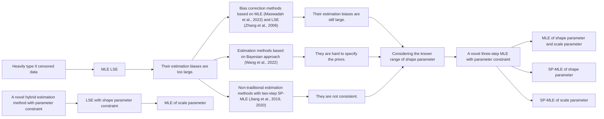

# 威布尔分布下基于重度II型截尾数据的可靠性评估

孟宇辉 郑慧玲 杨军

北京航空航天大学可靠性与系统工程学院，北京，中国

## 通讯作者

杨军，北京航空航天大学可靠性与系统工程学院，北京，中国。邮箱：tomyj2001@buaa.edu.cn

## 基金信息

国家自然科学基金，资助号：72371008、72301015、71971009

## 摘要

现场采集的寿命数据通常为重度截尾数据，在此情况下，基于重度截尾数据获得准确的可靠性评估极具挑战性。对于重度II型截尾数据，传统方法（即极大似然估计（MLE）和最小二乘估计（LSE））的参数估计偏差仍然较大，而贝叶斯方法在实践中难以指定先验分布。因此，本研究考虑威布尔分布形状参数的现有范围，提出了两种新的参数估计方法：三步MLE法和混合估计法。三步MLE法首先分别用MLE获得形状和尺度参数的初始估计，然后利用形状参数的范围约束，通过单参数MLE方法进行更新。混合估计法先用带范围约束的LSE方法估计形状参数，再用MLE获得尺度参数估计。在此基础上，进行了两个数值算例以验证所提方法的一致性和有效性。最后，给出了涡轮发动机案例研究，以验证所提方法的有效性和适用性。

## 关键词

重度II型截尾数据、最小二乘估计、极大似然估计、参数估计、威布尔分布

## 1 引言

随着科学技术的快速发展，高可靠性、长寿命的产品不断涌现，使得在考虑试验成本和时间的同时难以获得充分的寿命数据。[1,2] 此外，现场采集的寿命数据通常为重度截尾数据，[3,4] 且截尾比例通常大于0.5。这类数据被称为重度截尾数据，其信息量严重不足。因此，从重度截尾失效数据中获得准确的可靠性评估是一项重大挑战。

几种统计分布，包括对数正态分布、指数分布和威布尔分布，常被用来描述产品的寿命数据。其中，由形状参数和尺度参数定义的威布尔分布被广泛应用于各类产品的建模，如滚珠轴承和汽车零部件。[5] 此外，定数截尾数据在实践中经常获得，即试验将在预先确定的失效数 $r$ 时终止。对于重度II型截尾数据，经典的参数估计方法，如极大似然估计（MLE）和最小二乘估计（LSE），无法提供稳定且精确的估计。[6,7]

因此，已有若干研究致力于解决重度截尾数据的估计问题。一些研究者基于MLE提出了新的估计方法。在自适应逐步II型截尾数据下，Yan等[8]采用MLE和自助法评估产品可靠性。此外，对于广义I型截尾数据，Starling等[9]将改进的MLE与过采样技术相结合来估计威布尔参数。通过大量模拟和比较研究，Yang等[10]比较了各种方法的估计性能，并给出了小样本下的建议。此外，Zhu等[11]提出了一种新的牛顿-拉夫森算法，用于计算修正逐步混合截尾数据下的MLE估计。对于广义逐步混合截尾数据，Maswadah等[12]利用龙格-库塔技术提出了一种改进的MLE方法。对于I型截尾数据，Makalic等[13]开发了一种新的偏差调整MLE方法，以提高形状参数的估计精度。此外，为解决尺度参数的估计问题，Kumar等[14]将广义帕累托分布与MLE方法相结合，获得了更好的尺度参数估计。上述前期研究主要集中在MLE，而对LSE也有一些研究。例如，Zhang等[15]发现形状参数的估计偏差可以建模为样本量和截尾程度的函数，他们针对完全数据和截尾数据提出了降偏差函数。Jiang[16]提出了一种新的数据增强方法，并将其与LSE结合来给出分布参数的点估计。上述方法优于经典方法，但它们忽略了额外的失效信息，无法为重度截尾数据提供令人满意的可靠性评估结果。[17]

为进一步提高参数估计精度，已有研究尝试提取和利用额外的失效信息。例如，Ducros等[18]将贝叶斯方法与自助法相结合，解决重度截尾数据下双组分威布尔混合模型的参数估计问题。对于II型截尾数据，Algarni等[19]利用平方误差损失函数和伽马分布作为未知参数的共轭先验分布，提出了一种新的贝叶斯方法。同时，一些研究者将贝叶斯方法与LSE、[20] MLE[17]或其他技术[21,22]相结合，以减少估计偏差。此外，Liu等[23]针对I型截尾数据提出了一种新的参数估计方法，该方法将贝叶斯方法与加权最小二乘法相结合。以形状参数值作为先验信息，Zhang等[24,25]基于贝叶斯方法为零失效数据开发了两种估计方法。他们指出，失效时间数据包含大量有用信息，对威布尔分布形状参数的估计有显著影响。因此，这些基于贝叶斯方法的参数估计方法对重度截尾数据具有良好的性能。然而，它们难以指定先验分布且缺乏可操作性，[25,26]无法提供令人满意的可靠性评估结果。

为解决上述问题，一些研究提出了非传统方法，利用失效数据的特性来提取额外信息。考虑到两步单参数MLE（SP-MLE）方法和已知重度截尾数据集的特点，Jiang等[6,27]提出了两种新方法来估计威布尔分布的参数和平均失效时间（MTTF）。这些方法为随机重度截尾数据的可靠性评估提供了新思路，通常涉及两个步骤。第一步是利用收集的失效数据信息来估计MTTF，例如使用基于经验的方法（EBM）[6]或部分基于经验的方法（PEBM）。[27] 然后，利用MTTF的估计值，通过SP-MLE估计形状参数。一旦确定了形状参数的估计值，尺度参数也通过SP-MLE计算。对于随机重度截尾数据，这两种方法的参数估计比MLE和LSE准确得多。然而，如第2.2小节所示，它们对于II型截尾数据不是一致的。

综上所述，对于重度II型截尾数据，现有工作存在三个缺点：（1）MLE和LSE获得的参数估计偏差仍然较大；（2）贝叶斯方法在实践中难以指定先验分布；（3）来自失效数据的非传统方法对II型截尾数据不是一致的。因此，仍需进一步研究。通过对重度截尾数据参数估计的上述分析，利用额外信息对于提高分布参数的估计精度至关重要。因此，应首先探索一种更简单的方式来利用额外的有用信息，以获得更好的分布参数估计。

对于服从威布尔分布的产品，众所周知，形状参数对应于失效机制，这对获得形状参数的准确估计非常重要。对于服从威布尔分布的产品，当形状参数在零和一之间时，产品处于早期失效阶段；当形状参数等于一时，威布尔分布等价于指数分布。此外，当形状参数大于一时，产品趋于耗损失效，这与损伤累积过程相关，通常归因于设备的磨损、撕裂和老化。因此，基于耗损失效的产品，应考虑表征失效机制的参数，以获得威布尔分布更准确的参数估计结果。

flowchart

**图1** 所提方法对重度II型截尾数据的基本原理

已有若干研究讨论了不同产品威布尔分布的形状参数范围。例如，Jiang[28]指出，对于设计和制造良好的产品，形状参数的区间可以大于2，但很少大于4。再如，旋翼机复合材料寿命的形状参数合理范围为1.84到2.891。[29] Yang等[30]探索了描述岩石脆性破坏行为的形状参数范围，他们研究认为形状参数应大于1且小于6。总的来说，通过某种方式确定威布尔分布有价值的形状参数范围是可行的。这些方式包括但不限于：（1）来自类似产品的历史数据或可用数据；[31,32] （2）基于广泛工程理论和经验的专家信息，以确定准确的形状参数范围。[33,34] 因此，准确的形状参数范围可以显著有助于获得重度截尾数据的稳定和准确参数估计。此外，如上所述，现有方法大多基于MLE和LSE或其变体。因此，基于实践中获得的形状参数范围约束，本研究通过将额外的有用信息分别引入MLE和LSE，为重度II型截尾数据提出了两种新的估计方法。

因此，考虑到威布尔分布形状参数的范围约束，本研究提出了两种新的参数估计方法。所提方法的基本原理如图1所示。对于重度II型截尾数据，传统方法（即MLE和LSE）的参数估计偏差仍然较大。贝叶斯方法在实践中难以指定先验分布，非传统方法对II型截尾数据不是一致的。因此，考虑到威布尔分布形状参数的现有范围，本研究提出了两种新的参数估计方法：三步MLE法和混合估计法。三步MLE法首先分别用MLE获得形状和尺度参数的初始估计，然后利用形状参数的范围约束，通过单参数MLE方法进行更新。混合估计法先用带范围约束的LSE方法估计形状参数，再用MLE估计尺度参数。本研究的主要贡献如下。

1. 考虑形状参数的现有范围，提出了一种新的带参数约束的三步极大似然估计（MLE）方法，以有效估计重度II型截尾数据下威布尔分布的参数。
2. 考虑形状参数的现有范围，使用约束最小二乘估计来估计形状参数，采用MLE估计尺度参数，从而获得了一种新的重度II型截尾数据混合估计方法。
3. 通过模拟研究了所提两种方法的良好统计性质。

本研究的其余部分组织如下。第2节详细描述了重度截尾数据的相关方法。第3节考虑形状参数的范围约束，为重度II型截尾数据提出了两种新的参数估计方法。第4节通过模拟评估所提两种方法的性能和一致性，并进行敏感性分析以评估形状参数和样本量的影响。第5节提供了一个实际应用案例，以展示所提两种方法的有效性。最后，第6节对本研究进行总结。

## 2 重度截尾数据的相关工作

本节将首先介绍重度截尾数据的描述，然后简要回顾一些过去和当前常用的参数估计方法，最后基于重度II型截尾数据评估它们的性能。

## 2.1 重度截尾数据

假设有一个包含 $n$ 个单位的随机样本，选择进行试验并在 $r$ 个失效时终止，获得失效数据 $t_1, t_2, \ldots, t_r$，其中 $r \leq n$。对于重度截尾数据，截尾程度为 $c = (n - r) / n \geq 0.5$。

威布尔分布是可靠性工程中广泛应用的分布，常用于描述寿命数据。[35–37] 假设产品寿命服从威布尔分布，其累积分布函数（CDF）定义为

$$
F(t) = 1 - \exp\left[-\left(\frac{t}{\eta}
ight)^{\beta}
ight], \quad t \geq 0, \tag{1}
$$

其概率密度函数（PDF）为

$$
f(t) = \frac{\beta t^{\beta-1}}{\eta^{\beta}} \exp\left[-\left(\frac{t}{\eta}
ight)^{\beta}
ight], \quad t \geq 0, \tag{2}
$$

其中 $\beta > 0$ 为形状参数，$\eta > 0$ 为尺度参数。

## 2.2 相关方法与性能评估

本节将简要介绍一些当前用于重度II型截尾数据的估计方法，然后通过模拟评估它们的性能。

## 2.2.1 MLE和LSE

对于来自服从威布尔分布的 $n$ 个项目的失效观测数据 $t_1, t_2, \ldots, t_r$，形状参数为 $\beta$，尺度参数为 $\eta$，对数似然函数为

$$
\ln(L) = \sum_{i=1}^{n} \ln[f(t_i)] + (\ln[1 - F(t_r)])^{n-r}. \tag{3}
$$

然后，$\beta$ 和 $\eta$ 的MLE（分别记为 $\hat{\beta}_M$ 和 $\hat{\eta}_M$）可以通过最大化公式(3)计算得到。

**表1** 极大似然估计（MLE）和最小二乘估计（LSE）模拟研究的设定参数

<table><tr><td>参数</td><td colspan="4">设定值</td></tr><tr><td> $\beta$ </td><td colspan="4">1.1, 1.3, 1.5, 2.5</td></tr><tr><td> $\eta$ </td><td colspan="4">1</td></tr><tr><td>n</td><td>10</td><td>20</td><td>30</td><td>50</td></tr><tr><td>c</td><td>0.2, 0.4, 0.6</td><td>0.2, 0.4, 0.6, 0.8</td><td>0.2, 0.4, 0.6, 0.8</td><td>0.2, 0.4, 0.6, 0.8</td></tr></table>

此外，$\beta$ 和 $\eta$ 的LSE（分别记为 $\hat{\beta}_L$ 和 $\hat{\eta}_L$）可以使用线性回归模型获得。首先对公式(1)两边取两次对数，线性回归模型表示为

$$
\ln\left(\ln\left(\frac{1}{1 - F(t_i)}
ight)
ight) = \beta \ln(t_i) - \beta \ln(\eta), \tag{4}
$$

其中 $1 \leq i \leq n$。令 $y_i = \ln\left(\ln\left(\frac{1}{1 - F(t_i)}
ight)
ight)$ 和 $x_i = \ln(t_i)$，公式(4)可以转换为

$$
y_i = a + bx_i, \quad 1 \leq i \leq n. \tag{5}
$$

则 $t_i$ 处的经验CDF为

$$
F(t_i) = \frac{i}{n+1}, \quad 1 \leq i \leq n, \tag{6}
$$

将(6)代入(5)，$\beta$ 和 $\eta$ 的LSE分别记为 $\hat{\beta}_L$ 和 $\hat{\eta}_L$，

$$
\hat{\beta}_L = b, \tag{7}
$$

$$
\hat{\eta}_L = \exp(b/a). \tag{8}
$$

对于高可靠性产品，平均失效时间（MTTF）是工程中的重要指标，它描述了系统的寿命可靠性。[38] 利用 $\beta$ 和 $\eta$ 的估计值（即 $\hat{\beta}$ 和 $\hat{\eta}$），可靠性参数MTTF（记为 $\mu$）可以估计为

$$
\hat{\mu} = \int_{0}^{\infty} t \times f(t) dt = \hat{\eta} \times \Gamma\left(1 + \frac{1}{\hat{\beta}}
ight), \tag{9}
$$

其中 $\Gamma(\cdot)$ 为伽马函数，$\hat{\mu}$ 为 $\mu$ 的估计量。

## 2.2.2 MLE和LSE的性能评估

在本小节中，通过模拟研究评估MLE和LSE在重度II型截尾数据下的性能。不失一般性，尺度参数 $\eta$ 设为1。每次模拟运行时，我们从威布尔分布中生成 $n$ 个数据，参数组合为 $(\beta, \eta)$。表1列出了模拟研究中使用的不同参数设定。生成的 $n$ 个数据在第 $r$ 个失效时终止（即 $r = n - n \times c$），从而生成II型截尾数据集。然后，对每个 $(\beta, \eta, n, c)$ 组合进行 $m$ 次II型截尾数据集模拟，其中截尾程度 $c = (n - r) / n$。

为评估MLE和LSE在不同截尾程度 $c$ 和样本量 $n$ 下的性能，本节考虑 $n \in \{10, 20, 30, 50\}$ 和 $c \in \{0.2, 0.4, 0.6, 0.8\}$ 的情况。然而，由于过小样本的统计推断困难，确保观测失效数大于或等于5至关重要。[39] 具体地，当 $n = 10$ 且 $c = 0.8$ 时，观测失效数为4，无法实现参数估计。因此，$n$ 和 $c$ 的详细设定如表1所示。

对于每个生成的II型截尾数据集，估计误差可以用平均绝对误差（MAE）、[9] 均方误差（MSE）[40] 和平均绝对百分比误差（MAPE）[41] 来衡量，它们分别定义为估计参数（即 $\hat{\beta}$、$\hat{\eta}$、$\hat{\mu}$）与真实值（即 $\beta$、$\eta$、$\mu$）之差的平均绝对值、平均平方值和平均绝对百分比值。通常，MAE、MSE和MAPE的值越小，参数的估计结果越准确。MAE、MSE和MAPE的表达式如下，

$$
\mathrm{MAE} = \frac{1}{m} \sum_{i=1}^{m} |\theta - \hat{\theta}|, \tag{10}
$$

$$
\mathrm{MSE} = \frac{1}{m} \sum_{i=1}^{m} (\theta - \hat{\theta})^2, \tag{11}
$$

$$
\mathrm{MAPE} = \frac{1}{m} \sum_{i=1}^{m} \left|\frac{\theta - \hat{\theta}}{\theta}
ight| \times 100\%, \tag{12}
$$

其中 $m$ 为模拟次数，$\hat{\theta}$ 和 $\theta$ 分别表示 $\theta = \beta, \eta, \mu$（即 $\hat{\beta}, \hat{\eta}, \hat{\mu}$）的点估计和真实值。随后，取 $m = 10,000$，可以计算 $\beta$、$\eta$ 和 $\mu$ 的三个估计指标（即MAE、MSE和MAPE）。相应的模拟结果见附录A的表A1和表A2。

根据表A1和表A2可以看出，上述两种方法的估计误差（即MAE、MSE和MAPE）过大，特别是当 $c$ 大于0.5时，这表明MLE和LSE对重度截尾程度是不精确的。此外，MLE对 $\eta$ 和 $\mu$ 的估计误差几乎都小于LSE。然而，$\beta$ 的估计误差表现出不同的模式，例如，当 $n = 30$ 且 $c = 0.6$ 时，MLE对 $\beta$ 的估计误差小于LSE，而当 $n = 10$ 且 $c = 0.6$ 时，LSE的估计误差小于MLE。

因此，有必要基于MLE和LSE方法的特点，提出更有效的方法来提高参数估计的准确性。

## 2.2.3 部分基于经验的方法

最近，在重度截尾数据的参数估计方面取得了一些突破。Jiang[27]提出了一种PEBM来优化估计过程，特别是提出了一种两步SP-MLE方法，利用MTTF的现有信息迭代更新参数估计结果。该方法的一个重要特点是利用了额外信息，即MTTF的初始信息。因此，为评估PEBM的估计性能，本小节进行了一项模拟研究，观测程度（od）定义为观测失效数据占总样本的比例，即

$$
od = 1 - c, \tag{13}
$$

其中 $c$ 表示截尾程度。

每次模拟运行时，我们从参数设定为 $\beta = 2.5, \mu = 100$ 的威布尔分布中生成 $n = 50$ 个数据点。模拟和估计过程重复 $m = 10,000$ 次。然后，在不同的观测程度 $od \in \{0.1, 0.2, 0.3, 0.4, 0.5, 0.6, 0.7, 0.8, 0.9\}$ 下，计算三种现有方法（即PEBM、MLE和LSE）对 $\beta$、$\eta$ 和 $\mu$ 的MAE，结果如图2所示。

通过比较，在极度重度截尾数据（即 $c \geq 0.8$）下，PEBM的MAE小于MLE和LSE，表现出比传统方法（即MLE和LSE）更好的性能，这表明额外信息可以显著提高 $\beta$、$\eta$ 和 $\mu$ 的估计精度。然而，如图2所示，PEBM对 $\beta$、$\eta$ 和 $\mu$ 的MAE并不能随着观测程度的增加而始终呈现下降趋势，因此PEBM对II型截尾数据不是一致的。

因此，考虑到额外有用信息的利用，本研究旨在提出一些一致的估计方法。

line chart

| observing degrees | PEBM | MLE | LSE |
| ------------------ | ---- | --- | --- |
| 0.1                | 0.22 | 0.80 | 0.64 |
| 0.2                | 0.13 | 0.37 | 0.40 |
| 0.3                | 0.20 | 0.25 | 0.31 |
| 0.4                | 0.22 | 0.21 | 0.26 |
| 0.5                | 0.23 | 0.19 | 0.23 |
| 0.6                | 0.21 | 0.17 | 0.21 |
| 0.7                | 0.18 | 0.15 | 0.18 |
| 0.8                | 0.15 | 0.13 | 0.16 |
| 0.9                | 0.13 | 0.11 | 0.14 |

(A) MAEs of $\beta$

line chart

| observing degrees | PEBM  | MLE   | LSE   |
| ------------------ | ----- | ----- | ----- |
| 0.1                | 0.18  | 0.44  | 0.65  |
| 0.2                | 0.16  | 0.25  | 0.55  |
| 0.3                | 0.24  | 0.16  | 0.47  |
| 0.4                | 0.27  | 0.12  | 0.40  |
| 0.5                | 0.25  | 0.10  | 0.33  |
| 0.6                | 0.20  | 0.08  | 0.27  |
| 0.7                | 0.14  | 0.06  | 0.21  |
| 0.8                | 0.08  | 0.05  | 0.15  |
| 0.9                | 0.05  | 0.04  | 0.10  |

(B) MAEs of

line chart

| observing degrees | PEBM  | MLE   | LSE   |
| ------------------ | ----- | ----- | ----- |
| 0.1                | 0.18  | 0.43  | 0.62  |
| 0.2                | 0.16  | 0.24  | 0.53  |
| 0.3                | 0.25  | 0.16  | 0.45  |
| 0.4                | 0.30  | 0.12  | 0.39  |
| 0.5                | 0.31  | 0.10  | 0.32  |
| 0.6                | 0.29  | 0.08  | 0.26  |
| 0.7                | 0.26  | 0.07  | 0.21  |
| 0.8                | 0.22  | 0.06  | 0.15  |
| 0.9                | 0.18  | 0.05  | 0.11  |

**图2** 当 $\beta = 2.5$ 和 $n = 50$ 时，部分基于经验方法（PEBM）、极大似然估计（MLE）和最小二乘估计（LSE）的平均绝对误差（MAE）

## 3 所提参数估计方法

如第2节所述，额外的有用信息对于提高重度截尾数据参数 $\beta$、$\eta$ 和 $\mu$ 的估计精度至关重要。此外，获得失效机制表征参数的有价值范围比其他额外有用信息更可行，因为该参数可以表征产品的失效信息。

对于威布尔分布，形状参数 $\beta$ 可以表征产品的失效机制。因此，通过现有的理论研究和实践中的工程经验，获得特定产品 $\beta$ 的可靠范围是可行的。通常，$\beta$ 的约束形式为

$$
\beta_{min} \leq \beta \leq \beta_{max},
$$

其中 $\beta_{min} \geq 1$，因为对于耗损失效，$\beta$ 始终大于1。

如第2.2.2小节所述，在不同样本量 $n$ 和截尾程度 $c$ 下，$\beta$ 的估计误差表现出不同的模式，例如，当 $n = 30$ 且 $c = 0.6$ 时，MLE对 $\beta$ 的估计误差小于LSE，而当 $n = 10$ 且 $c = 0.6$ 时，LSE的估计误差小于MLE。因此，本研究应考虑MLE和LSE的特点。

综上所述，考虑到MLE和LSE的特点，本节将提出两种一致的估计方法，以形状参数的现有范围作为额外信息，以提高参数估计精度。

## 3.1 带形状参数约束的新型三步MLE

以形状参数的范围作为额外有用信息，我们基于PEBM提出了一种带形状参数约束的新型三步MLE（CMLE），以获得准确的参数估计。详细步骤如下。

首先，通过MLE获得 $\beta$ 和 $\eta$ 的初始估计（分别记为 $\beta_{C0}$ 和 $\eta_{C0}$）。因此，$\mu$ 的初始估计（记为 $\mu_{C0}$）可以通过以下公式计算：

$$
\mu_{C0} = \eta_{C0} \Gamma\left(1 + \frac{1}{\beta_{C0}}
ight). \tag{14}
$$

其次，对 $\beta$ 施加精确约束，以获得参数 $\beta$、$\eta$ 和 $\mu$ 的准确估计。利用 $\eta_{C0}$ 的估计值，$\beta$ 的估计（即 $\beta_C$）通过以下线性规划进行更新：

$$
\max \quad r \ln \beta - r \ln \eta + (\beta - 1) \sum_{i=1}^{r} \ln t_i - \frac{1}{\beta} \sum^{*} t_i^{\beta}, \tag{15}
$$

$$
\text{s.t.} \quad 1 \leq \beta_{min} \leq \beta \leq \beta_{max}.
$$

其中 $\eta = \eta_{C0}$，$\sum^{*} t_i^{\beta} = \sum_{i=1}^{r} t_i^{\beta} + (n-r) t_r^{\beta}$。

第三，固定 $\beta_C$，使用SP-MLE重新估计 $\eta$（记为 $\eta_C$），公式如下：

$$
\eta_C = \mu_{C0} / \Gamma(1 + 1/\beta_C). \tag{16}
$$

已知 $\beta_C$ 和 $\eta_C$，$\mu$ 的估计（记为 $\mu_C$）通过以下公式计算：

$$
\mu_C = \eta_C \Gamma\left(1 + \frac{1}{\beta_C}
ight). \tag{17}
$$

最后，通过所提CMLE方法获得 $\beta$、$\eta$ 和 $\mu$ 的最终估计（即 $\beta_C$、$\eta_C$ 和 $\mu_C$）。

## 3.2 带形状参数约束的混合估计方法

考虑到 $\beta$ 的现有范围，我们提出了一种混合估计方法（HEM），以提高重度II型截尾数据下参数的估计精度。详细步骤如下。

首先，带现有限制 $[\beta_{min}, \beta_{max}]$ 的LSE由以下非线性规划给出：

$$
\max \sum_{i=1}^{n} \left(y_i' - (\hat{a} + \hat{\beta} x_i)
ight)^2, \tag{18}
$$

$$
\text{s.t.} \quad 1 \leq \beta_{min} \leq \beta \leq \beta_{max}.
$$

因此，$\beta$ 的估计（记为 $\beta_H$）计算为 $\beta_H = b$。

其次，$\eta$ 的精确估计可以通过MLE获得。对公式(3)两边的 $\beta$ 和 $\eta$ 求导并令导数为零，我们可以得到以下两个方程：

$$
\frac{\partial \ln L}{\partial \beta} = \frac{\sum_{i=1}^{r} t_i^{\beta} \ln t_i + (n-r) t_r^{\beta} \ln t_r}{\sum_{i=1}^{r} t_i^{\beta} + (n-r) t_r^{\beta}} - \frac{1}{\beta} - \frac{1}{r} \sum_{i=1}^{r} \ln t_i, \tag{19}
$$

$$
\eta^{\beta} = \frac{\sum_{i=1}^{r} t_i^{\beta} + (n-r) t_r^{\beta}}{r}, \tag{20}
$$

$\eta$ 的估计（记为 $\eta_H$）通过公式(20)计算。

第三，$\mu$ 的估计（记为 $\mu_H$）可以通过以下公式计算：

$$
\mu_H = \eta_H \Gamma\left(1 + \frac{1}{\beta_H}
ight). \tag{21}
$$

最后，通过所提HEM方法获得 $\beta$、$\eta$ 和 $\mu$ 的最终估计（即 $\beta_H$、$\eta_H$ 和 $\mu_H$）。

## 4 模拟研究

考虑到 $\beta$ 的范围约束，第3节介绍了重度II型截尾数据下的所提方法（即CMLE和HEM）。本节旨在研究CMLE和HEM的统计性质，并验证形状参数范围和有效样本量 $n_r$ 对参数 $\beta$、$\eta$ 和 $\mu$ 估计精度的影响。

**表2** 一致性模拟研究的设定参数

<table><tr><td>β</td><td colspan="2">β的范围</td><td>n</td><td>c</td><td>η</td><td>m</td></tr><tr><td rowspan="3">1.1</td><td>范围1</td><td>[1.07, 1.4]</td><td>50, 20</td><td>0.2, 0.4, 0.6, 0.8</td><td>1</td><td>10,000</td></tr><tr><td>范围2</td><td>[1.04, 1.7]</td><td></td><td></td><td></td><td></td></tr><tr><td>范围3</td><td>[1.01, 2.0]</td><td></td><td></td><td></td><td></td></tr><tr><td rowspan="3">1.3</td><td>范围1</td><td>[1.25, 1.6]</td><td>50, 20</td><td>0.2, 0.4, 0.6, 0.8</td><td>1</td><td>10,000</td></tr><tr><td>范围2</td><td>[1.2, 1.9]</td><td></td><td></td><td></td><td></td></tr><tr><td>范围3</td><td>[1.15, 2.2]</td><td></td><td></td><td></td><td></td></tr><tr><td rowspan="3">1.5</td><td>范围1</td><td>[1.4, 1.8]</td><td>50, 20</td><td>0.2, 0.4, 0.6, 0.8</td><td>1</td><td>10,000</td></tr><tr><td>范围2</td><td>[1.3, 2.1]</td><td></td><td></td><td></td><td></td></tr><tr><td>范围3</td><td>[1.2, 2.4]</td><td></td><td></td><td></td><td></td></tr></table>

## 4.1 所提方法的一致性

本节通过模拟评估CMLE和HEM在重度II型截尾数据下的一致性。

类似地，每次模拟运行时，从威布尔分布中生成 $n$ 个数据，参数为 $\beta$ 和 $\eta$。不失一般性，$\eta$ 设为1。表2列出了本模拟研究中使用的不同参数设定。然后，对每个 $(\beta, \eta, \beta的范围, c)$ 组合进行 $m$ 次模拟，并通过CMLE和HEM计算 $\beta$、$\eta$ 和 $\mu$ 的三个估计指标（即MAE、MSE和MAPE）。CMLE和HEM计算的估计结果分别列于表B1–B4中。

根据表A1和表A2以及表B1–B4，在重度截尾数据（即 $c > 0.5$）下，CMLE和HEM的估计误差（即MAE、MSE和MAPE）都小于MLE和LSE。此外，在所有情况下，随着截尾程度的降低，CMLE和HEM对 $\beta$、$\eta$ 和 $\mu$ 的估计误差（即MAE、MSE和MAPE）都逐渐减小并收敛到相同的值。因此，对于重度II型截尾数据，我们可以得出HEM和CMLE都是一致的，比MLE和LSE更可靠和准确。使用表A1和表A2以及表B1–B4中的所有三个评估指标（即MAE、MSE和MAPE）得出了相同的结论。为了简洁地呈现发现和结论，后续计算可以以MAE为例。

## 4.2 所提两种方法的敏感性分析

为探讨不同参数变化对参数估计精度的影响，本小节对CMLE和HEM进行了敏感性分析。

由于额外信息越充分，参数估计结果越准确，[25] 此外，有效样本量 $n_r$ 可以影响CMLE和HEM对参数 $\beta$、$\eta$ 和 $\mu$ 的估计精度，其描述为

$$
n_r = n \times (1 - c), \tag{22}
$$

其中 $n$ 和 $c$ 分别表示II型截尾数据集的样本量和截尾程度。

因此，本节主要讨论两个敏感性因素（即形状参数 $\beta$ 的范围和 $n_r$）对CMLE和HEM参数 $\beta$、$\eta$ 和 $\mu$ 估计精度的影响。

根据第4.1小节的模拟结果（即表B1–B4），采用相对偏差（REB）来定量衡量 $\beta$ 范围（或 $n_r$）的变化对所提方法的相对改善程度。它定义为在更准确范围或更大 $n_r$（记为 $H_l$）下计算的估计指标（即MAE、MSE和MAPE）相对于在较不准确范围或较小 $n_r$（记为 $H_s$）下获得的估计指标的相对变化值。通常，REB的绝对值越大，$H_l$ 和 $H_s$ 之间的差异越大，其正值表示减小，负值表示增大。REB的表达式如下：

$$
REB(H) = \frac{H_l - H_s}{H_s} \times 100\%, \tag{23}
$$

**表3** 形状参数约束（CMLE）的REB变化（$\beta$、$\eta$ 和 $\mu$ 的平均绝对误差（MAE））（$c = 0.8$）

<table><tr><td>参数设定</td><td>β的范围变化</td><td>n</td><td>β的REB (%)</td><td>η的REB (%)</td><td>μ的REB (%)</td></tr><tr><td rowspan="4">β = 1.1</td><td rowspan="2">范围3→范围2</td><td>20</td><td>25.58</td><td>6.46</td><td>6.88</td></tr><tr><td>50</td><td>16.59</td><td>5.07</td><td>5.39</td></tr><tr><td rowspan="2">范围2→范围1</td><td>20</td><td>44.10</td><td>9.46</td><td>11.33</td></tr><tr><td>50</td><td>36.03</td><td>11.52</td><td>12.52</td></tr><tr><td rowspan="4">β = 1.3</td><td rowspan="2">范围3→范围2</td><td>20</td><td>26.69</td><td>7.32</td><td>7.81</td></tr><tr><td>50</td><td>19.02</td><td>7.14</td><td>7.68</td></tr><tr><td rowspan="2">范围2→范围1</td><td>20</td><td>45.07</td><td>9.51</td><td>10.93</td></tr><tr><td>50</td><td>38.41</td><td>12.99</td><td>14.14</td></tr><tr><td rowspan="4">β = 1.5</td><td rowspan="2">范围3→范围2</td><td>20</td><td>27.30</td><td>8.97</td><td>9.71</td></tr><tr><td>50</td><td>20.20</td><td>10.21</td><td>11.16</td></tr><tr><td rowspan="2">范围2→范围1</td><td>20</td><td>45.59</td><td>10.01</td><td>11.15</td></tr><tr><td>50</td><td>39.88</td><td>15.41</td><td>16.71</td></tr></table>

**表4** 混合估计方法（HEM）的REB变化（$\beta$、$\eta$ 和 $\mu$ 的平均绝对误差（MAE））（$c = 0.8$）

<table><tr><td>参数设定</td><td>β的范围变化</td><td>n</td><td>β的REB (%)</td><td>η的REB (%)</td><td>μ的REB (%)</td></tr><tr><td rowspan="4">β = 1.1</td><td rowspan="2">范围3→范围2</td><td>20</td><td>24.85</td><td>5.46</td><td>6.24</td></tr><tr><td>50</td><td>18.76</td><td>5.78</td><td>6.30</td></tr><tr><td rowspan="2">范围2→范围1</td><td>20</td><td>42.81</td><td>7.17</td><td>8.81</td></tr><tr><td>50</td><td>37.63</td><td>11.22</td><td>12.39</td></tr><tr><td rowspan="4">β = 1.3</td><td rowspan="2">范围3→范围2</td><td>20</td><td>26.14</td><td>6.66</td><td>7.60</td></tr><tr><td>50</td><td>20.90</td><td>8.03</td><td>8.91</td></tr><tr><td rowspan="2">范围2→范围1</td><td>20</td><td>35.03</td><td>7.67</td><td>9.00</td></tr><tr><td>50</td><td>39.96</td><td>12.78</td><td>14.12</td></tr><tr><td rowspan="4">β = 1.5</td><td rowspan="2">范围3→范围2</td><td>20</td><td>26.90</td><td>10.52</td><td>12.32</td></tr><tr><td>50</td><td>22.23</td><td>13.03</td><td>14.75</td></tr><tr><td rowspan="2">范围2→范围1</td><td>20</td><td>44.82</td><td>9.70</td><td>11.13</td></tr><tr><td>50</td><td>41.46</td><td>16.16</td><td>17.82</td></tr></table>

其中 $H$ 代表估计指标之一（即MAE、MSE和MAPE）。

## 1. 形状参数范围对参数估计精度的影响

为验证形状参数范围对参数估计精度的影响，本节在每个 $\beta$ 值下改变形状参数的范围，通过保持 $n$ 和 $c$ 不变使 $n_r$ 保持不变。

以MAE为例，通过公式(23)计算某些组合（即 $n = 50, 20$ 和 $c = 0.8$）下不同范围的REB(MAE)值，结果列于表3和表4中。

根据表3和表4，REB(MAE)的值始终大于0，这意味着更可靠和准确的 $\beta$ 范围可以显著有助于提高参数估计精度。此外，$n = 20$ 时 $\beta$ 的REB(MAE)大于 $n = 50$ 时的值，这初步表明样本量越小，$\beta$ 的范围约束对 $\beta$ 估计精度的影响越大。因此，HEM和CMLE适用于解决小样本和重度截尾样本下的参数估计问题。

此外，$\beta$ 的范围约束对不同参数的估计精度有不同的影响。具体来说，$\beta$ 的范围约束对 $\mu$ 估计精度的影响高于对 $\eta$ 和 $\mu$ 的影响。从其他参数组合和估计指标（即MSE和MAPE）下的表B1–B4可以得出相同的结论。

## 2. 有效样本量对参数估计精度的影响

**表5** 敏感性分析模拟研究的设定参数

<table><tr><td> $\beta$ </td><td> $n_r$ </td><td> $\beta$ 的范围 </td><td>c</td><td> $\eta$ </td><td> $\mu$ </td><td>m</td></tr><tr><td rowspan="4">1.5</td><td>3, 6, 9, 12, 15, 18, 21, 24, 27</td><td rowspan="4">[1.3, 2.1]</td><td>0.6</td><td>110.8</td><td>100</td><td>10,000</td></tr><tr><td>3, 6, 9, 12, 15, 18, 21, 24, 27</td><td>0.7</td><td></td><td></td><td></td></tr><tr><td>3, 6, 9, 12, 15, 18, 21, 24, 27</td><td>0.8</td><td></td><td></td><td></td></tr><tr><td>3, 6, 9, 12, 15, 18, 21, 24, 27</td><td>0.9</td><td></td><td></td><td></td></tr><tr><td rowspan="3">2.5</td><td>3, 6, 9, 12, 15, 18, 21, 24, 27</td><td rowspan="4">[2.3, 3.1]</td><td>0.6</td><td>112.7</td><td>100</td><td>10,000</td></tr><tr><td>3, 6, 9, 12, 15, 18, 21, 24, 27</td><td>0.7</td><td></td><td></td><td></td></tr><tr><td>3, 6, 9, 12, 15, 18, 21, 24, 27</td><td>0.8</td><td></td><td></td><td></td></tr><tr><td></td><td>3, 6, 9, 12, 15, 18, 21, 24, 27</td><td>0.9</td><td></td><td></td><td></td></tr><tr><td rowspan="3">3.5</td><td>3, 6, 9, 12, 15, 18, 21, 24, 27</td><td rowspan="3">[3.3, 4.1]</td><td>0.6</td><td>111.1</td><td>100</td><td>10,000</td></tr><tr><td>3, 6, 9, 12, 15, 18, 21, 24, 27</td><td>0.7</td><td></td><td></td><td></td></tr><tr><td>3, 6, 9, 12, 15, 18, 21, 24, 27</td><td>0.8</td><td></td><td></td><td></td></tr></table>

line chart

| nr (β=2.5,c=0.6) | CMLE  | HEM   | HEM.without.contraints |
| ---------------- | ----- | ----- | ---------------------- |
| 3                | 0.18  | 0.14  | 0.68                   |
| 6                | 0.17  | 0.14  | 0.48                   |
| 9                | 0.15  | 0.14  | 0.35                   |
| 12               | 0.14  | 0.14  | 0.32                   |
| 15               | 0.13  | 0.14  | 0.29                   |
| 18               | 0.13  | 0.14  | 0.28                   |
| 21               | 0.13  | 0.14  | 0.27                   |
| 24               | 0.12  | 0.14  | 0.25                   |
| 27               | 0.12  | 0.14  | 0.24                   |

(A) MAEs of $\beta$

line chart

| n_r | CMLE  | HEM   |
| --- | ----- | ----- |
| 3   | 0.165 | 0.165 |
| 6   | 0.140 | 0.140 |
| 9   | 0.110 | 0.110 |
| 12  | 0.100 | 0.100 |
| 15  | 0.090 | 0.090 |
| 18  | 0.085 | 0.085 |
| 21  | 0.080 | 0.080 |
| 24  | 0.075 | 0.075 |
| 27  | 0.070 | 0.070 |

(B) MAEs of

line chart

| n_r | CMLE | HEM  |
| --- | ---- | ---- |
| 3   | 0.16 | 0.16 |
| 6   | 0.14 | 0.14 |
| 9   | 0.11 | 0.11 |
| 12  | 0.10 | 0.10 |
| 15  | 0.09 | 0.09 |
| 18  | 0.08 | 0.08 |
| 21  | 0.08 | 0.08 |
| 24  | 0.07 | 0.07 |
| 27  | 0.07 | 0.07 |

**图3** 当 $c = 0.6$ 时，形状参数约束（CMLE）和混合估计方法（HEM）对 $\beta$、$\eta$ 和 $\mu$ 的平均绝对误差（MAE）

为探讨有效样本量对参数估计精度的影响，在重度II型截尾数据下进行了模拟研究。

每次模拟运行时，我们从威布尔分布中生成 $n = n_r / c$ 个数据，参数设定如表5所示。然后，对每个 $(\beta, \eta, n_r, c)$ 组合进行 $m$ 次模拟。对于每个 $(\beta, \eta, c)$ 参数组合，$\beta$ 的范围保持不变，仅 $n_r$ 变化。

在给定的形状参数范围下，CMLE和HEM对参数（即 $\beta$、$\eta$ 和 $\mu$）的MAE分别如图3–6（$\beta = 2.5$）和表6、表7（$\beta = 1.5, 3.5$）所示。

为直观显示敏感性结果，以MAE为例，通过公式(23)计算某些组合下 $n_r$ 变化（即 $n_r$ 从3增加到15和从15增加到27）时 $\beta$、$\eta$ 和 $\mu$ 的REB(MAE)值，结果列于表8中。

根据表8，CMLE的REB(MAE)值都大于0且显著高于HEM的值，这意味着 $n_r$ 对CMLE的影响大于HEM。通常，随着 $n_r$ 的增加，所有参数的MAE应该减小，因为更大的样本包含更多可用信息。然而，根据图3A–6A和表8，HEM对 $\beta$ 的MAE不符合这一模式。为进一步分析这一现象，我们在有和无 $\beta$ 范围约束的两种情况下比较HEM，结果也如图3A–6A所示。

根据这三幅图，随着 $n_r$ 的增加，带形状参数范围约束的 $\beta$ 的MAE逐渐接近无形状参数范围约束的MAE。这表明形状参数约束的效果逐渐减弱，大样本在 $\beta$ 的估计精度中起主要作用。因此，HEM对通过增加有效样本量获得的有用失效信息不够敏感。

**表6** 形状参数约束（CMLE）、极大似然估计（MLE）和LSE在重度截尾程度下对 $\beta = 1.5$ 和 $3.5$ 的平均绝对误差（MAE）

<table><tr><td rowspan="2"></td><td rowspan="2">cnr</td><td colspan="3">0.6</td><td colspan="3">0.7</td><td colspan="3">0.8</td><td colspan="3">0.9</td></tr><tr><td> $\hat{\beta}_{C}$ </td><td> $\hat{\eta}_{C}$ </td><td> $\hat{\mu}_{C}$ </td><td> $\hat{\beta}_{C}$ </td><td> $\hat{\eta}_{C}$ </td><td> $\hat{\mu}_{C}$ </td><td> $\hat{\beta}_{C}$ </td><td> $\hat{\eta}_{C}$ </td><td> $\hat{\mu}_{C}$ </td><td> $\hat{\beta}_{C}$ </td><td> $\hat{\eta}_{C}$ </td><td> $\hat{\mu}_{C}$ </td></tr><tr><td rowspan="9"> $\beta = 1.5$ </td><td>3</td><td>0.2819</td><td>0.2721</td><td>0.2765</td><td>0.3056</td><td>0.3160</td><td>0.3211</td><td>0.3056</td><td>0.3362</td><td>0.3429</td><td>0.3087</td><td>0.3841</td><td>0.3927</td></tr><tr><td>6</td><td>0.2509</td><td>0.2305</td><td>0.2358</td><td>0.2526</td><td>0.2427</td><td>0.2493</td><td>0.2531</td><td>0.2673</td><td>0.2757</td><td>0.2569</td><td>0.3241</td><td>0.3347</td></tr><tr><td>9</td><td>0.2151</td><td>0.1861</td><td>0.1922</td><td>0.2236</td><td>0.2091</td><td>0.2164</td><td>0.2259</td><td>0.2363</td><td>0.2458</td><td>0.2279</td><td>0.2871</td><td>0.2979</td></tr><tr><td>12</td><td>0.2014</td><td>0.1717</td><td>0.1777</td><td>0.2036</td><td>0.1881</td><td>0.1959</td><td>0.2047</td><td>0.2133</td><td>0.2228</td><td>0.2077</td><td>0.2669</td><td>0.2780</td></tr><tr><td>15</td><td>0.1808</td><td>0.1518</td><td>0.1580</td><td>0.1865</td><td>0.1710</td><td>0.1790</td><td>0.1893</td><td>0.1980</td><td>0.2077</td><td>0.1918</td><td>0.2500</td><td>0.2613</td></tr><tr><td>18</td><td>0.1725</td><td>0.1440</td><td>0.1504</td><td>0.1744</td><td>0.1588</td><td>0.1669</td><td>0.1766</td><td>0.1843</td><td>0.1940</td><td>0.1791</td><td>0.2363</td><td>0.2475</td></tr><tr><td>21</td><td>0.1646</td><td>0.1372</td><td>0.1435</td><td>0.1640</td><td>0.1500</td><td>0.1581</td><td>0.1651</td><td>0.1729</td><td>0.1823</td><td>0.1678</td><td>0.2252</td><td>0.2365</td></tr><tr><td>24</td><td>0.1538</td><td>0.1263</td><td>0.1326</td><td>0.1546</td><td>0.1421</td><td>0.1500</td><td>0.1560</td><td>0.1641</td><td>0.1735</td><td>0.1582</td><td>0.2148</td><td>0.2259</td></tr><tr><td>27</td><td>0.1489</td><td>0.1223</td><td>0.1287</td><td>0.1473</td><td>0.1350</td><td>0.1430</td><td>0.1488</td><td>0.1580</td><td>0.1675</td><td>0.1508</td><td>0.2068</td><td>0.2178</td></tr><tr><td rowspan="9"> $\beta = 3.5$ </td><td>3</td><td>0.1330</td><td>0.1193</td><td>0.1182</td><td>0.1403</td><td>0.1398</td><td>0.1384</td><td>0.1408</td><td>0.1435</td><td>0.1416</td><td>0.1416</td><td>0.1540</td><td>0.1511</td></tr><tr><td>6</td><td>0.1242</td><td>0.0982</td><td>0.0970</td><td>0.1249</td><td>0.1006</td><td>0.0990</td><td>0.1246</td><td>0.1042</td><td>0.1020</td><td>0.1263</td><td>0.1158</td><td>0.1125</td></tr><tr><td>9</td><td>0.1143</td><td>0.0771</td><td>0.0757</td><td>0.1164</td><td>0.0835</td><td>0.0817</td><td>0.1173</td><td>0.0882</td><td>0.0858</td><td>0.1179</td><td>0.0986</td><td>0.0953</td></tr><tr><td>12</td><td>0.1102</td><td>0.0705</td><td>0.0690</td><td>0.1105</td><td>0.0733</td><td>0.0714</td><td>0.1113</td><td>0.0780</td><td>0.0754</td><td>0.1123</td><td>0.0894</td><td>0.0859</td></tr><tr><td>15</td><td>0.1043</td><td>0.0615</td><td>0.0600</td><td>0.1058</td><td>0.0660</td><td>0.0640</td><td>0.1064</td><td>0.0712</td><td>0.0685</td><td>0.1077</td><td>0.0829</td><td>0.0793</td></tr><tr><td>18</td><td>0.1017</td><td>0.0580</td><td>0.0565</td><td>0.1026</td><td>0.0608</td><td>0.0587</td><td>0.1031</td><td>0.0659</td><td>0.0631</td><td>0.1040</td><td>0.0778</td><td>0.0742</td></tr><tr><td>21</td><td>0.0990</td><td>0.0552</td><td>0.0537</td><td>0.0993</td><td>0.0571</td><td>0.0550</td><td>0.0994</td><td>0.0618</td><td>0.0590</td><td>0.1008</td><td>0.0741</td><td>0.0705</td></tr><tr><td>24</td><td>0.0961</td><td>0.0505</td><td>0.0489</td><td>0.0962</td><td>0.0542</td><td>0.0521</td><td>0.0970</td><td>0.0585</td><td>0.0558</td><td>0.0977</td><td>0.0706</td><td>0.0671</td></tr><tr><td>27</td><td>0.0947</td><td>0.0488</td><td>0.0472</td><td>0.0942</td><td>0.0512</td><td>0.0491</td><td>0.0948</td><td>0.0561</td><td>0.0533</td><td>0.0954</td><td>0.0682</td><td>0.0647</td></tr></table>

**表7** 混合估计方法（HEM）、极大似然估计（MLE）和最小二乘估计（LSE）在重度截尾程度下对 $\beta = 1.5$ 和 $3.5$ 的平均绝对误差（MAE）

<table><tr><td rowspan="2"></td><td>c</td><td colspan="3">0.6</td><td colspan="3">0.7</td><td colspan="3">0.8</td><td colspan="3">0.9</td></tr><tr><td>nr</td><td> $\hat{\beta}_{H}$ </td><td> $\hat{\eta}_{H}$ </td><td> $\hat{\mu}_{H}$ </td><td> $\hat{\beta}_{H}$ </td><td> $\hat{\eta}_{H}$ </td><td> $\hat{\mu}_{H}$ </td><td> $\hat{\beta}_{H}$ </td><td> $\hat{\eta}_{H}$ </td><td> $\hat{\mu}_{H}$ </td><td> $\hat{\beta}_{H}$ </td><td> $\hat{\eta}_{H}$ </td><td> $\hat{\mu}_{H}$ </td></tr><tr><td rowspan="9">β = 1.5</td><td>3</td><td>0.2177</td><td>0.2721</td><td>0.2765</td><td>0.2334</td><td>0.3216</td><td>0.3279</td><td>0.2393</td><td>0.3404</td><td>0.3485</td><td>0.2419</td><td>0.3854</td><td>0.3957</td></tr><tr><td>6</td><td>0.2070</td><td>0.2305</td><td>0.2358</td><td>0.2117</td><td>0.2431</td><td>0.2504</td><td>0.2172</td><td>0.2664</td><td>0.2758</td><td>0.2247</td><td>0.3189</td><td>0.3310</td></tr><tr><td>9</td><td>0.1970</td><td>0.1861</td><td>0.1922</td><td>0.2048</td><td>0.2094</td><td>0.2177</td><td>0.2108</td><td>0.2360</td><td>0.2463</td><td>0.2165</td><td>0.2894</td><td>0.3018</td></tr><tr><td>12</td><td>0.1940</td><td>0.1717</td><td>0.1777</td><td>0.2001</td><td>0.1903</td><td>0.1991</td><td>0.2072</td><td>0.2187</td><td>0.2294</td><td>0.2119</td><td>0.2758</td><td>0.2884</td></tr><tr><td>15</td><td>0.1896</td><td>0.1518</td><td>0.1580</td><td>0.1978</td><td>0.1761</td><td>0.1853</td><td>0.2049</td><td>0.2064</td><td>0.2175</td><td>0.2093</td><td>0.2639</td><td>0.2766</td></tr><tr><td>18</td><td>0.1882</td><td>0.1440</td><td>0.1504</td><td>0.1954</td><td>0.1658</td><td>0.1753</td><td>0.2017</td><td>0.1968</td><td>0.2079</td><td>0.2077</td><td>0.2563</td><td>0.2689</td></tr><tr><td>21</td><td>0.1864</td><td>0.1372</td><td>0.1435</td><td>0.1939</td><td>0.1583</td><td>0.1679</td><td>0.1990</td><td>0.1892</td><td>0.2002</td><td>0.2063</td><td>0.2505</td><td>0.2630</td></tr><tr><td>24</td><td>0.1835</td><td>0.1263</td><td>0.1326</td><td>0.1920</td><td>0.1526</td><td>0.1622</td><td>0.1979</td><td>0.1844</td><td>0.1955</td><td>0.2054</td><td>0.2453</td><td>0.2577</td></tr><tr><td>27</td><td>0.1829</td><td>0.1223</td><td>0.1287</td><td>0.1896</td><td>0.1466</td><td>0.1563</td><td>0.1964</td><td>0.1802</td><td>0.1913</td><td>0.2043</td><td>0.2413</td><td>0.2536</td></tr><tr><td rowspan="9">β = 3.5</td><td>3</td><td>0.1046</td><td>0.1186</td><td>0.1178</td><td>0.1099</td><td>0.1384</td><td>0.1374</td><td>0.1123</td><td>0.1412</td><td>0.1398</td><td>0.1132</td><td>0.1494</td><td>0.1473</td></tr><tr><td>6</td><td>0.1027</td><td>0.0972</td><td>0.0963</td><td>0.1047</td><td>0.0994</td><td>0.0982</td><td>0.1072</td><td>0.1022</td><td>0.1005</td><td>0.1099</td><td>0.1112</td><td>0.1086</td></tr><tr><td>9</td><td>0.1020</td><td>0.0766</td><td>0.0754</td><td>0.1046</td><td>0.0825</td><td>0.0810</td><td>0.1073</td><td>0.0868</td><td>0.0847</td><td>0.1094</td><td>0.0963</td><td>0.0934</td></tr><tr><td>12</td><td>0.1020</td><td>0.0702</td><td>0.0689</td><td>0.1051</td><td>0.0731</td><td>0.0713</td><td>0.1077</td><td>0.0779</td><td>0.0754</td><td>0.1097</td><td>0.0889</td><td>0.0855</td></tr><tr><td>15</td><td>0.1026</td><td>0.0615</td><td>0.0601</td><td>0.1057</td><td>0.0663</td><td>0.0643</td><td>0.1085</td><td>0.0716</td><td>0.0689</td><td>0.1104</td><td>0.0835</td><td>0.0799</td></tr><tr><td>18</td><td>0.1032</td><td>0.0581</td><td>0.0567</td><td>0.1064</td><td>0.0614</td><td>0.0592</td><td>0.1091</td><td>0.0673</td><td>0.0644</td><td>0.1114</td><td>0.0802</td><td>0.0763</td></tr><tr><td>21</td><td>0.1035</td><td>0.0556</td><td>0.0539</td><td>0.1074</td><td>0.0580</td><td>0.0557</td><td>0.1093</td><td>0.0640</td><td>0.0608</td><td>0.1121</td><td>0.0777</td><td>0.0736</td></tr><tr><td>24</td><td>0.1043</td><td>0.0511</td><td>0.0493</td><td>0.1077</td><td>0.0555</td><td>0.0529</td><td>0.1104</td><td>0.0618</td><td>0.0584</td><td>0.1132</td><td>0.0759</td><td>0.0716</td></tr><tr><td>27</td><td>0.1051</td><td>0.0495</td><td>0.0476</td><td>0.1081</td><td>0.0528</td><td>0.0502</td><td>0.1111</td><td>0.0599</td><td>0.0564</td><td>0.1138</td><td>0.0746</td><td>0.0701</td></tr></table>

line chart

| n_r | CMLE  | HEM   | HEM.without.contraints |
| --- | ----- | ----- | ---------------------- |
| 3   | 0.25  | 0.24  | 0.95                   |
| 6   | 0.24  | 0.23  | 0.55                   |
| 9   | 0.23  | 0.22  | 0.40                   |
| 12  | 0.22  | 0.21  | 0.35                   |
| 15  | 0.21  | 0.20  | 0.32                   |
| 18  | 0.20  | 0.19  | 0.30                   |
| 21  | 0.19  | 0.18  | 0.29                   |
| 24  | 0.18  | 0.17  | 0.28                   |
| 27  | 0.17  | 0.16  | 0.27                   |

(A) MAEs of

line chart

| n_r | CMLE  | HEM   |
| --- | ----- | ----- |
| 3   | 0.185 | 0.185 |
| 6   | 0.145 | 0.145 |
| 9   | 0.120 | 0.120 |
| 12  | 0.105 | 0.105 |
| 15  | 0.095 | 0.095 |
| 18  | 0.085 | 0.085 |
| 21  | 0.080 | 0.080 |
| 24  | 0.075 | 0.075 |
| 27  | 0.070 | 0.070 |

(B) MAEs of

line chart

| n_r | CMLE  | HEM   |
| --- | ----- | ----- |
| 3   | 0.185 | 0.185 |
| 6   | 0.140 | 0.140 |
| 9   | 0.120 | 0.120 |
| 12  | 0.105 | 0.105 |
| 15  | 0.095 | 0.095 |
| 18  | 0.085 | 0.085 |
| 21  | 0.080 | 0.080 |
| 24  | 0.075 | 0.075 |
| 27  | 0.070 | 0.070 |

(C) MAEs of

F I G U R E 4 Mean absolute error (MAE)s of ??, ??, and ?? from shape parameter constraint (CMLE) and hybrid estimation method (HEM) when ?? = 0.7.

line chart

| n_r | CMLE | HEM | HEM.with.no.constraints |
| --- | --- | --- | --- |
| 3 | 0.2 | 0.15 | 1.25 |
| 6 | 0.15 | 0.15 | 0.5 |
| 9 | 0.15 | 0.15 | 0.4 |
| 12 | 0.15 | 0.15 | 0.35 |
| 15 | 0.15 | 0.15 | 0.3 |
| 18 | 0.15 | 0.15 | 0.28 |
| 21 | 0.15 | 0.15 | 0.27 |
| 24 | 0.15 | 0.15 | 0.26 |
| 27 | 0.15 | 0.15 | 0.25 |

(A) MAEs of

line chart

| n_r | CMLE  | HEM   |
| --- | ----- | ----- |
| 3   | 0.20  | 0.20  |
| 6   | 0.15  | 0.15  |
| 9   | 0.13  | 0.13  |
| 12  | 0.12  | 0.12  |
| 15  | 0.11  | 0.11  |
| 18  | 0.10  | 0.10  |
| 21  | 0.09  | 0.09  |
| 24  | 0.085 | 0.085 |
| 27  | 0.08  | 0.08  |

(B) MAEs of

line chart

| n_r | CMLE  | HEM   |
| --- | ----- | ----- |
| 3   | 0.20  | 0.20  |
| 6   | 0.15  | 0.15  |
| 9   | 0.13  | 0.13  |
| 12  | 0.12  | 0.12  |
| 15  | 0.11  | 0.11  |
| 18  | 0.10  | 0.10  |
| 21  | 0.09  | 0.09  |
| 24  | 0.085 | 0.085 |
| 27  | 0.08  | 0.08  |

(C) MAEs of

F I G U R E 5 Mean absolute error (MAE)s of ??, ??, and ?? from shape parameter constraint (CMLE) and hybrid estimation method (HEM) when ?? = 0.8.

line chart

| n_r (β=2.5,c=0.9) | CMLE  | HEM   | HEM.without.contraints |
| ----------------- | ----- | ----- | ---------------------- |
| 3                 | 0.20  | 0.18  | 1.20                   |
| 6                 | 0.18  | 0.17  | 0.55                   |
| 9                 | 0.16  | 0.16  | 0.42                   |
| 12                | 0.15  | 0.15  | 0.38                   |
| 15                | 0.14  | 0.14  | 0.35                   |
| 18                | 0.13  | 0.13  | 0.33                   |
| 21                | 0.12  | 0.12  | 0.31                   |
| 24                | 0.11  | 0.11  | 0.30                   |
| 27                | 0.10  | 0.10  | 0.28                   |

(A) MAEs of

line chart

| n_r | CMLE  | HEM   |
| --- | ----- | ----- |
| 3   | 0.22  | 0.215 |
| 6   | 0.175 | 0.17  |
| 9   | 0.15  | 0.15  |
| 12  | 0.14  | 0.14  |
| 15  | 0.135 | 0.135 |
| 18  | 0.125 | 0.13  |
| 21  | 0.12  | 0.125 |
| 24  | 0.115 | 0.125 |
| 27  | 0.11  | 0.12  |

(B) MAEs of

line chart

| n_r | CMLE  | HEM   |
| --- | ----- | ----- |
| 3   | 0.22  | 0.215 |
| 6   | 0.17  | 0.165 |
| 9   | 0.145 | 0.145 |
| 12  | 0.135 | 0.135 |
| 15  | 0.13  | 0.13  |
| 18  | 0.12  | 0.125 |
| 21  | 0.115 | 0.12  |
| 24  | 0.11  | 0.12  |
| 27  | 0.105 | 0.12  |

**图4** 当 $c = 0.7$ 时，形状参数约束（CMLE）和混合估计方法（HEM）对 $\beta$、$\eta$ 和 $\mu$ 的平均绝对误差（MAE）

**图5** 当 $c = 0.8$ 时，形状参数约束（CMLE）和混合估计方法（HEM）对 $\beta$、$\eta$ 和 $\mu$ 的平均绝对误差（MAE）

**图6** 当 $c = 0.9$ 时，形状参数约束（CMLE）和混合估计方法（HEM）对 $\beta$、$\eta$ 和 $\mu$ 的平均绝对误差（MAE）

## 5 案例研究

为验证所提方法的有效性和适用性，本节给出了一个涡轮发动机的实际案例研究。涡轮发动机广泛应用于直升机、辅助动力装置和气垫船等旋转机械。涡轮发动机的结构主要由三个核心部件组成：压气机、燃烧室和涡轮。如今，涡轮发动机已成为大型客机、战斗机、直升机和其他飞行器的主要动力来源。然而，涡轮发动机的工作状态直接影响飞机的性能。由于飞机总是在空中长时间停留，其失效无论对人身安全还是经济损失都是不可估量的。因此，为获得涡轮发动机的准确寿命，我们在定数截尾方案下对50台发动机进行了寿命试验，然后收集了它们的寿命数据，如表9所示。

**表8** 所提方法在 $c = 0.9$ 下对 $\beta$、$\eta$ 和 $\mu$ 的REB[平均绝对误差（MAE）]值

<table><tr><td>方法</td><td>参数设定</td><td> $n_r$ 的变化 </td><td>β的REB (%)</td><td>η的REB (%)</td><td>μ的REB (%)</td></tr><tr><td rowspan="6">CMLE</td><td rowspan="2">β = 1.5</td><td>3→15</td><td>60.95</td><td>53.64</td><td>50.29</td></tr><tr><td>15→27</td><td>27.19</td><td>20.89</td><td>19.97</td></tr><tr><td rowspan="2">β = 2.5</td><td>3→15</td><td>39.90</td><td>70.92</td><td>72.92</td></tr><tr><td>15→27</td><td>17.38</td><td>20.62</td><td>20.75</td></tr><tr><td rowspan="2">β = 3.5</td><td>3→15</td><td>30.15</td><td>85.77</td><td>90.54</td></tr><tr><td>15→27</td><td>12.89</td><td>21.55</td><td>22.57</td></tr><tr><td rowspan="6">HEM</td><td rowspan="2">β = 1.5</td><td>3→15</td><td>15.58</td><td>46.04</td><td>43.06</td></tr><tr><td>15→27</td><td>2.45</td><td>9.37</td><td>9.07</td></tr><tr><td rowspan="2">β = 2.5</td><td>3→15</td><td>6.05</td><td>62.33</td><td>64.88</td></tr><tr><td>15→27</td><td>-1.42</td><td>9.26</td><td>9.88</td></tr><tr><td rowspan="2">β = 3.5</td><td>3→15</td><td>2.54</td><td>78.92</td><td>84.36</td></tr><tr><td>15→27</td><td>-2.99</td><td>11.93</td><td>13.98</td></tr></table>

**表9** 10个项目失效时间的涡轮发动机数据

<table><tr><td>1064.3</td><td>1453.9</td><td>1863.7</td><td>2084.5</td><td>2356.1</td></tr><tr><td>2833.1</td><td>2860.1</td><td>2937.9</td><td>3995.6</td><td>4474.3</td></tr></table>

**表10** 形状参数约束（CMLE）和混合估计方法（HEM）对 $\beta$、$\eta$ 和 $\mu$ 的估计

<table><tr><td>方法</td><td>CMLE</td><td>HEM</td><td>MLE</td><td>LSE</td></tr><tr><td> $\beta$ </td><td>1.85001</td><td>2.25665</td><td>1.69273</td><td>2.25665</td></tr><tr><td> $\eta$ </td><td>9979.39</td><td>7606.53</td><td>10785.3</td><td>2973.86</td></tr><tr><td>MTTF</td><td>8863.82</td><td>7606.84</td><td>9625.94</td><td>2634.10</td></tr></table>

基于实践中可用的工程经验，涡轮发动机的形状参数范围为[1.85, 2.50]。然后，分别通过CMLE和HEM估计参数 $\beta$、$\eta$ 和 $\mu$。估计结果列于表10中。

缩写：LSE，最小二乘估计；MLE，极大似然估计；MTTF，平均失效时间。

根据表10的计算结果，CMLE和HEM给出了合理的参数估计。然而，MLE对 $\beta$ 的估计不在 $\beta$ 的现有范围内，这可能不符合经验认知。此外，LSE对MTTF的估计太小，与涡轮发动机的实际情况不符。因此，建议使用所提方法（即CMLE和HEM）基于重度II型截尾数据进行可靠性评估。

## 6 结论

考虑到高可靠性产品的失效机制表征参数，本研究分别为重度II型截尾数据提出了两种新的可靠性评估方法，即CMLE和HEM。众所周知，通过类似产品的先前研究和实践中的工程经验，可以获得相对准确的形状参数区间。因此，本研究提出了两种新的参数估计方法，即三步MLE法和混合估计法，以解决先前方法在重度截尾数据下获取先验、大偏差和不一致的问题。三步MLE法首先用MLE获得形状和尺度参数的初始估计，然后利用形状参数的范围约束，通过单参数MLE方法进行更新。混合估计法先用带形状参数范围约束的LSE估计形状参数，再用MLE获得尺度参数估计。此外，进行了两个数值算例以验证所提方法的一致性和有效性，敏感性分析结果表明形状参数范围和有效样本量对参数的估计精度有重要影响。最后，给出了涡轮发动机案例研究以验证所提方法的适用性，与传统方法的比较结果表明了所提方法的有效性。

本研究为重度II型截尾数据下威布尔分布提供了两种参数估计方法。在未来的研究中，应研究其他常见的寿命分布，如双参数指数分布和对数正态分布。此外，所提方法可以扩展到其他常见的截尾方案，如I型截尾和混合截尾方案。最后，目前所提方法应用于参数的点估计，有必要获得重度截尾数据下分布参数和可靠性指标的准确区间估计。

## 致谢

本工作部分得到了国家自然科学基金（资助号：72371008、72301015和71971009）的支持。国家自然科学基金，资助号：72371008、72301015和71971009；

## 数据可用性声明

支持本研究发现的数据可在本文的补充材料中获取。

## ORCID

杨军 https://orcid.org/0000-0002-1428-0280

## REFERENCES

[1] Shang X, Ng HKT. On parameter estimation for the generalized gamma distribution based on left-truncated and right-censored data. Comput Math Methods. 2021;3:e1091. doi:10.1002/cmm4.1091
[2] Guo J, Li Y, Peng W, Huang H. Bayesian information fusion method for reliability analysis with failure-time data and degradation data. Qual Reliab Eng Int. 2022;38:1944-1956. doi:10.1002/qre.3065
[3] Ranjan R, Sen R, Upadhyay SK. Bayes analysis of some important lifetime models using MCMC based approaches when the observations are left truncated and right censored. Reliab Eng Syst Saf. 2021;214:107747. doi:10.1016/j.ress.2021.107747
[4] Zhuang L, Xu A, Pang J. Product reliability analysis based on heavily censored interval data with batch effects. Reliab Eng Syst Saf. 2021;212:107622. doi:10.1016/j.ress.2021.107622
[5] Cai X, Siman F, Liang Y. Generalized fiducial inference for the lower confidence limit of reliability based on Weibull distribution. Commun Stat—Simul Comput. 2022:1-11. doi:10.1080/03610918.2022.2067873
[6] Jiang R. A novel parameter estimation method for the Weibull distribution on heavily censored data. Proc Inst Mech Eng Part O J Risk Reliab. 2022;236:307-316. doi:10.1177/1748006%D7;19887648
[7] Jiang R, Cao Y, Qi F. An aging-intensity-function-based parameter estimation method on heavily censored data. Qual Reliab Eng Int. 2022;39:3484-3501. doi:10.1002/qre.3209
[8] Yan W, Li P, Yu Y. Statistical inference for the reliability of Burr-XII distribution under improved adaptive Type-II progressive censoring. Appl Math Model. 2021;95:38-52. doi:10.1016/j.apm.2021.01.050
[9] Starling JK, Mastrangelo C, Choe Y. Improving Weibull distribution estimation for generalized Type I censored data using modified SMOTE. Reliab Eng Syst Saf. 2021;211:107505. doi:10.1016/j.ress.2021.107505
[10] Yang X, Xie L, Yang Y, Zhao B, Li Y. A comparative study for parameter estimation of the Weibull distribution in a small sample size: an application to spring fatigue failure data. Qual Eng. 2022;35:553-565. doi:10.1080/08982112.2022.2158745
[11] Zhu T. A new approach for estimating parameters of two-parameter bathtub-shaped lifetime distribution under modified progressive hybrid censoring. Qual Reliab Eng Int. 2021;37:2288-2304. doi:10.1002/qre.2858
[12] Maswadah M. Improved maximum likelihood estimation of the shape-scale family based on the generalized progressive hybrid censoring scheme. J Appl Stat. 2022;49:2825-2844. doi:10.1080/02664763.2021.1924638
[13] Makalic E, Schmidt DF. Maximum likelihood estimation of the Weibull distribution with reduced bias. Stat Comput. 2023;33:69. doi:10. 1007/s11222-023-10236-0
[14] Kumar D, Nassar M, Malik MR, Dey S. Estimation of the location and scale parameters of generalized pareto distribution based on progressively Type-II censored order statistics. Ann Data Sci. 2023;10:349-383. doi:10.1007/s40745-020-00266-0
[15] Zhang LF, Xie M, Tang LC. Bias correction for the least squares estimator of Weibull shape parameter with complete and censored data. Reliab Eng Syst Saf. 2006;91:930-939. doi:10.1016/j.ress.2005.09.010
[16] Jiang R. Two bias-corrected Kaplan-Meier estimators. Qual Reliab Eng Int. 2022;38:2939-2952. doi:10.1002/qre.2905
[17] Zhu T. Reliability estimation for two-parameter Weibull distribution under block censoring. Reliab Eng Syst Saf. 2020;203:107071. doi:10. 1016/j.ress.2020.107071
[18] Ducros F, Pamphile P. Bayesian estimation of Weibull mixture in heavily censored data setting. Reliab Eng Syst Saf. 2018;180:453-462. doi:10.1016/j.ress.2018.08.008
[19] Algarni A, Almarashi AM. E-Bayesian estimation of reliability characteristics of two-parameter bathtub-shaped lifetime distribution with application. Qual Reliab Eng Int. 2021;37:1635-1649. doi:10.1002/qre.2817
[20] Jia X. Reliability analysis for Weibull distribution with homogeneous heavily censored data based on Bayesian and least-squares methods. Appl Math Model. 2020;83:169-188. doi:10.1016/j.apm.2020.02.013
[21] Shuto S, Amemiya T. Sequential Bayesian inference for Weibull distribution parameters with initial hyperparameter optimization for system reliability estimation. Reliab Eng Syst Saf. 2022;224:108516. doi:10.1016/j.ress.2022.108516
[22] Wang L, Dey S, Tripathi YM. Classical and Bayesian inference of the Inverse Nakagami distribution based on progressive Type-II censored samples. Mathematics. 2022;10:2137. doi:10.3390/math10122137
[23] Liu T, Zhang L, Jin G, Pan Z. Reliability assessment of heavily censored data based on E-Bayesian estimation. Mathematics. 2022;10:4216. doi:10.3390/math10224216
[24] Zhang CW. Weibull parameter estimation and reliability analysis with zero-failure data from high-quality products. Reliab Eng Syst Saf. 2021;207:107321. doi:10.1016/j.ress.2020.107321
[25] Zhang CW, Pan R, Goh TN. Reliability assessment of high-quality new products with data scarcity. Int J Prod Res. 2021;59:4175-4187. doi:10. 1080/00207543.2020.1758355
[26] Jiang R, Qi F, Cao Y. Relation between aging intensity function and WPP plot and its application in reliability modelling. Reliab Eng Syst Saf. 2023;229:108894. doi:10.1016/j.ress.2022.108894
[27] Jiang R. A novel MTTF estimator and associated parameter estimation method on heavily censoring data. Qual Reliab Eng Int. 2021;37:1706- 1717. doi:10.1002/qre.2620
[28] Jiang R. A quasi-normal distribution and its application in parameter estimation on heavily censored data. Int J Reliab Qual Saf Eng. 2021;28:2150027. doi:10.1142/S0218539321500273
[29] Lee C, Gong D, Shin S. Application of Weibull parameter estimation methods for fatigue evaluation of composite materials scatter. Int J Aeronaut Space Sci. 2021;22:318-327. doi:10.1007/s42405-020-00309-z
[30] Yang B, Qin S, Xue L, Chen H. The reasonable range limit of the shape parameter in the Weibull distribution for describing the brittle failure behavior of rocks. Rock Mech Rock Eng. 2021;54:3359-3367. doi:10.1007/s00603-021-02414-1
[31] Zhang CW, Zhang T, Xu D, Xie M. Analyzing highly censored reliability data without exact failure times: an efficient tool for practitioners. Qual Eng. 2013;25:392-400. doi:10.1080/08982112.2013.783598
[32] Kang W, Tian Y, Xu H, et al. Reliability analysis based on the Wiener process integrated with historical degradation data. Qual Reliab Eng Int. 2023;39:1376-1395. doi:10.1002/qre.3300
[33] Liang Q, Yang C, Hu S, Huang H. Reliability evaluation method of torpedo loading based on zero-failure data. Ocean Eng. 2023;278:114431. doi:10.1016/j.oceaneng.2023.114431
[34] Ahmadi Yazdi A, Zeinal Hamadani A, Amiri A, Grzegorczyk M. A new Bayesian multivariate exponentially weighted moving average control chart for phase II monitoring of multivariate multiple linear profiles. Qual Reliab Eng Int. 2019;35:2152-2177. doi:10.1002/qre.2496
[35] Huwang L, Lin L. New EWMA control charts for monitoring the Weibull shape parameter. Qual Reliab Eng Int. 2020;36:1872-1894. doi:10. 1002/qre.2663
[36] Gorjian Jolfaei N, Jin B, Van Der Linden L, Gunawan I, Gorjian N. Reliability modelling with redundancy—a case study of power generation engines in a wastewater treatment plant. Qual Reliab Eng Int. 2020;36:784-796. doi:10.1002/qre.2573
[37] Bhattacharya R, Pradhan B. Bayesian design of life testing plans under hybrid censoring scheme: bayesian design of life testing plans under hybrid censoring scheme. Qual Reliab Eng Int. 2018;34:93-106. doi:10.1002/qre.2240
[38] Bandan MIbin, Bhattacharjee S, Jali SK, Pradhan DK. Instantaneous Mean-Time-To-Failure (MTTF) estimation for checkpoint interval computation at run time. Microelectron Reliab. 2019;98:69-77. doi:10.1016/j.microrel.2019.04.009
[39] Psutka JV, Psutka J. Sample size for maximum-likelihood estimates of Gaussian model depending on dimensionality of pattern space. Pattern Recognit. 2019;91:25-33. doi:10.1016/j.patcog.2019.01.046
[40] Kao S. A robust standard deviation control chart based on square A estimator. Qual Reliab Eng Int. 2022;38:2715-2730. doi:10.1002/qre.3100
[41] Ahmad Z, Almaspoor Z, Khan F, El-Morshedy M. On predictive modeling using a new flexible weibull distribution and machine learning approach: analyzing the COVID-19 data. Mathematics. 2022;10:1792. doi:10.3390/math10111792

How to cite this article: Liu M, Zheng H, Yang J. Reliability evaluation for Weibull distribution with heavily Type II censored data. Qual Reliab Eng Int. 2024;40:3620–3642. https://doi.org/10.1002/qre.3570

TA B L E A 1 Estimation errors of ??, ??, and ?? using maximum likelihood estimation (MLE) under Type-II censored samples.

<table><tr><td rowspan="2">β</td><td rowspan="2">n</td><td rowspan="2">c</td><td colspan="3"> $\hat{\beta}_{M}$ </td><td colspan="3"> $\hat{\eta}_{M}$ </td><td colspan="3"> $\hat{\mu}_{M}$ </td></tr><tr><td>MAE</td><td>MSE</td><td>MAPE</td><td>MAE</td><td>MSE</td><td>MAPE</td><td>MAE</td><td>MSE</td><td>MAPE</td></tr><tr><td rowspan="15">1.1</td><td rowspan="3">10</td><td>0.2</td><td>0.4081</td><td>0.3712</td><td>37.1018</td><td>0.2553</td><td>0.1027</td><td>25.5260</td><td>0.2544</td><td>0.1034</td><td>26.3690</td></tr><tr><td>0.4</td><td>0.5906</td><td>0.9011</td><td>53.6882</td><td>0.3002</td><td>0.1404</td><td>30.0173</td><td>0.3261</td><td>0.1869</td><td>33.7974</td></tr><tr><td>0.6</td><td>1.1226</td><td>4.7681</td><td>102.0544</td><td>0.4241</td><td>0.2992</td><td>42.4073</td><td>0.4966</td><td>0.6949</td><td>51.4671</td></tr><tr><td rowspan="4">20</td><td>0.2</td><td>0.2329</td><td>0.1014</td><td>21.1698</td><td>0.1836</td><td>0.0526</td><td>18.3611</td><td>0.1823</td><td>0.0522</td><td>18.8953</td></tr><tr><td>0.4</td><td>0.3088</td><td>0.1932</td><td>28.0698</td><td>0.2165</td><td>0.0725</td><td>21.6465</td><td>0.2350</td><td>0.0899</td><td>24.3566</td></tr><tr><td>0.6</td><td>0.4618</td><td>0.4853</td><td>41.9809</td><td>0.3139</td><td>0.1563</td><td>31.3914</td><td>0.3605</td><td>0.2511</td><td>37.3576</td></tr><tr><td>0.8</td><td>1.1797</td><td>5.8077</td><td>107.2415</td><td>0.6169</td><td>1.0856</td><td>61.6935</td><td>0.8043</td><td>6.8792</td><td>83.3535</td></tr><tr><td rowspan="4">30</td><td>0.2</td><td>0.1767</td><td>0.0552</td><td>16.0654</td><td>0.1490</td><td>0.0350</td><td>14.8952</td><td>0.1479</td><td>0.0347</td><td>15.3310</td></tr><tr><td>0.4</td><td>0.2269</td><td>0.0970</td><td>20.6252</td><td>0.1766</td><td>0.0488</td><td>17.6589</td><td>0.1918</td><td>0.0595</td><td>19.8785</td></tr><tr><td>0.6</td><td>0.3225</td><td>0.2102</td><td>29.3206</td><td>0.2585</td><td>0.1072</td><td>25.8482</td><td>0.2967</td><td>0.1725</td><td>30.7492</td></tr><tr><td>0.8</td><td>0.6505</td><td>1.0563</td><td>59.1391</td><td>0.5060</td><td>0.5409</td><td>50.5970</td><td>0.6091</td><td>1.6535</td><td>63.1282</td></tr><tr><td rowspan="4">50</td><td>0.2</td><td>0.1291</td><td>0.0279</td><td>11.7370</td><td>0.1151</td><td>0.0209</td><td>11.5083</td><td>0.1150</td><td>0.0210</td><td>11.9190</td></tr><tr><td>0.4</td><td>0.1624</td><td>0.0458</td><td>14.7646</td><td>0.1371</td><td>0.0295</td><td>13.7065</td><td>0.1498</td><td>0.0361</td><td>15.5212</td></tr><tr><td>0.6</td><td>0.2215</td><td>0.0903</td><td>20.1359</td><td>0.2015</td><td>0.0646</td><td>20.1545</td><td>0.2309</td><td>0.0916</td><td>23.9293</td></tr><tr><td>0.8</td><td>0.3956</td><td>0.3386</td><td>35.9602</td><td>0.4085</td><td>0.3278</td><td>40.8498</td><td>0.4804</td><td>0.6815</td><td>49.7886</td></tr><tr><td rowspan="15">1.3</td><td rowspan="3">10</td><td>0.2</td><td>0.4823</td><td>0.5184</td><td>37.1023</td><td>0.2166</td><td>0.0732</td><td>21.6640</td><td>0.2036</td><td>0.0650</td><td>22.0397</td></tr><tr><td>0.4</td><td>0.6979</td><td>1.2584</td><td>53.6847</td><td>0.2563</td><td>0.1011</td><td>25.6298</td><td>0.2556</td><td>0.1071</td><td>27.6753</td></tr><tr><td>0.6</td><td>1.3267</td><td>6.6596</td><td>102.0549</td><td>0.3647</td><td>0.2104</td><td>36.4660</td><td>0.3798</td><td>0.3058</td><td>41.1235</td></tr><tr><td rowspan="4">20</td><td>0.2</td><td>0.2752</td><td>0.1417</td><td>21.1699</td><td>0.1556</td><td>0.0376</td><td>15.5602</td><td>0.1455</td><td>0.0330</td><td>15.7552</td></tr><tr><td>0.4</td><td>0.3650</td><td>0.2702</td><td>28.0744</td><td>0.1841</td><td>0.0522</td><td>18.4105</td><td>0.1838</td><td>0.0535</td><td>19.8975</td></tr><tr><td>0.6</td><td>0.5458</td><td>0.6778</td><td>41.9810</td><td>0.2678</td><td>0.1113</td><td>26.7841</td><td>0.2780</td><td>0.1348</td><td>30.1035</td></tr><tr><td>0.8</td><td>1.3942</td><td>8.1119</td><td>107.2474</td><td>0.5209</td><td>0.6039</td><td>52.0884</td><td>0.5738</td><td>1.6102</td><td>62.1333</td></tr><tr><td rowspan="4">30</td><td>0.2</td><td>0.2088</td><td>0.0771</td><td>16.0615</td><td>0.1262</td><td>0.0250</td><td>12.6161</td><td>0.1180</td><td>0.0220</td><td>12.7782</td></tr><tr><td>0.4</td><td>0.2681</td><td>0.1354</td><td>20.6228</td><td>0.1499</td><td>0.0350</td><td>14.9884</td><td>0.1498</td><td>0.0356</td><td>16.2228</td></tr><tr><td>0.6</td><td>0.3810</td><td>0.2934</td><td>29.3048</td><td>0.2198</td><td>0.0753</td><td>21.9780</td><td>0.2284</td><td>0.0886</td><td>24.7288</td></tr><tr><td>0.8</td><td>0.7688</td><td>1.4758</td><td>59.1364</td><td>0.4290</td><td>0.3403</td><td>42.9025</td><td>0.4565</td><td>0.5745</td><td>49.4324</td></tr><tr><td rowspan="4">50</td><td>0.2</td><td>0.1526</td><td>0.0389</td><td>11.7373</td><td>0.0974</td><td>0.0150</td><td>9.7443</td><td>0.0915</td><td>0.0132</td><td>9.9044</td></tr><tr><td>0.4</td><td>0.1919</td><td>0.0639</td><td>14.7640</td><td>0.1162</td><td>0.0212</td><td>11.6201</td><td>0.1167</td><td>0.0216</td><td>12.6323</td></tr><tr><td>0.6</td><td>0.2617</td><td>0.1261</td><td>20.1339</td><td>0.1711</td><td>0.0461</td><td>17.1104</td><td>0.1782</td><td>0.0525</td><td>19.2934</td></tr><tr><td>0.8</td><td>0.4675</td><td>0.4729</td><td>35.9648</td><td>0.3455</td><td>0.2137</td><td>34.5479</td><td>0.3644</td><td>0.2995</td><td>39.4599</td></tr><tr><td rowspan="15">1.5</td><td rowspan="3">10</td><td>0.2</td><td>0.5565</td><td>0.6902</td><td>37.1023</td><td>0.1884</td><td>0.0551</td><td>18.8367</td><td>0.1716</td><td>0.0459</td><td>19.0069</td></tr><tr><td>0.4</td><td>0.8053</td><td>1.6757</td><td>53.6883</td><td>0.2239</td><td>0.0769</td><td>22.3931</td><td>0.2121</td><td>0.0714</td><td>23.4954</td></tr><tr><td>0.6</td><td>1.5308</td><td>8.8660</td><td>102.0531</td><td>0.3208</td><td>0.1587</td><td>32.0761</td><td>0.3109</td><td>0.1783</td><td>34.4438</td></tr><tr><td rowspan="4">20</td><td>0.2</td><td>0.3175</td><td>0.1886</td><td>21.1692</td><td>0.1351</td><td>0.0283</td><td>13.5081</td><td>0.1225</td><td>0.0233</td><td>13.5685</td></tr><tr><td>0.4</td><td>0.4211</td><td>0.3598</td><td>28.0744</td><td>0.1603</td><td>0.0395</td><td>16.0280</td><td>0.1519</td><td>0.0361</td><td>16.8303</td></tr><tr><td>0.6</td><td>0.6297</td><td>0.9024</td><td>41.9811</td><td>0.2339</td><td>0.0840</td><td>23.3914</td><td>0.2276</td><td>0.0858</td><td>25.2142</td></tr><tr><td>0.8</td><td>1.6087</td><td>10.8000</td><td>107.2467</td><td>0.4542</td><td>0.3988</td><td>45.4247</td><td>0.4561</td><td>0.6532</td><td>50.5208</td></tr><tr><td rowspan="4">30</td><td>0.2</td><td>0.2410</td><td>0.1027</td><td>16.0674</td><td>0.1095</td><td>0.0188</td><td>10.9475</td><td>0.0993</td><td>0.0155</td><td>10.9992</td></tr><tr><td>0.4</td><td>0.3093</td><td>0.1803</td><td>20.6227</td><td>0.1303</td><td>0.0264</td><td>13.0273</td><td>0.1237</td><td>0.0241</td><td>13.7047</td></tr><tr><td>0.6</td><td>0.4397</td><td>0.3908</td><td>29.3149</td><td>0.1916</td><td>0.0568</td><td>19.1553</td><td>0.1869</td><td>0.0571</td><td>20.7042</td></tr><tr><td>0.8</td><td>0.8872</td><td>1.9651</td><td>59.1478</td><td>0.3742</td><td>0.2400</td><td>37.4157</td><td>0.3697</td><td>0.2973</td><td>40.9488</td></tr><tr><td rowspan="4">50</td><td>0.2</td><td>0.1761</td><td>0.0518</td><td>11.7371</td><td>0.0845</td><td>0.0112</td><td>8.4518</td><td>0.0768</td><td>0.0093</td><td>8.5056</td></tr><tr><td>0.4</td><td>0.2214</td><td>0.0851</td><td>14.7629</td><td>0.1009</td><td>0.0159</td><td>10.0875</td><td>0.0961</td><td>0.0146</td><td>10.6463</td></tr><tr><td>0.6</td><td>0.3019</td><td>0.1679</td><td>20.1295</td><td>0.1488</td><td>0.0347</td><td>14.8781</td><td>0.1456</td><td>0.0343</td><td>16.1263</td></tr><tr><td>0.8</td><td>0.5395</td><td>0.6296</td><td>35.9648</td><td>0.3003</td><td>0.1534</td><td>30.0308</td><td>0.2960</td><td>0.1724</td><td>32.7935</td></tr></table>

Abbreviations: MAE, mean absolute error; MAPE, mean absolute error; MSE, mean squared error .

TA B L E A 2 Estimation errors of ??, ??, and ?? using least squares estimation (LSE) under Type-II censored samples.

<table><tr><td rowspan="2">β</td><td rowspan="2">n</td><td rowspan="2">c</td><td colspan="3"> $\hat{\beta}_{L}$ </td><td colspan="3"> $\hat{\eta}_{L}$ </td><td colspan="3"> $\hat{\mu}_{L}$ </td></tr><tr><td>MAE</td><td>MSE</td><td>MAPE</td><td>MAE</td><td>MSE</td><td>MAPE</td><td>MAE</td><td>MSE</td><td>MAPE</td></tr><tr><td rowspan="15">1.1</td><td rowspan="3">10</td><td>0.2</td><td>0.3480</td><td>0.2242</td><td>31.6349</td><td>0.2990</td><td>0.1245</td><td>29.8974</td><td>0.3763</td><td>0.8134</td><td>38.9942</td></tr><tr><td>0.4</td><td>0.4630</td><td>0.5219</td><td>42.0882</td><td>0.4512</td><td>0.2435</td><td>45.1216</td><td>0.5022</td><td>1.4402</td><td>52.0429</td></tr><tr><td>0.6</td><td>0.7421</td><td>2.1721</td><td>67.4603</td><td>0.6182</td><td>0.4153</td><td>61.8201</td><td>0.7016</td><td>5.2006</td><td>72.7116</td></tr><tr><td rowspan="4">20</td><td>0.2</td><td>0.2516</td><td>0.1049</td><td>22.8707</td><td>0.2826</td><td>0.1043</td><td>28.2573</td><td>0.2790</td><td>0.1491</td><td>28.9151</td></tr><tr><td>0.4</td><td>0.3214</td><td>0.1905</td><td>29.2179</td><td>0.4762</td><td>0.2507</td><td>47.6218</td><td>0.4516</td><td>0.2973</td><td>46.7973</td></tr><tr><td>0.6</td><td>0.4327</td><td>0.4114</td><td>39.3391</td><td>0.6509</td><td>0.4404</td><td>65.0856</td><td>0.6206</td><td>0.6211</td><td>64.3167</td></tr><tr><td>0.8</td><td>0.8162</td><td>3.3282</td><td>74.2041</td><td>0.8079</td><td>0.6619</td><td>80.7913</td><td>0.8272</td><td>9.0935</td><td>85.7244</td></tr><tr><td rowspan="4">30</td><td>0.2</td><td>0.2099</td><td>0.0723</td><td>19.0806</td><td>0.2841</td><td>0.0995</td><td>28.4070</td><td>0.2688</td><td>0.0970</td><td>27.8524</td></tr><tr><td>0.4</td><td>0.2681</td><td>0.1254</td><td>24.3693</td><td>0.4895</td><td>0.2558</td><td>48.9510</td><td>0.4603</td><td>0.2355</td><td>47.7058</td></tr><tr><td>0.6</td><td>0.3547</td><td>0.2419</td><td>32.2457</td><td>0.6645</td><td>0.4525</td><td>66.4515</td><td>0.6264</td><td>0.4181</td><td>64.9211</td></tr><tr><td>0.8</td><td>0.5572</td><td>0.7554</td><td>50.6583</td><td>0.8197</td><td>0.6777</td><td>81.9678</td><td>0.7795</td><td>0.8076</td><td>80.7890</td></tr><tr><td rowspan="4">50</td><td>0.2</td><td>0.1700</td><td>0.0469</td><td>15.4527</td><td>0.2909</td><td>0.0974</td><td>29.0894</td><td>0.2759</td><td>0.0906</td><td>28.5913</td></tr><tr><td>0.4</td><td>0.2212</td><td>0.0839</td><td>20.1064</td><td>0.5017</td><td>0.2613</td><td>50.1681</td><td>0.4784</td><td>0.2414</td><td>49.5762</td></tr><tr><td>0.6</td><td>0.2913</td><td>0.1545</td><td>26.4817</td><td>0.6764</td><td>0.4638</td><td>67.6380</td><td>0.6452</td><td>0.4268</td><td>66.8615</td></tr><tr><td>0.8</td><td>0.4292</td><td>0.3836</td><td>39.0147</td><td>0.8306</td><td>0.6932</td><td>83.0561</td><td>0.7910</td><td>0.6467</td><td>81.9725</td></tr><tr><td rowspan="15">1.3</td><td rowspan="3">10</td><td>0.2</td><td>0.4113</td><td>0.3131</td><td>31.6349</td><td>0.2610</td><td>0.0960</td><td>26.1049</td><td>0.2752</td><td>0.2223</td><td>29.8022</td></tr><tr><td>0.4</td><td>0.5471</td><td>0.7290</td><td>42.0882</td><td>0.4032</td><td>0.1971</td><td>40.3152</td><td>0.3868</td><td>0.3473</td><td>41.8781</td></tr><tr><td>0.6</td><td>0.8770</td><td>3.0338</td><td>67.4603</td><td>0.5636</td><td>0.3489</td><td>56.3629</td><td>0.5364</td><td>0.7599</td><td>58.0811</td></tr><tr><td rowspan="4">20</td><td>0.2</td><td>0.2973</td><td>0.1466</td><td>22.8707</td><td>0.2470</td><td>0.0805</td><td>24.6966</td><td>0.2255</td><td>0.0795</td><td>24.4184</td></tr><tr><td>0.4</td><td>0.3798</td><td>0.2661</td><td>29.2179</td><td>0.4246</td><td>0.2011</td><td>42.4646</td><td>0.3013</td><td>0.1219</td><td>32.6181</td></tr><tr><td>0.6</td><td>0.5114</td><td>0.5746</td><td>39.3391</td><td>0.5931</td><td>0.3680</td><td>59.3060</td><td>0.3801</td><td>0.1780</td><td>41.1575</td></tr><tr><td>0.8</td><td>0.9647</td><td>4.6485</td><td>74.2041</td><td>0.7562</td><td>0.5824</td><td>75.6236</td><td>0.4575</td><td>0.2473</td><td>49.5350</td></tr><tr><td rowspan="4">30</td><td>0.2</td><td>0.2480</td><td>0.1010</td><td>19.0806</td><td>0.2480</td><td>0.0765</td><td>24.8026</td><td>0.2223</td><td>0.0643</td><td>24.0727</td></tr><tr><td>0.4</td><td>0.3168</td><td>0.1752</td><td>24.3693</td><td>0.4361</td><td>0.2043</td><td>43.6115</td><td>0.3918</td><td>0.1687</td><td>42.4206</td></tr><tr><td>0.6</td><td>0.4192</td><td>0.3378</td><td>32.2457</td><td>0.6056</td><td>0.3774</td><td>60.5550</td><td>0.5458</td><td>0.3122</td><td>59.0924</td></tr><tr><td>0.8</td><td>0.6586</td><td>1.0551</td><td>50.6583</td><td>0.7679</td><td>0.5966</td><td>76.7941</td><td>0.6932</td><td>0.5119</td><td>75.0569</td></tr><tr><td rowspan="4">50</td><td>0.2</td><td>0.2009</td><td>0.0655</td><td>15.4527</td><td>0.2536</td><td>0.0745</td><td>25.3604</td><td>0.2295</td><td>0.0623</td><td>24.8475</td></tr><tr><td>0.4</td><td>0.2614</td><td>0.1172</td><td>20.1064</td><td>0.4467</td><td>0.2080</td><td>44.6693</td><td>0.4074</td><td>0.1748</td><td>44.1088</td></tr><tr><td>0.6</td><td>0.3443</td><td>0.2158</td><td>26.4817</td><td>0.6165</td><td>0.3864</td><td>61.6514</td><td>0.5626</td><td>0.3242</td><td>60.9204</td></tr><tr><td>0.8</td><td>0.5072</td><td>0.5357</td><td>39.0147</td><td>0.7790</td><td>0.6109</td><td>77.8979</td><td>0.7090</td><td>0.5109</td><td>76.7692</td></tr><tr><td rowspan="15">1.5</td><td rowspan="3">10</td><td>0.2</td><td>0.4745</td><td>0.4169</td><td>31.6349</td><td>0.2317</td><td>0.0765</td><td>23.1748</td><td>0.2230</td><td>0.1049</td><td>24.6972</td></tr><tr><td>0.4</td><td>0.6313</td><td>0.9705</td><td>42.0883</td><td>0.3641</td><td>0.1626</td><td>36.4133</td><td>0.3265</td><td>0.1733</td><td>36.1669</td></tr><tr><td>0.6</td><td>1.0119</td><td>4.0391</td><td>67.4603</td><td>0.5172</td><td>0.2965</td><td>51.7194</td><td>0.4588</td><td>0.3223</td><td>50.8211</td></tr><tr><td rowspan="4">20</td><td>0.2</td><td>0.3431</td><td>0.1951</td><td>22.8707</td><td>0.2193</td><td>0.0641</td><td>21.9299</td><td>0.1928</td><td>0.0540</td><td>21.3574</td></tr><tr><td>0.4</td><td>0.4383</td><td>0.3542</td><td>29.2179</td><td>0.3829</td><td>0.1646</td><td>38.2854</td><td>0.3336</td><td>0.1313</td><td>36.9543</td></tr><tr><td>0.6</td><td>0.5901</td><td>0.7650</td><td>39.3391</td><td>0.5438</td><td>0.3111</td><td>54.3788</td><td>0.4756</td><td>0.2492</td><td>52.6887</td></tr><tr><td>0.8</td><td>1.1131</td><td>6.1888</td><td>74.2041</td><td>0.7087</td><td>0.5136</td><td>70.8708</td><td>0.6232</td><td>0.4718</td><td>69.0336</td></tr><tr><td rowspan="4">30</td><td>0.2</td><td>0.2862</td><td>0.1345</td><td>19.0806</td><td>0.2200</td><td>0.0606</td><td>22.0048</td><td>0.1923</td><td>0.0476</td><td>21.2987</td></tr><tr><td>0.4</td><td>0.3655</td><td>0.2333</td><td>24.3693</td><td>0.3929</td><td>0.1666</td><td>39.2892</td><td>0.3451</td><td>0.1307</td><td>38.2307</td></tr><tr><td>0.6</td><td>0.4837</td><td>0.4498</td><td>32.2457</td><td>0.5552</td><td>0.3184</td><td>55.5201</td><td>0.4893</td><td>0.2504</td><td>54.2046</td></tr><tr><td>0.8</td><td>0.7599</td><td>1.4047</td><td>50.6583</td><td>0.7201</td><td>0.5261</td><td>72.0081</td><td>0.6342</td><td>0.4158</td><td>70.2578</td></tr><tr><td rowspan="4">50</td><td>0.2</td><td>0.2318</td><td>0.0873</td><td>15.4527</td><td>0.2247</td><td>0.0588</td><td>22.4729</td><td>0.1986</td><td>0.0466</td><td>22.0015</td></tr><tr><td>0.4</td><td>0.3016</td><td>0.1561</td><td>20.1064</td><td>0.4022</td><td>0.1692</td><td>40.2207</td><td>0.3584</td><td>0.1353</td><td>39.6986</td></tr><tr><td>0.6</td><td>0.3972</td><td>0.2874</td><td>26.4817</td><td>0.5653</td><td>0.3256</td><td>56.5300</td><td>0.5042</td><td>0.2605</td><td>55.8497</td></tr><tr><td>0.8</td><td>0.5852</td><td>0.7133</td><td>39.0147</td><td>0.7310</td><td>0.5388</td><td>73.0970</td><td>0.6502</td><td>0.4289</td><td>72.0269</td></tr></table>

Abbreviations: MAE, mean absolute error; MAPE, mean absolute error; MSE, mean squared error .

## APPENDIX B

TA B L E B 1 Estimation errors of ??, ?? and ?? using shape parameter constraint (CMLE) under Type-II censored samples (?? = 20).

<table><tr><td rowspan="2">β</td><td rowspan="2">c</td><td rowspan="2">index</td><td colspan="3">Range 1</td><td colspan="3">Range 2</td><td colspan="3">Range 3</td></tr><tr><td> $\hat{\beta}_{C}$ </td><td> $\hat{\eta}_{C}$ </td><td> $\hat{\mu}_{C}$ </td><td> $\hat{\beta}_{C}$ </td><td> $\hat{\eta}_{C}$ </td><td> $\hat{\mu}_{C}$ </td><td> $\hat{\beta}_{C}$ </td><td> $\hat{\eta}_{C}$ </td><td> $\hat{\mu}_{C}$ </td></tr><tr><td rowspan="12">1.1</td><td rowspan="3">0.2</td><td>MAE</td><td>0.1337</td><td>0.1837</td><td>0.1767</td><td>0.1834</td><td>0.1837</td><td>0.1774</td><td>0.2022</td><td>0.1836</td><td>0.1779</td></tr><tr><td>MSE</td><td>0.0313</td><td>0.0528</td><td>0.0483</td><td>0.0660</td><td>0.0528</td><td>0.0487</td><td>0.0829</td><td>0.0527</td><td>0.0490</td></tr><tr><td>MAPE</td><td>12.1556</td><td>18.3682</td><td>18.3147</td><td>16.6722</td><td>18.3649</td><td>18.3870</td><td>18.3803</td><td>18.3605</td><td>18.4329</td></tr><tr><td rowspan="3">0.4</td><td>MAE</td><td>0.1514</td><td>0.2089</td><td>0.2052</td><td>0.2237</td><td>0.2107</td><td>0.2105</td><td>0.2572</td><td>0.2119</td><td>0.2134</td></tr><tr><td>MSE</td><td>0.0378</td><td>0.0673</td><td>0.0640</td><td>0.0929</td><td>0.0682</td><td>0.0671</td><td>0.1315</td><td>0.06894</td><td>0.0690</td></tr><tr><td>MAPE</td><td>13.7612</td><td>20.8872</td><td>21.2678</td><td>20.3373</td><td>21.0689</td><td>21.8234</td><td>23.3809</td><td>21.1920</td><td>22.1205</td></tr><tr><td rowspan="3">0.6</td><td>MAE</td><td>0.1732</td><td>0.2604</td><td>0.2589</td><td>0.2793</td><td>0.2723</td><td>0.2771</td><td>0.3771</td><td>0.2801</td><td>0.2874</td></tr><tr><td>MSE</td><td>0.0456</td><td>0.1022</td><td>0.0994</td><td>0.1316</td><td>0.1099</td><td>0.1117</td><td>0.2013</td><td>0.1157</td><td>0.1199</td></tr><tr><td>MAPE</td><td>15.7463</td><td>26.0430</td><td>26.8277</td><td>25.3940</td><td>27.2338</td><td>28.7219</td><td>34.2775</td><td>28.0148</td><td>29.7882</td></tr><tr><td rowspan="3">0.8</td><td>MAE</td><td>0.2108</td><td>0.3646</td><td>0.3623</td><td>0.3429</td><td>0.4027</td><td>0.4086</td><td>0.5067</td><td>0.4305</td><td>0.4388</td></tr><tr><td>MSE</td><td>0.0590</td><td>0.1943</td><td>0.1887</td><td>0.2152</td><td>0.2271</td><td>0.2289</td><td>0.3863</td><td>0.2542</td><td>0.2591</td></tr><tr><td>MAPE</td><td>19.1633</td><td>36.4618</td><td>37.5497</td><td>31.1736</td><td>40.2664</td><td>42.3464</td><td>46.0655</td><td>43.0494</td><td>45.4743</td></tr><tr><td rowspan="12">1.3</td><td rowspan="3">0.2</td><td>MAE</td><td>0.1488</td><td>0.1555</td><td>0.1434</td><td>0.2156</td><td>0.1555</td><td>0.1437</td><td>0.2442</td><td>0.1555</td><td>0.1440</td></tr><tr><td>MSE</td><td>0.0350</td><td>0.0376</td><td>0.0318</td><td>0.0820</td><td>0.0376</td><td>0.0320</td><td>0.1104</td><td>0.0376</td><td>0.0321</td></tr><tr><td>MAPE</td><td>11.4454</td><td>15.5534</td><td>15.5232</td><td>16.5860</td><td>15.5519</td><td>15.5573</td><td>18.7868</td><td>15.5509</td><td>15.5865</td></tr><tr><td rowspan="3">0.4</td><td>MAE</td><td>0.1648</td><td>0.1776</td><td>0.1659</td><td>0.2557</td><td>0.1794</td><td>0.1697</td><td>0.3027</td><td>0.1807</td><td>0.1722</td></tr><tr><td>MSE</td><td>0.0411</td><td>0.0486</td><td>0.0421</td><td>0.1098</td><td>0.0494</td><td>0.0439</td><td>0.1650</td><td>0.0501</td><td>0.0452</td></tr><tr><td>MAPE</td><td>12.6806</td><td>17.7647</td><td>17.9612</td><td>19.6727</td><td>17.9427</td><td>18.3743</td><td>23.2851</td><td>18.0740</td><td>18.6412</td></tr><tr><td rowspan="3">0.6</td><td>MAE</td><td>0.1848</td><td>0.2220</td><td>0.2088</td><td>0.3086</td><td>0.2326</td><td>0.2228</td><td>0.3890</td><td>0.2408</td><td>0.2325</td></tr><tr><td>MSE</td><td>0.0483</td><td>0.0745</td><td>0.0655</td><td>0.1473</td><td>0.0808</td><td>0.0733</td><td>0.2525</td><td>0.0860</td><td>0.0796</td></tr><tr><td>MAPE</td><td>14.2122</td><td>22.2023</td><td>22.6083</td><td>23.7358</td><td>23.2629</td><td>24.1213</td><td>29.9213</td><td>24.0792</td><td>25.1690</td></tr><tr><td rowspan="3">0.8</td><td>MAE</td><td>0.2189</td><td>0.3129</td><td>0.2943</td><td>0.3985</td><td>0.3458</td><td>0.3304</td><td>0.5436</td><td>0.3731</td><td>0.3584</td></tr><tr><td>MSE</td><td>0.0608</td><td>0.1444</td><td>0.1267</td><td>0.2130</td><td>0.1702</td><td>0.1536</td><td>0.4179</td><td>0.1941</td><td>0.1772</td></tr><tr><td>MAPE</td><td>16.8366</td><td>31.2858</td><td>31.8680</td><td>30.6547</td><td>34.5833</td><td>35.7793</td><td>41.8152</td><td>37.3109</td><td>38.8108</td></tr><tr><td rowspan="12">1.5</td><td rowspan="3">0.2</td><td>MAE</td><td>0.1702</td><td>0.1349</td><td>0.1217</td><td>0.2555</td><td>0.1350</td><td>0.1219</td><td>0.2931</td><td>0.1350</td><td>0.1221</td></tr><tr><td>MSE</td><td>0.0398</td><td>0.0283</td><td>0.0229</td><td>0.1009</td><td>0.0282</td><td>0.0230</td><td>0.1439</td><td>0.0282</td><td>0.0231</td></tr><tr><td>MAPE</td><td>11.3481</td><td>13.4940</td><td>13.4838</td><td>17.0332</td><td>13.4952</td><td>13.5058</td><td>19.5398</td><td>13.5001</td><td>13.5281</td></tr><tr><td rowspan="3">0.4</td><td>MAE</td><td>0.1846</td><td>0.1547</td><td>0.1408</td><td>0.2952</td><td>0.1566</td><td>0.1439</td><td>0.3558</td><td>0.1581</td><td>0.1467</td></tr><tr><td>MSE</td><td>0.0453</td><td>0.0369</td><td>0.0305</td><td>0.1288</td><td>0.0377</td><td>0.0318</td><td>0.2036</td><td>0.0384</td><td>0.0331</td></tr><tr><td>MAPE</td><td>12.3093</td><td>15.4726</td><td>15.5920</td><td>19.6803</td><td>15.6569</td><td>15.9449</td><td>23.7191</td><td>15.8135</td><td>16.2504</td></tr><tr><td rowspan="3">0.6</td><td>MAE</td><td>0.2027</td><td>0.1940</td><td>0.1773</td><td>0.3457</td><td>0.2044</td><td>0.1895</td><td>0.4419</td><td>0.2138</td><td>0.2004</td></tr><tr><td>MSE</td><td>0.0520</td><td>0.0573</td><td>0.0477</td><td>0.1652</td><td>0.0630</td><td>0.0540</td><td>0.2923</td><td>0.0686</td><td>0.0604</td></tr><tr><td>MAPE</td><td>13.5144</td><td>19.4037</td><td>19.6356</td><td>23.0437</td><td>20.4364</td><td>20.9879</td><td>29.4624</td><td>21.3785</td><td>22.2034</td></tr><tr><td rowspan="3">0.8</td><td>MAE</td><td>0.2321</td><td>0.2750</td><td>0.2511</td><td>0.4266</td><td>0.3056</td><td>0.2826</td><td>0.5868</td><td>0.3357</td><td>0.3130</td></tr><tr><td>MSE</td><td>0.0634</td><td>0.1131</td><td>0.0941</td><td>0.2261</td><td>0.1363</td><td>0.1161</td><td>0.4510</td><td>0.1620</td><td>0.1409</td></tr><tr><td>MAPE</td><td>15.4723</td><td>27.4990</td><td>27.8185</td><td>28.4397</td><td>30.5608</td><td>31.3059</td><td>39.1193</td><td>33.5720</td><td>34.6751</td></tr></table>

Abbreviations: MAE, mean absolute error; MAPE, mean absolute error; MSE, mean squared error .

TA B L E B 2 Estimation errors of ??, ?? and ?? using hybrid estimation method (HEM) under Type-II censored samples (?? = 20).

<table><tr><td rowspan="2">β</td><td rowspan="2">c</td><td rowspan="2">index</td><td colspan="3">Range 1</td><td colspan="3">Range 2</td><td colspan="3">Range 3</td></tr><tr><td> $\hat{\beta}_{H}$ </td><td> $\hat{\beta}_{H}$ </td><td> $\hat{\beta}_{H}$ </td><td> $\hat{\beta}_{H}$ </td><td> $\hat{\beta}_{H}$ </td><td> $\hat{\beta}_{H}$ </td><td> $\hat{\beta}_{H}$ </td><td> $\hat{\beta}_{H}$ </td><td> $\hat{\beta}_{H}$ </td></tr><tr><td rowspan="12">1.1</td><td rowspan="3">0.2</td><td>MAE</td><td>0.1002</td><td>0.1837</td><td>0.1773</td><td>0.1428</td><td>0.1836</td><td>0.1782</td><td>0.1645</td><td>0.1836</td><td>0.1791</td></tr><tr><td>MSE</td><td>0.0214</td><td>0.0528</td><td>0.0489</td><td>0.0459</td><td>0.0528</td><td>0.0495</td><td>0.0591</td><td>0.0527</td><td>0.0502</td></tr><tr><td>MAPE</td><td>9.0878</td><td>18.3680</td><td>18.3737</td><td>12.9792</td><td>18.3650</td><td>18.4689</td><td>14.9503</td><td>18.3605</td><td>18.5633</td></tr><tr><td rowspan="3">0.4</td><td>MAE</td><td>0.1212</td><td>0.2089</td><td>0.2053</td><td>0.1842</td><td>0.2107</td><td>0.2104</td><td>0.2181</td><td>0.2119</td><td>0.2140</td></tr><tr><td>MSE</td><td>0.0285</td><td>0.0673</td><td>0.0650</td><td>0.0721</td><td>0.0682</td><td>0.0682</td><td>0.1046</td><td>0.0689</td><td>0.0708</td></tr><tr><td>MAPE</td><td>11.0156</td><td>20.8872</td><td>21.2808</td><td>16.7435</td><td>21.0689</td><td>21.8085</td><td>19.8265</td><td>21.1920</td><td>22.1762</td></tr><tr><td rowspan="3">0.6</td><td>MAE</td><td>0.1357</td><td>0.2604</td><td>0.2583</td><td>0.2195</td><td>0.2723</td><td>0.2737</td><td>0.2718</td><td>0.2801</td><td>0.2840</td></tr><tr><td>MSE</td><td>0.0337</td><td>0.1022</td><td>0.1012</td><td>0.0964</td><td>0.1099</td><td>0.1123</td><td>0.1567</td><td>0.1157</td><td>0.1213</td></tr><tr><td>MAPE</td><td>12.3338</td><td>26.0430</td><td>26.7688</td><td>19.9530</td><td>27.2338</td><td>28.3653</td><td>24.7050</td><td>28.0148</td><td>29.4375</td></tr><tr><td rowspan="3">0.8</td><td>MAE</td><td>0.1508</td><td>0.3646</td><td>0.3601</td><td>0.2637</td><td>0.4027</td><td>0.3949</td><td>0.3509</td><td>0.4305</td><td>0.4212</td></tr><tr><td>MSE</td><td>0.0393</td><td>0.1943</td><td>0.1956</td><td>0.1289</td><td>0.2271</td><td>0.2302</td><td>0.2419</td><td>0.2542</td><td>0.2617</td></tr><tr><td>MAPE</td><td>13.7068</td><td>36.4618</td><td>37.3168</td><td>23.9715</td><td>40.2664</td><td>40.9285</td><td>31.8968</td><td>0.4305</td><td>43.6538</td></tr><tr><td rowspan="12">1.3</td><td rowspan="3">0.2</td><td>MAE</td><td>0.1164</td><td>0.1556</td><td>0.1437</td><td>0.1762</td><td>0.1556</td><td>0.1443</td><td>0.2099</td><td>0.1556</td><td>0.1450</td></tr><tr><td>MSE</td><td>0.0245</td><td>0.0377</td><td>0.0321</td><td>0.0585</td><td>0.0377</td><td>0.0324</td><td>0.0818</td><td>0.0377</td><td>0.0328</td></tr><tr><td>MAPE</td><td>8.9513</td><td>15.5551</td><td>15.5640</td><td>13.5576</td><td>15.5571</td><td>15.6261</td><td>16.1499</td><td>15.5587</td><td>15.6982</td></tr><tr><td rowspan="3">0.4</td><td>MAE</td><td>0.1363</td><td>0.1781</td><td>0.1662</td><td>0.2170</td><td>0.1799</td><td>0.1700</td><td>0.2659</td><td>0.1814</td><td>0.1734</td></tr><tr><td>MSE</td><td>0.0314</td><td>0.0492</td><td>0.0427</td><td>0.0855</td><td>0.0501</td><td>0.0447</td><td>0.1330</td><td>0.0511</td><td>0.0466</td></tr><tr><td>MAPE</td><td>10.4865</td><td>17.8144</td><td>17.9953</td><td>16.6923</td><td>17.9856</td><td>18.4053</td><td>20.4547</td><td>18.1439</td><td>18.7764</td></tr><tr><td rowspan="3">0.6</td><td>MAE</td><td>0.1494</td><td>0.2225</td><td>0.2088</td><td>0.2509</td><td>0.2318</td><td>0.2212</td><td>0.3197</td><td>0.2398</td><td>0.2317</td></tr><tr><td>MSE</td><td>0.0362</td><td>0.0759</td><td>0.0665</td><td>0.1096</td><td>0.0817</td><td>0.0741</td><td>0.1871</td><td>0.0874</td><td>0.0815</td></tr><tr><td>MAPE</td><td>11.4897</td><td>22.2543</td><td>22.6116</td><td>19.2987</td><td>23.1769</td><td>23.9534</td><td>24.5903</td><td>23.9770</td><td>25.0855</td></tr><tr><td rowspan="3">0.8</td><td>MAE</td><td>0.1630</td><td>0.3130</td><td>0.2933</td><td>0.2910</td><td>0.3390</td><td>0.3223</td><td>0.3940</td><td>0.3632</td><td>0.3488</td></tr><tr><td>MSE</td><td>0.0414</td><td>0.1490</td><td>0.1303</td><td>0.1393</td><td>0.1722</td><td>0.1550</td><td>0.2682</td><td>0.1972</td><td>0.1815</td></tr><tr><td>MAPE</td><td>12.5391</td><td>31.3027</td><td>31.7611</td><td>22.3848</td><td>33.9000</td><td>34.8990</td><td>30.3112</td><td>36.3213</td><td>37.7715</td></tr><tr><td rowspan="12">1.5</td><td rowspan="3">0.2</td><td>MAE</td><td>0.1458</td><td>0.1349</td><td>0.1220</td><td>0.2309</td><td>0.1350</td><td>0.1226</td><td>0.2804</td><td>0.1351</td><td>0.1235</td></tr><tr><td>MSE</td><td>0.0299</td><td>0.0283</td><td>0.0231</td><td>0.0794</td><td>0.0283</td><td>0.0234</td><td>0.1209</td><td>0.0283</td><td>0.0238</td></tr><tr><td>MAPE</td><td>9.7203</td><td>13.4940</td><td>13.5152</td><td>15.3920</td><td>13.4988</td><td>13.5770</td><td>18.6950</td><td>13.5064</td><td>13.6795</td></tr><tr><td rowspan="3">0.4</td><td>MAE</td><td>0.1633</td><td>0.1552</td><td>0.1413</td><td>0.2688</td><td>0.1574</td><td>0.1454</td><td>0.3367</td><td>0.1598</td><td>0.1506</td></tr><tr><td>MSE</td><td>0.0365</td><td>0.0374</td><td>0.0309</td><td>0.1060</td><td>0.0385</td><td>0.0328</td><td>0.1758</td><td>0.0397</td><td>0.0354</td></tr><tr><td>MAPE</td><td>10.8881</td><td>15.5216</td><td>15.6503</td><td>17.9207</td><td>15.7379</td><td>16.1014</td><td>22.4438</td><td>15.9828</td><td>16.6776</td></tr><tr><td rowspan="3">0.6</td><td>MAE</td><td>0.1748</td><td>0.1949</td><td>0.1781</td><td>0.3013</td><td>0.2055</td><td>0.1913</td><td>0.3913</td><td>0.2176</td><td>0.2072</td></tr><tr><td>MSE</td><td>0.0409</td><td>0.0584</td><td>0.0488</td><td>0.1295</td><td>0.0649</td><td>0.0563</td><td>0.2311</td><td>0.0731</td><td>0.0667</td></tr><tr><td>MAPE</td><td>11.6525</td><td>19.4891</td><td>19.7260</td><td>20.0880</td><td>20.5534</td><td>21.1925</td><td>26.0889</td><td>21.7613</td><td>22.9511</td></tr><tr><td rowspan="3">0.8</td><td>MAE</td><td>0.1870</td><td>0.2765</td><td>0.2524</td><td>0.3389</td><td>0.3062</td><td>0.2840</td><td>0.4636</td><td>0.3422</td><td>0.3239</td></tr><tr><td>MSE</td><td>0.0455</td><td>0.1174</td><td>0.0977</td><td>0.1574</td><td>0.1438</td><td>0.1240</td><td>0.3090</td><td>0.1812</td><td>0.1635</td></tr><tr><td>MAPE</td><td>12.4646</td><td>27.6503</td><td>27.9558</td><td>22.5902</td><td>30.6218</td><td>31.4650</td><td>30.9086</td><td>34.2207</td><td>35.8753</td></tr></table>

Abbreviations: MAE, mean absolute error; MAPE, mean absolute error; MSE, mean squared error .

TA B L E B 3 Estimation errors of ??, ?? and ?? using shape parameter constraint (CMLE) under Type-II censored samples (?? = 50).

<table><tr><td rowspan="2">β</td><td rowspan="2">c</td><td rowspan="2">index</td><td colspan="3">Range 1</td><td colspan="3">Range 2</td><td colspan="3">Range 3</td></tr><tr><td> $\hat{\beta}_{C}$ </td><td> $\hat{\eta}_{C}$ </td><td> $\hat{\mu}_{C}$ </td><td> $\hat{\beta}_{C}$ </td><td> $\hat{\eta}_{C}$ </td><td> $\hat{\mu}_{C}$ </td><td> $\hat{\beta}_{C}$ </td><td> $\hat{\eta}_{C}$ </td><td> $\hat{\mu}_{C}$ </td></tr><tr><td rowspan="12">1.1</td><td rowspan="3">0.2</td><td>MAE</td><td>0.0913</td><td>0.1151</td><td>0.1118</td><td>0.1070</td><td>0.1151</td><td>0.1123</td><td>0.1144</td><td>0.1150</td><td>0.1128</td></tr><tr><td>MSE</td><td>0.0166</td><td>0.0210</td><td>0.0196</td><td>0.0222</td><td>0.0210</td><td>0.0198</td><td>0.0236</td><td>0.0209</td><td>0.0200</td></tr><tr><td>MAPE</td><td>8.2981</td><td>11.5083</td><td>11.5902</td><td>9.7244</td><td>11.5061</td><td>11.6376</td><td>10.3980</td><td>11.5044</td><td>11.6850</td></tr><tr><td rowspan="3">0.4</td><td>MAE</td><td>0.1073</td><td>0.1332</td><td>0.1339</td><td>0.1325</td><td>0.1342</td><td>0.1368</td><td>0.1421</td><td>0.1347</td><td>0.1385</td></tr><tr><td>MSE</td><td>0.0222</td><td>0.0277</td><td>0.0276</td><td>0.0354</td><td>0.0281</td><td>0.0289</td><td>0.0391</td><td>0.0284</td><td>0.0297</td></tr><tr><td>MAPE</td><td>9.7558</td><td>13.3156</td><td>13.8793</td><td>12.0414</td><td>13.4190</td><td>14.1783</td><td>12.9227</td><td>13.4653</td><td>14.3524</td></tr><tr><td rowspan="3">0.6</td><td>MAE</td><td>0.1285</td><td>0.1738</td><td>0.1777</td><td>0.1743</td><td>0.1817</td><td>0.1890</td><td>0.1917</td><td>0.1848</td><td>0.1939</td></tr><tr><td>MSE</td><td>0.0296</td><td>0.0455</td><td>0.0469</td><td>0.0608</td><td>0.0497</td><td>0.0532</td><td>0.0752</td><td>0.0516</td><td>0.0563</td></tr><tr><td>MAPE</td><td>11.6855</td><td>17.3772</td><td>18.4196</td><td>15.8444</td><td>18.1744</td><td>19.5918</td><td>17.4285</td><td>18.4828</td><td>20.0934</td></tr><tr><td rowspan="3">0.8</td><td>MAE</td><td>0.1653</td><td>0.2634</td><td>0.2689</td><td>0.2584</td><td>0.2977</td><td>0.3074</td><td>0.3098</td><td>0.3136</td><td>0.3249</td></tr><tr><td>MSE</td><td>0.0427</td><td>0.1004</td><td>0.1027</td><td>0.1168</td><td>0.1248</td><td>0.1309</td><td>0.1821</td><td>0.1385</td><td>0.1466</td></tr><tr><td>MAPE</td><td>15.0276</td><td>26.3447</td><td>27.8661</td><td>23.4869</td><td>29.7704</td><td>31.8598</td><td>28.1654</td><td>31.3564</td><td>33.6717</td></tr><tr><td rowspan="12">1.3</td><td rowspan="3">0.2</td><td>MAE</td><td>0.1082</td><td>0.0974</td><td>0.0902</td><td>0.1330</td><td>0.0974</td><td>0.0905</td><td>0.1427</td><td>0.0974</td><td>0.0908</td></tr><tr><td>MSE</td><td>0.0206</td><td>0.0150</td><td>0.0128</td><td>0.0316</td><td>0.0150</td><td>0.0129</td><td>0.0348</td><td>0.0150</td><td>0.0130</td></tr><tr><td>MAPE</td><td>8.3204</td><td>9.7399</td><td>9.7717</td><td>10.2340</td><td>9.7395</td><td>9.8012</td><td>10.9774</td><td>9.7399</td><td>9.8289</td></tr><tr><td rowspan="3">0.4</td><td>MAE</td><td>0.1238</td><td>0.1129</td><td>0.1071</td><td>0.1622</td><td>0.1141</td><td>0.1096</td><td>0.1764</td><td>0.1147</td><td>0.1113</td></tr><tr><td>MSE</td><td>0.0262</td><td>0.0199</td><td>0.0178</td><td>0.0480</td><td>0.0203</td><td>0.0187</td><td>0.0560</td><td>0.0206</td><td>0.0193</td></tr><tr><td>MAPE</td><td>9.5263</td><td>11.2911</td><td>11.5917</td><td>12.4739</td><td>11.4088</td><td>11.8687</td><td>13.5657</td><td>11.4664</td><td>12.0461</td></tr><tr><td rowspan="3">0.6</td><td>MAE</td><td>0.1440</td><td>0.1470</td><td>0.1410</td><td>0.2061</td><td>0.1552</td><td>0.1514</td><td>0.2332</td><td>0.1594</td><td>0.1572</td></tr><tr><td>MSE</td><td>0.0335</td><td>0.0327</td><td>0.0299</td><td>0.0759</td><td>0.0364</td><td>0.0345</td><td>0.1014</td><td>0.0386</td><td>0.0373</td></tr><tr><td>MAPE</td><td>11.0773</td><td>14.6988</td><td>15.2625</td><td>15.8507</td><td>15.5201</td><td>16.3956</td><td>17.9416</td><td>15.9443</td><td>17.0252</td></tr><tr><td rowspan="3">0.8</td><td>MAE</td><td>0.1777</td><td>0.2218</td><td>0.2126</td><td>0.2885</td><td>0.2549</td><td>0.2476</td><td>0.3564</td><td>0.2745</td><td>0.2682</td></tr><tr><td>MSE</td><td>0.0456</td><td>0.0725</td><td>0.0658</td><td>0.1327</td><td>0.0927</td><td>0.0864</td><td>0.2188</td><td>0.1069</td><td>0.1009</td></tr><tr><td>MAPE</td><td>13.6717</td><td>22.1821</td><td>23.0224</td><td>22.1952</td><td>25.4928</td><td>26.8120</td><td>27.4176</td><td>27.4538</td><td>29.0395</td></tr><tr><td rowspan="12">1.5</td><td rowspan="3">0.2</td><td>MAE</td><td>0.1312</td><td>0.0844</td><td>0.0764</td><td>0.1661</td><td>0.0845</td><td>0.0765</td><td>0.1743</td><td>0.0845</td><td>0.0767</td></tr><tr><td>MSE</td><td>0.0257</td><td>0.0112</td><td>0.0092</td><td>0.0448</td><td>0.0112</td><td>0.0092</td><td>0.0504</td><td>0.0112</td><td>0.0093</td></tr><tr><td>MAPE</td><td>8.7482</td><td>8.4448</td><td>8.4597</td><td>11.0704</td><td>8.4472</td><td>8.4779</td><td>11.6178</td><td>8.4496</td><td>8.4953</td></tr><tr><td rowspan="3">0.4</td><td>MAE</td><td>0.1468</td><td>0.0981</td><td>0.0901</td><td>0.1999</td><td>0.0996</td><td>0.0929</td><td>0.2159</td><td>0.1003</td><td>0.0947</td></tr><tr><td>MSE</td><td>0.0313</td><td>0.0150</td><td>0.0127</td><td>0.0645</td><td>0.0155</td><td>0.0135</td><td>0.0787</td><td>0.0158</td><td>0.0140</td></tr><tr><td>MAPE</td><td>9.7839</td><td>9.8123</td><td>9.9848</td><td>13.3238</td><td>9.9559</td><td>10.2871</td><td>14.3942</td><td>10.0337</td><td>10.4848</td></tr><tr><td rowspan="3">0.6</td><td>MAE</td><td>0.1660</td><td>0.1278</td><td>0.1183</td><td>0.2465</td><td>0.1371</td><td>0.1295</td><td>0.2820</td><td>0.1431</td><td>0.1373</td></tr><tr><td>MSE</td><td>0.0383</td><td>0.0249</td><td>0.0213</td><td>0.0945</td><td>0.0287</td><td>0.0255</td><td>0.1337</td><td>0.0314</td><td>0.0289</td></tr><tr><td>MAPE</td><td>11.0671</td><td>12.7773</td><td>13.1042</td><td>16.4335</td><td>13.7121</td><td>14.3490</td><td>18.7971</td><td>14.3104</td><td>15.2070</td></tr><tr><td rowspan="3">0.8</td><td>MAE</td><td>0.1966</td><td>0.1927</td><td>0.1784</td><td>0.3270</td><td>0.2278</td><td>0.2142</td><td>0.4098</td><td>0.2537</td><td>0.2411</td></tr><tr><td>MSE</td><td>0.0496</td><td>0.0557</td><td>0.0474</td><td>0.1511</td><td>0.0751</td><td>0.0659</td><td>0.2587</td><td>0.0926</td><td>0.0834</td></tr><tr><td>MAPE</td><td>13.1050</td><td>19.2718</td><td>19.7608</td><td>21.7975</td><td>22.7801</td><td>23.7281</td><td>27.3215</td><td>25.3733</td><td>26.7023</td></tr></table>

Abbreviations: MAE, mean absolute error; MAPE, mean absolute error; MSE, mean squared error .

TA B L E B 4 Estimation errors of ??, ?? and ?? using hybrid estimation method (HEM) under Type-II censored samples (?? = 50).

<table><tr><td rowspan="2">β</td><td rowspan="2">c</td><td rowspan="2">index</td><td colspan="3">Range 1</td><td colspan="3">Range 2</td><td colspan="3">Range 3</td></tr><tr><td> $\hat{\beta}_{H}$ </td><td> $\hat{\eta}_{H}$ </td><td> $\hat{\mu}_{H}$ </td><td> $\hat{\beta}_{H}$ </td><td> $\hat{\eta}_{H}$ </td><td> $\hat{\mu}_{H}$ </td><td> $\hat{\beta}_{H}$ </td><td> $\hat{\eta}_{H}$ </td><td> $\hat{\mu}_{H}$ </td></tr><tr><td rowspan="12">1.1</td><td rowspan="3">0.2</td><td>MAE</td><td>0.0965</td><td>0.1153</td><td>0.1118</td><td>0.1210</td><td>0.1153</td><td>0.1124</td><td>0.1325</td><td>0.1153</td><td>0.1131</td></tr><tr><td>MSE</td><td>0.0191</td><td>0.0211</td><td>0.0197</td><td>0.0299</td><td>0.0211</td><td>0.0200</td><td>0.0330</td><td>0.0211</td><td>0.0203</td></tr><tr><td>MAPE</td><td>8.7761</td><td>11.5264</td><td>11.5896</td><td>10.9982</td><td>11.5311</td><td>11.6536</td><td>12.0433</td><td>11.5307</td><td>11.7264</td></tr><tr><td rowspan="3">0.4</td><td>MAE</td><td>0.1221</td><td>0.1339</td><td>0.1359</td><td>0.1645</td><td>0.1357</td><td>0.1407</td><td>0.1801</td><td>0.1365</td><td>0.1433</td></tr><tr><td>MSE</td><td>0.0277</td><td>0.0279</td><td>0.0283</td><td>0.0547</td><td>0.0286</td><td>0.0303</td><td>0.0650</td><td>0.0290</td><td>0.0314</td></tr><tr><td>MAPE</td><td>11.0993</td><td>13.3880</td><td>14.0863</td><td>14.9516</td><td>13.5656</td><td>14.5845</td><td>16.3768</td><td>13.6510</td><td>14.8495</td></tr><tr><td rowspan="3">0.6</td><td>MAE</td><td>0.1381</td><td>0.1751</td><td>0.1800</td><td>0.2023</td><td>0.1863</td><td>0.1961</td><td>0.2313</td><td>0.1914</td><td>0.2037</td></tr><tr><td>MSE</td><td>0.0335</td><td>0.0463</td><td>0.0482</td><td>0.0800</td><td>0.0521</td><td>0.0569</td><td>0.1094</td><td>0.0552</td><td>0.0616</td></tr><tr><td>MAPE</td><td>12.5588</td><td>17.5111</td><td>18.6587</td><td>18.3940</td><td>18.6314</td><td>20.3253</td><td>21.0260</td><td>19.1447</td><td>21.1112</td></tr><tr><td rowspan="3">0.8</td><td>MAE</td><td>0.1480</td><td>0.2604</td><td>0.2645</td><td>0.2373</td><td>0.2933</td><td>0.3019</td><td>0.2921</td><td>0.3113</td><td>0.3222</td></tr><tr><td>MSE</td><td>0.0376</td><td>0.0994</td><td>0.1009</td><td>0.1062</td><td>0.1233</td><td>0.1288</td><td>0.1726</td><td>0.1390</td><td>0.1473</td></tr><tr><td>MAPE</td><td>13.4537</td><td>26.0441</td><td>27.4113</td><td>21.5696</td><td>29.3348</td><td>31.2827</td><td>26.5544</td><td>31.1252</td><td>33.3960</td></tr><tr><td rowspan="12">1.3</td><td rowspan="3">0.2</td><td>MAE</td><td>0.1134</td><td>0.0975</td><td>0.0902</td><td>0.1517</td><td>0.0976</td><td>0.0906</td><td>0.1688</td><td>0.0976</td><td>0.0912</td></tr><tr><td>MSE</td><td>0.0228</td><td>0.0150</td><td>0.0128</td><td>0.0416</td><td>0.0150</td><td>0.0130</td><td>0.0488</td><td>0.0150</td><td>0.0132</td></tr><tr><td>MAPE</td><td>8.7262</td><td>9.7514</td><td>9.7702</td><td>11.6713</td><td>9.7580</td><td>9.8118</td><td>12.9876</td><td>9.7590</td><td>9.8709</td></tr><tr><td rowspan="3">0.4</td><td>MAE</td><td>0.1378</td><td>0.1135</td><td>0.1082</td><td>0.1975</td><td>0.1154</td><td>0.1122</td><td>0.2225</td><td>0.1165</td><td>0.1148</td></tr><tr><td>MSE</td><td>0.0314</td><td>0.0200</td><td>0.0180</td><td>0.0701</td><td>0.0207</td><td>0.0194</td><td>0.0899</td><td>0.0211</td><td>0.0203</td></tr><tr><td>MAPE</td><td>10.6021</td><td>11.3476</td><td>11.7112</td><td>15.1942</td><td>11.5386</td><td>12.1464</td><td>17.1124</td><td>11.6500</td><td>12.4297</td></tr><tr><td rowspan="3">0.6</td><td>MAE</td><td>0.1526</td><td>0.1480</td><td>0.1423</td><td>0.2351</td><td>0.1590</td><td>0.1565</td><td>0.2783</td><td>0.1657</td><td>0.1652</td></tr><tr><td>MSE</td><td>0.0368</td><td>0.0332</td><td>0.0305</td><td>0.0959</td><td>0.0382</td><td>0.0366</td><td>0.1415</td><td>0.0415</td><td>0.0409</td></tr><tr><td>MAPE</td><td>11.7419</td><td>14.7959</td><td>15.4024</td><td>18.0862</td><td>15.9038</td><td>16.9404</td><td>21.4047</td><td>16.5682</td><td>17.8902</td></tr><tr><td rowspan="3">0.8</td><td>MAE</td><td>0.1611</td><td>0.2197</td><td>0.2099</td><td>0.2683</td><td>0.2519</td><td>0.2444</td><td>0.3392</td><td>0.2739</td><td>0.2683</td></tr><tr><td>MSE</td><td>0.0402</td><td>0.0718</td><td>0.0649</td><td>0.1204</td><td>0.0919</td><td>0.0856</td><td>0.2046</td><td>0.1082</td><td>0.1028</td></tr><tr><td>MAPE</td><td>12.3947</td><td>21.9677</td><td>22.7295</td><td>20.6353</td><td>25.1942</td><td>26.4623</td><td>26.0905</td><td>27.3901</td><td>29.0521</td></tr><tr><td rowspan="12">1.5</td><td rowspan="3">0.2</td><td>MAE</td><td>0.1397</td><td>0.0845</td><td>0.0764</td><td>0.1958</td><td>0.0846</td><td>0.0768</td><td>0.2173</td><td>0.0846</td><td>0.0774</td></tr><tr><td>MSE</td><td>0.0282</td><td>0.0113</td><td>0.0092</td><td>0.0594</td><td>0.0113</td><td>0.0093</td><td>0.0744</td><td>0.0113</td><td>0.0095</td></tr><tr><td>MAPE</td><td>9.3100</td><td>8.4530</td><td>8.4620</td><td>13.0530</td><td>8.4610</td><td>8.5070</td><td>14.4872</td><td>8.4640</td><td>8.5772</td></tr><tr><td rowspan="3">0.4</td><td>MAE</td><td>0.1615</td><td>0.0987</td><td>0.0910</td><td>0.2414</td><td>0.1010</td><td>0.0952</td><td>0.2764</td><td>0.1027</td><td>0.0989</td></tr><tr><td>MSE</td><td>0.0363</td><td>0.0152</td><td>0.0129</td><td>0.0897</td><td>0.0159</td><td>0.0141</td><td>0.1241</td><td>0.0165</td><td>0.0153</td></tr><tr><td>MAPE</td><td>10.7676</td><td>9.8670</td><td>10.0801</td><td>16.0940</td><td>10.0985</td><td>10.5428</td><td>18.4278</td><td>10.2725</td><td>10.9523</td></tr><tr><td rowspan="3">0.6</td><td>MAE</td><td>0.1753</td><td>0.1288</td><td>0.1195</td><td>0.2796</td><td>0.1413</td><td>0.1345</td><td>0.3377</td><td>0.1514</td><td>0.1475</td></tr><tr><td>MSE</td><td>0.0414</td><td>0.0254</td><td>0.0218</td><td>0.1157</td><td>0.0304</td><td>0.0274</td><td>0.1814</td><td>0.0350</td><td>0.0332</td></tr><tr><td>MAPE</td><td>11.6893</td><td>12.8832</td><td>13.2405</td><td>18.6427</td><td>14.1277</td><td>14.9020</td><td>22.5117</td><td>15.1401</td><td>16.3367</td></tr><tr><td rowspan="3">0.8</td><td>MAE</td><td>0.1841</td><td>0.1920</td><td>0.1776</td><td>0.3145</td><td>0.2290</td><td>0.2161</td><td>0.4044</td><td>0.2633</td><td>0.2535</td></tr><tr><td>MSE</td><td>0.0446</td><td>0.0557</td><td>0.0474</td><td>0.1399</td><td>0.0769</td><td>0.0681</td><td>0.2470</td><td>0.1014</td><td>0.0938</td></tr><tr><td>MAPE</td><td>12.2739</td><td>19.1982</td><td>19.6687</td><td>20.9692</td><td>22.8974</td><td>23.9429</td><td>26.9613</td><td>26.3349</td><td>28.0829</td></tr></table>

缩写：MAE，平均绝对误差；MAPE，平均绝对百分比误差；MSE，均方误差。

## 作者简介

natural_image

Portrait photo of a young woman with long dark hair wearing a school uniform (no text or symbols visible)

孟宇辉目前是北京航空航天大学可靠性与系统工程学院的硕士研究生。她获得了合肥工业大学机械工程学院的学士学位。她最近的研究兴趣包括可靠性建模与分析。

natural_image

Portrait of a woman wearing glasses and formal attire (no text or symbols visible)

郑慧玲于2020年获得北京理工大学硕士学位。她目前在北京航空航天大学可靠性与系统工程学院攻读系统工程博士学位。她的科研兴趣包括可靠性建模、应用统计和可靠性验证。

natural_image

Portrait of a man wearing glasses and a suit (no text or symbols visible)

杨军目前是北京航空航天大学可靠性与系统工程学院系统工程教授。他获得了烟台大学数学与信息科学学士学位和中国科学院概率与统计博士学位。他的科研兴趣包括可靠性建模、应用统计、统计过程控制、加速试验、网络可靠性和迁移学习。

---
## 翻译质量检查

- [x] LaTeX 公式全部原样保留
- [x] 图片链接完整
- [x] 术语全文一致
- [x] 无遗漏未翻译的英文段落（参考文献保留原文）
---